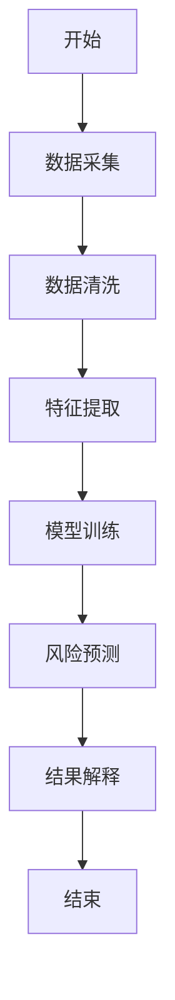
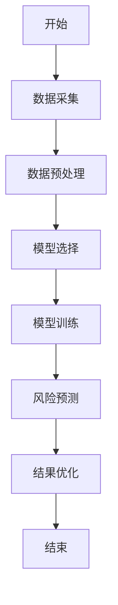
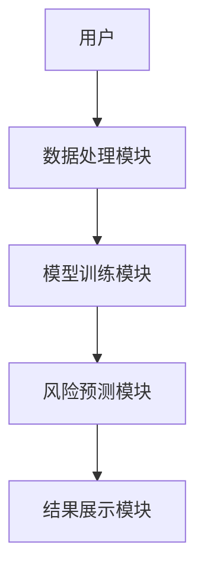
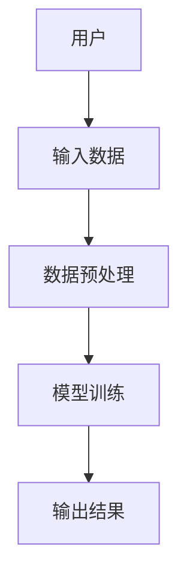
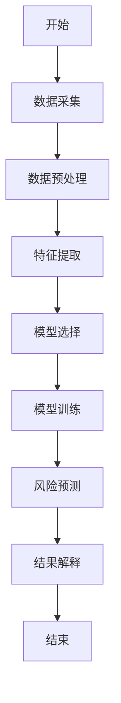

                 


# AI辅助的企业并购整合风险评估

## 关键词：AI, 企业并购, 风险评估, 整合风险, 风险预测, 机器学习

## 摘要：  
随着企业并购活动的频繁进行，整合过程中的风险评估变得至关重要。本文将探讨如何利用人工智能技术辅助企业并购整合风险评估。通过分析并购整合中的关键风险因素，结合机器学习和自然语言处理等AI技术，构建高效的评估模型，为企业提供数据驱动的决策支持。文章将从背景介绍、核心概念、算法原理、系统架构到实际案例，全面解析AI在企业并购整合风险评估中的应用。

---

# 第一部分：背景介绍

## 第1章：企业并购整合概述

### 1.1 企业并购的基本概念  
企业并购（Mergers and Acquisitions, M&A）是指两个或多个企业之间通过合并或收购形成的新的企业结构。并购整合则是指在企业合并后，将双方的业务、资源、文化等进行融合的过程。  

#### 1.1.1 并购整合的必要性与挑战  
企业并购整合的目的是实现协同效应，提高效率，降低成本，增强竞争力。然而，整合过程中常常面临以下挑战：  
1. **文化冲突**：不同企业的文化差异可能导致员工抵触，影响整合效果。  
2. **组织架构调整**：整合后的企业需要重新设计组织架构，可能引发管理混乱。  
3. **业务流程整合**：不同企业的业务流程差异可能导致效率低下。  
4. **技术系统整合**：不同企业的信息系统可能不兼容，需要进行技术改造。  

#### 1.1.2 并购整合中的风险类型  
并购整合中的风险主要包括：  
1. **战略风险**：并购目标与企业战略不一致。  
2. **财务风险**：并购后的财务表现不佳，可能导致企业陷入财务危机。  
3. **运营风险**：整合过程中出现的运营问题，如供应链中断。  
4. **法律与合规风险**：并购涉及的法律问题，如反垄断审查。  

---

## 第2章：AI在企业并购中的应用前景  

### 2.1 AI技术在企业并购中的潜力  
AI技术在企业并购中的潜力主要体现在以下几个方面：  
1. **数据驱动的决策支持**：通过分析历史并购数据，预测并购后的表现。  
2. **自然语言处理（NLP）**：用于分析并购相关的文本数据，如新闻报道、公司公告等。  
3. **机器学习模型**：用于识别并购中的潜在风险，优化整合策略。  

#### 2.1.1 数据分析与预测的应用  
通过机器学习模型，企业可以基于历史数据预测并购后的财务表现、市场份额变化等。  

#### 2.1.2 自然语言处理在文档审查中的作用  
NLP技术可以帮助企业快速分析并购相关的法律文件、公司公告等，提取关键信息。  

#### 2.1.3 机器学习在风险评估中的价值  
机器学习模型可以识别并购中的潜在风险，如文化冲突、运营问题等，并提供风险评分。  

### 2.2 AI辅助企业并购整合的核心技术  
AI辅助企业并购整合的核心技术包括：  
1. **数据挖掘与清洗技术**：处理并购相关的结构化和非结构化数据。  
2. **机器学习模型构建**：基于数据训练模型，预测并购后的风险。  
3. **自然语言处理与知识图谱**：分析文本数据，构建知识图谱，支持决策。  

---

# 第二部分：AI辅助企业并购整合风险评估的核心概念与联系

## 第3章：核心概念与联系  

### 3.1 企业并购整合风险评估的理论框架  

#### 3.1.1 风险评估的定义与维度  
风险评估是指通过分析可能影响企业并购整合的因素，预测并量化这些因素可能带来的风险。风险评估的维度包括财务风险、运营风险、法律风险等。  

#### 3.1.2 并购整合中的关键风险因素  
1. **财务风险**：并购后的财务表现不佳。  
2. **运营风险**：整合过程中出现的运营问题。  
3. **法律风险**：并购涉及的法律问题。  
4. **文化风险**：企业文化冲突导致整合失败。  

#### 3.1.3 风险评估的数学模型  
风险评估的数学模型可以表示为：  
$$ \text{风险评分} = f(\text{财务指标}, \text{运营指标}, \text{法律指标}, \text{文化指标}) $$  
其中，$f$ 是一个机器学习模型，基于输入的指标预测风险评分。  

---

### 3.2 AI技术与企业并购整合的关联性  

#### 3.2.1 数据驱动的决策优势  
AI技术可以通过分析海量数据，提供数据驱动的决策支持，帮助企业在并购整合中降低风险。  

#### 3.2.2 AI在风险预测中的优势  
AI技术可以快速处理和分析数据，发现潜在的风险因素，提高风险预测的准确性。  

#### 3.2.3 AI技术在整合过程中的应用案例  
例如，某企业通过AI技术分析目标公司的财务数据和市场表现，预测并购后的财务风险，并制定相应的整合策略。  

---

## 第4章：核心概念原理与对比分析  

### 4.1 AI辅助风险评估的核心原理  

#### 4.1.1 数据采集与特征提取  
AI技术通过采集并购相关的数据，提取特征，如财务指标、市场份额等。  

#### 4.1.2 模型训练与优化  
基于特征数据，训练机器学习模型，优化模型参数，提高预测准确性。  

#### 4.1.3 结果解释与反馈机制  
通过模型预测结果，解释风险来源，并根据反馈不断优化模型。  

---

### 4.2 核心概念的对比分析  

#### 4.2.1 不同AI技术的优缺点对比  
1. **机器学习**：优点是能够处理复杂的数据关系，缺点是需要大量数据支持。  
2. **自然语言处理**：优点是能够分析文本数据，缺点是处理复杂语义时效果有限。  

#### 4.2.2 传统风险评估方法与AI方法的对比  
传统方法依赖人工分析，效率低；AI方法通过数据驱动，效率高，准确性高。  

#### 4.2.3 不同企业规模下的风险评估方法对比  
小企业适合简单模型，大企业适合复杂模型。  

---

## 第5章：实体关系图与流程图分析  

### 5.1 实体关系图（ER图）  

#### 5.1.1 企业并购中的实体关系  
- 企业：参与并购的主体。  
- 并购交易：并购的具体行为。  
- 风险因素：影响并购整合的潜在风险。  

#### 5.1.2 风险评估中的实体关系  
- 风险评估模型：用于预测风险的模型。  
- 数据源：用于训练模型的数据。  

#### 5.1.3 AI技术在实体关系中的应用  
AI技术可以自动识别和分析实体之间的关系，支持风险评估。  

---

### 5.2 流程图分析  

#### 5.2.1 并购整合风险评估的流程图  



---

#### 5.2.2 AI辅助风险评估的流程图  



---

### 5.3 系统架构与交互设计  

#### 5.3.1 系统架构设计  



---

#### 5.3.2 系统交互设计  



---

# 第三部分：AI辅助企业并购整合风险评估的算法原理

## 第6章：算法原理与流程图  

### 6.1 算法原理  

#### 6.1.1 机器学习算法的选择与应用  
常用算法包括逻辑回归、随机森林和神经网络。  

#### 6.1.2 自然语言处理算法的应用  
NLP技术用于分析文本数据，提取关键词和主题。  

---

### 6.2 算法实现与流程图  



---

### 6.3 数学模型与公式  

#### 6.3.1 逻辑回归模型  

$$ P(y=1) = \frac{e^{\beta x}}{1 + e^{\beta x}} $$  

其中，$\beta$ 是模型参数，$x$ 是输入特征。  

#### 6.3.2 随机森林模型  

随机森林通过集成学习，提高模型的准确性和鲁棒性。  

---

## 第7章：数学模型与公式  

### 7.1 风险评估模型  

$$ \text{风险评分} = \sum_{i=1}^{n} \alpha_i x_i $$  

其中，$\alpha_i$ 是特征 $x_i$ 的权重。  

---

### 7.2 模型优化与调参  

通过交叉验证和网格搜索，优化模型参数，提高预测准确性。  

---

## 第8章：系统分析与架构设计方案  

### 8.1 系统架构设计  


---

### 8.2 系统功能设计  

#### 8.2.1 数据处理模块  
负责采集和清洗数据，提取特征。  

#### 8.2.2 模型训练模块  
基于特征数据，训练机器学习模型。  

#### 8.2.3 风险预测模块  
根据模型预测并购整合的风险评分。  

#### 8.2.4 结果展示模块  
将预测结果以可视化形式展示给用户。  

---

## 第9章：项目实战  

### 9.1 环境安装  

```bash
pip install pandas numpy scikit-learn
```

---

### 9.2 核心代码实现  

```python
import pandas as pd
from sklearn.ensemble import RandomForestClassifier
from sklearn.model_selection import train_test_split
from sklearn.metrics import accuracy_score

# 数据加载
data = pd.read_csv('merger_risk.csv')

# 特征提取
X = data.drop(columns=['risk_score'])
y = data['risk_score']

# 数据分割
X_train, X_test, y_train, y_test = train_test_split(X, y, test_size=0.2)

# 模型训练
model = RandomForestClassifier()
model.fit(X_train, y_train)

# 预测与评估
y_pred = model.predict(X_test)
print("准确率:", accuracy_score(y_test, y_pred))
```

---

### 9.3 案例分析与结果解读  
通过实际案例分析，展示模型的预测结果，并解读结果的实际意义。  

---

## 第10章：最佳实践与小结  

### 10.1 小结  
本文详细探讨了AI辅助企业并购整合风险评估的核心概念、算法原理和系统架构，并通过实际案例展示了AI技术在风险评估中的应用。  

### 10.2 注意事项  
在实际应用中，需要注意数据质量和模型解释性，避免模型过拟合。  

### 10.3 拓展阅读  
推荐阅读相关领域的书籍和论文，深入学习AI技术在企业并购中的应用。  

---

## 作者：AI天才研究院/AI Genius Institute & 禅与计算机程序设计艺术/Zen And The Art of Computer Programming

