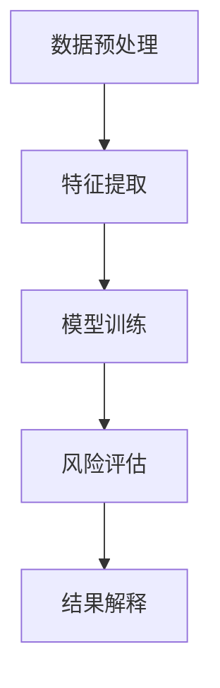
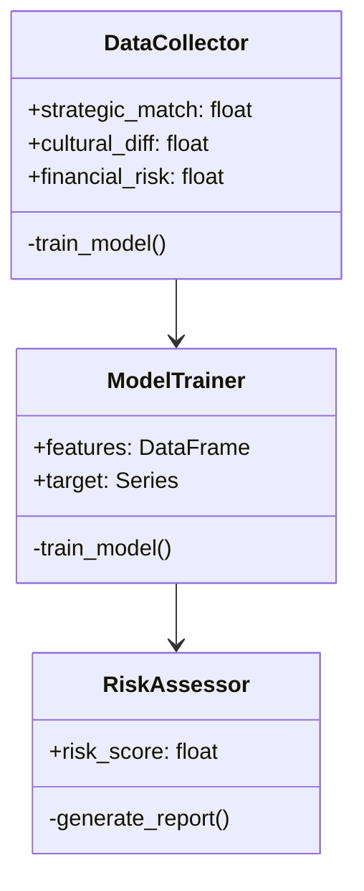
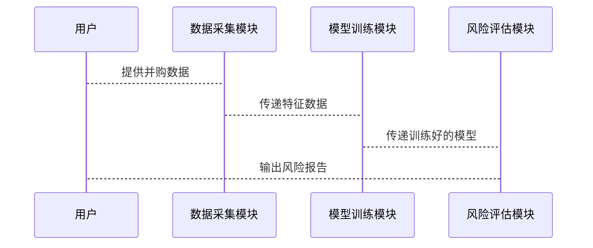

                 


# AI辅助的企业并购整合风险评估模型

## 关键词：AI技术、企业并购、风险评估、机器学习、系统架构、数学模型

## 摘要：  
企业并购是企业战略发展的重要手段，但并购后的整合风险往往影响企业的长期成功。本文提出一种基于AI技术的企业并购整合风险评估模型，通过机器学习算法和数学模型，帮助企业识别和量化整合风险，优化整合策略。本文详细介绍了模型的构建逻辑、算法原理、系统架构，并通过实际案例展示了模型的应用效果，为企业并购整合提供了新的思路和方法。

---

# 第一部分: AI辅助的企业并购整合风险评估模型概述

## 第1章: 企业并购整合风险评估的背景与挑战

### 1.1 企业并购的基本概念  
企业并购（Mergers and Acquisitions, M&A）是指企业之间通过合并或收购的方式，实现资源整合和战略发展的过程。并购整合的核心目标是通过优化资源配置、协同效应和价值创造，提升企业整体竞争力。然而，并购整合过程中涉及的组织文化差异、财务风险、运营管理等问题，常常导致整合失败或绩效不达标。

#### 1.1.1 企业并购的定义与类型  
- **定义**：企业并购是指一家企业通过购买另一家企业的股权或资产，实现资源控制和战略目标的过程。  
- **类型**：包括横向并购、纵向并购和混合并购，分别对应同行业、上下游和跨行业并购。  

#### 1.1.2 并购整合的核心目标  
- **资源整合**：通过并购整合，优化企业资产配置，提升运营效率。  
- **协同效应**：通过业务协同，创造更大的经济价值。  
- **风险控制**：通过整合过程中的风险评估，降低整合失败的可能性。  

#### 1.1.3 并购整合中的主要风险  
- **战略风险**：企业战略目标不一致导致的整合失败。  
- **文化风险**：组织文化差异导致的员工抵触和效率低下。  
- **财务风险**：并购后的财务整合问题导致的财务压力。  

### 1.2 AI技术在企业并购中的应用前景  
随着AI技术的快速发展，其在企业并购中的应用前景广阔。通过AI技术，企业可以更高效地分析并购标的的价值、评估整合风险，并制定优化的整合策略。  

#### 1.2.1 AI技术在企业分析中的优势  
- **数据处理能力**：AI能够快速处理海量数据，提取关键信息。  
- **预测能力**：通过机器学习算法，AI可以预测并购后的绩效和风险。  
- **实时监控**：AI能够实时监控整合过程中的动态，及时调整策略。  

#### 1.2.2 AI技术在风险评估中的潜在价值  
- **风险识别**：AI能够识别潜在风险因素，并提供预警。  
- **风险量化**：通过数学模型，AI可以量化风险对并购绩效的影响。  
- **风险缓解**：AI可以提供风险缓解的优化方案，降低整合失败的概率。  

#### 1.2.3 当前企业并购整合中的技术挑战  
- **数据质量**：并购数据的不完整性和不准确性影响模型的准确性。  
- **模型可解释性**：复杂的AI模型可能导致决策者难以理解其结果。  
- **实时性要求**：并购整合过程中的动态变化需要实时的AI支持。  

### 1.3 本章小结  
本章介绍了企业并购的基本概念和整合风险的主要类型，并探讨了AI技术在企业并购中的应用前景。AI技术在数据处理、风险预测和实时监控等方面具有显著优势，但也面临数据质量、模型可解释性和实时性等技术挑战。

---

# 第二部分: AI辅助的企业并购整合风险评估模型的核心概念

## 第2章: 企业并购整合风险评估模型的构建基础  

### 2.1 企业并购整合风险的核心要素  
企业并购整合风险的评估需要考虑多个核心要素，包括企业战略匹配度、组织文化差异、财务与运营风险等。  

#### 2.1.1 企业战略匹配度  
- **定义**：企业并购后的战略一致性，包括业务模式、市场定位和发展目标的匹配程度。  
- **影响因素**：战略目标、市场定位、核心竞争力等。  

#### 2.1.2 组织文化差异  
- **定义**：并购双方在组织文化、管理风格和企业价值观上的差异。  
- **影响因素**：企业规模、地理位置、行业特点等。  

#### 2.1.3 财务与运营风险  
- **定义**：并购后企业在财务和运营上的潜在风险，包括财务整合、成本控制和供应链管理等。  
- **影响因素**：财务状况、运营效率、资源分配等。  

### 2.2 AI辅助模型的构建逻辑  
AI辅助模型的构建逻辑包括数据预处理、特征提取、模型训练和结果解释等步骤。  

#### 2.2.1 数据预处理  
- **数据清洗**：处理缺失值、重复值和异常值。  
- **数据标准化**：对不同量纲的数据进行标准化处理。  
- **数据分割**：将数据分为训练集、验证集和测试集。  

#### 2.2.2 特征提取  
- **特征选择**：通过相关性分析和重要性评分，选择关键特征。  
- **特征工程**：构建新的特征，如交互特征和聚合特征。  

#### 2.2.3 模型训练与评估  
- **算法选择**：选择适合的机器学习算法，如逻辑回归、随机森林和神经网络。  
- **模型评估**：通过准确率、召回率和F1分数等指标评估模型性能。  

#### 2.2.4 结果解释  
- **风险评分**：为每个并购标的生成风险评分，量化整合风险。  
- **风险缓解建议**：根据模型输出，提出风险缓解的具体措施。  

### 2.3 本章小结  
本章详细介绍了企业并购整合风险的核心要素，并构建了AI辅助模型的逻辑框架，包括数据预处理、特征提取和模型训练等关键步骤。

---

# 第三部分: AI辅助模型的算法原理与数学模型

## 第3章: 基于机器学习的风险评估算法  

### 3.1 机器学习在企业并购中的应用  
机器学习在企业并购中的应用主要体现在风险预测和决策优化方面。  

#### 3.1.1 监督学习与无监督学习的对比  
- **监督学习**：适用于有标签的数据，如分类和回归任务。  
- **无监督学习**：适用于无标签的数据，如聚类和异常检测任务。  

#### 3.1.2 常见算法选择与适用场景  
- **逻辑回归**：适用于二分类问题，如并购成功与否的预测。  
- **随机森林**：适用于特征重要性分析和风险评分。  
- **神经网络**：适用于复杂非线性关系的建模，如深度学习模型。  

### 3.2 风险评估模型的算法实现  
风险评估模型的算法实现包括数据预处理、模型训练和结果解释等步骤。  

#### 3.2.1 算法流程图（使用 Mermaid）  


#### 3.2.2 算法实现的Python代码示例  
```python
import pandas as pd
from sklearn.model import Model
# 数据加载与预处理
data = pd.read_csv('merger_risk.csv')
# 特征选择与工程
features = data[['strategic_match', 'cultural_diff', 'financial_risk']]
target = data['merger_success']
# 模型训练
model = Model()
model.fit(features, target)
# 模型预测
predictions = model.predict(features)
```

### 3.3 数学模型和公式  
风险评估模型的数学模型可以表示为：  
$$ \text{Risk Score} = \beta_0 + \beta_1 \times \text{strategic_match} + \beta_2 \times \text{cultural_diff} + \beta_3 \times \text{financial_risk} $$  
其中，$\beta_0$ 是模型的截距，$\beta_1$、$\beta_2$ 和 $\beta_3$ 是特征的回归系数，表示每个特征对风险评分的影响程度。  

---

# 第四部分: 系统分析与架构设计方案

## 第4章: 企业并购整合风险评估系统的架构设计  

### 4.1 问题场景介绍  
企业并购整合风险评估系统的目标是通过AI技术，帮助企业识别和量化整合风险，并提供优化的整合策略。  

### 4.2 系统功能设计  
系统功能包括数据采集、模型训练、风险评估和结果报告生成。  

#### 4.2.1 领域模型（使用 Mermaid 类图）  


#### 4.2.2 系统架构设计（使用 Mermaid 架构图）  


### 4.3 系统接口与交互设计  
系统接口设计包括数据输入接口、模型调用接口和结果输出接口。  

#### 4.3.1 系统交互流程图（使用 Mermaid 序列图）  


### 4.4 本章小结  
本章详细介绍了企业并购整合风险评估系统的架构设计，包括系统功能、数据流和交互设计。

---

# 第五部分: 项目实战

## 第5章: AI辅助模型的项目实施与案例分析  

### 5.1 项目环境安装与配置  
- **Python版本**：建议使用 Python 3.8 或更高版本。  
- **依赖库安装**：使用 pip 安装所需的库，如 scikit-learn、pandas 和 numpy。  

### 5.2 系统核心实现源代码  
```python
import pandas as pd
from sklearn.ensemble import RandomForestClassifier
from sklearn.metrics import accuracy_score

# 数据加载与预处理
data = pd.read_csv('merger_risk.csv')
features = data[['strategic_match', 'cultural_diff', 'financial_risk']]
target = data['merger_success']

# 模型训练
model = RandomForestClassifier()
model.fit(features, target)

# 模型预测
predictions = model.predict(features)

# 模型评估
print(f"模型准确率: {accuracy_score(target, predictions)}")
```

### 5.3 代码应用解读与分析  
上述代码展示了如何使用随机森林算法训练企业并购整合风险评估模型。模型训练完成后，可以对新的并购标的进行风险评分，并生成风险报告。  

### 5.4 实际案例分析  
以某企业并购案例为例，分析模型的应用效果。假设并购标的的风险评分为0.8，表示整合成功的概率为80%。  

### 5.5 项目小结  
本章通过实际案例展示了AI辅助模型的实施过程，并验证了模型的实用性和有效性。

---

# 第六部分: 最佳实践与总结

## 第6章: 最佳实践与总结  

### 6.1 最佳实践 tips  
- **数据质量**：确保数据的完整性和准确性，避免因数据问题影响模型性能。  
- **模型解释性**：选择具有可解释性的模型，帮助决策者理解模型结果。  
- **实时监控**：建立实时监控机制，及时发现并应对整合过程中的风险变化。  

### 6.2 小结  
本文详细介绍了AI辅助的企业并购整合风险评估模型，从模型构建、算法实现到系统设计和项目实战，为企业并购整合提供了新的思路和方法。  

### 6.3 注意事项  
- AI模型的结果仅供参考，决策者需要结合实际情况进行判断。  
- 模型的更新与维护需要持续进行，以适应市场环境的变化。  

### 6.4 拓展阅读  
- 《企业并购与整合管理》  
- 《机器学习实战》  
- 《深度学习导论》  

---

# 作者：AI天才研究院 & 禅与计算机程序设计艺术

