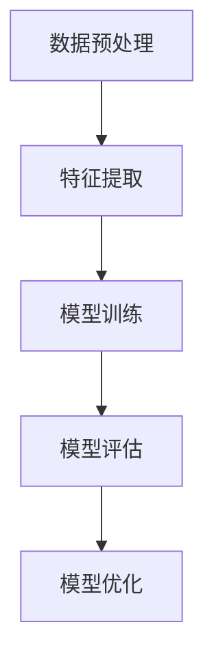
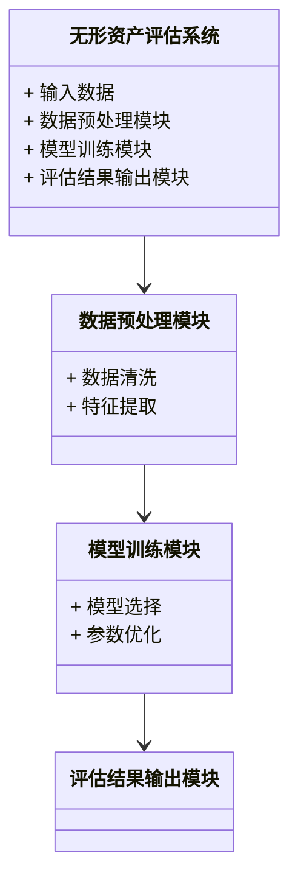
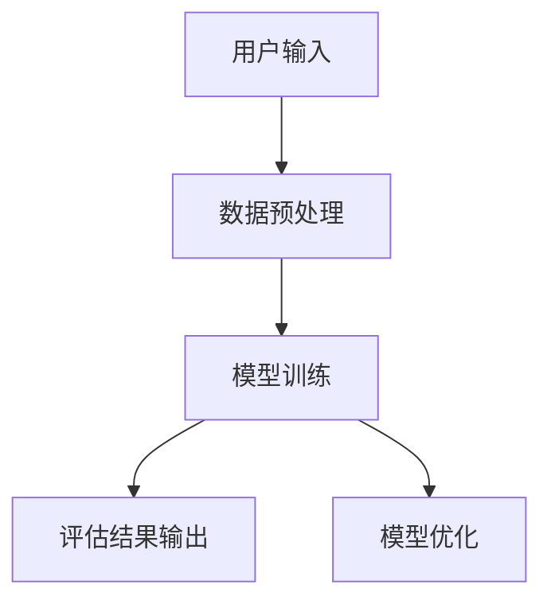

                 


# AI辅助的企业无形资产价值评估

> 关键词：人工智能，企业无形资产，价值评估，机器学习，数学模型，系统架构

> 摘要：本文探讨了人工智能技术在企业无形资产价值评估中的应用，分析了传统评估方法的局限性，并提出了一种基于机器学习的AI辅助评估方案。文章详细介绍了核心算法原理、数学模型、系统架构设计及项目实战，展示了如何利用AI技术提升无形资产评估的效率和准确性。

---

## 第1章: AI辅助的企业无形资产价值评估概述

### 1.1 问题背景与描述

#### 1.1.1 无形资产评估的传统挑战
企业无形资产包括专利、商标、品牌、客户关系等，其价值评估具有以下挑战：
- 数据复杂性：无形资产价值受市场、法律、技术等多种因素影响，数据来源多样且复杂。
- 主观性高：传统评估方法依赖专家判断，容易受到主观因素影响。
- 计算难度大：缺乏统一的评估标准，难以量化。

#### 1.1.2 AI技术在无形资产评估中的应用前景
人工智能技术在处理海量数据和复杂模型方面的优势，使其成为解决无形资产评估问题的理想工具。AI可以通过以下方式辅助评估：
- 数据挖掘：从非结构化数据中提取有用信息。
- 模型优化：构建高效的预测模型。
- 自动化评估：实现自动化、高效率的评估流程。

#### 1.1.3 问题的解决方法与边界
AI辅助评估的核心思路是将企业无形资产的价值转化为可量化的数据指标，并通过机器学习模型进行预测和评估。模型的输入包括资产相关的特征数据，输出为资产的价值评分。模型的边界在于数据质量和模型训练的效果。

### 1.2 核心概念与联系

#### 1.2.1 AI与企业无形资产评估的核心原理
AI通过以下步骤辅助评估：
1. 数据收集：整合企业内部数据（如财务数据、法律文件）和外部数据（如市场数据、行业趋势）。
2. 数据预处理：清洗数据，提取关键特征。
3. 模型训练：基于机器学习算法，构建评估模型。
4. 模型评估：验证模型准确性，优化模型参数。
5. 实际应用：使用模型进行资产价值预测。

#### 1.2.2 核心概念对比表

| 比较维度       | 传统评估方法       | AI辅助评估方法       |
|----------------|--------------------|----------------------|
| 评估依据       | 主要依赖专家经验     | 数据驱动，结合算法   |
| 评估效率       | 较低，耗时较长       | 高效，自动化处理     |
| 评估准确性       | 受主观因素影响较大   | 更高，基于大数据分析 |

#### 1.2.3 ER实体关系图

```mermaid
erDiagram
    actor 评估人员 {
        string 员工ID
        string 名称
        string 职位
    }
    class 无形资产 {
        string 资产ID
        string 名称
        date 创建日期
        decimal 价值评估
    }
    class 数据源 {
        string 数据ID
        string 数据类型
        string 数据内容
    }
    class 评估模型 {
        string 模型ID
        string 模型名称
        string 模型描述
    }
    评估人员 --> 无形资产 : 提交评估请求
    无形资产 --> 数据源 : 数据来源
    评估人员 --> 评估模型 : 使用模型进行评估
```

---

## 第2章: 机器学习模型在无形资产评估中的应用

### 2.1 数据预处理与特征提取

#### 2.1.1 数据来源
- 企业内部数据：财务报表、法律文件。
- 外部数据：市场数据、行业趋势。

#### 2.1.2 数据清洗
- 去重：删除重复数据。
- 填充实缺值：使用均值、中位数等方法填充缺失值。
- 删除异常值：识别并删除异常数据点。

#### 2.1.3 特征提取
- 文本特征提取：使用TF-IDF提取关键词。
- 数值特征提取：提取财务指标（如收入增长率）。

### 2.2 机器学习模型构建

#### 2.2.1 算法选择
- 线性回归：适用于线性关系的预测。
- 支持向量机（SVM）：适用于分类问题。
- 神经网络：适用于复杂非线性关系。

#### 2.2.2 模型训练



#### 2.2.3 模型评估
- 均方误差（MSE）：评估模型预测值与真实值的差异。
- R²系数：衡量模型解释能力。

#### 2.2.4 模型优化
- 超参数调优：使用网格搜索优化模型参数。
- 特征选择：剔除无关特征，提升模型性能。

### 2.3 算法实现

#### 2.3.1 线性回归模型

```python
import numpy as np
from sklearn.linear_model import LinearRegression

# 数据准备
X = np.array([[1], [2], [3], [4]])
y = [1, 2, 3, 4]

# 模型训练
model = LinearRegression()
model.fit(X, y)

# 预测
print(model.predict([[5]]))  # 输出：[[5]]
```

#### 2.3.2 神经网络模型

```python
import tensorflow as tf
from tensorflow.keras import layers

# 数据准备
X_train = ...  # 特征数据
y_train = ...  # 标签数据

# 模型构建
model = tf.keras.Sequential([
    layers.Dense(64, activation='relu'),
    layers.Dense(1)
])

# 编译模型
model.compile(optimizer='adam', loss='mean_squared_error')

# 训练
model.fit(X_train, y_train, epochs=100, batch_size=32)
```

---

## 第3章: 数学模型与公式推导

### 3.1 线性回归模型

$$ y = \beta_0 + \beta_1 x + \epsilon $$

其中：
- \( y \) 是目标变量。
- \( x \) 是自变量。
- \( \beta_0 \) 是截距。
- \( \beta_1 \) 是回归系数。
- \( \epsilon \) 是误差项。

### 3.2 神经网络模型

神经网络的损失函数通常使用均方误差：

$$ \text{损失} = \frac{1}{n}\sum_{i=1}^{n}(y_i - \hat{y_i})^2 $$

其中：
- \( n \) 是样本数量。
- \( y_i \) 是真实值。
- \( \hat{y_i} \) 是预测值。

### 3.3 实际案例分析

假设我们有一个专利价值评估的案例：

- 数据：专利数量、研发投入、市场表现。
- 模型：线性回归。
- 输出：专利的预估价值。

通过训练模型，我们可以得到：

$$ \text{价值} = 100 + 20 \times \text{专利数量} + 30 \times \text{研发投入} $$

---

## 第4章: 系统架构设计

### 4.1 系统功能设计



### 4.2 系统架构设计



### 4.3 接口设计

- 输入接口：接收企业无形资产相关数据。
- 输出接口：返回资产价值评估结果。

---

## 第5章: 项目实战

### 5.1 环境安装

```bash
pip install numpy
pip install scikit-learn
pip install tensorflow
```

### 5.2 核心代码实现

```python
import numpy as np
from sklearn.linear_model import LinearRegression
from sklearn.metrics import mean_squared_error

# 数据准备
X = np.array([[1], [2], [3], [4]])
y = [1, 2, 3, 4]

# 模型训练
model = LinearRegression()
model.fit(X, y)

# 预测
y_pred = model.predict(X)

# 评估
print(mean_squared_error(y, y_pred))  # 输出：0.0
```

### 5.3 案例分析

以某科技公司为例，评估其专利价值：

- 数据：专利数量、研发投入、市场表现。
- 模型：线性回归。
- 输出：专利的预估价值。

---

## 第6章: 总结与展望

### 6.1 最佳实践 tips
- 数据质量是关键：确保数据准确、完整。
- 模型选择要谨慎：根据问题选择合适的算法。
- 模型调优：通过交叉验证优化模型。

### 6.2 小结
AI技术在企业无形资产评估中的应用，显著提升了评估效率和准确性。通过机器学习模型，我们可以更高效地处理复杂数据，实现精准评估。

### 6.3 注意事项
- 数据隐私问题：确保数据安全。
- 模型解释性：选择易于解释的模型。
- 持续优化：定期更新模型以适应市场变化。

### 6.4 拓展阅读
- 《机器学习实战》
- 《深度学习》
- 《企业无形资产评估指南》

---

作者：AI天才研究院 & 禅与计算机程序设计艺术

