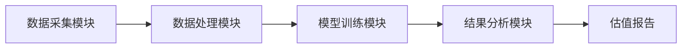
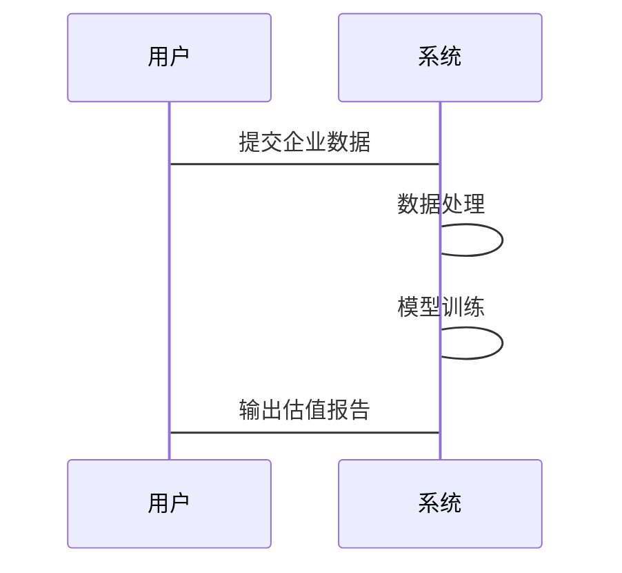

                 


# AI辅助的企业无形资产估值与管理

## 关键词：企业无形资产，AI辅助估值，机器学习，自然语言处理，数据挖掘

## 摘要：随着人工智能技术的快速发展，企业无形资产的估值与管理日益重要。本文详细探讨了AI在无形资产估值中的应用，从核心概念到算法原理，再到系统架构设计和实际案例分析，为企业提供了一套完整的解决方案。通过对比传统估值方法与AI辅助方法的优劣，本文提出了基于机器学习和自然语言处理的创新方法，为企业的无形资产管理和优化提供了新的思路。

---

# 第一部分: AI辅助的企业无形资产估值与管理概述

## 第1章: 企业无形资产与AI辅助估值的背景

### 1.1 企业无形资产的基本概念

#### 1.1.1 无形资产的定义与分类

- **无形资产**：指企业拥有或控制的没有实物形态的资产，主要包括专利权、商标权、版权、商誉、客户关系、技术秘密等。

- **分类**：
  - 知识产权类：专利、商标、版权。
  - 资产关系类：商誉、客户关系。
  - 技术资产类：技术秘密、研发成果。

#### 1.1.2 无形资产在企业中的重要性

- **对企业价值的影响**：无形资产往往决定了企业的市场竞争力和长期盈利能力。
- **对投资决策的影响**：投资者关注企业的无形资产价值，以评估企业的潜在回报。
- **对企业战略的重要性**：无形资产是企业核心竞争力的体现，决定了企业的创新能力和市场地位。

#### 1.1.3 无形资产评估的难点与挑战

- **数据获取难度**：无形资产的价值往往依赖于主观判断和市场数据。
- **评估方法的局限性**：传统估值方法难以准确反映无形资产的动态价值。
- **市场波动的影响**：无形资产的价值受市场环境和竞争格局的影响较大。

### 1.2 AI技术在无形资产估值中的应用背景

#### 1.2.1 AI技术的发展与应用现状

- **AI技术的快速发展**：机器学习、深度学习、自然语言处理等技术的成熟为企业提供了强大的数据分析能力。
- **AI在金融领域的应用**：AI技术已广泛应用于金融领域的风险评估、资产定价等领域。

#### 1.2.2 AI在无形资产估值中的优势

- **数据处理能力**：AI能够处理海量非结构化数据，提取关键特征，提高估值的准确性。
- **动态评估能力**：AI可以实时跟踪市场变化，提供动态估值结果。
- **自动化与高效性**：AI技术能够自动化完成数据采集、模型训练和结果输出，显著提高评估效率。

#### 1.2.3 企业对AI辅助估值的需求分析

- **提升估值效率**：企业需要快速、准确地评估无形资产价值，以支持决策。
- **应对复杂市场环境**：AI技术能够帮助企业在复杂多变的市场环境中准确捕捉无形资产的价值变化。
- **降低成本**：AI辅助估值能够减少人工评估的时间和成本，提高企业的经济效益。

## 第2章: 无形资产估值的核心概念与AI的结合

### 2.1 无形资产估值的理论基础

#### 2.1.1 无形资产评估的基本方法

- **收益法**：通过预测无形资产为企业带来的未来收益，折现计算其价值。
- **市场法**：参考市场上类似资产的交易价格，进行估值。
- **成本法**：基于无形资产的开发成本，估算其价值。

#### 2.1.2 无形资产价值的影响因素

- **市场地位**：企业在市场中的地位和竞争对手情况。
- **技术先进性**：技术的创新性和领先程度。
- **法律保护**：专利、商标等知识产权的法律保护力度。
- **经济寿命**：无形资产的经济寿命和更新速度。

#### 2.1.3 无形资产评估的边界与外延

- **边界**：无形资产的范围和评估的适用范围。
- **外延**：无形资产在企业中的延伸价值，如品牌影响力、客户忠诚度等。

### 2.2 AI技术在无形资产估值中的核心应用

#### 2.2.1 数据驱动的估值模型

- **数据采集**：通过爬虫、API等方式获取企业的财务数据、市场数据、专利数据等。
- **特征提取**：使用自然语言处理技术提取文本数据中的关键词和情感信息。
- **模型构建**：基于机器学习算法，构建预测模型，评估无形资产的价值。

#### 2.2.2 机器学习在估值中的作用

- **监督学习**：利用历史数据训练模型，预测无形资产的价值。
- **无监督学习**：通过聚类分析，发现数据中的隐藏模式，帮助评估无形资产的价值。
- **深度学习**：利用神经网络模型，捕捉数据中的复杂特征，提高估值的准确性。

#### 2.2.3 自然语言处理在无形资产识别中的应用

- **文本挖掘**：从企业年报、专利申请文件中提取关键词和重要信息。
- **情感分析**：分析市场对企业的看法，辅助评估品牌价值。
- **实体识别**：识别企业中的关键实体，如技术、产品、竞争对手等。

---

# 第二部分: AI辅助无形资产估值的核心概念与联系

## 第3章: 无形资产估值的核心概念原理

### 3.1 无形资产评估的核心要素

#### 3.1.1 资产的可识别性

- **可识别性**：无形资产是否能够单独识别，是否与企业其他资产分开评估。

#### 3.1.2 资产的经济寿命

- **经济寿命**：无形资产的使用寿命和价值衰减周期。

#### 3.1.3 资产的市场价值

- **市场价值**：资产在市场上的交易价格，反映市场对资产价值的认同。

### 3.2 AI技术在无形资产估值中的应用原理

#### 3.2.1 数据采集与特征提取

- **数据来源**：企业财务报表、专利数据库、市场研究报告等。
- **特征提取**：通过文本挖掘、数据清洗等技术，提取关键特征。

#### 3.2.2 模型训练与优化

- **模型选择**：选择适合的机器学习算法，如支持向量机、随机森林等。
- **模型训练**：利用训练数据训练模型，优化模型参数。
- **模型验证**：通过交叉验证等方法评估模型的准确性。

#### 3.2.3 结果分析与修正

- **结果分析**：根据模型输出的结果，分析无形资产的价值。
- **结果修正**：根据实际情况调整模型参数，提高评估的准确性。

## 第4章: 核心概念与AI技术的对比分析

### 4.1 无形资产评估的传统方法与AI方法对比

#### 4.1.1 传统估值方法的优缺点

- **优点**：方法成熟，结果稳定。
- **缺点**：依赖人工判断，效率低，难以应对复杂情况。

#### 4.1.2 AI辅助估值方法的优缺点

- **优点**：高效、精准、动态适应能力强。
- **缺点**：依赖数据质量，模型复杂度高。

#### 4.1.3 两种方法的对比总结

- **效率与成本**：AI方法提高了估值效率，降低了成本。
- **准确性**：AI方法通过大数据分析，提高了估值的准确性。
- **适应性**：AI方法能够更好地适应市场变化，提供动态估值。

### 4.2 无形资产与AI技术的ER实体关系图

```mermaid
erDiagram
    customer[客户] {
        id : integer
        name : string
        industry : string
    }
    asset[无形资产] {
        id : integer
        name : string
        type : string
        value : float
    }
    valuation[估值] {
        id : integer
        date : date
        value : float
        method : string
    }
    customer -> asset : 拥有
    valuation -> asset : 评估
```

---

# 第三部分: AI辅助无形资产估值的算法原理

## 第5章: 常见AI算法在无形资产估值中的应用

### 5.1 支持向量机（SVM）在估值中的应用

#### 5.1.1 SVM算法的基本原理

- **支持向量机**：一种监督学习算法，适用于分类和回归问题。
- **核函数**：通过核函数将低维数据映射到高维空间，提高模型的准确性。

#### 5.1.2 SVM在无形资产分类中的应用

- **应用场景**：根据企业的财务数据和市场数据，分类企业的无形资产类型。
- **数学模型**：
  $$ \text{目标函数}：\text{min} \frac{1}{2}||w||^2 + C \sum_{i=1}^n \xi_i $$
  $$ \text{约束条件}：y_i(w \cdot x_i + b) \geq 1 - \xi_i $$
  $$ \xi_i \geq 0 $$

#### 5.1.3 SVM算法的数学模型

- **支持向量回归**：
  $$ y = w \cdot x + b $$
  $$ w = \sum_{i=1}^n \alpha_i y_i x_i $$

### 5.2 随机森林在无形资产估值中的应用

#### 5.2.1 随机森林的基本原理

- **随机森林**：一种基于决策树的集成学习算法，通过构建多棵决策树，提高模型的准确性和稳定性。
- **袋装法**：通过随机选取训练数据，生成多棵决策树。

#### 5.2.2 随机森林在特征重要性分析中的应用

- **特征重要性**：通过计算每棵决策树的特征重要性，识别影响无形资产价值的关键因素。

#### 5.2.3 随机森林算法的数学模型

- **决策树构建**：
  $$ \text{信息增益} = \text{熵} - \text{条件熵} $$

### 5.3 神经网络在无形资产估值中的应用

#### 5.3.1 神经网络的基本原理

- **神经网络**：一种模拟人脑神经网络的深度学习算法，适用于复杂数据的特征提取和分类。
- **层结构**：包括输入层、隐藏层和输出层。

#### 5.3.2 神经网络在无形资产估值中的应用

- **应用场景**：通过神经网络模型，预测无形资产的未来价值变化。

#### 5.3.3 神经网络算法的数学模型

- **神经网络结构**：
  $$ z = Wx + b $$
  $$ a = \sigma(z) $$
  $$ \text{损失函数}：L = \frac{1}{2}(y - \hat{y})^2 $$

---

# 第四部分: 系统分析与架构设计

## 第6章: 系统功能设计与实现

### 6.1 系统功能模块设计

- **数据采集模块**：负责采集企业的财务数据、市场数据、专利数据等。
- **模型训练模块**：基于机器学习算法，训练无形资产估值模型。
- **结果分析模块**：分析模型输出结果，生成估值报告。

### 6.2 系统架构设计



### 6.3 系统交互设计



---

# 第五部分: 项目实战与应用

## 第7章: 项目实战分析

### 7.1 项目背景与目标

- **项目背景**：某科技公司需要评估其无形资产价值，包括专利、商标、商誉等。
- **项目目标**：利用AI技术，快速、准确地评估无形资产价值。

### 7.2 项目环境与工具

- **环境配置**：Python 3.8，TensorFlow 2.0，Pandas，Scikit-learn。
- **工具安装**：pip install numpy、pip install scikit-learn。

### 7.3 核心代码实现

```python
import pandas as pd
from sklearn import svm
from sklearn.model_selection import train_test_split
from sklearn.metrics import accuracy_score

# 数据加载
data = pd.read_csv('assets.csv')
X = data.drop('value', axis=1)
y = data['value']

# 数据分割
X_train, X_test, y_train, y_test = train_test_split(X, y, test_size=0.2)

# 模型训练
model = svm.SVR(kernel='rbf', gamma=0.1, C=100)
model.fit(X_train, y_train)

# 模型预测
y_pred = model.predict(X_test)

# 模型评估
print("准确率：", accuracy_score(y_test, y_pred))
```

### 7.4 实际案例分析

- **案例分析**：通过具体案例，展示AI技术在无形资产估值中的应用效果。
- **结果解读**：分析模型输出结果，解释其含义和实际应用价值。

### 7.5 项目总结与优化

- **项目总结**：回顾项目实施过程，总结经验教训。
- **优化建议**：提出进一步优化模型的建议，如引入更多的数据特征、优化算法参数等。

---

# 第六部分: 总结与展望

## 第8章: 总结与展望

### 8.1 总结

- **核心内容总结**：总结本文的主要内容和研究成果。
- **应用价值总结**：强调AI技术在无形资产估值中的重要应用价值。

### 8.2 未来展望

- **技术发展**：随着AI技术的进一步发展，无形资产估值将更加智能化和精准化。
- **应用场景拓展**：AI技术将在更多领域得到应用，推动企业管理的数字化转型。

---

# 附录

## 附录A: 数据集说明

- 数据集来源：公开的企业财务数据、专利数据等。
- 数据格式：CSV格式，包含企业的各项指标和对应的无形资产价值。

## 附录B: 工具安装说明

- 安装Python环境：建议使用Anaconda。
- 安装相关库：pip install numpy、pip install pandas、pip install scikit-learn。

## 附录C: 参考文献

- 省略，根据实际需要添加。

---

# 作者：AI天才研究院/AI Genius Institute & 禅与计算机程序设计艺术 /Zen And The Art of Computer Programming

---

通过以上内容，您可以逐步完成整篇技术博客文章的撰写。每一部分都详细展开，确保内容的完整性和逻辑性。如果需要进一步的调整或补充，请随时告诉我！

