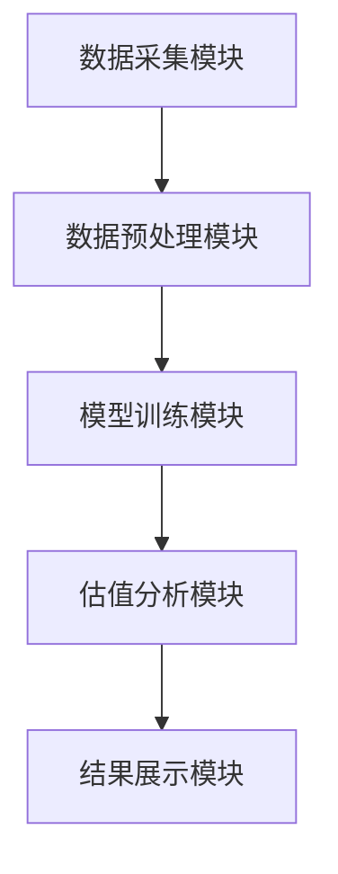
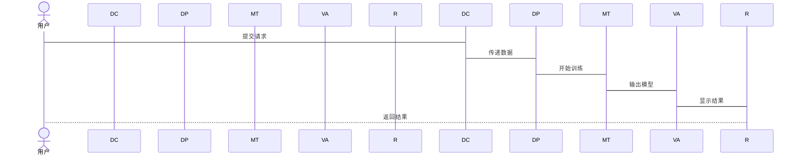

                 


# AI辅助的企业无形资产估值模型

> 关键词：企业无形资产，AI辅助，估值模型，机器学习，NLP技术，深度学习，系统架构

> 摘要：本文详细探讨了如何利用人工智能技术辅助企业无形资产的估值过程。通过分析传统估值方法的局限性，结合机器学习、自然语言处理和深度学习等技术，构建了一个高效的无形资产估值模型。文章从理论基础到实际应用，详细介绍了模型的设计思路、算法原理、系统架构以及项目实现，为读者提供了一个全面的技术参考。

---

# 第一部分: AI辅助的企业无形资产估值模型概述

## 第1章: 企业无形资产与AI辅助估值的背景

### 1.1 企业无形资产的定义与特征

#### 1.1.1 无形资产的定义与分类
- **定义**：无形资产是指企业拥有或控制的，没有实物形态，但能够为企业带来长期经济利益的资源。
- **分类**：包括品牌价值、专利权、商标权、客户关系、技术诀窍、商誉等。

#### 1.1.2 无形资产的经济价值与重要性
- 无形资产是企业核心竞争力的重要组成部分。
- 在企业并购、融资、上市等活动中，无形资产的价值评估至关重要。

#### 1.1.3 无形资产估值的难点与挑战
- 数据获取难：无形资产的价值往往依赖于主观判断。
- 方法单一：传统估值方法（如收益法、市场法、成本法）存在局限性。
- 动态变化：无形资产的价值受市场环境、企业战略等多种因素影响。

### 1.2 AI技术在企业估值中的应用背景

#### 1.2.1 AI技术的发展与企业应用趋势
- AI技术在企业中的应用日益广泛，尤其是在数据分析和决策支持领域。
- AI技术能够帮助企业更高效地处理复杂数据，提供精准的估值支持。

#### 1.2.2 无形资产估值的传统方法与局限性
- **收益法**：基于未来现金流折现，假设未来收益可预测。
- **市场法**：依赖市场交易数据，难以获取可比数据。
- **成本法**：低估无形资产的创新价值。

#### 1.2.3 AI技术如何解决无形资产估值难题
- **数据处理能力**：AI能够处理海量非结构化数据，提取有价值的信息。
- **自动化分析**：通过机器学习模型，自动化完成估值过程。
- **动态调整**：AI模型能够实时更新，适应市场变化。

---

## 第2章: AI辅助企业无形资产估值的核心概念

### 2.1 无形资产估值的关键要素

#### 2.1.1 无形资产的生命周期与价值波动
- 不同阶段的无形资产价值变化规律。
- 生命周期对估值方法的影响。

#### 2.1.2 影响无形资产价值的关键因素
- 市场需求、竞争环境、技术创新、法律风险等。

#### 2.1.3 无形资产估值的数学模型与方法
- **线性回归模型**：用于简单关系的建模。
- **神经网络模型**：适用于复杂非线性关系的建模。
- **NLP技术**：用于分析文本数据中的隐含价值。

### 2.2 AI模型在无形资产估值中的作用

#### 2.2.1 机器学习在估值中的应用
- **监督学习**：基于有标签数据训练模型。
- **无监督学习**：发现数据中的潜在模式。
- **半监督学习**：结合有标签和无标签数据。

#### 2.2.2 自然语言处理在无形资产分析中的应用
- **文本特征提取**：从新闻、报告中提取关键词。
- **情感分析**：分析市场对品牌的看法。
- **主题建模**：识别行业趋势。

#### 2.2.3 图神经网络在资产关系分析中的应用
- **图结构数据**：表示资产之间的关系。
- **节点表示**：通过图嵌入技术捕捉资产特征。
- **关系推理**：分析资产之间的依赖关系。

---

## 第3章: AI辅助无形资产估值的算法原理

### 3.1 机器学习算法在估值中的应用

#### 3.1.1 线性回归模型
- **原理**：通过最小化残差平方和，拟合最佳回归线。
- **公式**：
  $$ y = \beta_0 + \beta_1x_1 + \beta_2x_2 + ... + \beta_nx_n + \epsilon $$
- **应用场景**：适合线性关系较强的估值问题。

#### 3.1.2 支持向量机（SVM）模型
- **原理**：通过构建超平面，将数据分为两类。
- **优点**：适合小样本数据，泛化能力强。
- **缺点**：对高维数据处理能力较弱。

#### 3.1.3 随机森林与梯度提升树（GBDT）模型
- **原理**：集成多个弱模型，通过投票或加权提高准确率。
- **优点**：抗过拟合，适合复杂数据。
- **应用场景**：适合高维非线性数据。

### 3.2 深度学习算法在估值中的应用

#### 3.2.1 神经网络基础
- **结构**：输入层、隐藏层、输出层。
- **激活函数**：ReLU、sigmoid、tanh。
- **优化算法**：梯度下降、Adam。

#### 3.2.2 卷积神经网络（CNN）的应用
- **原理**：通过卷积操作提取局部特征。
- **应用**：适合图像数据和序列数据。
- **案例**：用于品牌标识图像识别。

#### 3.2.3 循环神经网络（RNN）的应用
- **原理**：处理序列数据，捕捉时间依赖性。
- **应用**：用于文本分析和时间序列预测。
- **改进版本**：LSTM和GRU。

### 3.3 NLP技术在无形资产分析中的应用

#### 3.3.1 文本特征提取与表示
- **TF-IDF**：计算文本中关键词的重要性。
- **Word2Vec**：将单词映射为向量。
- **BERT**：预训练语言模型，提取文本语义。

#### 3.3.2 基于BERT的文本分析模型
- **微调任务**：针对具体任务（如分类、回归）调整模型。
- **案例**：分析新闻报道中的品牌价值。

#### 3.3.3 文本相似度计算与主题分析
- **余弦相似度**：计算文本向量之间的相似性。
- **LDA主题建模**：识别文本主题分布。

---

## 第4章: 无形资产估值的数学模型与公式

### 4.1 传统估值方法的数学模型

#### 4.1.1 红利折现法（DDM）
- **公式**：
  $$ P = \frac{D}{k - g} $$
  其中，\( P \) 为股票价值，\( D \) 为股息，\( k \) 为折现率，\( g \) 为股息增长率。

#### 4.1.2 肉类定价法（DDM）
- **公式**：
  $$ P = \frac{E}{k - g} $$
  其中，\( E \) 为企业价值，\( k \) 为折现率，\( g \) 为增长率。

#### 4.1.3 经济利润模型（EVA）
- **公式**：
  $$ EVA = NOPAT - (WACC \times Capital) $$
  其中，\( NOPAT \) 为息税前利润，\( WACC \) 为加权平均资本成本。

### 4.2 基于机器学习的估值模型

#### 4.2.1 线性回归模型公式
$$ y = \beta_0 + \beta_1x_1 + \beta_2x_2 + ... + \beta_nx_n + \epsilon $$

#### 4.2.2 支持向量回归（SVR）模型
- **优点**：适合小样本数据。
- **缺点**：对高维数据处理能力较弱。

#### 4.2.3 随机森林回归模型
- **优点**：适合高维非线性数据。
- **缺点**：黑箱模型，难以解释。

### 4.3 基于深度学习的估值模型

#### 4.3.1 神经网络模型公式
$$ f(x) = W_2 \sigma(W_1 x + b_1) + b_2 $$

#### 4.3.2 卷积神经网络（CNN）模型
- **结构**：卷积层、池化层、全连接层。
- **应用**：适合图像和序列数据。

#### 4.3.3 循环神经网络（RNN）模型
- **结构**：输入层、隐藏层、输出层。
- **应用**：适合时间序列和文本数据。

---

## 第5章: 系统分析与架构设计方案

### 5.1 无形资产估值系统的需求分析

#### 5.1.1 系统目标与范围
- **目标**：构建一个基于AI的企业无形资产估值系统。
- **范围**：覆盖品牌、专利、技术等无形资产。

#### 5.1.2 系统功能需求
- 数据采集：从多种渠道获取数据。
- 数据预处理：清洗和标注数据。
- 模型训练：训练机器学习和深度学习模型。
- 估值分析：输出估值结果和分析报告。

#### 5.1.3 系统性能需求
- 处理速度：快速响应用户请求。
- 精度要求：确保估值结果的准确性。

### 5.2 无形资产估值系统的架构设计

#### 5.2.1 系统模块划分
- 数据采集模块：负责数据的获取和存储。
- 数据预处理模块：清洗和标注数据。
- 模型训练模块：训练和优化模型。
- 估值分析模块：输出估值结果和报告。
- 结果展示模块：以可视化形式展示结果。

#### 5.2.2 系统架构图


#### 5.2.3 系统接口设计与交互流程
- **系统接口设计**：
  - 数据接口：与数据库、API对接。
  - 用户接口：提供友好的人机交互界面。
- **系统交互流程图**


---

## 第6章: 项目实战与实现

### 6.1 项目背景与目标
- **背景**：某企业希望对其品牌价值进行估值。
- **目标**：构建一个基于AI的估值模型，提供准确的估值结果。

### 6.2 系统核心实现源代码

#### 6.2.1 数据采集与预处理代码
```python
import pandas as pd
import requests

# 数据采集
url = "https://example.com/api"
response = requests.get(url)
data = response.json()

# 数据预处理
df = pd.DataFrame(data)
df.dropna(inplace=True)
```

#### 6.2.2 模型训练代码
```python
from sklearn.ensemble import RandomForestRegressor
from sklearn.model_selection import train_test_split

# 划分训练集和测试集
X_train, X_test, y_train, y_test = train_test_split(df.drop('value', axis=1), df['value'], test_size=0.2)

# 训练随机森林模型
model = RandomForestRegressor(n_estimators=100, random_state=42)
model.fit(X_train, y_train)
```

#### 6.2.3 结果展示代码
```python
import matplotlib.pyplot as plt

# 预测结果
y_pred = model.predict(X_test)

# 可视化
plt.scatter(y_test, y_pred)
plt.xlabel('真实值')
plt.ylabel('预测值')
plt.title('随机森林模型预测结果')
plt.show()
```

### 6.3 代码应用解读与分析

#### 6.3.1 数据采集模块
- 使用 `requests` 库获取API数据。
- 使用 `pandas` 库处理数据。

#### 6.3.2 模型训练模块
- 使用随机森林回归模型。
- 通过 `train_test_split` 划分数据集。
- 使用 `RandomForestRegressor` 进行训练。

#### 6.3.3 结果展示模块
- 使用 `matplotlib` 可视化预测结果。
- 对比真实值和预测值，验证模型效果。

### 6.4 实际案例分析与详细讲解

#### 6.4.1 案例背景
- 某科技公司希望对其专利价值进行估值。
- 数据来源：专利申请数量、技术领域、市场占有率。

#### 6.4.2 数据分析
- 使用NLP技术分析专利描述，提取关键词。
- 使用图神经网络分析专利之间的关联性。

#### 6.4.3 模型训练与结果解读
- 训练模型并输出专利价值。
- 结果分析：专利价值受技术领域和市场占有率影响较大。

### 6.5 项目小结

---

## 第7章: 最佳实践与小结

### 7.1 最佳实践 tips
- 数据质量是关键：确保数据的完整性和准确性。
- 模型选择要合理：根据数据特点选择合适的算法。
- 模型解释性要强：便于业务人员理解和使用。
- 模型要可扩展：能够适应业务变化。

### 7.2 小结
- AI技术能够显著提升企业无形资产的估值效率和准确性。
- 通过机器学习和NLP技术，能够更好地捕捉无形资产的隐含价值。
- 未来，随着AI技术的不断发展，无形资产估值模型将更加智能化和精准化。

### 7.3 注意事项
- 数据隐私与合规性：确保数据处理符合相关法律法规。
- 模型的可解释性：避免使用黑箱模型，确保结果可解释。
- 模型的实时性：确保模型能够实时更新，适应市场变化。

### 7.4 拓展阅读
- 推荐阅读《机器学习实战》、《深度学习》等书籍。
- 关注相关领域的最新研究和技术进展。

---

# 作者：AI天才研究院/AI Genius Institute & 禅与计算机程序设计艺术 /Zen And The Art of Computer Programming

