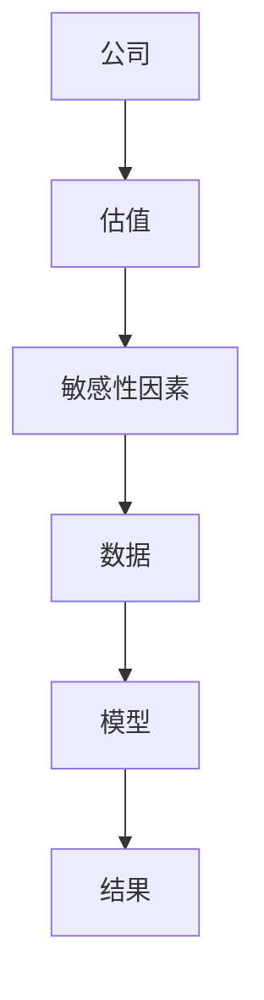
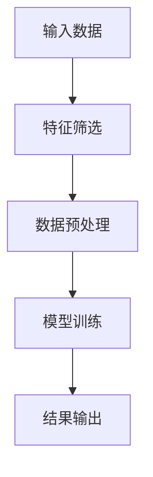
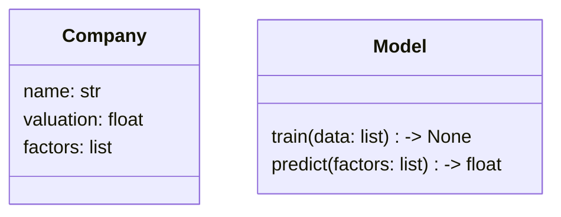
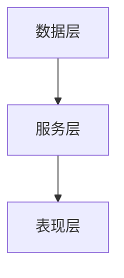
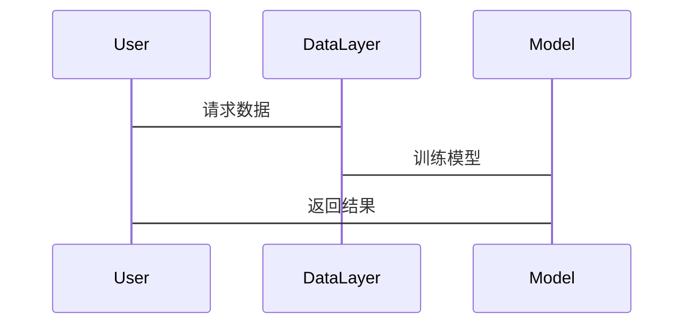

                 


# 《AI辅助的公司估值敏感性分析》

> 关键词：公司估值，敏感性分析，人工智能，数据驱动，数学模型，算法原理

> 摘要：本文详细探讨了如何利用人工智能技术进行公司估值的敏感性分析，从算法原理到系统设计，再到项目实战，全面解析了AI在公司估值中的应用，帮助读者掌握高效、精准的估值方法。

---

## 目录大纲

### 第一章：背景介绍

#### 1.1 问题背景
- 1.1.1 传统公司估值方法的局限性
- 1.1.2 敏感性分析的必要性
- 1.1.3 AI技术的应用优势

#### 1.2 问题描述
- 1.2.1 公司估值的关键因素
- 1.2.2 敏感性分析的目标
- 1.2.3 数据需求与假设条件

#### 1.3 问题解决
- 1.3.1 敏感性分析的步骤
- 1.3.2 AI在数据处理中的作用
- 1.3.3 分析结果的解释与应用

#### 1.4 边界与外延
- 1.4.1 分析的适用范围
- 1.4.2 与其他估值方法的对比
- 1.4.3 技术发展的可能性

#### 1.5 概念结构与核心要素
- 1.5.1 敏感性分析的基本框架
- 1.5.2 AI辅助分析的核心要素
- 1.5.3 与公司估值的关联性分析

---

### 第二章：核心概念与联系

#### 2.1 敏感性分析与公司估值的关系
- 2.1.1 敏感性分析的定义与作用
- 2.1.2 公司估值的基本原理
- 2.1.3 AI在敏感性分析中的应用

#### 2.2 概念属性特征对比
- 2.2.1 敏感性分析与回归分析的对比
- 2.2.2 AI辅助分析与传统方法的对比
- 2.2.3 数据驱动与模型驱动的对比

#### 2.3 实体关系图


---

### 第三章：算法原理讲解

#### 3.1 算法流程
- 3.1.1 输入数据
- 3.1.2 特征筛选
- 3.1.3 数据预处理
- 3.1.4 模型训练
- 3.1.5 结果输出

#### 3.2 算法流程图


#### 3.3 核心代码实现
- 3.3.1 数据加载与预处理
```python
import pandas as pd
data = pd.read_csv('company_data.csv')
```
- 3.3.2 模型训练
```python
from sklearn.linear_model import LinearRegression
model = LinearRegression()
model.fit(X_train, y_train)
```
- 3.3.3 结果分析
```python
importances = model.coef_
```

#### 3.4 数学模型与公式
- 3.4.1 线性回归模型
$$ y = \beta_0 + \beta_1x_1 + \beta_2x_2 + ... + \beta_nx_n + \epsilon $$

---

### 第四章：数学模型与公式

#### 4.1 模型推导
- 4.1.1 因子分解
- 4.1.2 协方差矩阵
$$ \Sigma = \begin{bmatrix} \sigma_1^2 & \sigma_{12} & \cdots & \sigma_{1n} \\ \sigma_{21} & \sigma_2^2 & \cdots & \sigma_{2n} \\ \vdots & \vdots & \ddots & \vdots \\ \sigma_{n1} & \sigma_{n2} & \cdots & \sigma_n^2 \end{bmatrix} $$

#### 4.2 参数估计
- 4.2.1 最小二乘法
$$ \hat{\beta} = (X^TX)^{-1}X^Ty $$

#### 4.3 模型应用
- 4.3.1 实际案例分析
- 4.3.2 模型解释

---

### 第五章：系统分析与架构设计

#### 5.1 问题场景介绍
- 5.1.1 项目背景
- 5.1.2 项目目标
- 5.1.3 项目范围

#### 5.2 系统功能设计
- 5.2.1 领域模型类图


#### 5.3 系统架构设计


#### 5.4 接口设计
- 5.4.1 数据接口
- 5.4.2 模型接口
- 5.4.3 结果接口

#### 5.5 交互流程


---

### 第六章：项目实战

#### 6.1 环境配置
- 6.1.1 Python安装
- 6.1.2 库的安装与配置
```bash
pip install numpy pandas scikit-learn
```

#### 6.2 核心代码实现
- 6.2.1 数据加载与预处理
```python
import pandas as pd
data = pd.read_csv('company_data.csv')
```
- 6.2.2 模型训练与预测
```python
from sklearn.linear_model import LinearRegression
model = LinearRegression()
model.fit(X_train, y_train)
predictions = model.predict(X_test)
```

#### 6.3 案例分析
- 6.3.1 数据分析
- 6.3.2 模型评估
- 6.3.3 结果解读

#### 6.4 项目总结
- 6.4.1 成果展示
- 6.4.2 经验与教训
- 6.4.3 改进建议

---

### 第七章：高级主题与拓展

#### 7.1 结合机器学习的敏感性分析
- 7.1.1 集成学习的应用
- 7.1.2 深度学习的潜力

#### 7.2 实时数据处理与动态调整
- 7.2.1 数据流处理
- 7.2.2 模型动态调整

#### 7.3 高级算法实现
- 7.3.1 非线性模型
- 7.3.2 超参数优化

---

### 第八章：最佳实践与总结

#### 8.1 最佳实践
- 8.1.1 数据质量管理
- 8.1.2 模型验证与测试
- 8.1.3 结果解释与应用

#### 8.2 小结
- 8.2.1 全书内容回顾
- 8.2.2 AI辅助分析的优势
- 8.2.3 未来发展方向

#### 8.3 注意事项
- 8.3.1 数据偏差问题
- 8.3.2 模型过拟合风险
- 8.3.3 解释性与准确性平衡

#### 8.4 拓展阅读
- 8.4.1 推荐书籍与论文
- 8.4.2 在线课程与资源
- 8.4.3 专业社区与论坛

---

### 作者简介

作者：AI天才研究院/AI Genius Institute & 禅与计算机程序设计艺术 /Zen And The Art of Computer Programming

---

这本书将系统地介绍AI在公司估值敏感性分析中的应用，从理论到实践，帮助读者掌握这一领域的核心知识和技术。

