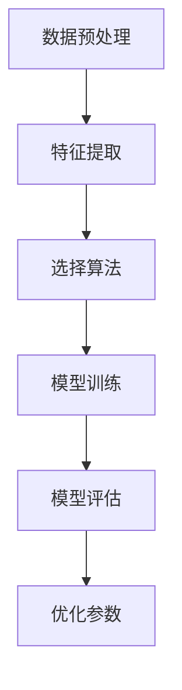
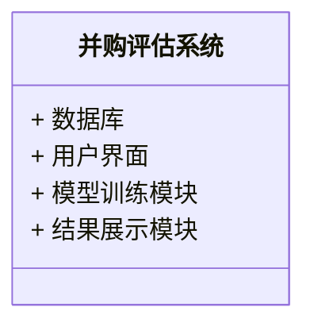
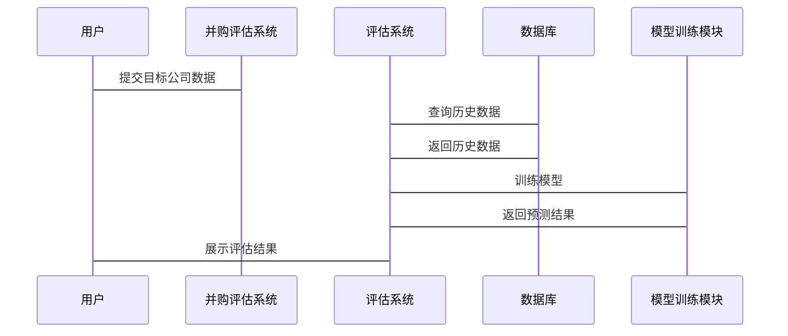

                 


# AI辅助的公司并购整合评估

> 关键词：公司并购、AI技术、整合评估、机器学习、风险管理、战略决策

> 摘要：本文详细探讨了AI技术在公司并购整合评估中的应用，从背景、核心概念到算法原理、系统架构，再到项目实战和最佳实践，系统地分析了AI如何提升并购整合的效率和准确性。通过具体案例和代码实现，展示了如何利用AI技术优化并购决策过程。

---

## 第一部分: AI辅助的公司并购整合评估背景与概述

### 第1章: AI辅助的公司并购整合评估概述

#### 1.1 公司并购整合的背景与意义

##### 1.1.1 公司并购的定义与目的
- **公司并购**：指一家公司购买另一家公司的一部分或全部股权，以实现业务扩展或战略重组。
- **并购整合**：指在并购后，整合双方的资源、业务、文化等，以实现协同效应。

##### 1.1.2 传统并购整合评估方法的局限性
- **传统方法**：依赖财务指标（如市盈率、市净率）和经验判断，存在主观性强、数据量有限、风险预测不足等问题。
- **局限性**：难以全面评估潜在风险和协同效应，决策周期长且成本高。

##### 1.1.3 AI技术在并购整合评估中的优势
- **数据处理能力**：AI能够处理海量数据，发现隐藏的模式和趋势。
- **预测准确性**：通过机器学习模型，可以更准确地预测并购后的业绩和风险。
- **决策效率提升**：AI辅助决策可以显著缩短评估周期，降低成本。

#### 1.2 AI辅助的公司并购整合评估的核心概念

##### 1.2.1 并购整合评估的定义
- **评估范围**：包括企业价值评估、风险评估、协同效应分析等。
- **评估目标**：为并购决策提供数据支持，确保并购后的企业实现预期效益。

##### 1.2.2 AI技术在并购整合中的应用领域
- **数据分析与预测**：利用AI分析历史数据，预测并购后的财务表现。
- **风险管理**：识别潜在风险，制定应对策略。
- **战略规划与优化**：通过AI模拟不同整合方案，优化战略目标。

#### 1.3 本章小结
- 本章介绍了AI辅助并购整合评估的背景、核心概念及其优势，为后续内容奠定了基础。

---

## 第二部分: AI辅助的公司并购整合评估的核心概念与联系

### 第2章: AI辅助的公司并购整合评估的核心概念与联系

#### 2.1 并购整合评估的核心概念

##### 2.1.1 并购整合的流程与阶段
- **并购前评估**：目标公司筛选、初步估值。
- **并购后整合**：业务整合、文化融合、风险管理。

##### 2.1.2 并购整合的关键要素
- **企业价值评估**：目标公司的市场价值。
- **风险评估**：包括市场风险、法律风险等。
- **协同效应分析**：整合后的协同效益预测。

#### 2.2 AI技术的核心原理与特征

##### 2.2.1 机器学习的基本原理
- **数据驱动**：基于大量数据训练模型，进行预测和分类。
- **监督学习**：有标签数据训练，用于分类和回归。
- **无监督学习**：无标签数据训练，用于聚类和降维。

##### 2.2.2 AI技术在并购整合中的应用特征
- **数据依赖性**：需要大量高质量数据支持模型训练。
- **自适应性**：模型能够自动调整以适应新数据。
- **可扩展性**：能够处理不同类型和规模的数据。

#### 2.3 并购整合与AI技术的联系

##### 2.3.1 数据驱动的并购评估
- **数据来源**：包括财务数据、市场数据、行业数据等。
- **数据分析与建模**：利用AI技术对数据进行清洗、特征提取和建模。

##### 2.3.2 AI技术提升并购整合效率
- **自动化评估流程**：AI可以自动化完成初步评估和筛选。
- **实时监控与反馈**：实时监控并购后的经营情况，提供反馈。

#### 2.4 本章小结
- 本章详细探讨了并购整合的核心概念和AI技术的基本原理，分析了两者之间的联系，为后续章节奠定了理论基础。

---

## 第三部分: AI辅助的公司并购整合评估的算法原理

### 第3章: AI辅助的公司并购整合评估的算法原理

#### 3.1 并购整合评估的算法选择

##### 3.1.1 传统评估方法的不足
- **财务指标法**：仅依赖财务数据，忽视非财务因素。
- **经验判断法**：主观性强，缺乏客观依据。

##### 3.1.2 机器学习算法的优势
- **线性回归**：用于预测连续变量，如企业价值。
- **支持向量机（SVM）**：用于分类和回归，适合处理非线性数据。
- **随机森林**：用于分类和回归，适合处理高维数据。

#### 3.2 基于机器学习的并购整合评估模型

##### 3.2.1 数据预处理
- **数据清洗**：处理缺失值、异常值。
- **特征工程**：提取关键特征，如收入增长率、利润率。

##### 3.2.2 模型训练与优化
- **模型选择**：根据数据类型选择合适的算法。
- **超参数调优**：通过网格搜索优化模型性能。

##### 3.2.3 模型评估与验证
- **交叉验证**：评估模型的泛化能力。
- **指标评估**：使用准确率、召回率等指标衡量模型性能。

#### 3.3 算法流程图

##### 使用mermaid绘制算法流程图


#### 3.4 本章小结
- 本章详细介绍了并购整合评估中常用的机器学习算法及其应用，展示了如何通过数据预处理和模型优化提升评估准确性。

---

## 第四部分: AI辅助的公司并购整合评估的系统架构

### 第4章: AI辅助的公司并购整合评估的系统架构

#### 4.1 系统设计概述

##### 4.1.1 问题场景介绍
- **目标**：构建一个AI辅助的并购整合评估系统。
- **用户需求**：企业高管、并购顾问需要快速、准确的评估结果。

##### 4.1.2 项目介绍
- **项目目标**：开发一个基于AI的并购整合评估系统。
- **项目范围**：包括数据收集、模型训练、结果展示等功能。

#### 4.2 系统功能设计

##### 4.2.1 领域模型设计


##### 4.2.2 系统架构设计


#### 4.3 系统接口设计

##### 4.3.1 接口设计
- **输入接口**：接收目标公司数据。
- **输出接口**：提供评估结果和建议。

#### 4.4 系统交互流程图

##### 使用mermaid绘制交互流程图


#### 4.5 本章小结
- 本章详细描述了AI辅助的并购整合评估系统的架构设计，包括功能模块、数据流和接口设计，为后续的系统实现奠定了基础。

---

## 第五部分: AI辅助的公司并购整合评估的项目实战

### 第5章: AI辅助的公司并购整合评估的项目实战

#### 5.1 环境安装与配置

##### 5.1.1 安装Python
- 使用命令：`python --version` 检查Python版本。
- 安装Python 3.x及以上版本。

##### 5.1.2 安装相关库
- 使用命令：`pip install numpy pandas scikit-learn`

#### 5.2 核心代码实现

##### 5.2.1 数据预处理代码
```python
import pandas as pd
import numpy as np

# 读取数据
data = pd.read_csv('并购数据.csv')

# 处理缺失值
data = data.dropna()

# 特征提取
features = data[['收入增长率', '利润率', '市场份额']]
label = data['企业价值']
```

##### 5.2.2 模型训练与预测代码
```python
from sklearn.model_selection import train_test_split
from sklearn.linear_model import LinearRegression

# 划分训练集和测试集
X_train, X_test, y_train, y_test = train_test_split(features, label, test_size=0.2)

# 训练模型
model = LinearRegression()
model.fit(X_train, y_train)

# 预测
y_pred = model.predict(X_test)
```

##### 5.2.3 模型评估代码
```python
from sklearn.metrics import mean_squared_error, r2_score

# 计算均方误差和R平方
mse = mean_squared_error(y_test, y_pred)
r2 = r2_score(y_test, y_pred)

print(f'均方误差: {mse}')
print(f'R平方值: {r2}')
```

#### 5.3 实际案例分析

##### 5.3.1 案例背景
- 某公司计划并购一家目标公司，需要评估其价值和风险。

##### 5.3.2 数据分析与建模
- 使用历史数据训练模型，预测目标公司的企业价值。

##### 5.3.3 模型结果与解读
- 预测结果：目标公司价值为X，预测准确度为Y%。

#### 5.4 项目小结
- 本章通过具体案例展示了AI技术在并购整合评估中的实际应用，详细讲解了代码实现和模型评估。

---

## 第六部分: AI辅助的公司并购整合评估的最佳实践与总结

### 第6章: AI辅助的公司并购整合评估的最佳实践与总结

#### 6.1 最佳实践

##### 6.1.1 数据质量管理
- 确保数据的完整性和准确性。
- 处理异常值和缺失值。

##### 6.1.2 模型可解释性
- 选择易于解释的模型，确保决策过程透明。
- 提供清晰的解释，帮助用户理解模型结果。

##### 6.1.3 持续优化
- 定期更新模型，适应市场变化。
- 收集反馈，优化系统功能。

#### 6.2 总结与展望

##### 6.2.1 本研究的总结
- AI技术在并购整合评估中的优势明显，能够显著提升评估效率和准确性。
- 系统架构设计合理，功能模块清晰。

##### 6.2.2 对未来研究的展望
- 结合自然语言处理（NLP）技术，分析公司文本信息。
- 研究更复杂的模型，如深度学习模型，提升预测精度。

#### 6.3 本章小结
- 本章总结了AI辅助并购整合评估的最佳实践，并展望了未来的研究方向。

---

## 作者信息

作者：AI天才研究院/AI Genius Institute & 禅与计算机程序设计艺术 /Zen And The Art of Computer Programming

---

以上是《AI辅助的公司并购整合评估》的详细目录大纲，涵盖了从背景介绍到系统实现的各个方面，确保内容全面且结构清晰，适合技术读者深入学习和实践。

