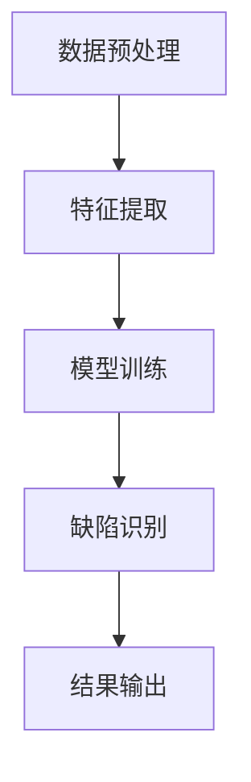
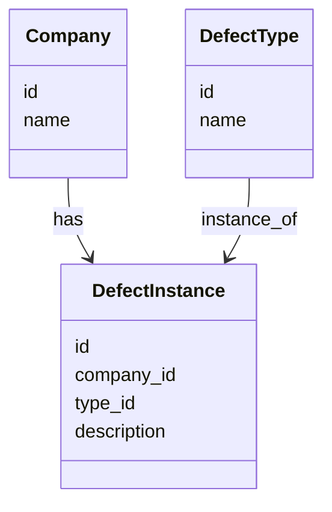
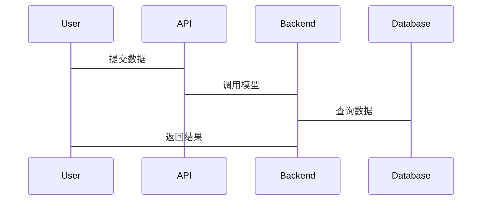

                 


# AI辅助的公司治理缺陷识别系统

## 关键词
AI技术、公司治理、缺陷识别、系统架构、算法原理

## 摘要
随着企业规模的不断扩大，公司治理中的缺陷识别变得越来越复杂。传统的缺陷识别方法依赖于人工审核，效率低下且容易出错。本文提出了一种基于AI技术的公司治理缺陷识别系统，通过数据驱动的方法，利用机器学习和自然语言处理技术，自动识别公司治理中的潜在缺陷。本文详细介绍了该系统的背景、核心概念、算法原理、系统架构、项目实战以及最佳实践，为企业的治理优化提供了新的思路和解决方案。

---

## 第1章: 背景介绍

### 1.1 问题背景

#### 1.1.1 公司治理中的常见缺陷
在现代企业中，公司治理是确保企业高效运作、合规经营的关键。然而，公司治理中常常存在以下缺陷：
- **决策失误**：管理层决策不科学，缺乏数据支持。
- **合规性不足**：企业可能因未能遵守法规而面临法律风险。
- **内部效率低下**：流程复杂，资源浪费。
- **团队协作问题**：部门间沟通不畅，责任不清。

#### 1.1.2 传统缺陷识别的局限性
传统的缺陷识别方法通常依赖于人工审核和经验判断，存在以下问题：
- **效率低**：人工审核耗时长，难以应对大量数据。
- **主观性**：依赖个人经验，容易出现偏差。
- **覆盖面有限**：难以全面覆盖所有可能的治理缺陷。

#### 1.1.3 AI技术在缺陷识别中的潜力
AI技术，特别是机器学习和自然语言处理，为缺陷识别提供了新的可能性：
- **高效性**：AI可以在短时间内处理大量数据，快速识别潜在问题。
- **准确性**：通过训练模型，AI能够识别复杂模式，减少人为误差。
- **可扩展性**：AI系统可以轻松扩展，适用于不同规模的企业。

### 1.2 问题描述

#### 1.2.1 缺陷识别的定义与分类
缺陷识别是指通过分析企业内部数据，识别潜在问题或风险的过程。根据缺陷的性质，可以将其分为以下几类：
- **合规性缺陷**：如未能遵守法律法规。
- **效率缺陷**：如流程冗余或资源浪费。
- **决策缺陷**：如战略决策失误。

#### 1.2.2 系统的目标与范围
本系统的目标是通过AI技术，帮助企业在公司治理中快速识别潜在缺陷，提供改进建议。系统范围包括：
- 数据收集与处理。
- 缺陷识别模型的训练与部署。
- 结果分析与报告生成。

---

## 第2章: 核心概念与联系

### 2.1 核心概念原理

#### 2.1.1 数据驱动的缺陷识别
数据驱动的缺陷识别依赖于对企业内外部数据的收集和分析。关键数据来源包括：
- **内部数据**：如财务报表、员工反馈、会议记录。
- **外部数据**：如行业趋势、市场动态、法规变化。

#### 2.1.2 AI模型在缺陷识别中的作用
AI模型通过学习数据中的模式，能够自动识别潜在缺陷。常用的技术包括：
- **监督学习**：使用标注数据训练模型，识别特定缺陷。
- **无监督学习**：通过聚类分析，发现异常模式。
- **自然语言处理（NLP）**：分析文本数据，识别潜在风险。

#### 2.1.3 多模态数据的融合与分析
多模态数据融合是指将结构化数据（如表格数据）和非结构化数据（如文本、图像）结合，以提高识别精度。例如：
- 使用NLP分析会议记录，识别潜在决策问题。
- 结合财务数据和市场趋势，预测合规风险。

### 2.2 核心概念对比

#### 2.2.1 不同缺陷识别方法的特征对比
| 方法         | 优点                           | 缺点                           |
|--------------|--------------------------------|--------------------------------|
| 人工审核       | 高准确性                       | 低效、主观性                   |
| 监督学习       | 高效、准确                     | 需大量标注数据                 |
| 无监督学习     | 自动发现异常                   | 结果难以解释                   |
| NLP分析       | 能处理文本数据                 | 对文本质量敏感                 |

#### 2.2.2 AI辅助与传统方法的优劣势分析
- **AI辅助的优势**：高效、客观、可扩展。
- **传统方法的劣势**：低效、主观、难以扩展。

### 2.3 ER实体关系图

```mermaid
erDiagram
    company : 公司
    defect_type : 缺陷类型
    defect_instance : 缺陷实例
    company --> defect_instance : 包含
    defect_type --> defect_instance : 实例化
```

---

## 第3章: 算法原理讲解

### 3.1 算法流程



### 3.2 Python核心代码实现

```python
import numpy as np
from sklearn.model import model

class DefectRecognizer:
    def __init__(self):
        self.model = model()

    def preprocess(self, data):
        # 数据预处理逻辑
        return data

    def recognize(self, data):
        processed_data = self.preprocess(data)
        return self.model.predict(processed_data)
```

### 3.3 数学模型与公式

#### 分类模型的损失函数
$$ L = -\sum_{i=1}^{n} y_i \log(p_i) + (1 - y_i) \log(1 - p_i) $$

其中：
- \( y_i \) 是真实标签。
- \( p_i \) 是模型预测的概率。

---

## 第4章: 系统分析与架构设计

### 4.1 问题场景介绍
本系统旨在解决企业治理中的缺陷识别问题，通过AI技术实现高效、准确的缺陷识别。

### 4.2 项目介绍

#### 4.2.1 系统功能设计
- 数据预处理模块：清洗和转换数据。
- 模型训练模块：训练AI模型。
- 缺陷识别模块：识别潜在缺陷。
- 报告生成模块：生成分析报告。

#### 4.2.2 领域模型


#### 4.2.3 系统架构


### 4.3 系统接口设计

#### 4.3.1 API接口
- 输入：公司数据。
- 输出：缺陷识别结果。

#### 4.3.2 交互流程


---

## 第5章: 项目实战

### 5.1 环境安装

#### 5.1.1 安装Python
```bash
python --version
pip install --upgrade pip
```

#### 5.1.2 安装依赖
```bash
pip install numpy scikit-learn
```

### 5.2 核心代码实现

#### 5.2.1 数据预处理
```python
def preprocess_data(data):
    # 数据清洗和转换
    return processed_data
```

#### 5.2.2 模型训练
```python
def train_model(X, y):
    model = model()
    model.fit(X, y)
    return model
```

#### 5.2.3 缺陷识别
```python
def recognize_defects(data, model):
    processed_data = preprocess_data(data)
    predictions = model.predict(processed_data)
    return predictions
```

### 5.3 实际案例分析

#### 5.3.1 案例背景
某企业面临合规性问题，希望通过AI系统识别潜在缺陷。

#### 5.3.2 数据分析
分析财务报表和员工反馈，识别潜在的合规风险。

#### 5.3.3 模型优化
调整模型参数，提高识别精度。

---

## 第6章: 最佳实践

### 6.1 小结
AI辅助的公司治理缺陷识别系统通过数据驱动的方法，显著提高了缺陷识别的效率和准确性。

### 6.2 注意事项
- 数据质量是关键，需确保数据的完整性和准确性。
- 模型需要定期更新，以适应变化的业务需求。
- 遵守数据隐私法规，确保合规性。

### 6.3 拓展阅读
- 《机器学习实战》
- 《自然语言处理入门》
- 《企业治理与风险管理》

---

## 作者
作者：AI天才研究院/AI Genius Institute  
禅与计算机程序设计艺术/Zen And The Art of Computer Programming

--- 

# 结语
AI辅助的公司治理缺陷识别系统为企业的治理优化提供了新的可能性。通过本文的详细讲解，读者可以深入了解系统的背景、原理、架构和实现，为实际应用提供了有力的指导。

