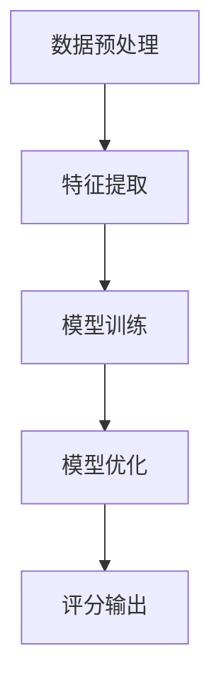
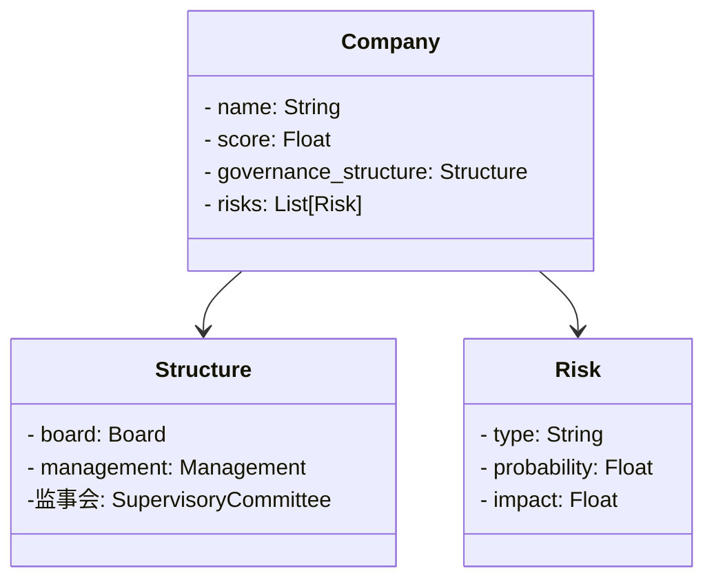
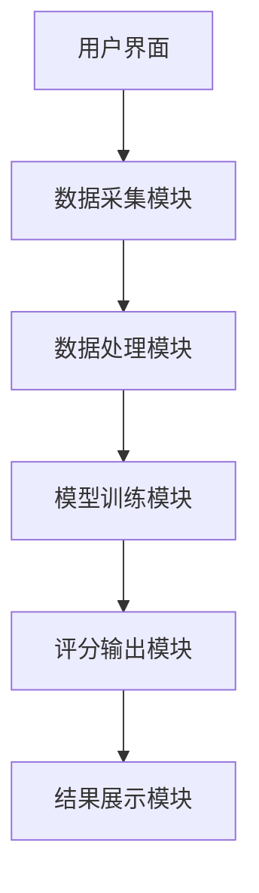
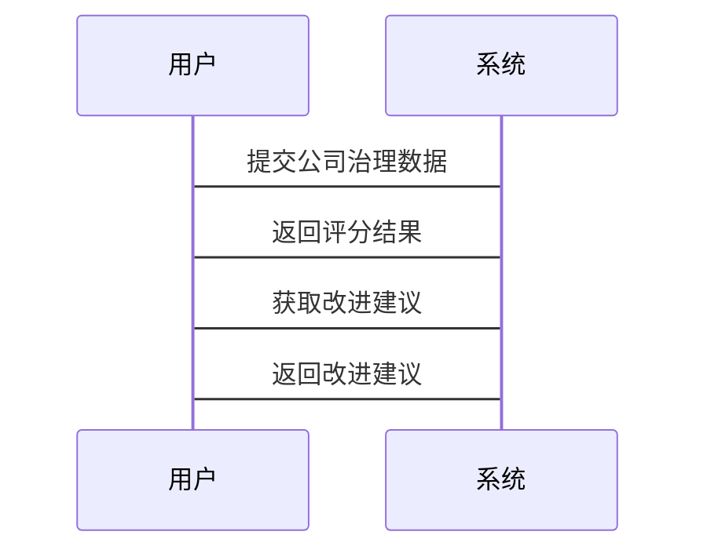
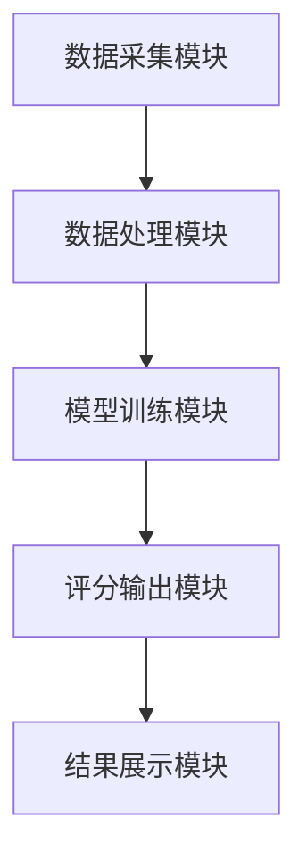

                 


# AI辅助的公司治理评分系统与改善建议

> 关键词：公司治理, AI辅助, 评分系统, 机器学习, 算法实现

> 摘要：本文将探讨如何利用人工智能技术来构建公司治理评分系统，并提出改善公司治理的具体建议。通过分析公司治理的核心要素，结合机器学习算法，设计并实现一个高效的评分系统，帮助企业优化治理结构，提升治理效率，降低治理风险。

---

# 第一部分: 公司治理与AI辅助评分系统基础

## 第1章: 公司治理基础

### 1.1 公司治理的基本概念
- **公司治理的定义**: 公司治理是指通过一系列制度、机制和流程，确保公司战略目标的实现，平衡股东、管理层、员工和其他利益相关者的利益，提升公司整体绩效的过程。
- **公司治理的核心要素**:
  - 股权结构
  - 组织架构
  - 决策机制
  - 监督机制
  - 信息披露
- **公司治理的目标与意义**:
  - 提高公司透明度和信任度
  - 优化资源配置
  - 风险控制
  - 增强公司竞争力

### 1.2 公司治理的主要问题
- **代理问题**: 股东与管理层之间的利益冲突，管理层可能追求自身利益而非股东利益最大化。
- **信息不对称问题**: 股东与管理层之间、公司与外部利益相关者之间存在信息不对称，导致决策失误和信任缺失。
- **股权分配与权力制衡**: 股权分配不合理可能导致控制权集中在少数人手中，缺乏有效制衡。

### 1.3 公司治理的评价标准
- **治理结构评价**: 包括董事会结构、独立董事比例、监事会设置等。
- **治理效率评价**: 包括决策效率、管理效率、执行效率等。
- **治理透明度评价**: 包括信息披露的及时性、完整性、准确性。

### 1.4 传统公司治理的局限性
- **传统治理模式的不足**: 依赖人工判断，主观性强，缺乏客观数据支持。
- **传统评分系统的缺陷**: 评分标准不统一，难以量化，缺乏动态调整能力。
- **传统治理与现代企业需求的矛盾**: 现代企业面临的复杂环境要求治理模式更加灵活、高效，传统模式难以满足。

---

## 第2章: AI技术与公司治理的结合

### 2.1 AI技术的基本概念
- **人工智能的定义**: 人工智能（AI）是指通过模拟人类智能的思考、学习、推理和自适应能力，使计算机系统能够执行复杂的任务。
- **机器学习的核心原理**: 机器学习是AI的重要分支，通过训练模型从数据中学习模式和规律，用于预测和分类。
- **自然语言处理的应用**: 自然语言处理（NLP）是AI的另一个重要分支，用于理解和生成人类语言，广泛应用于文本分析、情感分析等领域。

### 2.2 AI在公司治理中的应用场景
- **股权分析与风险评估**: 利用AI分析公司股权结构，评估潜在风险，如控制权风险、关联交易风险等。
- **经营决策支持**: 基于AI的分析，为管理层提供数据支持，优化决策过程。
- **内部控制与合规监控**: 利用AI实时监控公司运营，发现潜在违规行为，提升合规性。

### 2.3 AI辅助公司治理的优势
- **提高决策效率**: AI能够快速处理大量数据，提供实时反馈，帮助管理层做出更高效的决策。
- **增强风险预警能力**: 通过AI分析，可以提前发现潜在风险，制定应对策略。
- **优化资源配置**: AI能够根据数据分析结果，优化资源配置，提升公司整体效率。

---

# 第二部分: AI辅助公司治理评分系统的算法原理

## 第3章: AI辅助评分系统的算法基础

### 3.1 数据预处理与特征提取
- **数据清洗与标准化**: 对收集的数据进行清洗，去除噪声数据，标准化处理，确保数据一致性。
- **特征选择与降维**: 通过特征选择算法（如PCA）提取关键特征，降低维度，提升模型效率。
- **数据增强技术**: 通过数据增强技术，增加数据多样性，提升模型泛化能力。

### 3.2 评分模型的构建
- **线性回归模型**: 用于预测公司治理评分，公式为：
  $$ y = \beta_0 + \beta_1x_1 + \beta_2x_2 + \epsilon $$
- **支持向量机（SVM）**: 用于分类和回归，适用于非线性关系的数据。
- **随机森林与梯度提升树**: 集成学习方法，适用于复杂数据，提升模型准确性。

### 3.3 模型训练与优化
- **参数调优与交叉验证**: 通过网格搜索等方法，找到最优参数组合。
- **模型评估与性能指标**: 通过准确率、召回率、F1分数等指标评估模型性能。
- **模型部署与实时更新**: 将模型部署到生产环境，实时更新数据，保持模型最新。

### 3.4 评分系统的算法流程图


### 3.5 本章小结
---

## 第4章: 基于机器学习的评分算法实现

### 4.1 算法原理
- **线性回归模型公式**: $$ y = \beta_0 + \beta_1x + \epsilon $$
- **随机森林算法原理**: 随机森林是一种基于决策树的集成学习方法，通过随机采样和特征选择，构建多个决策树，最终通过投票或平均的方式得出结果。
- **梯度提升树的数学模型**: 梯度提升树通过不断优化损失函数，逐步构建弱分类器，最终形成强分类器。

### 4.2 算法实现
- **数据集划分与训练**: 将数据集划分为训练集和测试集，进行模型训练。
- **模型训练代码示例**:
```python
import pandas as pd
from sklearn.ensemble import RandomForestClassifier
from sklearn.metrics import accuracy_score

# 加载数据
data = pd.read_csv('governance_data.csv')
X = data.drop('score', axis=1)
y = data['score']

# 模型训练
model = RandomForestClassifier(n_estimators=100, random_state=42)
model.fit(X, y)

# 预测与评估
y_pred = model.predict(X)
print("准确率:", accuracy_score(y, y_pred))
```

---

# 第三部分: 系统分析与架构设计方案

## 第5章: 系统分析与架构设计

### 5.1 问题场景介绍
- **问题背景**: 公司治理评分系统需要实时监控公司运营，提供动态评分，帮助管理层优化治理结构。
- **项目介绍**: 本项目旨在开发一个基于AI的公司治理评分系统，利用机器学习算法，对公司的治理结构、效率和透明度进行评分，并提出改进建议。

### 5.2 系统功能设计
- **领域模型**: 下面是一个公司治理评分系统的领域模型类图。


### 5.3 系统架构设计
- **系统架构图**: 下面是一个基于AI的公司治理评分系统的架构图。


### 5.4 系统接口设计
- **数据接口**: 提供API接口，接收公司治理相关数据，如股权结构、董事会成员信息、财务数据等。
- **模型接口**: 提供API接口，接收输入数据，返回评分结果。

### 5.5 系统交互设计
- **系统交互图**: 下面是一个用户与系统的交互流程图。


---

## 第6章: 项目实战

### 6.1 环境安装
- **安装Python**: 下载并安装Python 3.8及以上版本。
- **安装依赖库**: 使用以下命令安装所需库：
  ```bash
  pip install pandas scikit-learn joblib
  ```

### 6.2 系统核心实现源代码
- **数据处理代码**:
```python
import pandas as pd
from sklearn.preprocessing import StandardScaler

# 加载数据
data = pd.read_csv('governance_data.csv')

# 数据清洗
data.dropna(inplace=True)
data = pd.get_dummies(data)

# 标准化处理
scaler = StandardScaler()
data_scaled = scaler.fit_transform(data)
```

- **模型训练代码**:
```python
from sklearn.ensemble import RandomForestClassifier
from sklearn.metrics import accuracy_score

# 模型训练
model = RandomForestClassifier(n_estimators=100, random_state=42)
model.fit(data_scaled, target)
```

### 6.3 代码应用解读与分析
- **数据处理**: 数据清洗和特征编码，确保数据一致性。
- **模型训练**: 使用随机森林算法训练模型，评估模型性能。

### 6.4 实际案例分析
- **案例介绍**: 以某公司为例，分析其治理结构、效率和透明度，计算其治理评分。
- **详细讲解**: 通过数据分析和模型预测，找出公司治理中的问题，并提出改进建议。

### 6.5 项目小结
- **项目总结**: 本项目通过AI技术，构建了一个高效的公司治理评分系统，帮助企业优化治理结构，提升治理效率。
- **经验总结**: 在项目实施过程中，需要注意数据质量、模型选择和结果解读等问题。

---

## 第7章: 系统架构与接口设计

### 7.1 系统架构设计
- **模块划分**: 系统分为数据采集模块、数据处理模块、模型训练模块、评分输出模块和结果展示模块。
- **架构图**: 下面是一个公司治理评分系统的架构图。


### 7.2 系统接口设计
- **数据接口**: 提供REST API接口，接收公司治理数据，返回处理后的数据。
- **模型接口**: 提供API接口，接收输入数据，返回评分结果。

### 7.3 系统交互设计
- **交互流程图**: 下面是一个用户与系统的交互流程图。


---

## 第8章: 系统实现与测试

### 8.1 系统实现
- **实现步骤**: 数据采集、数据处理、模型训练、评分输出、结果展示。
- **代码实现**: 如上文所述的Python代码。

### 8.2 系统测试
- **单元测试**: 对各个模块进行测试，确保功能正常。
- **集成测试**: 对整个系统进行测试，确保模块之间协同工作。

---

## 第9章: 改善建议与最佳实践

### 9.1 改善建议
- **优化股权结构**: 优化股权分配，引入更多的独立董事，增强董事会的独立性。
- **加强内部控制**: 建立健全的内部控制体系，确保公司运营合规。
- **提升透明度**: 加强信息披露，提高公司治理的透明度和信任度。

### 9.2 最佳实践Tips
- **数据质量**: 确保数据的准确性和完整性，提升模型性能。
- **模型更新**: 定期更新模型，适应公司治理的变化。
- **用户反馈**: 收集用户反馈，不断优化系统功能。

### 9.3 小结
- **总结**: 通过AI辅助的公司治理评分系统，企业可以更加高效地优化治理结构，提升治理效率，降低治理风险。

---

## 第10章: 结论与展望

### 10.1 本章总结
- **总结**: 本文探讨了如何利用AI技术构建公司治理评分系统，并提出了改善公司治理的具体建议。

### 10.2 未来展望
- **未来研究方向**: 研究更先进的AI技术，如深度学习、强化学习，提升评分系统的准确性和智能性。
- **发展趋势**: 随着AI技术的不断发展，公司治理评分系统将更加智能化、个性化，为企业提供更精准的治理支持。

---

## 作者：AI天才研究院/AI Genius Institute & 禅与计算机程序设计艺术 /Zen And The Art of Computer Programming

