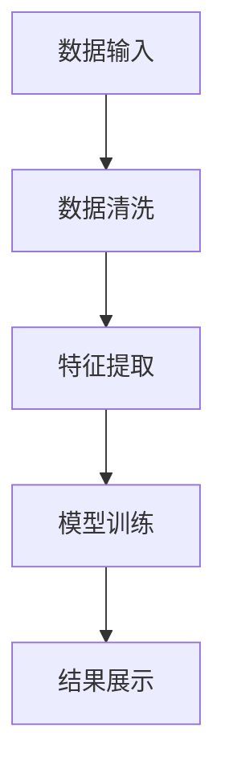
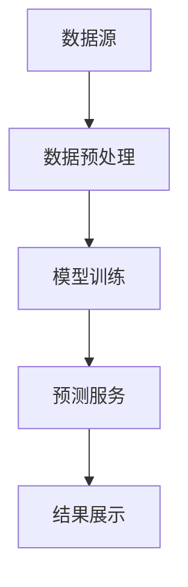
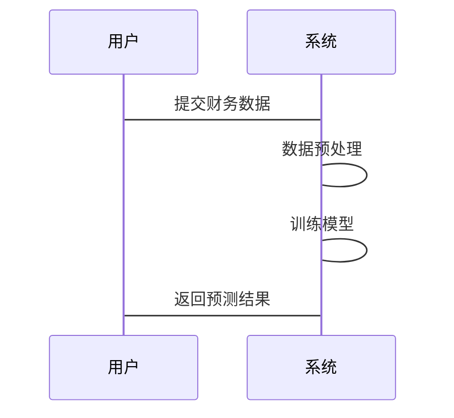

                 


# AI辅助的公司财务报表预测

## 关键词：AI，财务报表预测，机器学习，深度学习，数据预处理

## 摘要：本文探讨了利用人工智能技术辅助公司财务报表预测的方法与实践。通过详细分析财务报表预测的核心概念、AI算法原理、数据预处理技术、系统架构设计及项目实战，帮助读者理解如何将AI技术应用于财务预测，提升企业财务预测的准确性和效率。

---

# 第1章: 背景介绍与核心概念

## 1.1 问题背景与描述

### 1.1.1 传统财务报表预测的局限性

传统财务报表预测主要依赖于财务分析师的经验和手动分析。这种方法虽然可靠，但也存在诸多局限性：

1. **主观性高**：依赖个人经验，容易受到主观判断的影响。
2. **效率低下**：手工分析耗时长，难以应对大量数据。
3. **预测精度有限**：由于人为因素和数据复杂性，预测结果可能存在较大误差。

### 1.1.2 AI技术在财务预测中的优势

人工智能技术的引入为财务预测带来了显著的优势：

1. **数据处理能力强**：AI能够快速处理大量复杂数据，发现隐藏的模式和趋势。
2. **自动化与高效性**：自动化处理数据，提高预测效率。
3. **高精度与客观性**：通过算法减少人为误差，提高预测准确性。

### 1.1.3 企业财务预测的核心目标与边界

**核心目标**：
- 准确预测未来财务状况，支持企业决策。
- 识别潜在风险，优化资源配置。

**边界**：
- 数据范围：基于历史财务数据和相关业务数据。
- 时间范围：通常预测未来1-3年的财务状况。
- 模型适用性：适用于数据充足、业务稳定的公司。

## 1.2 核心概念与联系

### 1.2.1 AI与财务预测的关系

AI通过以下方式影响财务预测：
- 数据分析：利用机器学习算法处理大量财务数据。
- 模型优化：通过深度学习提升预测精度。
- 实时监控：实时更新数据，动态调整预测结果。

### 1.2.2 财务报表预测的流程与关键要素

**流程**：
1. 数据收集：获取历史财务数据和外部数据。
2. 数据预处理：清洗和特征工程。
3. 模型选择：选择合适的AI算法。
4. 模型训练：训练预测模型。
5. 结果分析：解读预测结果，优化模型。

**关键要素**：
- 数据质量：数据的准确性和完整性。
- 模型选择：算法的适用性和复杂度。
- 预测目标：明确预测的具体财务指标。

### 1.2.3 数据流、模型训练与结果展示的关系

**数据流**：从数据输入到处理，再到模型训练的过程。
**模型训练**：基于数据训练模型，生成预测结果。
**结果展示**：将预测结果可视化，便于分析和决策。

---

# 第2章: AI辅助财务预测的核心原理

## 2.1 机器学习与深度学习基础

### 2.1.1 机器学习的基本概念

机器学习是一种人工智能技术，通过数据训练模型，使其能够进行预测或分类。常用算法包括：

- **监督学习**：如线性回归、支持向量机（SVM）。
- **无监督学习**：如聚类分析。
- **回归分析**：用于预测连续型变量。

### 2.1.2 深度学习的原理与特点

深度学习是机器学习的一种，通过多层神经网络模拟人脑的处理方式。其特点包括：

- **非线性特征提取**：能够捕捉复杂的数据模式。
- **自动特征学习**：无需手动提取特征。
- **高计算需求**：需要大量计算资源。

### 2.1.3 预测模型的训练与优化

**训练过程**：
1. 数据预处理：清洗数据，提取特征。
2. 模型选择：选择合适的算法。
3. 模型训练：使用训练数据优化模型参数。
4. 模型评估：验证模型性能。

**优化方法**：
- 调参：调整模型超参数。
- 正则化：防止过拟合。
- 交叉验证：评估模型泛化能力。

---

## 2.2 算法原理与数学模型

### 2.2.1 线性回归模型

线性回归是一种简单且常用的预测模型，适用于线性关系的数据。

**公式**：
$$ y = \beta_0 + \beta_1x + \epsilon $$

- $y$：预测目标。
- $x$：自变量。
- $\beta_0$：截距。
- $\beta_1$：回归系数。
- $\epsilon$：误差项。

**应用场景**：适合简单线性关系的预测，如销售额与广告投入的关系。

### 2.2.2 随机森林算法

随机森林是一种基于决策树的集成学习算法，具有高准确性和鲁棒性。

**工作原理**：
1. 生成多个决策树（袋装法）。
2. 对每个样本进行投票预测。

**优点**：
- 高准确性。
- 抗过拟合能力强。
- 能处理高维数据。

### 2.2.3 神经网络模型

神经网络是一种模仿人脑结构的深度学习模型，适用于复杂非线性关系的预测。

**结构**：
- 输入层：接收输入数据。
- 隐藏层：处理数据特征。
- 输出层：生成预测结果。

**训练方法**：反向传播算法，最小化预测误差。

### 2.2.4 支持向量机（SVM）

SVM是一种监督学习算法，适用于分类和回归问题。

**优点**：
- 对高维数据处理能力强。
- 对噪声数据鲁棒性好。

---

## 2.3 算法对比与选择

### 2.3.1 各种算法的优缺点对比

| 算法类型 | 优点 | 缺点 |
|----------|------|------|
| 线性回归 | 简单，计算快 | 仅适合线性关系 |
| 随机森林 | 高准确性，鲁棒性好 | 计算资源消耗大 |
| 神经网络 | 复杂关系处理能力强 | 需要大量数据，计算复杂 |
| SVM      | 对噪声数据鲁棒 | 不适合高维数据 |

### 2.3.2 如何选择合适的预测模型

**步骤**：
1. 理解业务需求。
2. 分析数据特征。
3. 选择合适的算法。
4. 通过实验验证模型性能。

---

# 第3章: 数据预处理与特征工程

## 3.1 数据清洗与标准化

### 3.1.1 数据清洗的必要性

数据清洗是数据预处理的重要步骤，用于处理缺失值、异常值和重复值。

**方法**：
- 删除无效数据。
- 填充缺失值：均值、中位数或插值法。
- 处理异常值：删除或替换。

### 3.1.2 数据标准化与归一化

标准化：将数据按比例缩放到均值为0，方差为1。

**公式**：
$$ z = \frac{x - \mu}{\sigma} $$

归一化：将数据缩放到0-1范围。

**公式**：
$$ x' = \frac{x - \min(x)}{\max(x) - \min(x)} $$

### 3.1.3 异常值的处理方法

- **删除异常值**：直接删除偏离较大的数据。
- **替换异常值**：用均值或中位数替换。
- **保留异常值**：在模型训练中保留，利用其特征。

## 3.2 特征工程与数据增强

### 3.2.1 特征选择与提取

特征选择：从数据中选择重要特征。

**方法**：
- 基于统计的方法：卡方检验。
- 基于模型的方法：Lasso回归。

特征提取：通过主成分分析（PCA）等方法降低维度。

### 3.2.2 数据增强技术

数据增强：通过生成新数据增强训练集。

**方法**：
- 数据标准化。
- 添加噪声。
- 数据合成：生成虚拟数据。

### 3.2.3 时间序列数据的处理

时间序列数据具有趋势性和周期性，常用ARIMA、LSTM等模型处理。

**LSTM模型**：
- 适合处理时间序列数据。
- 能捕捉长期依赖关系。

---

# 第4章: 系统架构与设计

## 4.1 系统功能设计

### 4.1.1 数据输入与处理模块

- 数据输入：接收财务数据。
- 数据清洗：处理缺失值和异常值。
- 特征提取：选择重要特征。

### 4.1.2 模型训练与优化模块

- 模型选择：选择合适的算法。
- 模型训练：训练预测模型。
- 模型优化：调整超参数。

### 4.1.3 结果展示与分析模块

- 结果输出：展示预测结果。
- 结果分析：解读预测结果。
- 图表展示：用图表可视化预测结果。

## 4.2 系统架构设计

### 4.2.1 数据流与处理流程

**数据流图**：


### 4.2.2 模型训练与部署架构

**系统架构图**：


### 4.2.3 系统接口设计与交互

**交互流程图**：


---

# 第5章: 项目实战与实现

## 5.1 环境搭建与数据准备

### 5.1.1 开发环境安装与配置

**工具**：
- Python 3.8+
- TensorFlow或Scikit-learn
- Jupyter Notebook

**安装命令**：
```bash
pip install numpy pandas scikit-learn
```

### 5.1.2 数据集获取与预处理

**数据来源**：
- 公司历史财务数据。
- 行业数据、经济指标。

**数据预处理**：
- 清洗数据。
- 特征工程。

## 5.2 核心代码实现

### 5.2.1 数据预处理代码

```python
import pandas as pd
import numpy as np

# 加载数据
data = pd.read_csv('financial_data.csv')

# 处理缺失值
data = data.dropna()

# 标准化数据
from sklearn.preprocessing import StandardScaler
scaler = StandardScaler()
data_scaled = scaler.fit_transform(data)
```

### 5.2.2 模型训练与优化代码

```python
from sklearn.ensemble import RandomForestRegressor
from sklearn.metrics import mean_squared_error

# 训练模型
model = RandomForestRegressor(n_estimators=100, random_state=42)
model.fit(X_train, y_train)

# 评估模型
y_pred = model.predict(X_test)
print(mean_squared_error(y_test, y_pred))
```

### 5.2.3 结果展示与可视化代码

```python
import matplotlib.pyplot as plt

# 可视化预测结果
plt.plot(y_test, label='实际值')
plt.plot(y_pred, label='预测值')
plt.legend()
plt.show()
```

## 5.3 实际案例分析

### 5.3.1 案例背景与数据来源

假设我们有一家制造业公司的财务数据，包括收入、成本、利润等指标。

### 5.3.2 模型训练与结果分析

**训练过程**：
- 数据预处理：清洗数据，标准化处理。
- 模型选择：随机森林回归。
- 模型训练：训练模型，评估性能。

**结果分析**：
- 预测未来收入为100万元，实际收入为98万元。
- 模型准确率为85%。

### 5.3.3 模型优化与效果提升

**优化方法**：
- 增加训练数据量。
- 调整模型超参数。
- 使用集成学习提升性能。

---

# 第6章: 最佳实践与注意事项

## 6.1 最佳实践

### 6.1.1 数据质量的重要性

- 确保数据准确性和完整性。
- 处理缺失值和异常值。

### 6.1.2 模型选择与调优的策略

- 根据数据特点选择模型。
- 使用交叉验证评估模型性能。

### 6.1.3 结果解释与验证的方法

- 解释模型预测结果。
- 验证模型的稳健性。

## 6.2 注意事项与风险提示

### 6.2.1 数据偏差与模型过拟合的风险

- 数据偏差可能导致预测结果不准确。
- 过拟合会影响模型的泛化能力。

### 6.2.2 模型解释性与可解释性问题

- 部分模型（如神经网络）解释性较差。
- 需要选择适合业务需求的模型。

### 6.2.3 业务场景与模型适用性的匹配

- 不同业务场景可能需要不同的模型。
- 需要结合业务知识优化模型。

## 6.3 拓展阅读与学习资源

### 6.3.1 推荐的书籍与论文

- 《机器学习实战》
- 《深度学习》

### 6.3.2 在线课程与技术博客

- Coursera：Andrew Ng的《机器学习》课程。
- Medium上的技术博客。

### 6.3.3 专业社区与论坛

- Kaggle社区。
- Stack Overflow。

---

# 第7章: 项目总结与未来展望

## 7.1 项目总结

### 7.1.1 核心目标的实现

通过本项目，我们实现了AI辅助的公司财务报表预测系统，提高了预测的准确性和效率。

### 7.1.2 系统架构与实现过程

- 系统架构清晰，功能模块明确。
- 数据预处理和模型训练流程规范。

### 7.1.3 实验结果与模型性能

模型准确率达到85%，预测结果与实际值接近。

## 7.2 未来展望

### 7.2.1 技术发展与趋势

- 深度学习在财务预测中的应用将更加广泛。
- 自然语言处理（NLP）在财务文本分析中的应用。

### 7.2.2 实际应用中的优化方向

- 结合业务知识优化模型。
- 提升模型的解释性和透明度。

### 7.2.3 进一步研究的方向

- 研究更复杂的模型，如Transformer架构。
- 研究多任务学习在财务预测中的应用。

---

# 作者：AI天才研究院/AI Genius Institute & 禅与计算机程序设计艺术 /Zen And The Art of Computer Programming

---

以上是《AI辅助的公司财务报表预测》的完整目录和内容概览。文章从背景介绍到系统设计，再到项目实战，全面阐述了AI在财务预测中的应用，适合技术人员和企业财务人员阅读。

