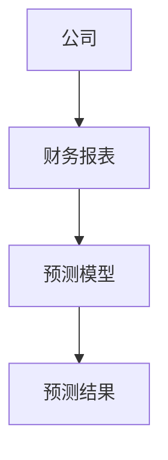
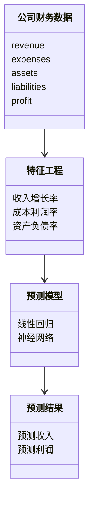
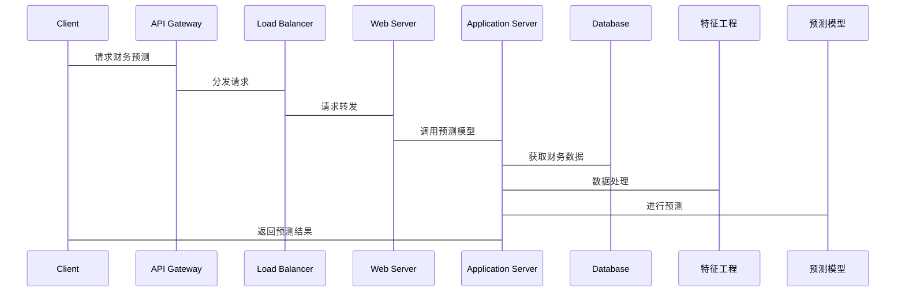

                 


# AI辅助的公司财务报表预测模型

> 关键词：AI辅助、财务报表、预测模型、机器学习、深度学习

> 摘要：本文介绍AI在公司财务报表预测中的应用，涵盖从基础概念到系统设计的全过程，通过详细讲解算法原理和项目实战，展示如何利用AI技术提升财务预测的准确性和效率。

---

## 第一部分: AI辅助的公司财务报表预测模型概述

### 第1章: AI辅助的公司财务报表预测模型背景介绍

#### 1.1 问题背景
传统的财务预测依赖于人工分析，存在耗时长、效率低、误差大的问题。随着AI技术的发展，尤其是机器学习和深度学习的应用，财务预测变得更加高效和准确。AI可以帮助分析大量财务数据，识别潜在的财务风险，优化预测模型，从而为公司决策提供支持。

#### 1.2 问题描述
财务报表预测的核心问题是利用历史财务数据预测未来的财务状况，包括利润表、资产负债表和现金流量表的预测。这些预测可以帮助企业进行预算制定、投资决策和风险管理。然而，财务数据的复杂性和不确定性使得传统方法难以准确预测。

#### 1.3 问题解决
AI技术，特别是机器学习和深度学习，能够处理大量结构化和非结构化的财务数据，提取特征并建立预测模型。通过训练模型，AI可以在一定程度上自动化财务预测过程，提高预测的准确性和效率。本文将详细探讨AI在财务预测中的应用，包括数据预处理、特征提取、模型选择和优化等关键步骤。

#### 1.4 概念结构与核心要素
财务报表预测模型的核心要素包括输入数据、预测目标、模型类型和评估指标。输入数据可以是结构化数据，如历史财务数据，也可以是非结构化数据，如市场新闻和行业报告。预测目标通常包括收入、利润和资产等财务指标。模型类型可以是线性回归、随机森林或神经网络等。评估指标包括准确率、均方误差（MSE）和R平方值等。

---

### 第2章: AI辅助的公司财务报表预测模型核心概念与联系

#### 2.1 核心概念原理
AI辅助的财务报表预测模型基于机器学习和深度学习算法。机器学习通过训练数据建立预测模型，深度学习则利用多层神经网络处理复杂的财务数据。特征工程是将原始数据转换为模型可以理解的特征，如将日期转换为季节性指标。

#### 2.2 概念属性特征对比表格
| 概念       | 特征1       | 特征2       | 特征3       |
|------------|------------|------------|------------|
| 数据类型   | 结构化数据   | 非结构化数据 | 混合型数据   |
| 模型类型   | 线性回归     | 神经网络     | 集成学习     |
| 预测目标   | 利润预测     | 资产负债预测 | 综合预测     |

#### 2.3 ER实体关系图架构


---

### 第3章: AI辅助的公司财务报表预测模型算法原理

#### 3.1 算法原理
AI辅助的财务预测模型通常采用监督学习算法，包括线性回归、随机森林和神经网络等。线性回归适用于线性关系较强的财务预测，而神经网络则适用于复杂非线性关系的预测。

#### 3.2 算法实现
以下是使用线性回归进行财务预测的Python代码示例：

```python
import pandas as pd
from sklearn.linear_model import LinearRegression
from sklearn.model_selection import train_test_split

# 加载数据
data = pd.read_csv('financial_data.csv')

# 特征选择
X = data[['revenue', 'expenses', 'assets']]
y = data['profit']

# 数据分割
X_train, X_test, y_train, y_test = train_test_split(X, y, test_size=0.2, random_state=42)

# 模型训练
model = LinearRegression()
model.fit(X_train, y_train)

# 预测结果
y_pred = model.predict(X_test)

# 模型评估
from sklearn.metrics import mean_squared_error, r2_score
mse = mean_squared_error(y_test, y_pred)
r2 = r2_score(y_test, y_pred)

print(f'均方误差: {mse}')
print(f'R平方值: {r2}')
```

#### 3.3 线性回归的数学模型
线性回归的模型可以表示为：
$$ y = \beta_0 + \beta_1 x_1 + \beta_2 x_2 + \ldots + \beta_n x_n + \epsilon $$
其中，$y$ 是目标变量，$x_i$ 是特征变量，$\beta_i$ 是系数，$\epsilon$ 是误差项。

---

## 第二部分: 系统分析与架构设计

### 第4章: 系统分析与架构设计

#### 4.1 系统功能设计
系统功能包括数据采集、特征工程、模型训练、预测和结果分析。以下是系统的领域模型：



#### 4.2 系统架构设计
系统架构采用分层架构，包括数据层、业务逻辑层和表现层。以下是系统架构图：


#### 4.3 系统接口设计
系统接口包括数据接口和预测接口。数据接口用于获取公司财务数据，预测接口用于调用模型进行预测。

#### 4.4 系统交互设计
以下是系统交互流程图：



---

## 第三部分: 项目实战

### 第5章: 项目实战

#### 5.1 环境安装
项目需要安装以下Python库：
- pandas
- numpy
- scikit-learn
- keras
- tensorflow

安装命令：
```bash
pip install pandas numpy scikit-learn keras tensorflow
```

#### 5.2 系统核心实现源代码
以下是使用神经网络进行财务预测的代码示例：

```python
import numpy as np
from sklearn.datasets import make_regression
from tensorflow.keras.models import Sequential
from tensorflow.keras.layers import Dense

# 生成数据
X, y = make_regression(n_samples=100, n_features=3, noise=0.1)

# 数据分割
X_train = X[:70]
X_test = X[70:]
y_train = y[:70]
y_test = y[70:]

# 模型构建
model = Sequential()
model.add(Dense(64, activation='relu', input_dim=3))
model.add(Dense(1))
model.compile(optimizer='adam', loss='mean_squared_error')

# 模型训练
model.fit(X_train, y_train, epochs=100, batch_size=32, verbose=1)

# 预测结果
y_pred = model.predict(X_test)

# 模型评估
mse = np.mean((y_test - y_pred) ** 2)
print(f'均方误差: {mse}')
```

#### 5.3 代码应用解读与分析
上述代码使用神经网络模型进行回归分析，适用于复杂的财务预测任务。通过训练数据，模型可以自动提取特征并进行预测。评估指标包括均方误差和R平方值，用于衡量模型的预测准确性。

#### 5.4 实际案例分析和详细讲解
以某公司为例，使用历史财务数据训练模型，预测未来的收入和利润。通过分析预测结果，帮助企业制定预算和投资决策。

---

## 第四部分: 最佳实践与总结

### 第6章: 最佳实践

#### 6.1 总结
AI辅助的财务报表预测模型能够显著提高预测的准确性和效率。通过特征工程、模型选择和优化，可以构建出高性能的预测系统。

#### 6.2 注意事项
- 数据质量：确保数据准确性和完整性
- 模型选择：根据实际需求选择合适的模型
- 模型评估：使用多种指标评估模型性能

#### 6.3 拓展阅读
推荐以下书籍和资源：
- 《机器学习实战》
- 《深度学习》
- Keras官方文档

---

## 作者

作者：AI天才研究院/AI Genius Institute & 禅与计算机程序设计艺术 /Zen And The Art of Computer Programming

