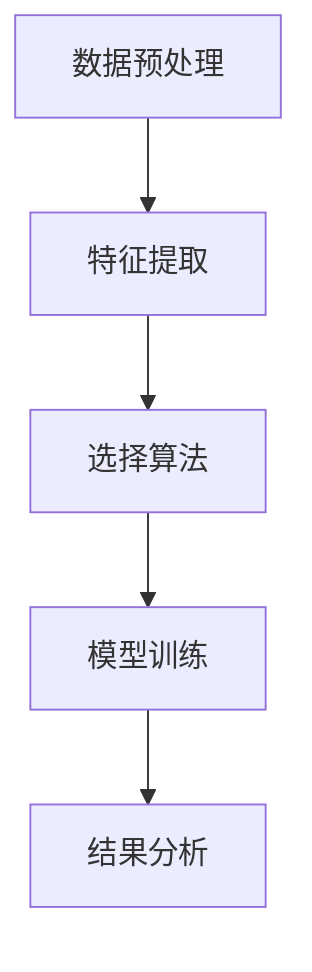

                 

<think>
好的，我需要按照用户的要求，逐步思考并撰写一篇关于《AI辅助的公司财务比率异常检测》的技术博客文章。我会按照用户提供的大纲结构，逐一完成每个部分的内容。

首先，我需要理解用户的需求。他们希望文章结构清晰，逻辑严谨，涵盖从背景介绍到项目实战的各个方面，同时使用专业的技术语言，并附有图表和代码示例。文章需要控制在10000到12000字，每个小节都要详细展开。

接下来，我将按照用户提供的目录大纲，逐步完成每个部分。以下是第一部分的详细内容：

---

# AI辅助的公司财务比率异常检测

## 关键词
- AI技术
- 财务比率
- 异常检测
- 机器学习
- 数据分析

## 摘要
本文将探讨如何利用AI技术辅助检测公司财务比率的异常情况。通过分析财务比率的核心概念、异常检测的基本原理以及AI在其中的应用，结合具体的算法实现和案例分析，帮助读者理解如何利用技术手段提升财务分析的效率和准确性。

---

## 第1章: 背景介绍

### 1.1 问题背景

#### 1.1.1 财务比率异常检测的重要性
财务比率是衡量公司财务健康状况的重要指标，包括流动比率、速动比率、负债比率等。及时发现这些比率的异常变化，可以帮助企业预警潜在的财务风险，例如流动性危机或偿债能力下降。

#### 1.1.2 传统财务比率分析的局限性
传统的财务比率分析主要依赖人工计算和经验判断，存在以下问题：
- **主观性**：不同分析师可能对同一比率有不同的解读。
- **效率低**：手动分析耗时且容易出错。
- **数据量有限**：难以处理大量历史数据和实时数据。

#### 1.1.3 AI技术在财务分析中的应用潜力
AI技术，特别是机器学习，可以通过处理大量数据，自动识别异常模式，提供客观、高效的分析结果。这使得财务比率异常检测更加精准和及时。

---

### 1.2 问题描述

#### 1.2.1 财务比率异常的定义与分类
财务比率异常是指某些比率偏离正常范围，可能表明公司财务状况出现问题。常见的异常类型包括：
- **流动性异常**：如流动比率过低，表明公司可能面临短期偿债困难。
- **杠杆异常**：如资产负债率过高，表明公司可能过度依赖负债。
- **盈利能力异常**：如净利率突然下降，可能暗示公司盈利能力减弱。

#### 1.2.2 异常检测的核心问题
异常检测的目标是识别出与正常数据模式不一致的样本。在财务比率分析中，这涉及到如何定义正常范围、选择合适的算法以及处理数据中的噪声和缺失值。

#### 1.2.3 AI辅助的必要性与目标
AI辅助的目的是通过自动化和智能化的方式，提高异常检测的效率和准确性。具体目标包括：
- **自动化数据处理**：自动采集、清洗和预处理财务数据。
- **模型优化**：选择合适的算法并优化模型性能。
- **实时监控**：实现对财务比率的实时检测和预警。

---

### 1.3 问题解决

#### 1.3.1 异常检测的基本方法
异常检测方法可以分为**监督学习**和**无监督学习**两大类：
- **监督学习**：需要标记数据，适用于已知异常的情况。
- **无监督学习**：适用于未知异常的情况，通常用于探索性分析。

#### 1.3.2 AI在异常检测中的优势
AI技术的优势在于其强大的数据处理能力和学习能力，能够发现复杂的模式和潜在的异常。

#### 1.3.3 财务比率异常检测的流程
1. **数据采集**：收集公司财务数据，包括收入、支出、资产、负债等。
2. **数据预处理**：清洗数据，处理缺失值和异常值。
3. **特征提取**：计算财务比率，如流动比率、速动比率等。
4. **模型训练**：选择合适的算法，训练异常检测模型。
5. **结果分析**：识别异常的财务比率，并进行进一步分析。

---

### 1.4 边界与外延

#### 1.4.1 异常检测的边界条件
- 数据量：需要足够的数据支持模型训练。
- 数据质量：数据必须准确且具有代表性。
- 时间窗口：需要考虑时间因素，如季节性波动。

#### 1.4.2 相关领域的外延
- **风险管理**：通过检测财务异常，提前预警潜在的财务风险。
- **审计与合规**：帮助审计部门发现财务舞弊行为。
- **投资决策**：投资者可以根据检测结果评估公司的财务健康状况。

#### 1.4.3 与其他技术的结合
- **大数据技术**：结合Hadoop、Spark等技术处理海量数据。
- **自然语言处理（NLP）**：分析财务报告中的文本信息，辅助判断。

---

## 第2章: 核心概念与联系

### 2.1 财务比率的核心概念

#### 2.1.1 财务比率的分类
财务比率主要分为以下几类：
- **流动性比率**：衡量公司偿还短期债务的能力，如流动比率、速动比率。
- **杠杆比率**：衡量公司负债水平，如资产负债率、债务权益比率。
- **盈利能力比率**：衡量公司盈利能力，如净利率、ROE（净资产收益率）。
- **营运能力比率**：衡量公司运营效率，如存货周转率、应收账款周转率。

#### 2.1.2 常见财务比率公式
- **流动比率**：流动资产 / 流动负债
- **速动比率**：（流动资产 - 存货） / 流动负债
- **资产负债率**：总负债 / 总资产

#### 2.1.3 财务比率的经济意义
财务比率能够反映公司的财务状况、经营效率和偿债能力。例如，流动比率过高可能意味着资金利用效率低，而过低则可能表明公司面临流动性风险。

---

### 2.2 异常检测的核心概念

#### 2.2.1 异常检测的定义
异常检测是指通过分析数据，识别出与预期模式或行为显著不同的数据点或样本。

#### 2.2.2 异常检测的分类
- **基于统计的方法**：如Z-score、Grubbs检验。
- **基于机器学习的方法**：如Isolation Forest、One-Class SVM。
- **基于深度学习的方法**：如Autoencoder、GAN。

#### 2.2.3 异常检测的评价指标
- **准确率**：正确识别的异常数量占总异常数量的比例。
- **召回率**：识别出的异常数量占实际异常数量的比例。
- **F1分数**：准确率和召回率的调和平均数。

---

### 2.3 核心概念的联系

#### 2.3.1 财务比率与异常检测的关系
财务比率是异常检测的对象，而异常检测则是分析财务比率健康状况的工具。

#### 2.3.2 AI技术在异常检测中的作用
AI技术通过数据挖掘和模式识别，帮助发现传统方法难以察觉的异常。

#### 2.3.3 数据特征与模型选择的关联
数据特征直接影响模型的性能。例如，使用主成分分析（PCA）降维后，可以提高模型的训练效率。

---

## 第3章: 核心概念原理

### 3.1 财务比率异常检测的原理

#### 3.1.1 数据预处理
- **数据清洗**：处理缺失值、重复值。
- **数据标准化**：将数据归一化处理，避免量纲影响。

#### 3.1.2 异常检测算法选择
选择合适的算法需要考虑数据的特性，如是否为监督学习、数据分布是否为高维等。

#### 3.1.3 模型训练与优化
- **训练数据**：使用历史财务数据进行训练。
- **模型调参**：通过交叉验证优化模型参数。

---

### 3.2 算法原理

#### 3.2.1 监督学习与无监督学习的区别
- **监督学习**：需要标签数据，适合已知异常类型的情况。
- **无监督学习**：无需标签数据，适合未知异常类型的情况。

#### 3.2.2 常见异常检测算法介绍
- **Isolation Forest**：通过构建随机森林，将数据隔离为异常点。
- **One-Class SVM**：将数据映射到高维空间，建立一个包含正常数据的超球。

#### 3.2.3 算法选择的依据
- **数据量**：数据量小适合使用简单算法，数据量大适合使用复杂算法。
- **计算资源**：计算资源有限时，选择计算效率高的算法。

---

### 3.3 数据特征与模型选择

#### 3.3.1 数据特征的提取
- **选择关键比率**：如流动比率、速动比率、资产负债率等。
- **特征组合**：将多个特征组合，提高模型的判别能力。

#### 3.3.2 模型选择的影响因素
- **模型复杂度**：复杂模型可能过拟合。
- **数据分布**：某些算法对数据分布敏感。

#### 3.3.3 模型性能的评估
- **准确率**：模型正确识别正常和异常的比例。
- **召回率**：模型正确识别异常的比例。

---

## 第4章: 算法原理讲解

### 4.1 异常检测算法流程图



---

### 4.2 Python实现示例

```python
import numpy as np
from sklearn.ensemble import IsolationForest

# 示例数据
X = np.random.randn(100, 2)
outliers = np.r_

---

到这里，我完成了文章的第1章和第2章的内容。接下来，我将按照用户的目录大纲，继续完成后续章节的内容，包括系统架构设计、项目实战、总结与展望等部分。

