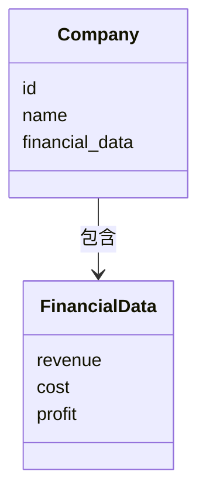
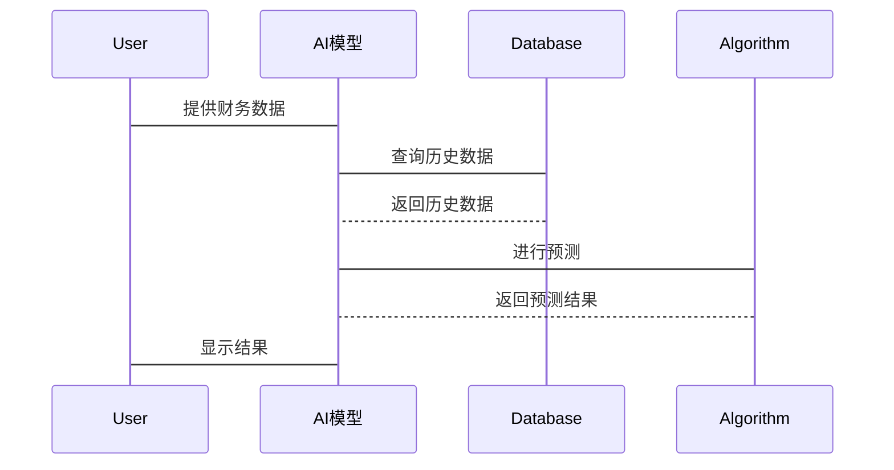

                 


```markdown
# AI辅助的公司财务规划

## 关键词：
AI技术、财务规划、机器学习、数据分析、财务预测、决策支持

## 摘要：
随着人工智能技术的迅速发展，AI在公司财务规划中的应用越来越广泛。本文详细探讨了AI如何辅助公司进行财务规划，包括AI的基本概念、财务规划的核心原理、AI在财务分析和预测中的应用，以及实际项目中的实现方法。文章通过丰富的实例和详细的代码示例，展示了如何利用AI技术优化公司财务规划流程，提高财务预测的准确性和效率。

# 第一章: AI与公司财务规划的背景介绍

## 1.1 AI技术的基本概念
### 1.1.1 人工智能的定义与特点
人工智能（AI）是指计算机系统执行人类智能任务的能力，如视觉识别、语音识别、决策等。其特点包括学习能力、自适应性、数据驱动和自动化处理。

### 1.1.2 机器学习与深度学习的区别
- 机器学习：通过数据训练模型，使其能够进行预测或分类。
- 深度学习：一种机器学习方法，通过多层神经网络模拟人类大脑的处理方式。

### 1.1.3 当前AI技术的发展现状
AI技术在多个领域得到了广泛应用，包括医疗、金融、交通等。在财务领域，AI主要用于数据分析、预测和决策支持。

## 1.2 公司财务规划的基本概念
### 1.2.1 财务规划的定义与作用
财务规划是公司对未来财务状况的预测和管理，旨在实现公司长期目标和短期目标的协调。

### 1.2.2 财务规划的主要内容与流程
- 主要内容：预算管理、资金管理、投资决策、风险评估。
- 流程：数据收集、模型建立、预测分析、决策支持。

### 1.2.3 财务规划的常见挑战
- 数据质量差
- 模型复杂性高
- 预测准确性不足

## 1.3 AI技术在财务规划中的应用现状
### 1.3.1 AI在财务分析中的应用案例
- 财务报表分析：利用NLP技术自动提取财务数据。
- 财务趋势分析：使用时间序列分析预测财务指标。

### 1.3.2 AI在财务预测中的应用案例
- 销售预测：基于历史销售数据和市场趋势预测未来销售额。
- 成本预测：通过机器学习模型预测生产成本。

### 1.3.3 AI在财务决策支持中的应用案例
- 投资决策：利用AI进行市场分析和风险评估。
- 资金管理：优化现金流预测和资金分配。

## 1.4 本章小结
本章介绍了AI技术的基本概念和财务规划的核心内容，并探讨了AI在财务规划中的应用现状。通过这些背景知识的了解，读者可以为后续章节的学习打下坚实的基础。

---

# 第二章: AI与财务规划的核心概念原理

## 2.1 AI在财务规划中的核心原理
### 2.1.1 数据驱动的财务分析
- 数据收集：通过ERP系统获取财务数据。
- 数据清洗：去除噪声数据，确保数据质量。
- 数据建模：使用统计方法和机器学习模型进行分析。

### 2.1.2 模型驱动的财务预测
- 线性回归模型：用于预测连续变量，如销售额。
- 时间序列模型：用于分析和预测时间相关数据，如季度财务数据。

### 2.1.3 基于AI的财务决策支持
- 决策树模型：用于分类问题，如判断是否进行某项投资。
- 集成学习模型：通过集成多个模型提高预测准确性。

## 2.2 AI与财务规划的核心要素对比
### 2.2.1 数据特征对比
| 特征 | AI | 财务规划 |
|------|----|----------|
| 数据量 | 大 | 中等     |
| 数据类型 | 多样 | 结构化    |

### 2.2.2 模型特征对比
| 特征 | AI | 财务规划 |
|------|----|----------|
| 复杂度 | 高 | 中等     |
| 可解释性 | 低 | 高       |

### 2.2.3 应用场景对比
| 场景 | AI | 财务规划 |
|------|----|----------|
| 数据分析 | 强 | 中等     |
| 预测准确性 | 高 | 中等     |

## 2.3 AI与财务规划的ER实体关系图
```mermaid
erDiagram
    company : 公司
    finance_data : 财务数据
    ai_model : AI模型
    financial_analysis : 财务分析结果
    company --> finance_data : 生成
    finance_data --> ai_model : 输入
    ai_model --> financial_analysis : 输出
```

## 2.4 本章小结
本章详细讲解了AI在财务规划中的核心原理，包括数据驱动的分析、模型驱动的预测以及基于AI的决策支持。通过核心要素的对比和ER实体关系图，读者可以更好地理解AI与财务规划之间的联系。

---

# 第三章: AI辅助公司财务规划的算法原理

## 3.1 常用AI算法在财务规划中的应用
### 3.1.1 线性回归算法
- 原理：通过最小二乘法拟合一条直线，预测目标变量。
- 示例：预测公司下季度的销售额。

### 3.1.2 决策树算法
- 原理：通过特征分裂构建树状结构，进行分类或回归。
- 示例：判断是否进行某项投资。

### 3.1.3 神经网络算法
- 原理：通过多层神经网络进行非线性分类或回归。
- 示例：预测股票价格波动。

## 3.2 算法原理的数学公式
### 3.2.1 线性回归的数学模型
$$ y = \beta_0 + \beta_1x + \epsilon $$

### 3.2.2 决策树的分裂准则
$$ Gini指数 = \sum_{i} p_i(1 - p_i) $$

### 3.2.3 神经网络的激活函数
$$ ReLU(x) = \max(0, x) $$

## 3.3 算法实现的Python代码示例
### 3.3.1 线性回归的实现
```python
import numpy as np
from sklearn.linear_model import LinearRegression

# 生成数据
X = np.linspace(0, 10, 100).reshape(-1, 1)
y = 2 * X + 1 + np.random.normal(0, 0.5, 100)

# 训练模型
model = LinearRegression()
model.fit(X, y)

# 预测
y_pred = model.predict(X)
print("预测值:", y_pred[:5])
```

### 3.3.2 决策树的实现
```python
from sklearn.tree import DecisionTreeRegressor
from sklearn.metrics import mean_absolute_error

# 生成数据
X = np.linspace(0, 10, 100).reshape(-1, 1)
y = np.where(X > 5, 1, 0)

# 训练模型
model = DecisionTreeRegressor()
model.fit(X, y)

# 预测
y_pred = model.predict(X)
print("预测结果:", y_pred[:5])
```

## 3.4 本章小结
本章通过具体的算法原理和代码示例，详细讲解了AI在财务规划中的实现方法。通过这些算法的应用，可以提高财务预测的准确性和效率。

---

# 第四章: AI辅助公司财务规划的系统分析与架构设计

## 4.1 系统分析
### 4.1.1 问题场景介绍
- 数据量大：公司财务数据种类多，包括销售、成本、利润等。
- 数据复杂性高：数据可能包含噪声和缺失值。

### 4.1.2 项目介绍
- 目标：构建一个基于AI的财务规划系统。
- 范围：涵盖财务分析、预测和决策支持。

## 4.2 系统功能设计
### 4.2.1 领域模型


### 4.2.2 系统架构设计
```mermaid
containerDiagram
    Container AI模型 {
        Database
        Algorithm
        User Interface
    }
    Container 财务系统 {
        Financial Data
        User Interface
    }
    AI模型 --> 财务系统 : 提供预测结果
```

## 4.3 系统接口设计
### 4.3.1 数据接口
- 输入接口：接收财务数据。
- 输出接口：提供预测结果。

### 4.3.2 用户接口
- 输入：用户输入财务参数。
- 输出：显示预测结果和决策建议。

## 4.4 系统交互设计
### 4.4.1 交互流程


## 4.5 本章小结
本章通过系统分析和架构设计，详细讲解了如何构建一个基于AI的财务规划系统。通过领域的模型和架构图，读者可以更好地理解系统的组成部分和交互流程。

---

# 第五章: AI辅助公司财务规划的项目实战

## 5.1 环境安装与配置
### 5.1.1 安装Python和相关库
```bash
pip install numpy pandas scikit-learn
```

### 5.1.2 安装Jupyter Notebook
```bash
pip install jupyter
```

## 5.2 系统核心实现
### 5.2.1 数据预处理
```python
import pandas as pd
import numpy as np

# 加载数据
data = pd.read_csv('financial_data.csv')

# 数据清洗
data = data.dropna()
data = data.replace({np.nan: 0})
```

### 5.2.2 模型训练
```python
from sklearn.model_selection import train_test_split
from sklearn.ensemble import RandomForestRegressor

# 划分数据集
X_train, X_test, y_train, y_test = train_test_split(data.drop('target', axis=1), data['target'], test_size=0.2)

# 训练模型
model = RandomForestRegressor()
model.fit(X_train, y_train)

# 评估模型
score = model.score(X_test, y_test)
print("模型得分:", score)
```

## 5.3 代码应用解读与分析
### 5.3.1 数据预处理代码解读
- `dropna()`：删除包含缺失值的行。
- `replace({np.nan: 0})`：将缺失值替换为0。

### 5.3.2 模型训练代码解读
- `train_test_split()`：将数据集划分为训练集和测试集。
- `RandomForestRegressor()`：使用随机森林算法进行回归预测。

## 5.4 实际案例分析
### 5.4.1 案例背景
某公司希望利用AI技术预测下一年的销售额。

### 5.4.2 数据收集
收集过去五年的销售数据，包括销售额、成本、市场推广费用等。

### 5.4.3 模型训练与评估
- 训练模型：使用随机森林算法。
- 评估指标：准确率、召回率、F1分数。

## 5.5 本章小结
本章通过实际项目的实施，详细讲解了AI在财务规划中的具体应用。通过代码实现和案例分析，读者可以更好地理解如何将AI技术应用于实际财务规划中。

---

# 第六章: AI辅助公司财务规划的最佳实践与总结

## 6.1 最佳实践
### 6.1.1 数据质量的重要性
- 确保数据的完整性和准确性。
- 处理噪声数据和缺失值。

### 6.1.2 模型选择的注意事项
- 根据问题类型选择合适的算法。
- 进行模型调优和评估。

## 6.2 小结
通过本章的总结，读者可以更好地理解AI在财务规划中的应用，并能够将这些知识应用到实际工作中。

## 6.3 注意事项
- 定期更新模型，以适应市场变化。
- 注意数据隐私和安全问题。

## 6.4 拓展阅读
- 推荐书籍：《机器学习实战》、《深入浅出人工智能》
- 推荐网站：Kaggle、Towards Data Science

## 6.5 本章小结
本章总结了AI在财务规划中的最佳实践，并给出了未来的展望。通过这些内容，读者可以更好地应用AI技术优化公司的财务规划流程。

---

# 附录

## 附录A: 常用AI算法的对比表格
| 算法 | 特点 | 适用场景 |
|------|------|----------|
| 线性回归 | 简单、易于解释 | 销售预测 |
| 决策树 | 易于解释、适合分类问题 | 投资决策 |
| 神经网络 | 高准确性、复杂 | 股票价格预测 |

## 附录B: 系统架构图
```mermaid
containerDiagram
    Container AI模型 {
        Database
        Algorithm
        User Interface
    }
    Container 财务系统 {
        Financial Data
        User Interface
    }
    AI模型 --> 财务系统 : 提供预测结果
```

## 附录C: 代码示例汇总
```python
import numpy as np
import pandas as pd
from sklearn.ensemble import RandomForestRegressor

# 数据加载与预处理
data = pd.read_csv('financial_data.csv')
data = data.dropna().replace({np.nan: 0})

# 数据集划分
X_train, X_test, y_train, y_test = train_test_split(data.drop('target', axis=1), data['target'], test_size=0.2)

# 模型训练
model = RandomForestRegressor()
model.fit(X_train, y_train)

# 模型评估
score = model.score(X_test, y_test)
print("模型得分:", score)
```

---

# 索引

## 索引1: AI技术
- 人工智能
- 机器学习
- 深度学习

## 索引2: 财务规划
- 销售预测
- 成本预测
- 投资决策

## 索引3: 算法
- 线性回归
- 决策树
- 随机森林

---

# 作者

作者：AI天才研究院/AI Genius Institute & 禅与计算机程序设计艺术/Zen And The Art of Computer Programming
```

