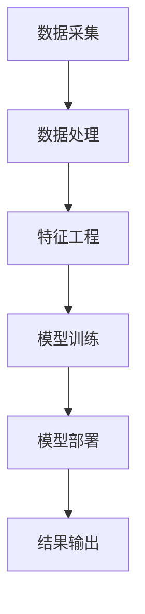

                 


# AI辅助的初创公司估值模型

> **关键词**: AI, 初创公司, 估值模型, 机器学习, 数据驱动

> **摘要**:  
本文系统地探讨了AI技术在初创公司估值建模中的应用。从背景、核心概念到算法原理，再到系统架构与实现，最后结合实际案例进行分析。文章旨在通过理论与实践的结合，为读者提供一个全面的视角，理解如何利用AI技术提升初创公司估值的准确性和效率。

---

## # 第一部分: AI辅助的初创公司估值模型概述

### ## 第1章: 初创公司估值模型的背景与挑战

#### ### 1.1 初创公司估值的重要性

初创公司的估值是创业生态中的核心问题之一。准确的估值可以帮助创始人和投资者做出更明智的决策，影响融资、并购和公司发展策略等关键环节。然而，传统估值方法往往依赖经验判断和简化假设，存在主观性强、数据不足和动态调整困难等问题。

#### ### 1.2 AI辅助估值的背景与趋势

随着大数据和AI技术的快速发展，AI在金融领域的应用日益广泛。AI技术可以通过分析海量数据，提取关键特征，并构建复杂的数学模型，从而提升估值的准确性和效率。特别是在初创公司估值中，AI可以帮助处理非结构化数据、捕捉市场动态，并实时调整模型参数。

#### ### 1.3 本章小结

初创公司估值的关键问题在于数据不足、模型复杂性和动态调整能力。AI辅助估值的核心优势在于其数据驱动的特性、高计算能力和动态适应能力。通过AI技术，可以显著提升估值的科学性和实用性。

---

## # 第二部分: AI辅助估值的核心概念与原理

### ## 第2章: AI辅助估值的核心概念

#### ### 2.1 数据驱动的估值模型

数据是AI估值模型的基础。初创公司估值需要考虑多种数据源，包括财务数据（收入、利润、现金流）、市场数据（行业趋势、竞争状况）、团队数据（创始人背景、团队能力）以及外部数据（新闻、社交媒体情绪）。数据预处理和特征工程是构建模型的关键步骤。

#### ### 2.2 机器学习在估值中的应用

机器学习通过训练模型来预测初创公司的估值。监督学习（如回归和分类）和非监督学习（如聚类）是常用的两种方法。回归模型用于预测具体的估值，而分类模型则用于评估公司处于某个估值区间内的概率。

#### ### 2.3 估值模型的构建与优化

模型的选择和优化是估值建模的核心。回归模型适用于简单场景，而复杂的场景则需要集成学习或深度学习模型。模型的优化包括参数调优、特征选择和交叉验证等步骤。此外，模型的可解释性和鲁棒性也是重要的评估指标。

---

### ## 第3章: 机器学习算法与估值模型

#### ### 3.1 线性回归模型

线性回归是最简单的回归模型，适用于线性关系的场景。其数学模型为：
$$ y = \beta_0 + \beta_1 x_1 + \beta_2 x_2 + ... + \beta_n x_n + \epsilon $$

其中，$y$ 是目标变量，$x_i$ 是特征变量，$\beta$ 是回归系数，$\epsilon$ 是误差项。线性回归的优点是简单易懂，但其线性假设可能限制其在复杂场景中的应用。

#### ### 3.2 逻辑回归与非线性回归

逻辑回归适用于二分类问题，其输出结果为概率值。其数学模型为：
$$ P(y=1|x) = \frac{e^{\beta_0 + \beta_1 x_1 + ... + \beta_n x_n}}{1 + e^{\beta_0 + \beta_1 x_1 + ... + \beta_n x_n}} $$

非线性回归模型（如多项式回归）适用于非线性关系的场景，但其复杂性较高，容易过拟合。

#### ### 3.3 集成学习与深度学习

集成学习通过组合多个模型的结果来提高性能。随机森林和梯度提升树（如XGBoost、LightGBM）是常用的集成学习方法。深度学习（如神经网络）适用于高维数据和复杂模式的识别，但其计算成本较高，且模型解释性较差。

---

## # 第三部分: AI辅助估值模型的系统架构与实现

### ## 第4章: 系统架构设计

#### ### 4.1 系统功能模块划分

AI辅助估值系统的功能模块包括：
1. 数据采集与处理模块：收集和清洗数据。
2. 特征工程模块：提取和处理特征。
3. 模型训练与优化模块：训练模型并进行参数调优。
4. 模型部署与结果输出模块：部署模型并输出结果。

#### ### 4.2 系统架构图

使用 Mermaid 绘制系统架构图：


#### ### 4.3 接口设计与交互流程

系统接口设计包括数据接口、模型接口和用户接口。数据接口用于与外部数据源交互，模型接口用于与其他系统模块交互，用户接口用于与最终用户交互。

---

### ## 第5章: 项目实战

#### ### 5.1 环境安装

安装所需的Python库：
```bash
pip install numpy pandas scikit-learn xgboost
```

#### ### 5.2 核心实现源代码

以下是模型训练的代码示例：
```python
import numpy as np
import pandas as pd
from sklearn.model_selection import train_test_split
from sklearn.ensemble import RandomForestRegressor
from sklearn.metrics import mean_absolute_error

# 数据加载与预处理
data = pd.read_csv('startup_valuation.csv')
X = data.drop('valuation', axis=1)
y = data['valuation']

# 数据分割
X_train, X_test, y_train, y_test = train_test_split(X, y, test_size=0.2, random_state=42)

# 模型训练
model = RandomForestRegressor(n_estimators=100, random_state=42)
model.fit(X_train, y_train)

# 模型预测
y_pred = model.predict(X_test)
print('Mean Absolute Error:', mean_absolute_error(y_test, y_pred))
```

#### ### 5.3 实际案例分析

通过实际案例分析，展示如何利用AI技术构建一个完整的估值模型。案例分析包括数据采集、特征工程、模型训练和结果输出等步骤。

---

## # 第四部分: 总结与展望

### ## 第6章: 总结与展望

#### ### 6.1 总结

AI技术在初创公司估值中的应用前景广阔。通过数据驱动的方法和机器学习算法，可以显著提升估值的准确性和效率。然而，AI模型的解释性和计算成本等问题仍需要进一步研究和优化。

#### ### 6.2 展望

未来，随着AI技术的不断发展，初创公司估值模型将更加智能化和个性化。结合自然语言处理和增强学习等技术，可以进一步提升估值的准确性和动态调整能力。

---

## # 作者

作者：AI天才研究院/AI Genius Institute  
禅与计算机程序设计艺术 /Zen And The Art of Computer Programming

