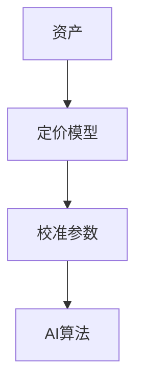
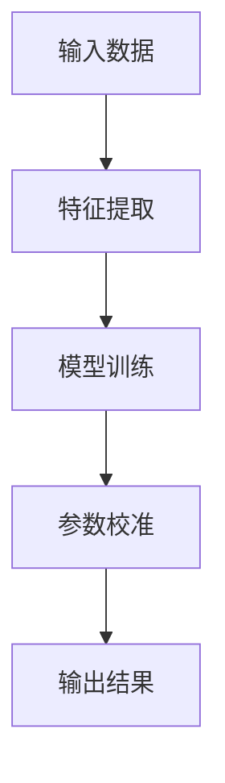
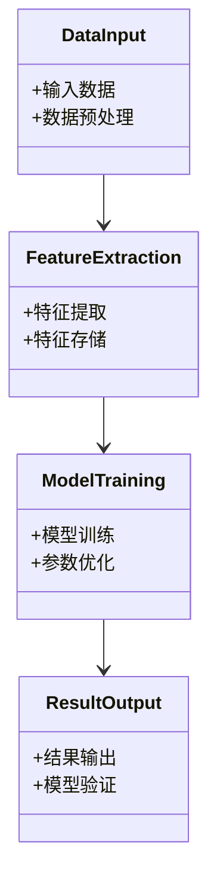
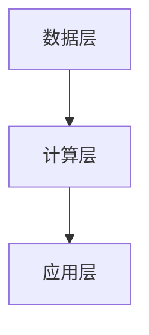

                 


# AI辅助的多资产类别定价模型校准

> 关键词：AI，多资产定价，模型校准，机器学习，神经网络

> 摘要：本文将探讨如何利用人工智能技术辅助多资产类别定价模型的校准过程。通过结合传统金融定价模型与现代AI技术，我们能够更高效、更准确地完成定价模型的参数校准，从而提高金融市场的定价效率和准确性。本文将从多资产定价模型的背景与核心概念出发，逐步分析AI辅助校准的算法原理，并通过实际案例展示如何将这些技术应用于实际金融场景中。

---

## 第一部分：AI辅助的多资产定价模型校准背景与基础

### 第1章：AI辅助的多资产定价模型校准概述

#### 1.1 多资产定价模型的背景与意义
- **传统金融定价模型的局限性**：传统金融定价模型（如CAPM、APT等）通常基于假设和简化条件，难以应对多资产类别（股票、债券、衍生品等）的复杂定价需求。  
- **AI技术的应用潜力**：人工智能技术，特别是机器学习和深度学习，能够处理海量数据、捕捉复杂关系和非线性特征，为多资产定价模型的校准提供了新的可能性。  
- **校准的重要性**：定价模型的校准是指通过历史数据调整模型参数，使其能够准确反映市场价格。校准过程直接影响模型的定价准确性和交易决策的有效性。

#### 1.2 AI辅助定价的核心概念
- **定价模型**：用于预测资产价格的数学模型，通常涉及资产的风险、收益、流动性等因素。  
- **模型校准**：通过历史数据优化模型参数，使其更好地拟合市场价格。  
- **AI在定价中的角色**：AI技术可以用于特征提取、模型训练、参数优化等环节，显著提高校准效率和准确性。

#### 1.3 校准的核心步骤
1. **数据收集**：获取历史价格、收益率、市场因子等数据。  
2. **特征提取**：从原始数据中提取有用的特征（如动量、波动率、因子暴露等）。  
3. **模型选择**：选择适合的定价模型（如因子模型、神经网络模型等）。  
4. **参数优化**：利用AI算法调整模型参数，使其最佳拟合历史数据。  
5. **验证与测试**：通过回测和交叉验证评估模型的准确性和稳定性。

---

### 第2章：多资产定价模型的核心概念与联系

#### 2.1 多资产定价模型的原理
- **资产定价的基本原理**：资产的价格由其未来现金流的现值决定，涉及无风险利率、风险溢价等因素。  
- **多资产定价的独特性**：多资产定价需要同时考虑多种资产之间的相互影响，如协方差矩阵、资产配置等。  
- **校准的关键步骤**：包括数据预处理、模型选择、参数优化等。

#### 2.2 AI辅助校准的核心概念
- **机器学习在模型校准中的应用**：通过训练数据优化模型参数，提高拟合效果。  
- **神经网络在定价中的优势**：神经网络能够捕捉复杂的非线性关系，适用于多资产定价场景。  
- **AI与传统定价模型的结合**：将AI技术嵌入传统模型，提升其定价能力和适应性。

#### 2.3 核心概念关系图


---

### 第3章：AI辅助定价模型的算法原理

#### 3.1 算法原理概述
- **机器学习在模型校准中的应用**：通过训练数据优化模型参数，提高拟合效果。  
- **神经网络的基本原理**：神经网络通过多层非线性变换，能够捕捉复杂的定价关系。  
- **深度学习在多资产定价中的优势**：深度学习能够自动提取特征，减少手动特征工程的需求。

#### 3.2 算法流程图


#### 3.3 算法实现代码
```python
# 简单的神经网络模型示例
import numpy as np
import tensorflow as tf

# 定义模型
model = tf.keras.Sequential([
    tf.keras.layers.Dense(64, activation='relu'),
    tf.keras.layers.Dense(1, activation='linear')
])

# 编译模型
model.compile(optimizer='adam', loss='mean_squared_error')

# 训练模型
model.fit(X_train, y_train, epochs=100, batch_size=32)
```

#### 3.4 本章小结
- 本章介绍了AI辅助定价模型的算法原理，包括机器学习和深度学习的核心思想。  
- 通过简单的神经网络示例，展示了如何利用AI技术优化定价模型的参数。

---

## 第4章：数学模型与公式

### 4.1 定价模型的基本公式
- **资产定价的基本公式**：
$$ P = \frac{CF}{(1 + r)^n} $$
其中，\( P \) 是资产的当前价格，\( CF \) 是未来现金流，\( r \) 是无风险利率，\( n \) 是时间期限。  
- **多资产定价的扩展公式**：
$$ P_i = \sum_{j=1}^{m} w_j \cdot P_j $$
其中，\( w_j \) 是权重，\( P_j \) 是各个资产的价格。

### 4.2 AI辅助校准的数学模型
- **神经网络的损失函数**：
$$ L = \frac{1}{N}\sum_{i=1}^{N}(y_i - \hat{y_i})^2 $$
其中，\( y_i \) 是真实值，\( \hat{y_i} \) 是预测值，\( N \) 是样本数量。  
- **模型优化的数学表达**：
$$ \theta = \theta - \eta \cdot \frac{\partial L}{\partial \theta} $$
其中，\( \theta \) 是模型参数，\( \eta \) 是学习率，\( \frac{\partial L}{\partial \theta} \) 是损失函数对参数的梯度。

---

## 第5章：系统分析与架构设计方案

### 5.1 问题场景介绍
- **多资产定价模型的复杂性**：涉及多种资产类别、复杂的市场关系和动态变化的市场条件。  
- **AI辅助校准的需求**：通过AI技术提高模型校准的效率和准确性，减少人工干预。

### 5.2 系统功能设计
- **领域模型**：通过类图展示系统的主要功能模块，包括数据输入、特征提取、模型训练、结果输出等。  


### 5.3 系统架构设计
- **系统架构图**：展示系统的整体架构，包括数据层、计算层、应用层等。  


### 5.4 系统接口设计
- **数据输入接口**：接收历史价格、收益率等数据。  
- **模型训练接口**：接收特征数据和标签，返回优化后的模型参数。  
- **结果输出接口**：返回校准后的模型输出结果。

---

## 第6章：项目实战

### 6.1 环境安装
- **安装Python环境**：使用Anaconda或Miniconda安装Python 3.8及以上版本。  
- **安装依赖库**：安装TensorFlow、Keras、NumPy、Pandas等库。

### 6.2 核心实现代码
```python
import numpy as np
import tensorflow as tf
from tensorflow.keras import layers

# 数据准备
X_train = np.random.randn(1000, 64)
y_train = np.random.randn(1000, 1)

# 模型定义
model = tf.keras.Sequential([
    layers.Dense(64, activation='relu'),
    layers.Dense(1, activation='linear')
])

# 模型编译
model.compile(optimizer='adam', loss='mean_squared_error')

# 模型训练
model.fit(X_train, y_train, epochs=100, batch_size=32)
```

### 6.3 实际案例分析
- **案例描述**：假设我们有一个包含10种资产的多资产定价模型，利用历史价格和收益率数据进行校准。  
- **数据来源**：使用公开的金融数据API获取历史价格数据。  
- **特征工程**：提取动量、波动率、因子暴露等特征。  
- **模型训练**：使用神经网络模型进行训练，并验证模型的拟合效果。

### 6.4 模型验证与优化
- **回测分析**：通过历史数据验证模型的预测准确性。  
- **交叉验证**：使用K折交叉验证评估模型的泛化能力。  
- **超参数优化**：通过网格搜索或随机搜索优化模型的超参数。

---

## 第7章：总结与展望

### 7.1 核心总结
- AI技术能够显著提高多资产定价模型的校准效率和准确性。  
- 通过神经网络和机器学习算法，我们可以更好地捕捉复杂市场关系，优化模型参数。  

### 7.2 展望
- **未来研究方向**：探索更高效的AI算法，如图神经网络、强化学习等。  
- **实际应用中的挑战**：数据质量、模型过拟合、计算资源等问题仍需进一步解决。

---

## 作者信息

作者：AI天才研究院（AI Genius Institute） & 禅与计算机程序设计艺术（Zen And The Art of Computer Programming）

---

通过以上章节，我们系统地介绍了AI辅助的多资产类别定价模型校准的核心思想、算法原理、系统设计和实际应用。希望本文能够为读者提供深入的理论和技术指导，帮助他们在实际金融场景中更好地应用AI技术。

