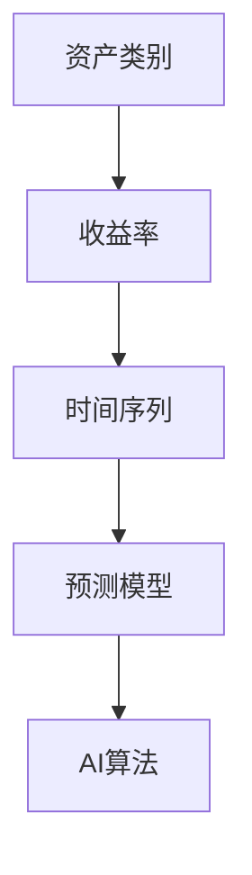
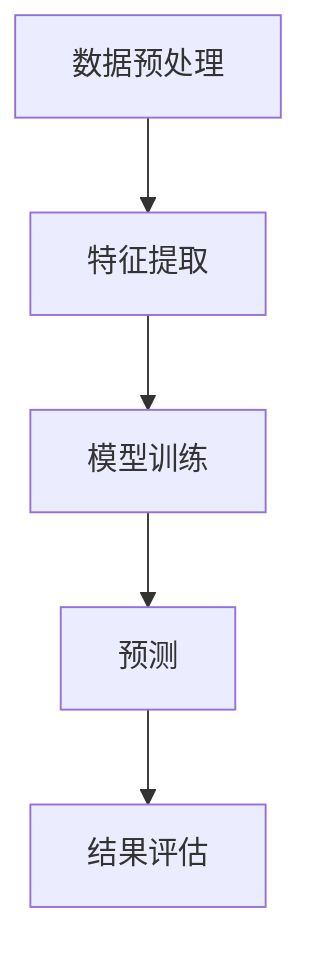
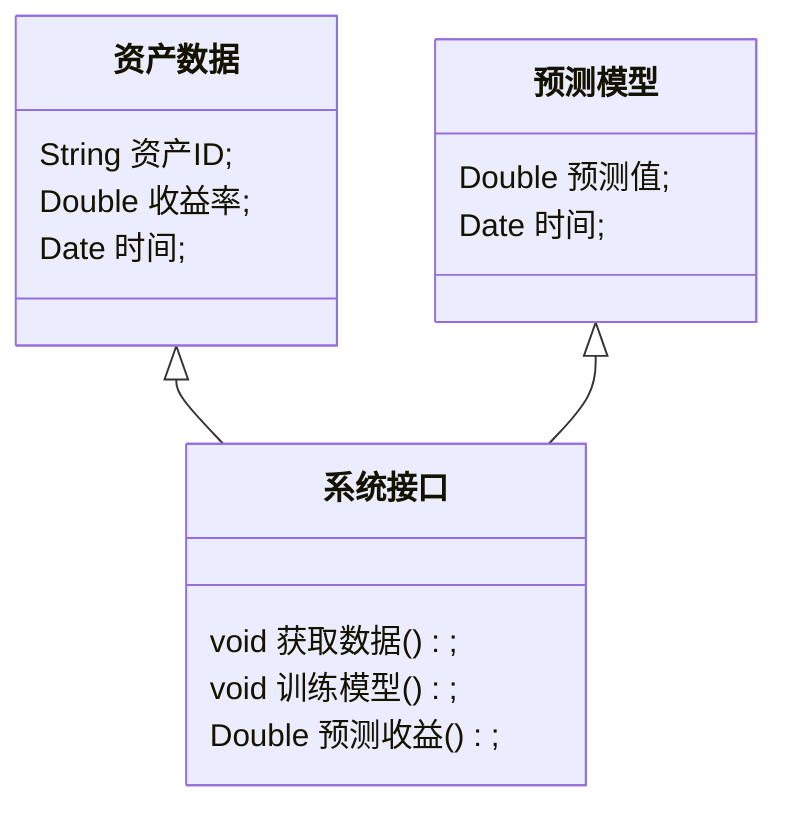
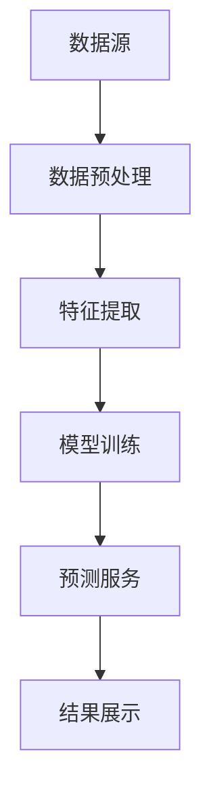
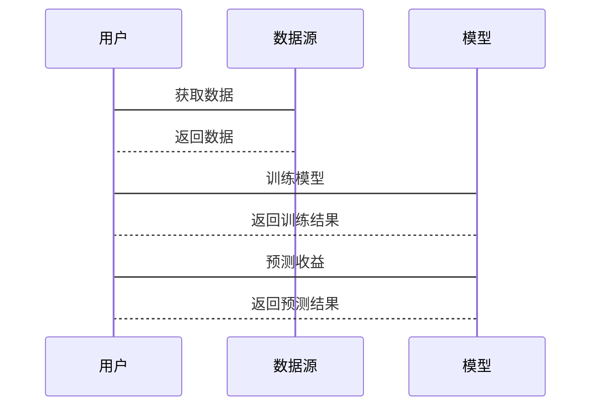

                 


# AI辅助的多资产类别收益率预测

## 关键词：AI，资产收益率预测，机器学习，时间序列分析，多资产类别

## 摘要：  
本文深入探讨了利用人工智能技术辅助多资产类别收益率预测的方法与实现。通过分析传统金融预测的挑战，结合现代AI技术的优势，提出了一种基于机器学习和深度学习的多资产预测框架。文章详细介绍了相关的核心概念、算法原理、系统架构及实际案例，为读者提供了一套完整的解决方案。

---

# 第1章: 背景介绍

## 1.1 问题背景

### 1.1.1 传统资产收益率预测的挑战  
传统的资产收益率预测主要依赖于统计模型和经验分析，但存在以下问题：  
1. 数据量有限，难以捕捉复杂市场动态。  
2. 高维度资产之间的关联性难以建模。  
3. 市场波动性和突发事件难以预测。  

### 1.1.2 AI技术在金融领域的应用潜力  
人工智能技术的快速发展为金融预测带来了新的可能性：  
1. 大数据分析能力：AI能够处理海量历史数据，发现隐藏的模式。  
2. 非线性关系建模：深度学习模型可以捕捉复杂的市场动态。  
3. 实时预测能力：AI系统能够快速响应市场变化。  

### 1.1.3 多资产类别预测的复杂性与重要性  
多资产类别预测涉及股票、债券、期货等多种资产，其复杂性主要体现在：  
1. 不同资产之间的相互影响。  
2. 各类资产的波动性差异。  
3. 综合收益与风险的平衡需求。  

## 1.2 问题描述  

### 1.2.1 资产收益率预测的核心目标  
通过分析历史数据和市场信息，预测未来资产收益率，帮助投资者做出更优决策。  

### 1.2.2 多资产类别预测的难点  
1. 资产之间的相互影响难以建模。  
2. 不同资产的数据特征差异大。  
3. 需要综合考虑多种风险因素。  

### 1.2.3 AI辅助预测的优势与局限性  
优势：  
1. 高效性：AI能够快速处理大量数据。  
2. 精准性：复杂模型可以捕捉更多市场信息。  
局限性：  
1. 黑箱问题：模型的可解释性较差。  
2. 数据依赖：模型性能依赖于数据质量和数量。  

## 1.3 问题解决  

### 1.3.1 AI技术如何提升预测准确性  
通过引入机器学习和深度学习算法，AI能够从非结构化数据中提取特征，提高预测精度。  

### 1.3.2 数据驱动的预测方法  
利用历史数据和实时市场信息，构建数据驱动的预测模型。  

### 1.3.3 组合理解与实际应用  
通过多资产类别预测，帮助投资者实现资产配置优化和风险控制。  

## 1.4 边界与外延  

### 1.4.1 资产收益率预测的边界条件  
1. 数据的完整性和准确性。  
2. 模型的有效性和适用性。  
3. 市场环境的稳定性和变化性。  

### 1.4.2 AI预测的适用范围与限制  
适用范围：  
1. 数据充足且稳定的资产类别。  
2. 市场动态变化不剧烈的情况。  
限制：  
1. 无法预测突发事件的极端影响。  
2. 模型性能依赖于数据质量和数量。  

### 1.4.3 多资产类别预测的外延领域  
1. 跨市场资产配置。  
2. 跨资产类别风险对冲。  
3. 个性化投资组合优化。  

## 1.5 概念结构与核心要素  

### 1.5.1 资产收益率预测的核心要素  
1. 数据来源：历史价格、市场指标、宏观经济数据等。  
2. 预测模型：统计模型、机器学习模型、深度学习模型。  
3. 评价指标：均方误差（MSE）、平均绝对误差（MAE）、R平方值等。  

### 1.5.2 AI辅助预测的关键模块  
1. 数据预处理模块：数据清洗、特征提取。  
2. 模型训练模块：参数优化、模型训练。  
3. 预测与评估模块：结果输出、模型调优。  

### 1.5.3 系统架构的核心组件  
1. 数据采集与存储：数据库、API接口。  
2. 模型构建与训练：机器学习框架（如TensorFlow、PyTorch）。  
3. 预测与展示：可视化界面、结果报表。  

---

# 第2章: 核心概念与联系

## 2.1 AI与多资产预测的核心原理  

### 2.1.1 机器学习在时间序列预测中的应用  
机器学习通过历史数据提取特征，构建回归或分类模型，预测未来收益率。  

### 2.1.2 深度学习在非线性关系中的优势  
深度学习模型（如LSTM）能够捕捉时间序列中的非线性关系，提高预测精度。  

### 2.1.3 统计模型与AI模型的结合  
通过结合统计模型和AI模型，可以充分利用传统方法的解释性和AI方法的预测性。  

## 2.2 核心概念对比分析  

### 2.2.1 时间序列分析与机器学习的对比  
| 对比维度 | 时间序列分析 | 机器学习 |
|----------|---------------|----------|
| 模型复杂性 | 较低          | 较高      |
| 数据要求 | 高            | 较高      |
| 可解释性 | 高            | 较低      |

### 2.2.2 监督学习与非监督学习在预测中的应用  
- **监督学习**：用于有标签的数据，如回归分析。  
- **非监督学习**：用于无标签数据的聚类分析，发现隐藏模式。  

### 2.2.3 单一资产与多资产预测的差异  
- 单一资产预测：数据维度低，模型简单。  
- 多资产预测：数据维度高，模型复杂，需要考虑资产之间的相互影响。  

## 2.3 ER实体关系图  



---

# 第3章: 算法原理讲解

## 3.1 时间序列分析  

### 3.1.1 ARIMA模型原理  
ARIMA（自回归积分滑动平均模型）是一种常用的时间序列预测模型，适用于线性趋势和季节性变化的数据。  

### 3.1.2 LSTM网络的应用  
LSTM（长短期记忆网络）通过引入记忆单元，能够有效捕捉时间序列中的长期依赖关系，适用于非线性数据。  

### 3.1.3 Prophet模型的实现  
Prophet是一种由Facebook开源的时间序列预测模型，适合处理有噪声的、非平稳的时间序列数据。  

## 3.2 机器学习模型  

### 3.2.1 线性回归模型  
线性回归模型通过最小二乘法拟合数据，适用于线性关系较强的预测任务。  

### 3.2.2 支持向量回归  
支持向量回归通过构建超平面，将数据映射到高维空间，适用于非线性关系的预测。  

### 3.2.3 随机森林与梯度提升树  
随机森林和梯度提升树通过集成学习，能够有效处理高维度数据，提高预测精度。  

## 3.3 算法流程图  



## 3.4 算法实现代码  

```python
import numpy as np
from sklearn.linear_model import LinearRegression

# 示例数据
X = np.array([[1], [2], [3], [4]])
y = np.array([2, 3, 5, 6])

# 模型训练
model = LinearRegression()
model.fit(X, y)

# 预测
print(model.predict([[5]]))
```

## 3.5 数学模型与公式  

### 3.5.1 ARIMA模型公式  
$$ ARIMA(p, d, q) $$  

### 3.5.2 线性回归公式  
$$ y = \beta_0 + \beta_1x + \epsilon $$  

### 3.5.3 LSTM单元公式  
$$ f(t) = \sigma(g(t)) $$  

---

# 第4章: 系统分析与架构设计

## 4.1 问题场景介绍  
多资产类别收益率预测系统需要处理多种资产的数据，包括股票、债券、期货等，同时要考虑宏观经济指标和市场情绪等因素。  

## 4.2 系统功能设计  

### 4.2.1 领域模型（mermaid类图）  


## 4.3 系统架构设计  

### 4.3.1 系统架构图  


## 4.4 系统接口设计  

### 4.4.1 数据接口  
1. 获取历史数据：`GET /data/historical`  
2. 获取实时数据：`GET /data/realtime`  

### 4.4.2 模型接口  
1. 训练模型：`POST /model/train`  
2. 预测收益：`POST /model/predict`  

## 4.5 系统交互设计  

### 4.5.1 序列图  


---

# 第5章: 项目实战

## 5.1 环境安装  
1. 安装Python和相关库（如TensorFlow、Pandas）。  
2. 安装数据获取工具（如Yahoo Finance API）。  

## 5.2 核心实现代码  

```python
import pandas as pd
import numpy as np
from sklearn.model_selection import train_test_split
from sklearn.metrics import mean_squared_error
from tensorflow.keras.models import Sequential
from tensorflow.keras.layers import LSTM, Dense

# 数据加载
data = pd.read_csv('asset_returns.csv')

# 数据分割
X = data[['资产1', '资产2', ...]]
y = data['目标收益']
X_train, X_test, y_train, y_test = train_test_split(X, y, test_size=0.2)

# 模型构建
model = Sequential()
model.add(LSTM(50, input_shape=(1, len(X.columns))))
model.add(Dense(1))
model.compile(optimizer='adam', loss='mean_squared_error')

# 模型训练
model.fit(X_train, y_train, epochs=100, batch_size=32)

# 模型预测
y_pred = model.predict(X_test)
print(mean_squared_error(y_test, y_pred))
```

## 5.3 案例分析  
以股票和债券为例，分析多资产类别预测的实际效果，并对比不同模型的预测精度。  

---

# 第6章: 最佳实践与总结

## 6.1 最佳实践  
1. 数据预处理：确保数据的完整性和准确性。  
2. 模型选择：根据数据特征选择合适的算法。  
3. 模型调优：通过网格搜索优化模型参数。  

## 6.2 小结  
AI技术为多资产类别收益率预测提供了新的思路和方法，通过结合传统统计模型和现代机器学习算法，可以显著提高预测精度。  

## 6.3 注意事项  
1. 模型的可解释性问题。  
2. 数据质量和数量对模型性能的影响。  
3. 市场变化对模型的有效性的影响。  

## 6.4 拓展阅读  
1. 《时间序列分析与应用》  
2. 《机器学习实战》  
3. 《深度学习入门》  

---

# 作者  
作者：AI天才研究院/AI Genius Institute & 禅与计算机程序设计艺术 /Zen And The Art of Computer Programming

