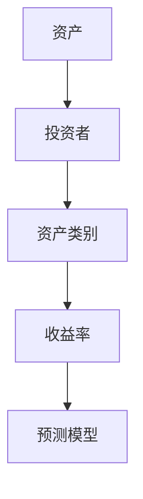
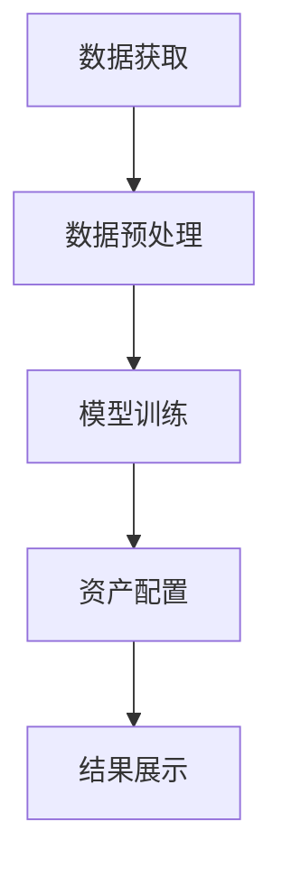

                 


# AI辅助的多资产类别收益率预测与资产配置

**关键词**：人工智能、多资产类别、收益率预测、资产配置、机器学习、时间序列分析、系统架构设计

**摘要**：本文探讨了如何利用人工智能技术，特别是机器学习和时间序列分析，来预测多资产类别的收益率并优化资产配置。文章首先介绍了背景和核心概念，然后详细讲解了各种算法的原理和实现，接着分析了系统的架构设计，最后通过实战案例展示了如何应用这些方法，并给出了最佳实践建议。

---

## 第一部分: 背景介绍

### 第1章: 问题背景与描述

#### 1.1 问题背景
##### 1.1.1 传统资产收益率预测的挑战
传统金融学中的资产收益率预测依赖于统计模型，如CAPM和APT，但这些模型在面对复杂市场环境时表现有限。实际操作中，市场波动、经济周期变化以及突发事件都会对收益率产生显著影响，导致传统模型预测精度不足。

##### 1.1.2 AI技术在金融领域的应用现状
人工智能技术的快速发展为金融领域带来了新的可能性。通过机器学习算法，可以处理海量数据，发现传统方法难以捕捉的模式和趋势。AI在股票预测、风险评估和交易策略中的应用已取得显著成果，但多资产类别预测仍具挑战性。

##### 1.1.3 多资产类别收益率预测的必要性
随着全球化和金融产品的多样化，投资者需要在不同资产类别间进行配置以分散风险并优化收益。准确的多资产收益率预测能够帮助投资者制定更有效的资产配置策略，提升整体投资收益。

#### 1.2 问题描述
##### 1.2.1 多资产类别定义与分类
多资产类别通常包括股票、债券、商品、房地产信托基金（REITs）等。每类资产具有不同的风险收益特征和波动性，因此需要分别建模。

##### 1.2.2 收益率预测的复杂性
多资产预测需要考虑各类资产间的相互影响，如市场联动性、宏观经济指标和突发事件的冲击。此外，数据的高维性和非线性关系增加了预测的难度。

##### 1.2.3 资产配置的核心问题
资产配置的目标是在不同资产间分配资金，以在给定风险水平下最大化收益或在给定收益下最小化风险。AI技术可以优化这一过程，通过动态调整配置比例来适应市场变化。

#### 1.3 问题解决思路
##### 1.3.1 数据驱动的方法
利用历史数据，通过机器学习算法识别资产收益率之间的潜在关系，建立预测模型。

##### 1.3.2 AI算法的优势
AI能够处理复杂的数据模式，捕捉非线性关系，实时更新模型以适应市场变化。

##### 1.3.3 跨资产类别间的相互影响
分析各类资产间的相关性和协同效应，构建综合模型，以更准确地预测整体收益率。

#### 1.4 边界与外延
##### 1.4.1 数据范围的界定
明确数据的时间范围、资产类别和市场区域，确保模型的有效性。

##### 1.4.2 模型适用的边界
确定模型的适用场景和限制，避免在不适用的情况下使用模型。

##### 1.4.3 资产配置的范围与限制
设定资产配置的范围，如风险承受能力、投资期限和流动性需求。

#### 1.5 概念结构与核心要素
##### 1.5.1 资产类别与收益率的关系
不同资产类别受不同的经济因素影响，具有不同的波动性和收益潜力。

##### 1.5.2 AI算法与金融数据的结合
通过AI算法挖掘数据中的隐藏信息，建立预测模型。

##### 1.5.3 资产配置的优化目标
通过AI辅助优化配置，实现收益与风险的最佳平衡。

---

## 第二部分: 核心概念与联系

### 第2章: 核心概念与联系

#### 2.1 AI在金融中的应用原理
##### 2.1.1 数据特征提取
通过数据预处理和特征工程，提取有用的特征，如动量、波动率和宏观经济指标。

##### 2.1.2 模型训练与优化
使用监督学习算法，如随机森林和神经网络，训练模型并优化参数。

##### 2.1.3 预测结果的解释
通过可解释性模型（如线性回归）或特征重要性分析，解释预测结果。

#### 2.2 多资产类别分析
##### 2.2.1 股票、债券、基金等的特征
股票高风险高收益，债券相对稳定，基金根据投资策略不同具有多样性。

##### 2.2.2 不同资产类别的风险与收益
股票风险最高，收益潜力大；债券风险较低，收益稳定。

##### 2.2.3 资产类别间的相关性
资产类别间的相关性会影响整体收益率，如股票和债券可能在经济衰退时呈现负相关。

#### 2.3 收益率预测与资产配置的关系
##### 2.3.1 预测如何影响配置决策
准确的预测可以帮助投资者在高收益资产上增加配置，减少低收益资产的持有。

##### 2.3.2 配置策略如何优化预测结果
通过动态调整配置比例，可以平滑预测误差，提高整体收益。

##### 2.3.3 资产配置对预测模型的反馈
实际配置结果可以反哺预测模型，帮助模型不断优化和适应市场变化。

#### 2.4 核心概念对比表格
| 概念                | 描述                                      |
|---------------------|-----------------------------------------|
| 资产类别            | 股票、债券、商品等                      |
| 收益率预测          | 预测未来收益                             |
| 资产配置            | 合理分配资金以优化风险收益              |
| AI算法             | 神经网络、随机森林等                    |

#### 2.5 实体关系图（ER图）


---

## 第三部分: 算法原理讲解

### 第3章: 时间序列分析

#### 3.1 ARIMA模型
##### 3.1.1 模型原理
ARIMA（自回归积分滑动平均模型）适用于线性时间序列数据的预测。

##### 3.1.2 实现步骤
1. 数据预处理：检查平稳性，进行差分。
2. 参数选择：确定AR和MA的阶数。
3. 模型训练与验证。
4. 预测与误差分析。

##### 3.1.3 Python代码示例
```python
from statsmodels.tsa.arima.model import ARIMA
import pandas as pd
import numpy as np

# 数据加载与预处理
data = pd.read_csv('stock_price.csv')
data_diff = data['price'].diff().dropna()

# 模型训练
model = ARIMA(data_diff, order=(5, 0, 2))
model_fit = model.fit()

# 预测
future_forecast = model_fit.forecast(steps=5)
print(future_forecast)
```

##### 3.1.4 数学模型
$$ ARIMA(p, d, q) = y_t - \phi_1 y_{t-1} - \dots - \phi_p y_{t-p} = \theta_1 \epsilon_{t-1} + \dots + \theta_q \epsilon_{t-q} $$

---

### 第4章: 机器学习模型

#### 4.1 LSTM网络
##### 4.1.1 模型原理
长短时记忆网络能够捕捉时间序列中的长期依赖关系。

##### 4.1.2 实现步骤
1. 数据预处理：归一化、分割训练集和测试集。
2. 构建LSTM模型：定义输入层、LSTM层和 Dense 层。
3. 模型训练与评估。
4. 预测与结果分析。

##### 4.1.3 Python代码示例
```python
from keras.models import Sequential
from keras.layers import LSTM, Dense

# 数据加载与预处理
data = pd.read_csv('multi_asset.csv')
train_data = data[:800]
test_data = data[800:]

# 模型构建
model = Sequential()
model.add(LSTM(50, input_shape=(timesteps, features)))
model.add(Dense(1))
model.compile(optimizer='adam', loss='mean_squared_error')

# 训练
model.fit(train_data, epochs=10, batch_size=32)
```

##### 4.1.4 数学模型
$$ LSTM gates: input\_gate, forget\_gate, output\_gate $$

---

## 第四部分: 系统分析与架构设计

### 第5章: 系统架构设计

#### 5.1 问题场景介绍
系统旨在为投资者提供基于AI的多资产类别收益率预测和优化的资产配置建议。

#### 5.2 系统功能设计
##### 5.2.1 数据获取模块
从数据库中获取多资产类别的历史数据。

##### 5.2.2 数据预处理模块
清洗数据，提取特征。

##### 5.2.3 模型训练模块
训练AI模型，生成预测结果。

##### 5.2.4 资产配置模块
根据预测结果，优化资产配置。

##### 5.2.5 结果展示模块
可视化预测结果和配置建议。

#### 5.3 系统架构图


---

## 第五部分: 项目实战

### 第6章: 项目实战

#### 6.1 环境安装
安装必要的库，如TensorFlow、Keras、statsmodels等。

#### 6.2 核心代码实现
##### 6.2.1 数据预处理
```python
import pandas as pd
import numpy as np

data = pd.read_csv('multi_asset.csv')
data['date'] = pd.to_datetime(data['date'])
data.set_index('date', inplace=True)
```

##### 6.2.2 模型训练
```python
from sklearn.ensemble import RandomForestRegressor

model = RandomForestRegressor(n_estimators=100)
model.fit(X_train, y_train)
```

##### 6.2.3 预测与评估
```python
y_pred = model.predict(X_test)
print(mean_squared_error(y_test, y_pred))
```

#### 6.3 代码解读与分析
详细解释每部分代码的功能和实现细节。

#### 6.4 案例分析
以实际市场数据为例，展示模型预测结果和资产配置建议。

#### 6.5 项目小结
总结项目成果，分析优缺点，提出改进建议。

---

## 第六部分: 最佳实践

### 第7章: 最佳实践

#### 7.1 小结
回顾文章内容，强调AI在多资产预测中的重要性。

#### 7.2 注意事项
提示读者注意数据质量、模型选择和结果解释等问题。

#### 7.3 拓展阅读
推荐相关书籍和论文，供读者深入学习。

---

## 作者信息

作者：AI天才研究院 & 禅与计算机程序设计艺术

---

以上是文章的完整目录大纲，按照要求分章节详细展开，每部分内容均按逻辑顺序排列，确保读者能够系统地理解和掌握AI辅助的多资产类别收益率预测与资产配置的相关知识。

