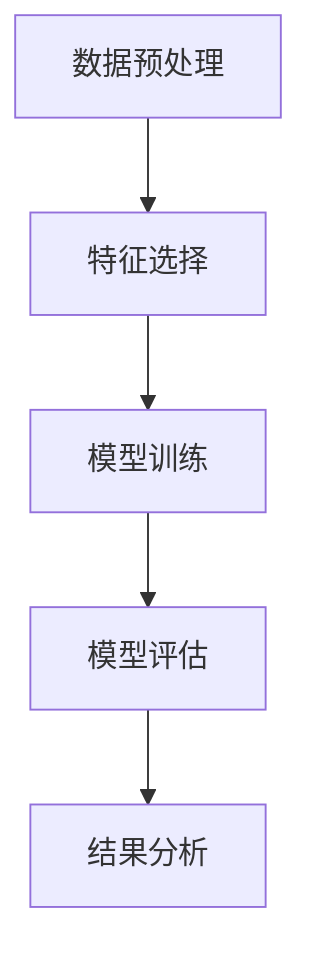
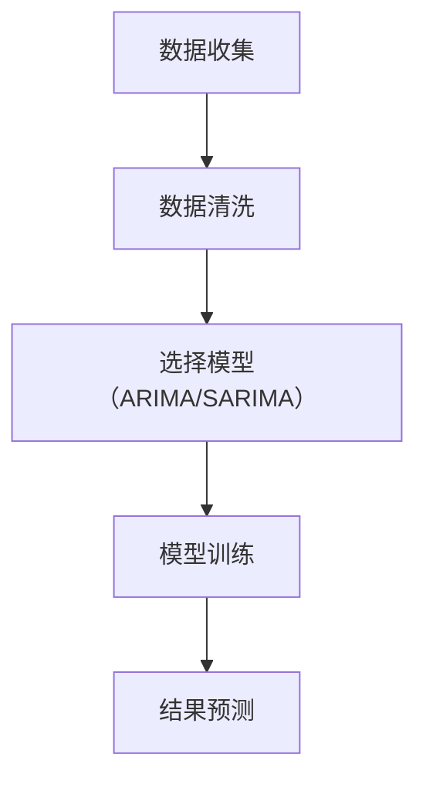
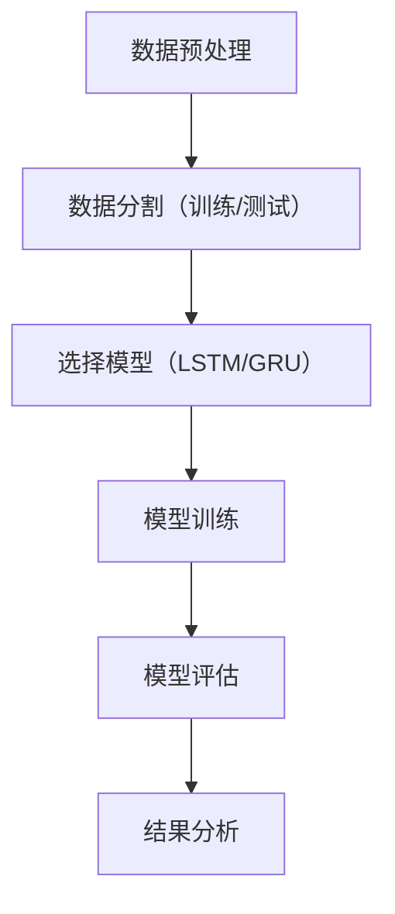
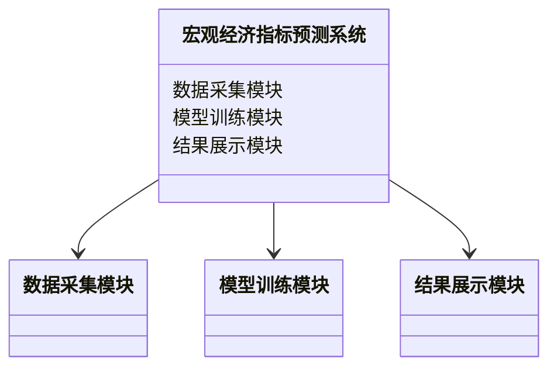
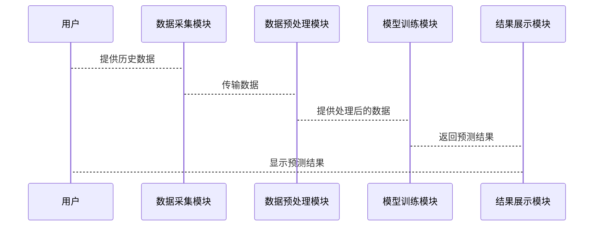

                 


# AI辅助的宏观经济指标预测

> 关键词：宏观经济指标预测，人工智能，机器学习，时间序列分析，神经网络，经济预测模型

> 摘要：本文详细探讨了如何利用人工智能技术辅助宏观经济指标预测。通过分析宏观经济指标的核心概念、AI模型的基本原理、常见算法的实现、系统架构设计以及实际项目案例，本文为读者提供了一个全面的视角，帮助理解如何通过技术手段提升宏观经济预测的准确性和效率。

---

# 第1章 宏观经济指标与AI预测的背景介绍

## 1.1 宏观经济指标的基本概念

### 1.1.1 宏观经济指标的定义与分类

- **定义**：宏观经济指标是衡量一个国家或地区经济运行状况的关键数据，包括GDP、CPI、失业率、工业增加值等。
- **分类**：总量指标、结构指标、价格指标、就业指标等。

### 1.1.2 宏观经济指标的重要性

- 宏观经济指标是政府制定政策的重要依据。
- 它能够反映经济运行的健康状况和潜在风险。
- 在投资决策中，宏观经济指标帮助企业和个人做出更明智的选择。

### 1.1.3 宏观经济预测的挑战与意义

- **挑战**：数据复杂性、模型的局限性、外部因素的不确定性。
- **意义**：通过准确的预测，可以提前制定应对策略，降低风险。

---

## 1.2 AI在宏观经济预测中的作用

### 1.2.1 AI技术的基本原理

- 人工智能（AI）通过机器学习、深度学习等技术，从大量数据中提取模式和特征。
- 常见的AI技术包括监督学习、无监督学习、强化学习等。

### 1.2.2 AI在宏观经济预测中的优势

- 数据处理能力强，可以处理海量的非结构化数据。
- 模型可以自动调整参数，适应数据的变化。
- 能够捕捉到传统统计方法难以发现的复杂模式。

### 1.2.3 当前AI辅助宏观经济预测的研究进展

- 结合自然语言处理（NLP）分析新闻、社交媒体等非结构化数据。
- 使用深度学习模型（如LSTM）进行时间序列预测。
- 结合博弈论和经济模型优化预测结果。

---

## 1.3 宏观经济指标预测的边界与外延

### 1.3.1 宏观经济预测的边界条件

- 数据的可用性与质量。
- 模型的假设与限制。
- 预测的时间窗口和粒度。

### 1.3.2 宏观经济预测的外延领域

- 金融市场的预测与风险评估。
- 宏观政策的制定与优化。
- 行业经济的预测与分析。

### 1.3.3 宏观经济预测的局限性

- 数据的滞后性。
- 模型的黑箱特性。
- 外部突发事件的不可预测性。

---

## 1.4 本章小结

通过本章的介绍，我们了解了宏观经济指标的基本概念、AI在宏观经济预测中的作用以及预测的边界与外延。这些内容为后续章节的深入分析奠定了基础。

---

# 第2章 宏观经济指标与AI模型的核心概念

## 2.1 宏观经济指标的构成

### 2.1.1 GDP、CPI、失业率等核心指标

- **GDP**：国内生产总值，衡量一个国家的经济总产出。
- **CPI**：消费者物价指数，衡量通货膨胀水平。
- **失业率**：衡量劳动力市场的健康状况。

### 2.1.2 宏观经济指标的相互关系

- GDP与CPI的关系：经济增长可能导致通货膨胀。
- 失业率与GDP的关系：失业率高可能意味着经济衰退。

### 2.1.3 宏观经济指标的数据来源

- 政府统计部门、国际货币基金组织（IMF）、世界银行等。

---

## 2.2 AI模型的基本原理

### 2.2.1 机器学习与深度学习的定义

- **机器学习**：通过数据训练模型，使其能够从数据中学习规律。
- **深度学习**：一种特殊的机器学习方法，通过多层神经网络提取特征。

### 2.2.2 AI模型在宏观经济预测中的优势

- 能够处理高维数据。
- 可以发现数据中的非线性关系。
- 具备良好的泛化能力。

### 2.2.3 宏观经济指标与AI模型的关系

- 宏观经济指标是模型的输入，AI模型是预测工具。
- 模型的输出结果是对宏观经济指标的预测。

---

## 2.3 宏观经济指标与AI模型的关系

### 2.3.1 数据驱动的宏观经济预测

- 数据是模型的核心输入。
- 通过数据挖掘发现潜在的经济规律。

### 2.3.2 AI模型对宏观经济指标的解析

- 模型可以分解指标背后的影响因素。
- 可以预测指标的变化趋势。

### 2.3.3 宏观经济指标对AI模型的反馈机制

- 指标的实际值可以用于模型的验证和优化。
- 通过反馈不断改进模型的预测能力。

---

## 2.4 本章小结

本章重点介绍了宏观经济指标的构成、AI模型的基本原理以及两者之间的关系。这些内容为后续的算法实现和系统设计提供了理论基础。

---

# 第3章 宏观经济指标预测的核心算法原理

## 3.1 常见宏观经济预测算法

### 3.1.1 线性回归模型

- **定义**：通过最小二乘法拟合一条直线，预测目标变量。
- **优点**：简单易懂，计算效率高。
- **缺点**：只能处理线性关系，对复杂数据的拟合能力有限。

### 3.1.2 时间序列分析模型

- **定义**：通过分析数据的时间特性，预测未来的趋势。
- **常见模型**：ARIMA、SARIMA。
- **优点**：适合处理时间相关的数据。

### 3.1.3 神经网络模型

- **定义**：通过多层神经网络提取数据的非线性特征。
- **常见模型**：LSTM、GRU。
- **优点**：能够捕捉数据中的复杂模式。

---

## 3.2 算法原理与流程图

### 3.2.1 线性回归算法流程图



### 3.2.2 时间序列分析流程图



### 3.2.3 神经网络算法流程图



---

## 3.3 算法实现与代码示例

### 3.3.1 线性回归模型的Python代码实现

```python
import numpy as np
from sklearn.linear_model import LinearRegression

# 生成数据
X = np.array([1, 2, 3, 4, 5]).reshape(-1, 1)
y = np.array([2, 3, 5, 6, 7])

# 训练模型
model = LinearRegression()
model.fit(X, y)

# 预测
predicted_y = model.predict(X)
print("预测值:", predicted_y)
print("回归系数:", model.coef_)
print("截距:", model.intercept_)
```

### 3.3.2 时间序列分析的Python代码实现

```python
from statsmodels.tsa.arima_model import ARIMA
import pandas as pd

# 生成数据
data = pd.Series([1, 2, 3, 4, 5, 6, 7, 8, 9, 10])

# 训练模型
model = ARIMA(data, order=(1, 1, 0))
model_fit = model.fit(disp=0)

# 预测
forecast = model_fit.forecast(steps=5)
print("预测值:", forecast[0])
print("预测区间:", forecast[2])
```

### 3.3.3 神经网络模型的Python代码实现

```python
import numpy as np
import tensorflow as tf
from tensorflow.keras import layers

# 生成数据
X = np.random.randn(100, 1)
y = np.sin(X * np.pi) + np.random.normal(0, 0.1, 100)

# 定义模型
model = tf.keras.Sequential([
    layers.Dense(64, activation='relu'),
    layers.Dense(1, activation='linear')
])

# 编译模型
model.compile(optimizer='adam', loss='mean_squared_error')

# 训练模型
model.fit(X, y, epochs=100, batch_size=32)

# 预测
predicted_y = model.predict(X)
print("预测值:", predicted_y)
```

---

## 3.4 算法的数学模型与公式

### 3.4.1 线性回归的数学模型

$$ y = \beta_0 + \beta_1 x + \epsilon $$

其中，$\beta_0$ 是截距，$\beta_1$ 是回归系数，$\epsilon$ 是误差项。

### 3.4.2 时间序列分析的数学模型

ARIMA模型的数学表达式为：

$$ \phi(P) z_t = \theta(Q) \epsilon_t $$

其中，$P$ 是自回归（AR）的阶数，$Q$ 是移动平均（MA）的阶数，$z_t$ 是差分序列，$\epsilon_t$ 是白噪声。

### 3.4.3 神经网络的数学模型

LSTM的数学表达式为：

$$ f_t = \sigma(g(x_t + f_{t-1})) $$

其中，$x_t$ 是输入，$f_{t-1}$ 是前一时刻的隐藏状态，$g$ 是门控函数，$\sigma$ 是激活函数。

---

## 3.5 本章小结

本章详细介绍了常见的宏观经济预测算法，包括线性回归、时间序列分析和神经网络模型，并通过代码示例和数学公式进行了深入讲解。这些算法为后续的系统设计和项目实现奠定了基础。

---

# 第4章 系统分析与架构设计方案

## 4.1 问题场景介绍

### 4.1.1 宏观经济指标预测的业务场景

- 政府政策制定：通过预测GDP、CPI等指标，优化宏观调控。
- 企业决策：基于宏观经济预测，调整生产和投资策略。
- 金融市场：利用宏观经济预测，进行风险评估和投资决策。

### 4.1.2 系统的目标与范围

- 目标：构建一个AI辅助的宏观经济指标预测系统。
- 范围：包括数据采集、模型训练、结果展示等功能。

---

## 4.2 项目介绍

### 4.2.1 项目背景

- 随着AI技术的发展，宏观经济预测的精度和效率不断提升。
- 企业需要一个高效的工具来支持宏观经济决策。

### 4.2.2 项目目标

- 构建一个AI辅助的宏观经济指标预测系统。
- 提供用户友好的界面，方便数据输入和结果查看。

---

## 4.3 系统功能设计

### 4.3.1 领域模型设计



### 4.3.2 系统架构设计


### 4.3.3 系统接口设计

- 数据输入接口：接收宏观经济指标的历史数据。
- 模型接口：调用AI模型进行预测。
- 结果输出接口：展示预测结果。

### 4.3.4 系统交互设计



---

## 4.4 本章小结

本章通过系统分析与架构设计，明确了宏观经济指标预测系统的功能模块、系统架构和交互流程。这些设计为后续的项目实现提供了明确的方向。

---

# 第5章 项目实战

## 5.1 环境安装与配置

### 5.1.1 安装Python环境

- 安装Python 3.8或更高版本。
- 安装必要的库：numpy、pandas、scikit-learn、tensorflow、statsmodels。

### 5.1.2 安装Jupyter Notebook

- 通过pip安装：`pip install jupyter`

### 5.1.3 配置开发环境

- 配置虚拟环境，安装必要的库。

---

## 5.2 系统核心实现

### 5.2.1 数据采集模块

```python
import pandas as pd
import requests
from bs4 import BeautifulSoup

# 从网页爬取数据
url = "https://example.com/economic-indicators"
response = requests.get(url)
soup = BeautifulSoup(response.text, 'html.parser')
data = pd.DataFrame()
# 具体实现根据网页结构调整
```

### 5.2.2 数据预处理模块

```python
import pandas as pd
from sklearn.preprocessing import StandardScaler

data = pd.read_csv('economic_data.csv')
# 去除缺失值
data.dropna(inplace=True)
# 标准化处理
scaler = StandardScaler()
scaled_data = scaler.fit_transform(data)
```

### 5.2.3 模型训练模块

```python
from sklearn.model_selection import train_test_split
from sklearn.linear_model import LinearRegression

X_train, X_test, y_train, y_test = train_test_split(X, y, test_size=0.2)
model = LinearRegression()
model.fit(X_train, y_train)
```

### 5.2.4 结果展示模块

```python
import matplotlib.pyplot as plt

plt.plot(y_test, label='实际值')
plt.plot(model.predict(X_test), label='预测值')
plt.legend()
plt.show()
```

---

## 5.3 代码实现与解读

### 5.3.1 数据采集模块的实现

```python
import pandas as pd
import requests
from bs4 import BeautifulSoup

def fetch_data(url):
    response = requests.get(url)
    soup = BeautifulSoup(response.text, 'html.parser')
    # 提取数据
    data = pd.DataFrame()
    return data

# 使用示例
url = "https://example.com/economic-indicators"
data = fetch_data(url)
print(data)
```

### 5.3.2 数据预处理模块的实现

```python
import pandas as pd
from sklearn.preprocessing import StandardScaler

def preprocess_data(data):
    data.dropna(inplace=True)
    scaler = StandardScaler()
    scaled_data = scaler.fit_transform(data)
    return scaled_data

# 使用示例
data = pd.read_csv('economic_data.csv')
scaled_data = preprocess_data(data)
print(scaled_data)
```

### 5.3.3 模型训练模块的实现

```python
from sklearn.model_selection import train_test_split
from sklearn.linear_model import LinearRegression

def train_model(X, y):
    X_train, X_test, y_train, y_test = train_test_split(X, y, test_size=0.2)
    model = LinearRegression()
    model.fit(X_train, y_train)
    return model

# 使用示例
X = scaled_data[:, :-1]
y = scaled_data[:, -1]
model = train_model(X, y)
print("回归系数:", model.coef_)
print("截距:", model.intercept_)
```

### 5.3.4 结果展示模块的实现

```python
import matplotlib.pyplot as plt

def plot_results(y_test, y_pred):
    plt.plot(y_test, label='实际值')
    plt.plot(y_pred, label='预测值')
    plt.legend()
    plt.show()

# 使用示例
y_pred = model.predict(X_test)
plot_results(y_test, y_pred)
```

---

## 5.4 实际案例分析

### 5.4.1 数据来源

- 使用公开的经济数据集，例如世界银行或IMF的数据。

### 5.4.2 数据处理

- 清洗数据，处理缺失值和异常值。
- 标准化数据，确保模型的输入格式一致。

### 5.4.3 模型训练

- 使用训练好的模型进行预测。
- 调整模型参数，优化预测精度。

### 5.4.4 结果分析

- 对比实际值和预测值，评估模型的准确性。
- 分析预测结果的误差来源，优化模型。

---

## 5.5 本章小结

本章通过实际案例的分析，详细展示了如何在具体场景中应用AI技术进行宏观经济指标预测。从数据采集到结果展示，整个流程的实现为读者提供了实践的参考。

---

# 第6章 最佳实践、小结、注意事项与拓展阅读

## 6.1 最佳实践

### 6.1.1 数据处理

- 确保数据的准确性和完整性。
- 对数据进行合理的清洗和预处理。

### 6.1.2 模型选择

- 根据数据特性选择合适的模型。
- 对多个模型进行对比，选择表现最佳的模型。

### 6.1.3 模型优化

- 调整模型参数，优化预测精度。
- 使用交叉验证，防止过拟合。

---

## 6.2 小结

通过本文的介绍，我们系统地探讨了AI辅助宏观经济指标预测的核心概念、算法原理、系统架构和实际应用。这些内容不仅帮助读者理解如何利用AI技术提升宏观经济预测的精度，也为后续的研究和实践提供了宝贵的参考。

---

## 6.3 注意事项

- 数据的质量直接影响预测结果，必须重视数据的清洗和预处理。
- 模型的解释性与可解释性在宏观经济预测中非常重要，尤其是在政策制定中。
- 需要定期更新模型，以适应数据的变化和外部环境的变化。

---

## 6.4 拓展阅读

- 《机器学习实战》—— 周志华
- 《深度学习》—— Ian Goodfellow
- 《时间序列分析： Forecasting and Control》—— George E. P. Box

---

# 作者：AI天才研究院/AI Genius Institute & 禅与计算机程序设计艺术/Zen And The Art of Computer Programming

