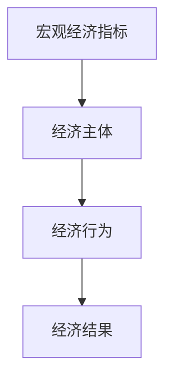
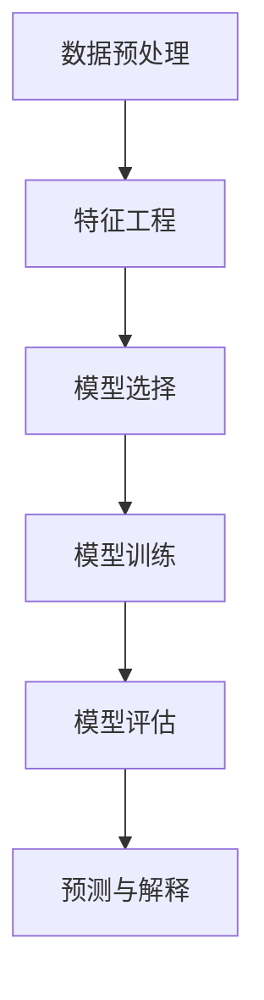
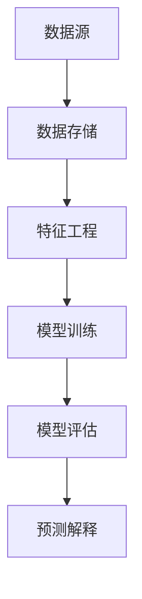
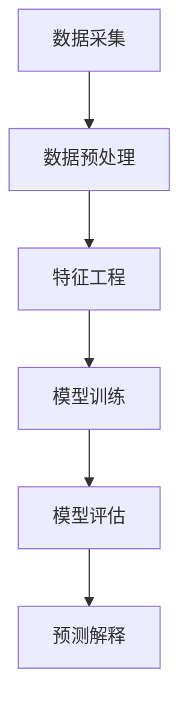

                 


# AI辅助的宏观经济指标预测与情景分析

## 关键词：人工智能、宏观经济预测、机器学习、情景分析、经济模型

## 摘要：本文详细探讨了人工智能在宏观经济指标预测与情景分析中的应用，从算法原理到系统架构，从项目实战到最佳实践，系统性地阐述了AI如何助力宏观经济分析。通过具体案例分析，本文展示了如何利用AI技术提升宏观经济预测的准确性和效率，并提出了未来研究的方向和建议。

---

# 第一部分: 宏观经济指标预测的背景与挑战

## 第1章: 宏观经济指标预测的背景与挑战

### 1.1 宏观经济指标的定义与作用

#### 1.1.1 宏观经济指标的核心概念
宏观经济指标是衡量一个国家或地区经济运行状况的关键数据，主要包括GDP（国内生产总值）、CPI（居民消费价格指数）、失业率、工业增加值、进出口额等。这些指标能够反映经济的总体状况、发展趋势和潜在风险。

#### 1.1.2 宏观经济指标在经济决策中的作用
宏观经济指标是政府制定货币政策、财政政策以及企业制定战略决策的重要依据。例如，中央银行可以通过调整利率来应对GDP增长放缓的情况，企业可以通过分析失业率和CPI走势来优化生产计划。

#### 1.1.3 宏观经济指标预测的复杂性与挑战
宏观经济指标的预测具有高度的复杂性，主要体现在以下几个方面：
1. **数据依赖性**：宏观经济指标的预测依赖于大量的历史数据，但数据的质量、完整性和及时性往往会影响预测的准确性。
2. **变量的相互作用**：宏观经济指标之间存在复杂的相互作用，例如货币政策会影响GDP、CPI和失业率，而这些变量又会反过来影响货币政策。
3. **外部冲击**：全球经济波动、地缘政治冲突、自然灾害等外部因素会对宏观经济指标产生不可预测的影响。

### 1.2 AI技术在宏观经济预测中的应用前景

#### 1.2.1 AI技术的基本概念与特点
人工智能（AI）是一种模拟人类智能的技术，能够通过数据学习、模式识别和决策优化来完成复杂的任务。AI的核心技术包括机器学习、深度学习、自然语言处理、计算机视觉等。AI在宏观经济预测中的应用主要依赖于其强大的数据处理能力和模式识别能力。

#### 1.2.2 AI在宏观经济预测中的优势
1. **数据处理能力**：AI能够处理海量的经济数据，并从中提取有价值的信息。
2. **预测准确性**：通过机器学习算法，AI可以发现数据中的复杂模式，从而提高预测的准确性。
3. **实时性**：AI可以实现实时数据处理和预测，帮助决策者快速应对经济变化。

#### 1.2.3 当前宏观经济预测中的AI技术应用现状
目前，AI技术已经在宏观经济预测中得到了广泛应用。例如，Google的Economic Trends Dashboard利用机器学习模型预测全球经济走势；中国人民银行也在利用AI技术进行货币政策研究和预测。

### 1.3 宏观经济指标预测的核心问题与边界

#### 1.3.1 宏观经济指标预测的核心问题
1. **数据质量问题**：如何处理缺失数据、噪声数据和异常值。
2. **模型选择问题**：如何选择合适的机器学习模型。
3. **预测准确性问题**：如何提高预测的准确性和稳定性。

#### 1.3.2 宏观经济指标预测的边界与外延
宏观经济指标预测的边界在于模型的假设和数据的限制。例如，模型假设经济变量之间存在线性关系，而实际上可能存在非线性关系。此外，宏观经济指标的预测需要考虑外部冲击的影响，但模型可能无法完全捕捉这些冲击。

#### 1.3.3 宏观经济指标预测的概念结构与核心要素
宏观经济指标预测的核心要素包括：
1. 数据采集：获取相关的宏观经济指标数据。
2. 数据预处理：清洗数据、处理缺失值、标准化数据。
3. 模型选择：选择合适的机器学习模型。
4. 模型训练：利用训练数据训练模型。
5. 模型评估：通过测试数据评估模型的性能。
6. 预测与解释：利用模型进行预测，并对结果进行解释。

### 1.4 本章小结
本章从宏观经济指标的定义与作用、AI技术的应用前景以及预测的核心问题与边界三个方面，详细介绍了宏观经济指标预测的背景与挑战。通过本章的学习，读者可以理解宏观经济指标预测的重要性和复杂性，以及AI技术在其中的独特优势。

---

## 第二部分: AI辅助宏观经济指标预测的核心概念与联系

## 第2章: AI辅助宏观经济指标预测的核心概念

### 2.1 宏观经济指标预测的基本原理

#### 2.1.1 宏观经济指标预测的基本原理概述
宏观经济指标预测的基本原理是通过分析经济变量之间的关系，利用历史数据建立数学模型，并通过模型预测未来的经济走势。传统的宏观经济预测方法包括时间序列分析、计量经济学模型等。

#### 2.1.2 宏观经济指标预测的主要方法
1. **时间序列分析**：通过分析经济指标的历史数据，建立时间序列模型，预测未来的经济走势。
2. **计量经济学模型**：通过建立经济变量之间的关系模型，进行预测和政策分析。
3. **机器学习模型**：利用机器学习算法，从数据中学习经济变量之间的关系，进行预测。

#### 2.1.3 宏观经济指标预测的关键因素分析
1. **数据质量**：数据的准确性和完整性直接影响预测的准确性。
2. **模型选择**：选择合适的模型是提高预测准确性的关键。
3. **外部因素**：外部冲击如地缘政治冲突、自然灾害等会对经济指标产生重大影响。

### 2.2 AI技术在宏观经济预测中的核心作用

#### 2.2.1 AI技术的核心算法与模型
1. **机器学习算法**：包括线性回归、支持向量机、随机森林等。
2. **深度学习模型**：包括神经网络、LSTM（长短期记忆网络）、Transformer等。

#### 2.2.2 AI技术在宏观经济预测中的优势
1. **数据驱动**：AI技术能够从海量数据中发现复杂的模式和关系。
2. **自动化特征工程**：AI技术可以自动提取特征，减少人工干预。
3. **实时预测**：AI技术能够实现实时预测，帮助决策者快速应对经济变化。

#### 2.2.3 AI技术与宏观经济预测的结合点
1. **数据处理**：AI技术能够处理复杂的经济数据，提取有价值的信息。
2. **模型训练**：AI技术能够训练复杂的模型，提高预测的准确性。
3. **情景分析**：AI技术能够进行情景分析，帮助决策者制定应对策略。

### 2.3 宏观经济指标预测中的关键概念对比

#### 2.3.1 宏观经济指标与微观经济指标的对比
| 宏观经济指标 | 微观经济指标 |
|--------------|--------------|
| 国内生产总值（GDP） | 企业利润 |
| 失业率        | 家庭收入 |
| 消费者价格指数（CPI） | 个人消费支出 |

#### 2.3.2 不同宏观经济指标的特征对比
| 指标       | 特征描述                       |
|------------|--------------------------------|
| GDP         | 反映一个国家或地区的经济总规模 |
| CPI         | 反映居民生活成本的变化         |
| 失业率       | 反映劳动力市场的健康状况       |

#### 2.3.3 AI技术在不同宏观经济指标预测中的应用对比
| 指标       | AI技术应用特点                   |
|------------|----------------------------------|
| GDP         | 可能需要考虑多个经济变量的影响     |
| CPI         | 可能需要考虑季节性因素           |
| 失业率       | 可能需要考虑政策变量的影响       |

### 2.4 宏观经济指标预测的ER实体关系图



### 2.5 本章小结
本章从宏观经济指标预测的基本原理、AI技术的核心作用以及关键概念对比三个方面，详细介绍了AI辅助宏观经济指标预测的核心概念与联系。通过本章的学习，读者可以理解AI技术在宏观经济预测中的重要作用，以及不同宏观经济指标的特征和AI技术的应用特点。

---

## 第三部分: AI辅助宏观经济指标预测的算法原理与数学模型

## 第3章: AI辅助宏观经济指标预测的核心算法

### 3.1 常见宏观经济预测算法概述

#### 3.1.1 线性回归模型
线性回归是一种简单而常用的统计学习方法，适用于线性关系的预测。其基本假设是因变量与自变量之间存在线性关系。线性回归的数学模型可以表示为：

$$ y = \beta_0 + \beta_1 x_1 + \beta_2 x_2 + \dots + \beta_n x_n + \epsilon $$

其中，$y$ 是因变量，$x_i$ 是自变量，$\beta_i$ 是回归系数，$\epsilon$ 是误差项。

#### 3.1.2 时间序列分析模型
时间序列分析是一种通过分析经济指标的时间序列数据来预测未来趋势的方法。常见的时间序列模型包括ARIMA（自回归积分滑动平均模型）和GARCH（广义自回归条件异方差模型）。

#### 3.1.3 支持向量机模型
支持向量机（SVM）是一种监督学习算法，适用于分类和回归问题。SVM通过构建支持向量来最大化类别之间的间隔，从而实现分类或回归。

#### 3.1.4 随机森林模型
随机森林是一种基于决策树的集成学习算法，通过构建多个决策树并集成结果来提高预测的准确性和稳定性。

#### 3.1.5 神经网络模型
神经网络是一种模仿人脑结构和功能的深度学习模型，能够通过多层神经元之间的连接来学习数据的特征和模式。

### 3.2 基于机器学习的宏观经济预测算法

#### 3.2.1 线性回归模型的原理与实现
线性回归模型的原理是通过最小二乘法拟合回归系数，使得预测值与实际值之间的残差平方和最小。其数学模型可以表示为：

$$ \text{最小化} \sum_{i=1}^n (y_i - \hat{y}_i)^2 $$

其中，$\hat{y}_i = \beta_0 + \beta_1 x_{i1} + \beta_2 x_{i2} + \dots + \beta_n x_{in}$。

#### 3.2.2 时间序列分析模型的原理与实现
时间序列分析模型的原理是通过分析数据的自相关性和偏自相关性来建立模型。例如，ARIMA模型的数学表达式为：

$$ \Phi(B)(1 - B)^d X_t = \theta(B) \epsilon_t $$

其中，$B$ 是后移算子，$\Phi(B)$ 和 $\theta(B)$ 是多项式系数，$d$ 是差分的阶数，$\epsilon_t$ 是白噪声序列。

#### 3.2.3 神经网络模型的原理与实现
神经网络模型的原理是通过多层神经元之间的连接来学习数据的特征和模式。其数学模型可以表示为：

$$ y = \sigma(w_1 x + b_1) $$

$$ \hat{y} = \sigma(w_2 y + b_2) $$

其中，$\sigma$ 是激活函数，$w$ 是权重，$b$ 是偏置。

### 3.3 基于深度学习的宏观经济预测算法

#### 3.3.1 RNN与LSTM模型的原理与实现
RNN（循环神经网络）和LSTM（长短期记忆网络）是一种适用于时间序列数据的深度学习模型。LSTM模型通过引入记忆单元和遗忘门来解决RNN的梯度消失问题。其数学表达式为：

$$ f_t = \sigma(W_f \cdot [h_{t-1}, x_t] + b_f) $$

$$ i_t = \sigma(W_i \cdot [h_{t-1}, x_t] + b_i) $$

$$ o_t = \sigma(W_o \cdot [h_{t-1}, x_t] + b_o) $$

$$ g_t = \tanh(W_g \cdot [h_{t-1}, x_t] + b_g) $$

$$ h_t = f_t \cdot g_t $$

$$ c_t = i_t \cdot c_{t-1} + f_t \cdot g_t $$

其中，$f_t$ 是遗忘门，$i_t$ 是输入门，$o_t$ 是输出门，$g_t$ 是候选记忆单元，$c_t$ 是记忆单元，$h_t$ 是隐藏状态。

#### 3.3.2 Transformer模型的原理与实现
Transformer模型是一种基于自注意力机制的深度学习模型，适用于长序列数据的预测。其数学表达式为：

$$ \text{Attention}(Q, K, V) = \text{softmax}\left(\frac{QK^T}{\sqrt{d_k}}\right)V $$

其中，$Q$ 是查询向量，$K$ 是键向量，$V$ 是值向量，$d_k$ 是键向量的维度。

#### 3.3.3 图神经网络模型的原理与实现
图神经网络是一种适用于复杂网络数据的深度学习模型，能够通过节点之间的关系来预测宏观经济指标。其数学表达式为：

$$ h_v = \sigma\left(\sum_{u \in N(v)} w_{vu} h_u\right) $$

其中，$h_v$ 是节点$v$的隐藏状态，$N(v)$ 是节点$v$的邻居节点，$w_{vu}$ 是权重。

### 3.4 算法流程图



### 3.5 本章小结
本章从常见宏观经济预测算法、基于机器学习的预测算法以及基于深度学习的预测算法三个方面，详细介绍了AI辅助宏观经济指标预测的核心算法。通过本章的学习，读者可以理解不同算法的原理与实现，以及它们在宏观经济预测中的应用。

---

## 第四部分: AI辅助宏观经济指标预测的系统分析与架构设计

## 第4章: AI辅助宏观经济指标预测的系统分析与架构设计

### 4.1 问题场景介绍

#### 4.1.1 宏观经济指标预测的场景描述
宏观经济指标预测的场景包括政府机构、中央银行、企业和学术研究机构。例如，中央银行需要预测GDP增长率以制定货币政策，企业需要预测CPI走势以优化生产计划。

#### 4.1.2 系统目标与范围
系统目标是通过AI技术提高宏观经济指标预测的准确性和效率。系统范围包括数据采集、特征工程、模型训练、模型评估和预测解释。

#### 4.1.3 系统边界与接口
系统边界包括数据源、模型训练模块、预测模块和结果展示模块。系统接口包括数据接口、模型接口和用户接口。

### 4.2 项目介绍

#### 4.2.1 项目目标
项目目标是开发一个基于AI的宏观经济指标预测系统，实现对GDP、CPI和失业率等指标的预测。

#### 4.2.2 项目范围
项目范围包括数据采集、特征工程、模型训练、模型评估和结果展示。

#### 4.2.3 项目实施步骤
项目实施步骤包括需求分析、数据采集、特征工程、模型训练、模型评估和系统部署。

### 4.3 系统功能设计

#### 4.3.1 领域模型设计
领域模型是系统功能设计的核心，包括数据采集模块、特征工程模块、模型训练模块、模型评估模块和预测解释模块。

#### 4.3.2 领域模型ER图


#### 4.3.3 系统架构设计



### 4.4 系统架构设计

#### 4.4.1 系统架构设计图


#### 4.4.2 系统架构设计说明
系统架构设计包括数据采集模块、数据预处理模块、特征工程模块、模型训练模块、模型评估模块和预测解释模块。每个模块的功能和接口需要清晰定义。

#### 4.4.3 系统交互设计
系统交互设计包括用户与系统的交互流程，例如用户输入预测需求，系统返回预测结果和解释。

### 4.5 系统接口设计

#### 4.5.1 数据接口
数据接口包括数据输入接口和数据输出接口。数据输入接口用于接收宏观经济指标数据，数据输出接口用于输出预测结果。

#### 4.5.2 模型接口
模型接口包括模型输入接口和模型输出接口。模型输入接口用于接收特征数据，模型输出接口用于输出预测结果和模型参数。

#### 4.5.3 用户接口
用户接口包括用户输入接口和用户输出接口。用户输入接口用于接收用户的预测需求，用户输出接口用于输出预测结果和解释。

### 4.6 本章小结
本章从系统分析与架构设计两个方面，详细介绍了AI辅助宏观经济指标预测的系统架构和功能设计。通过本章的学习，读者可以理解系统设计的核心思想和实现步骤。

---

## 第五部分: AI辅助宏观经济指标预测的项目实战

## 第5章: AI辅助宏观经济指标预测的项目实战

### 5.1 项目环境安装

#### 5.1.1 系统环境要求
项目运行需要安装Python 3.6及以上版本，安装Jupyter Notebook、Pandas、NumPy、Scikit-learn、TensorFlow等库。

#### 5.1.2 安装步骤
1. 安装Python：
   ```bash
   python --version
   ```
2. 安装Jupyter Notebook：
   ```bash
   pip install jupyter notebook
   ```
3. 安装Pandas、NumPy、Scikit-learn、TensorFlow：
   ```bash
   pip install pandas numpy scikit-learn tensorflow
   ```

### 5.2 系统核心实现源代码

#### 5.2.1 数据预处理代码
```python
import pandas as pd
import numpy as np

# 数据加载
data = pd.read_csv('economic_indicators.csv')

# 数据清洗
data.dropna(inplace=True)
data = data[~data.duplicated()]

# 数据标准化
from sklearn.preprocessing import StandardScaler
scaler = StandardScaler()
scaled_data = scaler.fit_transform(data)
```

#### 5.2.2 特征工程代码
```python
from sklearn.decomposition import PCA

# PCA降维
pca = PCA(n_components=10)
pca_data = pca.fit_transform(scaled_data)

# 特征选择
from sklearn.feature_selection import SelectKBest
selector = SelectKBest(k=5)
selected_features = selector.fit_transform(pca_data)
```

#### 5.2.3 模型训练代码
```python
from sklearn.linear_model import LinearRegression
from sklearn.metrics import mean_squared_error

# 线性回归模型训练
model = LinearRegression()
model.fit(selected_features, target)
```

#### 5.2.4 模型评估代码
```python
# 模型评估
from sklearn.model_selection import train_test_split

X_train, X_test, y_train, y_test = train_test_split(selected_features, target, test_size=0.2)

# 模型训练
model.fit(X_train, y_train)

# 模型预测
y_pred = model.predict(X_test)

# 模型评估
mse = mean_squared_error(y_test, y_pred)
print(f'Mean Squared Error: {mse}')
```

### 5.3 代码应用解读与分析

#### 5.3.1 数据预处理
数据预处理包括数据加载、数据清洗和数据标准化。数据清洗主要是处理缺失值和重复值，数据标准化是通过标准化方法将数据归一化。

#### 5.3.2 特征工程
特征工程包括主成分分析（PCA）和特征选择。PCA用于降维，特征选择用于选择最重要的特征。

#### 5.3.3 模型训练
模型训练使用线性回归算法，通过最小二乘法拟合回归系数，使得预测值与实际值之间的残差平方和最小。

#### 5.3.4 模型评估
模型评估使用均方误差（MSE）来衡量预测值与实际值之间的差异。MSE越小，模型的预测精度越高。

### 5.4 实际案例分析

#### 5.4.1 数据来源
数据来源包括政府统计机构、国际货币基金组织（IMF）、世界银行等。

#### 5.4.2 数据分析
通过分析GDP、CPI和失业率等宏观经济指标的历史数据，建立线性回归模型，预测未来的经济走势。

#### 5.4.3 数据可视化
使用Matplotlib或Seaborn对数据进行可视化，例如绘制时间序列图、散点图和热力图，帮助理解数据的特征和趋势。

### 5.5 项目小结

#### 5.5.1 项目总结
通过本项目，读者可以掌握AI技术在宏观经济指标预测中的应用，包括数据预处理、特征工程、模型训练和模型评估。

#### 5.5.2 经验与教训
在项目实施过程中，需要注意数据质量、模型选择和模型解释等问题。例如，数据可能存在缺失值和异常值，需要进行数据清洗；模型可能存在过拟合问题，需要进行交叉验证和调参。

#### 5.5.3 项目展望
未来可以进一步研究深度学习模型在宏观经济预测中的应用，例如LSTM和Transformer模型。同时，可以探索多变量预测和情景分析，帮助决策者制定更有效的政策。

---

## 第六部分: 总结与展望

## 第6章: 总结与展望

### 6.1 总结

#### 6.1.1 核心内容回顾
本文系统性地介绍了AI辅助宏观经济指标预测的核心概念、算法原理、系统架构和项目实战。通过理论与实践相结合的方式，帮助读者理解AI技术在宏观经济预测中的重要作用。

#### 6.1.2 核心收获
通过本文的学习，读者可以掌握AI技术在宏观经济预测中的应用，包括数据预处理、特征工程、模型训练和模型评估。

### 6.2 展望

#### 6.2.1 未来研究方向
未来研究可以进一步探索深度学习模型在宏观经济预测中的应用，例如LSTM和Transformer模型。同时，可以研究多变量预测和情景分析，帮助决策者制定更有效的政策。

#### 6.2.2 技术发展趋势
随着AI技术的不断发展，宏观经济指标预测将更加智能化和自动化。未来可能会出现更多基于深度学习的宏观经济预测模型，以及更加复杂的宏观经济指标预测系统。

#### 6.2.3 应用前景分析
AI技术在宏观经济预测中的应用前景广阔，可以帮助政府机构、中央银行、企业和学术研究机构提高经济预测的准确性和效率。

### 6.3 最佳实践 tips

#### 6.3.1 数据质量的重要性
在宏观经济预测中，数据质量是影响预测准确性的关键因素。建议在数据预处理阶段，进行数据清洗和标准化，确保数据的准确性和完整性。

#### 6.3.2 模型选择的多样性
在模型选择中，建议根据具体问题和数据特征选择合适的模型。例如，线性回归适用于线性关系，LSTM适用于时间序列数据。

#### 6.3.3 模型解释性的关注
在模型预测中，模型解释性是帮助决策者理解预测结果的重要因素。建议在模型训练阶段，选择具有可解释性的模型，例如线性回归和决策树。

### 6.4 本章小结
本章从总结与展望两个方面，对全文进行了总结，并提出了未来研究的方向和建议。通过本章的学习，读者可以更好地理解AI技术在宏观经济预测中的重要作用，并为未来的研究和实践提供参考。

---

## 作者：AI天才研究院/AI Genius Institute & 禅与计算机程序设计艺术 /Zen And The Art of Computer Programming

