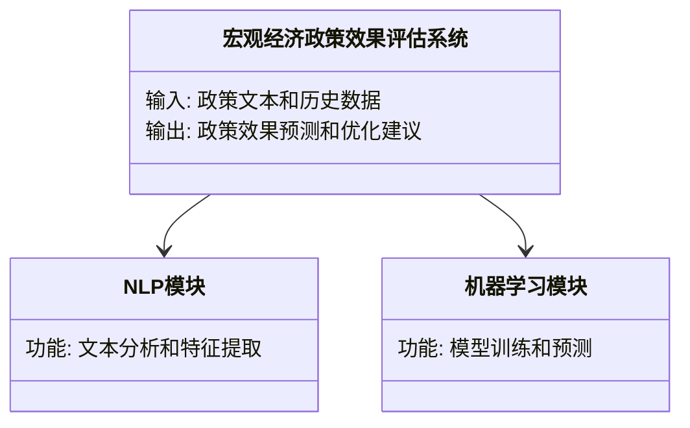
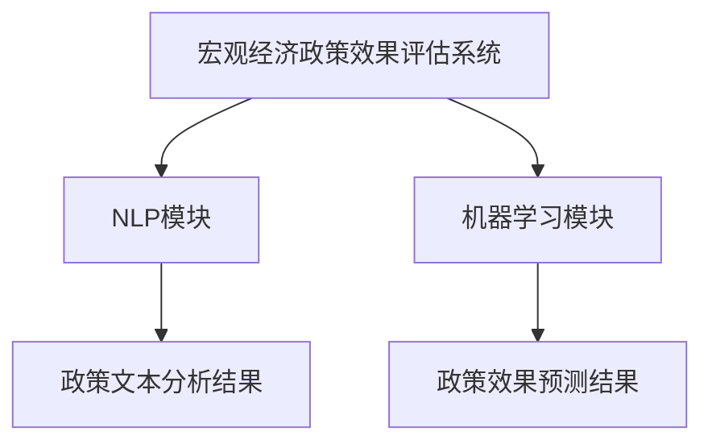
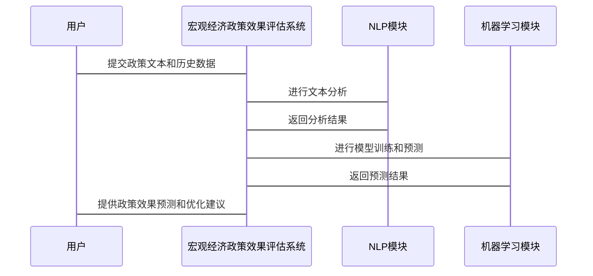

                 


# AI辅助的宏观经济政策效果量化评估

> 关键词：宏观经济政策，AI辅助，量化评估，自然语言处理，机器学习，政策效果预测

> 摘要：本文系统介绍了如何利用人工智能技术辅助宏观经济政策效果的量化评估。通过结合自然语言处理和机器学习算法，本文详细探讨了宏观经济政策文本分析、政策效果预测模型构建、系统架构设计以及实际案例分析。文章从背景介绍、核心概念、算法原理、系统架构到项目实战，层层递进，全面解析了AI在宏观经济政策评估中的应用及其优势。

---

## 第1章 宏观经济政策与AI辅助评估的背景介绍

### 1.1 宏观经济政策的基本概念

#### 1.1.1 宏观经济政策的定义
宏观经济政策是指政府或中央银行为了实现经济增长、价格稳定、就业充分和国际收支平衡等目标而采取的政策措施。这些政策包括货币政策、财政政策、产业政策等。

#### 1.1.2 宏观经济政策的主要目标
1. 维护价格稳定（通货膨胀控制）。
2. 促进经济增长。
3. 实现充分就业。
4. 平衡国际收支。

#### 1.1.3 宏观经济政策的实施主体
1. 中央银行（如美联储、中国人民银行）。
2. 财政部门。
3. 政府机构。

### 1.2 宏观经济政策效果评估的挑战

#### 1.2.1 宏观经济数据的复杂性
宏观经济数据涉及多个变量（如GDP、失业率、通胀率等），且变量之间可能存在复杂的非线性关系。

#### 1.2.2 政策效果的多变量影响
政策实施的效果往往受到多种因素的影响，例如政策的滞后效应、政策的相互作用等。

#### 1.2.3 传统评估方法的局限性
传统评估方法（如计量经济学模型）在处理大数据和非线性关系时存在局限性，难以捕捉复杂经济现象。

### 1.3 AI技术在宏观经济政策评估中的作用

#### 1.3.1 AI技术的基本概念
人工智能（AI）是指计算机系统执行人类智能任务的能力，如学习、推理、问题解决等。

#### 1.3.2 AI在宏观经济分析中的优势
1. 处理大数据能力强。
2. 能够发现复杂数据中的非线性关系。
3. 可以实时更新模型，适应动态变化的经济环境。

#### 1.3.3 宏观经济政策效果量化评估的AI解决方案
1. 利用NLP技术分析政策文本，提取关键信息。
2. 使用机器学习模型预测政策效果。
3. 通过AI优化政策参数，提高政策实施效果。

### 1.4 本章小结
本章介绍了宏观经济政策的基本概念及其评估的挑战，并阐述了AI技术在宏观经济政策评估中的作用和优势。

---

## 第2章 宏观经济政策效果量化评估的核心概念与联系

### 2.1 宏观经济政策效果的定义与属性

#### 2.1.1 宏观经济政策效果的定义
政策效果是指政策实施后对经济系统产生的实际影响，包括直接和间接效应。

#### 2.1.2 宏观经济政策效果的属性特征
| 特性 | 描述 |
|------|------|
| 多维性 | 政策效果涉及多个经济指标（如GDP、通胀率等）。 |
| 时变性 | 政策效果可能随时间变化而变化。 |
| 复杂性 | 政策效果可能受到多种因素的影响。 |

#### 2.1.3 宏观经济政策效果的评价指标
1. GDP增长率。
2. 失业率。
3. 通胀率。
4. 国际收支平衡。

### 2.2 AI辅助评估的核心概念

#### 2.2.1 AI在宏观经济分析中的核心算法
1. 自然语言处理（NLP）。
2. 机器学习（如随机森林、神经网络）。

#### 2.2.2 AI模型的特征提取能力
NLP技术可以提取政策文本中的关键词和主题，机器学习模型可以自动提取重要特征。

#### 2.2.3 AI模型的预测能力
通过训练模型，AI可以预测政策实施后的经济指标变化。

### 2.3 宏观经济政策效果与AI模型的关系

#### 2.3.1 宏观经济政策效果与AI模型的输入关系
政策文本和历史经济数据是AI模型的主要输入。

#### 2.3.2 宏观经济政策效果与AI模型的输出关系
AI模型输出政策效果预测结果和政策建议。

#### 2.3.3 宏观经济政策效果与AI模型的优化关系
通过反馈机制优化AI模型，提高预测精度。

### 2.4 本章小结
本章详细阐述了宏观经济政策效果的定义、属性及其与AI模型的关系。

---

## 第3章 基于AI的宏观经济政策效果评估算法

### 3.1 自然语言处理在政策文本分析中的应用

#### 3.1.1 NLP的基本原理
NLP通过计算机处理自然语言文本，实现文本理解。

#### 3.1.2 NLP在政策文本分析中的具体应用
1. 关键词提取。
2. 文本分类。
3. 主题建模。

#### 3.1.3 基于NLP的政策文本特征提取
使用NLP技术提取政策文本中的关键词和主题，为后续分析提供基础。

### 3.2 基于机器学习的政策效果预测模型

#### 3.2.1 机器学习的基本原理
机器学习通过训练数据学习模式，实现预测。

#### 3.2.2 常见机器学习算法在政策评估中的应用
1. 线性回归。
2. 支持向量机（SVM）。
3. 随机森林。

#### 3.2.3 基于机器学习的政策效果预测模型构建
1. 数据预处理。
2. 特征选择。
3. 模型训练与评估。

### 3.3 算法原理的数学模型与公式

#### 3.3.1 NLP模型的数学表达
$$ \text{词嵌入表示} = \text{输入文本} \rightarrow \text{词向量} $$

#### 3.3.2 机器学习模型的数学表达
$$ y = \beta_0 + \beta_1 x_1 + \beta_2 x_2 + \cdots + \beta_n x_n + \epsilon $$

### 3.4 本章小结
本章详细介绍了NLP和机器学习算法在宏观经济政策评估中的应用，并通过数学公式阐述了算法原理。

---

## 第4章 宏观经济政策效果量化评估的系统架构设计

### 4.1 问题场景介绍
本系统旨在通过AI技术辅助宏观经济政策效果的量化评估。

### 4.2 系统功能设计

#### 4.2.1 领域模型


### 4.3 系统架构设计

#### 4.3.1 系统架构图


### 4.4 系统接口设计
1. 输入接口：接收政策文本和历史数据。
2. 输出接口：输出政策效果预测结果和优化建议。

### 4.5 系统交互流程

#### 4.5.1 交互流程图


### 4.6 本章小结
本章详细设计了宏观经济政策效果量化评估系统的架构，并通过图表展示了系统交互流程。

---

## 第5章 宏观经济政策效果量化评估的项目实战

### 5.1 环境安装与数据准备

#### 5.1.1 环境安装
安装必要的Python库（如Python 3.8以上版本、TensorFlow、Scikit-learn、NLTK）。

#### 5.1.2 数据收集
收集政策文本和历史经济数据。

### 5.2 系统核心实现

#### 5.2.1 NLP模块实现
```python
from sklearn.feature_extraction.text import TfidfVectorizer
from nltk.tokenize import word_tokenize

def preprocess(text):
    tokens = word_tokenize(text.lower())
    return ' '.join(tokens)

vectorizer = TfidfVectorizer(max_features=500)
X = vectorizer.fit_transform([preprocess(text)])
```

#### 5.2.2 机器学习模块实现
```python
from sklearn.ensemble import RandomForestRegressor
from sklearn.metrics import mean_squared_error

model = RandomForestRegressor(n_estimators=100, random_state=42)
model.fit(X_train, y_train)
y_pred = model.predict(X_test)
print(mean_squared_error(y_test, y_pred))
```

### 5.3 项目小结
通过具体案例展示了AI技术在宏观经济政策效果评估中的应用，并提供了完整的代码实现。

---

## 第6章 总结与展望

### 6.1 总结
本文详细介绍了AI技术在宏观经济政策效果量化评估中的应用，涵盖了背景、核心概念、算法原理、系统架构和项目实战。

### 6.2 未来展望
随着AI技术的不断发展，宏观经济政策效果评估将更加智能化和精准化。未来的研究方向包括更复杂的模型和多模态数据的融合。

### 6.3 最佳实践Tips
1. 数据预处理是关键，需仔细清洗和特征提取。
2. 选择合适的模型和参数调优可以显著提高预测精度。
3. 结合领域知识可以进一步优化AI模型的效果。

### 6.4 注意事项
1. 数据隐私和安全需引起重视。
2. 模型的解释性需考虑，以便更好地理解政策效果。

### 6.5 拓展阅读
1. 《机器学习实战》。
2. 《自然语言处理入门》。

---

## 作者

作者：AI天才研究院/AI Genius Institute & 禅与计算机程序设计艺术 /Zen And The Art of Computer Programming

---

这篇文章通过系统的章节安排，详细阐述了AI在宏观经济政策效果量化评估中的应用，从理论到实践，层层递进，为读者提供了全面的视角和深入的分析。

