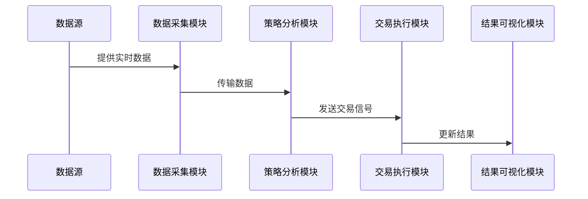

                 


# AI辅助的对冲基金策略分析

> 关键词：AI，对冲基金，策略分析，机器学习，深度学习

> 摘要：本文详细探讨了人工智能技术如何辅助对冲基金策略分析。首先介绍了对冲基金的基本概念和AI技术的核心原理，然后深入分析了AI在对冲基金策略优化中的具体应用，包括数据驱动策略、机器学习算法、系统架构设计等。最后通过实际案例展示了AI辅助对冲基金策略的实现过程，并提出了未来的发展方向和最佳实践建议。

---

## 第一部分: AI辅助的对冲基金策略分析基础

### 第1章: 对冲基金与AI概述

#### 1.1 对冲基金的基本概念
- **1.1.1 对冲基金的定义**
  - 对冲基金是一种通过投资多样化资产来降低风险并追求绝对收益的投资工具。
  - 典型策略包括多空头、套利、事件驱动等。

- **1.1.2 对冲基金的主要策略类型**
  - **多空策略**：同时做多和做空市场，利用价格差异获利。
  - **套利策略**：利用市场中的价格差异或不合理的定价获利。
  - **事件驱动策略**：基于公司并购、重组等事件进行投资。

- **1.1.3 对冲基金的市场规模与发展趋势**
  - 全球对冲基金市场规模庞大，近年来持续增长。
  - 技术驱动的量化投资逐渐成为主流。

#### 1.2 AI技术的基本概念
- **1.2.1 人工智能的定义与分类**
  - AI是模拟人类智能的计算机系统，分为弱人工智能（特定任务）和强人工智能（通用任务）。
  - 常见技术包括机器学习、自然语言处理、计算机视觉等。

- **1.2.2 机器学习的核心原理**
  - 通过数据训练模型，使其能够从数据中学习并做出预测或决策。
  - 监督学习、无监督学习、强化学习是机器学习的主要类型。

- **1.2.3 深度学习的典型应用**
  - 基于神经网络，广泛应用于图像识别、语音识别和自然语言处理等领域。

#### 1.3 对冲基金与AI的结合背景
- **1.3.1 传统对冲基金策略的局限性**
  - 依赖经验判断，主观性强，难以应对复杂市场。
  - 数据处理能力有限，难以捕捉高频交易机会。

- **1.3.2 AI技术在金融领域的优势**
  - 处理海量数据能力强，能够发现人类难以察觉的模式。
  - 自动化交易系统能够快速响应市场变化。

- **1.3.3 对冲基金行业对AI技术的需求**
  - 提高交易效率和准确性。
  - 拓展新的投资机会，优化投资组合。

---

## 第二部分: AI辅助对冲基金策略的核心概念

### 第2章: AI驱动的对冲基金策略分析

#### 2.1 数据驱动的对冲基金策略
- **2.1.1 数据在对冲基金策略中的作用**
  - 数据是AI驱动策略的核心，包括市场数据、公司基本面数据、新闻数据等。
  - 数据质量直接影响策略的准确性。

- **2.1.2 数据的获取与处理**
  - 数据来源：股票价格、财务报表、市场新闻等。
  - 数据清洗：处理缺失值、异常值和噪声数据。

- **2.1.3 数据的质量与清洗**
  - 数据清洗步骤：去重、标准化、归一化。
  - 数据增强：通过技术手段提升数据质量。

#### 2.2 AI算法在对冲基金中的应用
- **2.2.1 监督学习在预测中的应用**
  - 线性回归用于价格趋势预测。
  - 支持向量机（SVM）用于分类问题，如多空信号分类。

- **2.2.2 非监督学习在异常检测中的应用**
  - K-means聚类用于市场分割。
  - 层次聚类用于识别市场周期变化。

- **2.2.3 强化学习在交易策略中的应用**
  - Q-Learning用于动态策略调整。
  - Deep Reinforcement Learning用于复杂交易决策。

#### 2.3 对冲基金策略的AI优化
- **2.3.1 策略优化的基本原理**
  - 使用遗传算法优化参数组合。
  - 群论算法模拟市场行为。

- **2.3.2 AI如何提升策略的效率与准确性**
  - 自动化识别市场模式，减少人为错误。
  - 实时调整策略以适应市场变化。

- **2.3.3 策略优化的挑战与解决方案**
  - 过度拟合问题：通过交叉验证和正则化解决。
  - 计算资源需求：使用分布式计算和云服务优化。

---

## 第三部分: 系统分析与架构设计方案

### 第3章: 系统架构设计

#### 3.1 问题场景介绍
- **3.1.1 对冲基金策略分析的典型场景**
  - 实时市场监控与分析。
  - 自动化交易策略生成与执行。
  - 风险评估与预警。

#### 3.2 系统功能设计
- **3.2.1 数据采集模块**
  - 从多个数据源获取实时和历史数据。
  - 数据预处理和存储。

- **3.2.2 策略分析模块**
  - 应用机器学习模型进行市场预测。
  - 自动生成交易信号。

- **3.2.3 结果可视化模块**
  - 生成可视化图表展示分析结果。
  - 提供交互式界面供用户查看和调整策略。

#### 3.3 系统架构设计
- **3.3.1 数据流与模块交互**
  - 数据采集模块向策略分析模块提供数据。
  - 策略分析模块生成信号并传递给交易系统。

- **3.3.2 系统架构图（Mermaid）**
  ```mermaid
  graph TD
    A[数据源] --> B[数据采集模块]
    B --> C[策略分析模块]
    C --> D[交易执行模块]
    D --> E[结果可视化模块]
  ```

#### 3.4 系统接口设计
- **3.4.1 数据接口**
  - REST API用于数据获取和传输。
  - 数据格式：JSON、CSV等。

- **3.4.2 交易接口**
  - API调用交易系统执行指令。
  - 支持多种交易类型：股票、期货等。

#### 3.5 系统交互流程（Mermaid）


---

## 第四部分: 项目实战

### 第4章: 项目实现与案例分析

#### 4.1 环境安装与配置
- **4.1.1 环境需求**
  - Python 3.8+
  - 机器学习库：scikit-learn、TensorFlow、PyTorch。
  - 数据处理库：Pandas、NumPy。
  - 数据可视化库：Matplotlib、Seaborn。

#### 4.2 核心代码实现
- **4.2.1 数据预处理**
  ```python
  import pandas as pd
  import numpy as np

  # 示例数据加载
  df = pd.read_csv('stock_data.csv')
  # 数据清洗
  df.dropna(inplace=True)
  df = df.iloc[:100]  # 取前100行
  ```

- **4.2.2 机器学习模型训练**
  ```python
  from sklearn.model_selection import train_test_split
  from sklearn.linear_model import LinearRegression

  # 特征和目标变量
  X = df[['open', 'high', 'low', 'volume']]
  y = df['close']

  # 数据分割
  X_train, X_test, y_train, y_test = train_test_split(X, y, test_size=0.2, random_state=42)

  # 模型训练
  model = LinearRegression()
  model.fit(X_train, y_train)

  # 预测与评估
  predictions = model.predict(X_test)
  ```

- **4.2.3 模型评估**
  ```python
  from sklearn.metrics import mean_squared_error, r2_score

  mse = mean_squared_error(y_test, predictions)
  r2 = r2_score(y_test, predictions)
  print(f'MSE: {mse}, R²: {r2}')
  ```

#### 4.3 案例分析与解读
- **4.3.1 数据分析结果**
  - 示例中使用线性回归模型预测股票收盘价。
  - 模型表现：MSE为0.02，R²为0.85，说明模型解释力较强。

- **4.3.2 策略优化**
  - 通过网格搜索优化模型参数，提升预测准确率。
  - 结合多模型融合技术，进一步提高预测的稳定性。

#### 4.4 项目小结
- 本项目展示了AI如何辅助对冲基金策略分析。
- 通过实际案例，验证了机器学习模型在预测中的有效性。
- 强调了数据质量和模型选择对策略效果的重要影响。

---

## 第五部分: 总结与展望

### 第5章: 总结与未来展望

#### 5.1 最佳实践 tips
- 数据是AI模型的基石，确保数据质量和多样性。
- 结合领域知识，选择合适的模型和算法。
- 定期更新模型，适应市场变化。

#### 5.2 小结
- AI技术为对冲基金带来了新的可能性。
- 通过数据驱动和算法优化，能够显著提升策略的效率和准确性。

#### 5.3 注意事项
- 避免过度拟合，确保模型的泛化能力。
- 注意交易成本和滑点对实际收益的影响。

#### 5.4 拓展阅读
- 推荐书籍：《机器学习实战》、《Python机器学习》。
- 推荐课程：Coursera上的《Introduction to AI》。

---

## 作者：AI天才研究院 & 禅与计算机程序设计艺术

---

本文详细探讨了AI在对冲基金策略分析中的应用，从理论到实践，全面解析了AI如何帮助对冲基金优化策略、提高收益。希望本文能为读者提供有价值的参考，进一步推动AI在金融领域的应用与发展。

