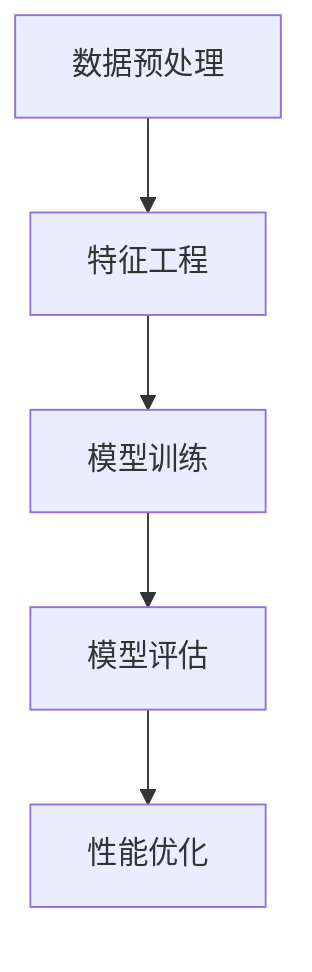
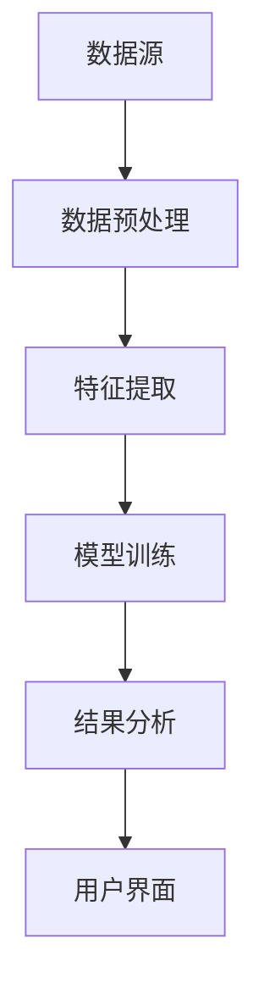

                 


# AI辅助的对冲基金策略分类与分析

> 关键词：对冲基金，AI辅助，策略分类，金融数据分析，机器学习算法

> 摘要：本文探讨了人工智能在对冲基金策略分类中的应用，分析了常见的对冲基金策略类型，并详细介绍了基于机器学习算法的分类方法。通过构建系统化的分析框架，文章展示了如何利用AI技术提升对冲基金策略的分类与分析效率，同时结合实际案例，深入分析了系统架构设计和项目实现的细节。

---

## 第一部分: AI与对冲基金的结合

### 第1章: AI与对冲基金的背景与概述

#### 1.1 对冲基金的基本概念

- **1.1.1 对冲基金的定义与特点**
  对冲基金是一种通过做多和做空相结合的投资工具，旨在通过市场中性策略降低风险并获取超额收益。其特点包括杠杆使用、多样化投资策略、灵活的资产配置等。

- **1.1.2 对冲基金的主要策略类型**
  常见的对冲基金策略包括股票多空、债券策略、多因子策略、统计套利和量化对冲等。

- **1.1.3 对冲基金的市场规模与发展趋势**
  近年来，对冲基金市场规模持续增长，量化和AI驱动的策略逐渐成为主流。

#### 1.2 AI在金融领域的应用现状

- **1.2.1 AI在金融领域的核心应用**
  AI在金融领域的应用包括算法交易、风险管理、客户画像、欺诈检测等。

- **1.2.2 AI在对冲基金中的潜在价值**
  AI可以帮助对冲基金优化投资决策、提高交易效率、降低风险。

- **1.2.3 当前AI对冲基金的主要挑战**
  数据质量、模型解释性、计算资源等是当前AI对冲基金面临的挑战。

#### 1.3 本章小结
本章介绍了对冲基金的基本概念及其策略类型，并探讨了AI在对冲基金中的应用及其面临的挑战。

---

### 第2章: 对冲基金策略的分类与分析框架

#### 2.1 对冲基金策略的主要分类

- **2.1.1 股票多空策略**
  通过买入低估股票并卖出高估股票，利用股价差异获利。

- **2.1.2 债券策略**
  利用债券市场的价格波动进行套利或长期投资。

- **2.1.3 多因子策略**
  基于多个因子（如市值、价值、动量）构建投资组合，分散风险。

- **2.1.4 统计套利策略**
  利用市场短期失衡进行套利，如配对交易策略。

- **2.1.5 量化对冲策略**
  使用量化模型进行高频交易，捕捉市场微小波动。

#### 2.2 对冲基金策略的分析框架

- **2.2.1 策略收益来源的分解**
  分析策略收益的来源，如alpha收益和beta收益。

- **2.2.2 策略风险的量化与管理**
  通过VaR、回撤等指标量化策略风险，并制定风险管理措施。

- **2.2.3 策略的可解释性与透明度**
  确保策略的透明度，便于投资者理解和监管。

#### 2.3 本章小结
本章详细介绍了对冲基金的主要策略类型，并构建了策略分析的框架，为后续AI辅助分类奠定了基础。

---

### 第3章: AI辅助对冲基金策略分类的核心概念

#### 3.1 AI在对冲基金策略分类中的作用

- **3.1.1 AI在策略识别中的优势**
  AI能够处理海量数据，发现非线性关系，识别隐含模式。

- **3.1.2 AI在策略优化中的应用**
  利用机器学习优化策略参数，提高策略收益和风险调整后的收益。

- **3.1.3 AI在策略组合中的价值**
  通过AI辅助构建最优投资组合，分散风险并提高收益。

#### 3.2 对冲基金策略分类的核心要素

- **3.2.1 数据特征的提取与选择**
  数据预处理、特征选择、特征工程是关键步骤。

- **3.2.2 策略标签的构建与标注**
  根据策略类型构建标签，确保数据的可分类性。

- **3.2.3 分类模型的训练与评估**
  使用合适的机器学习算法训练模型，并通过验证集评估模型性能。

#### 3.3 策略分类与AI模型的关系

- **3.3.1 模型选择与策略适用性**
  不同模型适用于不同类型的策略分类任务。

- **3.3.2 模型的可解释性与策略调整**
  可解释性差的模型难以用于策略调整和优化。

- **3.3.3 模型的泛化能力与策略风险**
  模型的泛化能力影响策略在不同市场环境下的表现。

#### 3.4 本章小结
本章探讨了AI在对冲基金策略分类中的作用，并分析了策略分类的核心要素及其与AI模型的关系。

---

### 第4章: AI辅助对冲基金策略分类的算法原理

#### 4.1 常见的分类算法与原理

- **4.1.1 线性模型：逻辑回归与支持向量机**
  逻辑回归适合二分类问题，支持向量机适用于高维数据。

- **4.1.2 树模型：决策树与随机森林**
  决策树适用于可解释性要求高的场景，随机森林通过集成提升性能。

- **4.1.3 集成模型：梯度提升树与堆叠模型**
  梯度提升树（如XGBoost、LightGBM）适合复杂分类任务，堆叠模型通过多层模型提升性能。

- **4.1.4 神经网络与深度学习模型**
  深度学习模型在处理非结构化数据和复杂模式识别中表现优异。

#### 4.2 基于特征的分类算法实现

- **4.2.1 数据预处理与特征工程**
  数据清洗、特征选择、特征变换（如标准化、正则化）是关键步骤。

- **4.2.2 分类模型的训练与调优**
  使用交叉验证调整模型参数，优化模型性能。

- **4.2.3 模型评估与性能优化**
  通过准确率、召回率、F1分数等指标评估模型性能，使用网格搜索或随机搜索优化模型。

#### 4.3 算法流程图（Mermaid）



#### 4.4 本章小结
本章详细介绍了常见的分类算法及其在对冲基金策略分类中的应用，并展示了算法实现的流程。

---

### 第5章: 对冲基金策略分类的系统架构设计

#### 5.1 系统功能设计

- **5.1.1 数据采集模块**
  采集金融市场数据，包括股票价格、债券收益率、宏观经济指标等。

- **5.1.2 特征提取模块**
  对数据进行特征提取，生成可用于分类的特征向量。

- **5.1.3 模型训练模块**
  使用训练数据训练分类模型，优化模型参数。

- **5.1.4 结果分析模块**
  对模型输出的结果进行分析，生成可读报告。

#### 5.2 系统架构图（Mermaid）



#### 5.3 本章小结
本章设计了对冲基金策略分类系统的功能模块和架构，展示了系统的整体流程。

---

### 第6章: 项目实战与总结

#### 6.1 项目背景与目标

- **项目背景**
  随着市场复杂化，传统策略分类方法效率低下，AI辅助分类成为趋势。

- **项目目标**
  构建一个基于机器学习的对冲基金策略分类系统，实现对策略的自动分类与分析。

#### 6.2 环境安装与配置

- **安装Python**
  ```bash
  python --version
  ```

- **安装机器学习库**
  ```bash
  pip install scikit-learn xgboost tensorflow pandas numpy
  ```

#### 6.3 核心实现源代码

```python
import pandas as pd
import numpy as np
from sklearn.model_selection import train_test_split
from sklearn.ensemble import RandomForestClassifier
from sklearn.metrics import accuracy_score

# 加载数据
data = pd.read_csv('fund_strategy.csv')

# 数据预处理
data = data.dropna()
X = data.drop('strategy_type', axis=1)
y = data['strategy_type']

# 分割数据
X_train, X_test, y_train, y_test = train_test_split(X, y, test_size=0.2)

# 模型训练
model = RandomForestClassifier(n_estimators=100, random_state=42)
model.fit(X_train, y_train)

# 模型评估
y_pred = model.predict(X_test)
print("Accuracy:", accuracy_score(y_test, y_pred))
```

#### 6.4 代码实现解读与案例分析

- **代码实现解读**
  代码实现了一个随机森林分类器，从数据加载到模型训练再到结果评估，展示了完整的分类流程。

- **案例分析**
  使用真实数据集，训练模型并评估其准确性，分析不同策略类型在模型中的表现。

#### 6.5 项目总结与未来展望

- **项目总结**
  成功构建了一个基于AI的对冲基金策略分类系统，能够高效分类和分析策略类型。

- **未来展望**
  结合更多数据源，优化模型性能，探索更复杂的算法，如深度学习模型。

---

## 作者：AI天才研究院/AI Genius Institute & 禅与计算机程序设计艺术 /Zen And The Art of Computer Programming

---

这篇文章系统地介绍了AI在对冲基金策略分类中的应用，从背景、分类方法到系统实现，层层深入，结合实际案例，为读者提供了全面的指导和实用的见解。希望这篇文章能够帮助读者更好地理解AI在金融领域的潜力和应用。

