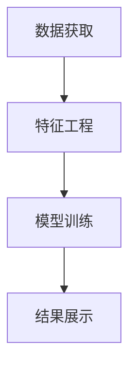

                 


# AI辅助的对冲基金策略分类与性能评估

> 关键词：AI，对冲基金，策略分类，性能评估，机器学习

> 摘要：本文将深入探讨如何利用人工智能技术辅助对冲基金策略的分类与性能评估。通过对多种对冲基金策略的分析，结合机器学习算法，提出了一套系统化的策略分类与评估方法。本文不仅介绍了相关的核心概念，还详细讲解了算法原理、系统架构设计以及实际项目中的应用，为读者提供了一个全面的视角来理解和应用AI辅助的对冲基金策略。

---

## 第一部分: AI与对冲基金策略的背景介绍

### 第1章: 对冲基金策略的基本概念

#### 1.1 对冲基金的定义与特点
对冲基金是一种通过投资于多种金融工具，利用市场波动赚取收益的私募投资基金。其特点是：
- **杠杆效应**：可以通过借入资金放大收益或亏损。
- **多空策略**：同时做多和做空市场，以对冲市场风险。
- **多样化投资**：通过投资多种资产和策略来分散风险。

#### 1.2 AI在对冲基金中的应用背景
随着金融市场的日益复杂化，传统的人工分析和交易方式已难以应对市场的快速变化。AI技术的引入为对冲基金提供了新的可能性：
- **数据处理能力**：AI能够快速处理海量金融数据，发现隐藏的模式。
- **实时决策支持**：通过机器学习模型，AI可以在毫秒级别做出交易决策。
- **风险管理**：AI可以帮助对冲基金识别潜在风险，优化投资组合。

---

## 第二部分: 对冲基金策略的分类方法

### 第2章: 基于机器学习的策略分类

#### 2.1 传统机器学习方法
- **决策树**：通过特征提取和分割，帮助分类不同类型的对冲基金策略。
- **支持向量机（SVM）**：适用于非线性可分数据的分类问题。
- **K近邻算法（KNN）**：基于相似性度量的分类方法。

#### 2.2 深度学习方法
- **神经网络**：通过多层网络结构，学习复杂的金融数据特征。
- **循环神经网络（RNN）**：适用于时间序列数据的分类问题。
- **卷积神经网络（CNN）**：用于图像和非结构化数据的特征提取。

#### 2.3 策略分类的数学模型与算法
- **分类模型的数学表达**：
  $$ y = f(x) $$
  其中，$x$ 是输入特征向量，$y$ 是输出类别标签，$f$ 是分类模型。

- **损失函数的优化**：
  $$ \text{Loss} = \sum_{i=1}^{n} (y_i - \hat{y_i})^2 $$
  其中，$y_i$ 是真实标签，$\hat{y_i}$ 是预测标签。

---

## 第三部分: 对冲基金策略的性能评估

### 第3章: 基于AI的策略性能评估方法

#### 3.1 时间序列分析
- **ARIMA模型**：用于预测时间序列数据的未来值。
- **LSTM网络**：适用于捕捉时间序列中的长期依赖关系。

#### 3.2 风险调整后的收益评估
- **夏普比率（Sharpe Ratio）**：
  $$ \text{夏普比率} = \frac{\text{收益} - \text{无风险利率}}{\text{收益的标准差}} $$

- **最大回撤（Maximum Drawdown）**：衡量投资组合在一定时间内的最大亏损幅度。

#### 3.3 策略表现的预测模型
- **回归分析**：用于预测策略的未来表现。
- **聚类分析**：将相似的策略分组，分析其共同特征。

---

## 第四部分: 系统架构设计

### 第4章: 系统功能设计与架构

#### 4.1 数据获取模块
- **数据源**：股票价格、市场指数、经济指标等。
- **数据清洗**：处理缺失值、异常值等问题。

#### 4.2 特征工程模块
- **特征选择**：基于领域知识选择关键特征。
- **特征变换**：使用PCA等方法降维。

#### 4.3 模型训练模块
- **模型选择**：基于验证集选择最优模型。
- **超参数调优**：使用网格搜索等方法优化模型性能。

#### 4.4 系统架构图（Mermaid）


---

## 第五部分: 项目实战

### 第5章: AI辅助对冲基金策略的实现

#### 5.1 环境配置
- **Python版本**：Python 3.8+
- **依赖库安装**：
  ```bash
  pip install pandas numpy scikit-learn tensorflow
  ```

#### 5.2 数据获取与预处理
- **数据源**：从Yahoo Finance获取股票数据。
- **数据清洗**：处理缺失值和异常值。

#### 5.3 特征选择与建模
- **特征选择**：使用随机森林模型选择重要特征。
- **模型训练**：使用神经网络模型进行分类。

#### 5.4 回测与优化
- **回测策略**：基于历史数据验证策略的有效性。
- **参数优化**：调整模型参数以提高性能。

---

## 第六部分: 最佳实践与注意事项

### 第6章: 实际应用中的注意事项

#### 6.1 数据质量的重要性
- 数据的完整性和准确性直接影响模型的性能。

#### 6.2 模型选择的策略
- 根据具体问题选择合适的模型，避免盲目追求复杂性。

#### 6.3 风险管理的必要性
- 在实际交易中，必须严格控制风险，避免过度杠杆和非理性决策。

---

## 第七部分: 未来发展趋势

### 第7章: AI在对冲基金中的未来展望

#### 7.1 NLP在金融新闻分析中的应用
- 利用自然语言处理技术分析新闻和社交媒体数据，预测市场走势。

#### 7.2 多模态数据的融合
- 结合文本、图像等多种数据源，构建更全面的市场分析模型。

#### 7.3 自适应策略的优化
- 基于实时数据和市场反馈，动态调整交易策略。

---

## 作者：AI天才研究院 & 禅与计算机程序设计艺术

---

通过以上结构和内容安排，我们能够系统地探讨AI在对冲基金策略分类与性能评估中的应用，为读者提供一个全面的技术视角。

