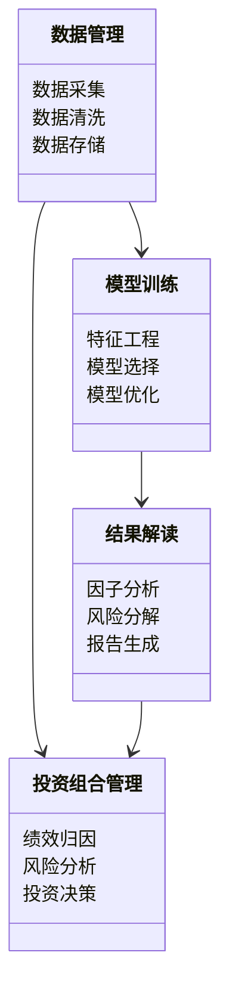
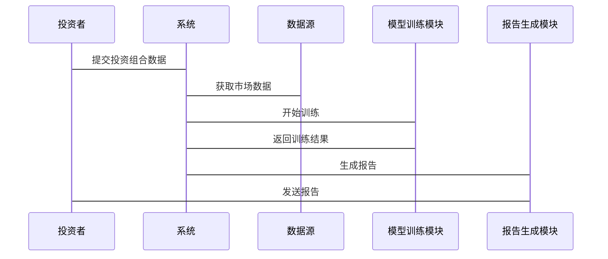

                 


# AI辅助的对冲基金绩效归因

## 关键词：对冲基金，绩效归因，人工智能，因子模型，机器学习

## 摘要：本文探讨了AI在对冲基金绩效归因中的应用，分析了传统方法的局限性，介绍了AI技术如何提升绩效归因的准确性和效率，详细讲解了因子模型、机器学习算法及系统架构，并通过实际案例展示了AI辅助下的绩效归因过程，最后总结了最佳实践和未来发展方向。

---

# 第一部分: AI辅助的对冲基金绩效归因基础

## 第1章: 对冲基金与绩效归因概述

### 1.1 对冲基金的基本概念

#### 1.1.1 对冲基金的定义与特点
对冲基金是一种通过做空和做多相结合的投资工具，旨在通过市场中性策略获取超额收益。其特点包括杠杆使用、多样化投资策略、高风险高回报等。

#### 1.1.2 对冲基金的主要策略类型
- 股票多空策略
- 债券策略
- 大宗商品策略
- 量化对冲策略

#### 1.1.3 对冲基金在金融市场的角色
对冲基金通过复杂的金融工具和策略，帮助投资者在不同市场环境下实现收益最大化，同时降低风险。

### 1.2 绩效归因的定义与重要性

#### 1.2.1 绩效归因的定义
绩效归因是将投资组合的收益分解为各个因素或资产的贡献，以识别收益来源和风险敞口。

#### 1.2.2 绩效归因在投资管理中的作用
绩效归因帮助投资者理解投资组合的表现，优化投资策略，提高透明度和责任感。

#### 1.2.3 绩效归因的常见方法
- 投资组合分解法
- 因子分析法
- 风险调整后收益法

### 1.3 AI在金融领域的应用背景

#### 1.3.1 AI在金融分析中的应用
AI通过自然语言处理、机器学习等技术，分析市场数据、预测价格走势、识别投资机会。

#### 1.3.2 AI在投资组合管理中的作用
AI辅助投资组合优化、风险管理和绩效评估，提升投资效率和收益。

#### 1.3.3 AI在绩效归因中的潜力
AI能够处理海量数据，发现复杂模式，提高绩效归因的准确性和效率。

### 1.4 本章小结
本章介绍了对冲基金的基本概念及其在金融市场中的角色，详细阐述了绩效归因的定义、重要性及常见方法，同时探讨了AI在金融领域的应用背景及其在绩效归因中的潜力。

---

## 第2章: 对冲基金绩效归因的核心概念

### 2.1 绩效归因的基本原理

#### 2.1.1 绩效归因的数学模型
绩效归因的数学模型通常涉及回归分析、因子分解等方法，用于量化各因素对投资组合收益的贡献。

#### 2.1.2 绩效归因的关键因素
- 市场风险
- 特定风险
- 时间序列分析

#### 2.1.3 绩效归因的边界与外延
绩效归因的边界在于其假设的有效性和数据的限制，外延则涉及对冲基金策略的多样化。

### 2.2 对冲基金绩效归因的核心要素

#### 2.2.1 投资组合的构成
投资组合由多种资产和策略构成，每个资产和策略对整体收益的贡献需单独分析。

#### 2.2.2 市场风险与特定风险
市场风险是投资组合整体面临的系统性风险，特定风险是因个别资产或策略产生的非系统性风险。

#### 2.2.3 时间序列分析的重要性
时间序列分析帮助识别投资组合收益的时间模式，为绩效归因提供动态视角。

### 2.3 AI辅助绩效归因的实现逻辑

#### 2.3.1 数据采集与预处理
AI系统首先收集市场数据、投资组合构成等信息，进行清洗和标准化处理。

#### 2.3.2 模型选择与训练
基于预处理的数据，选择合适的机器学习模型（如随机森林、神经网络）进行训练。

#### 2.3.3 结果解释与反馈
模型输出各因素对投资组合收益的贡献度，结合业务知识进行解释，并反馈优化模型。

### 2.4 本章小结
本章详细阐述了绩效归因的基本原理、关键因素及核心要素，同时探讨了AI在绩效归因中的实现逻辑，为后续章节奠定了基础。

---

## 第3章: 对冲基金绩效归因的核心概念与联系

### 3.1 因子模型的原理与应用

#### 3.1.1 因子模型的定义
因子模型将资产收益分解为多个因子的线性组合，常用CAPM、APT等模型。

#### 3.1.2 常见因子模型的对比
- 单因子模型：基于单一因子（如市值）解释收益。
- 多因子模型：结合多个因子（如市值、价值）提升解释能力。

#### 3.1.3 因子模型在绩效归因中的作用
因子模型帮助识别投资组合收益中各因子的贡献，优化投资策略。

### 3.2 风险中性组合的构建

#### 3.2.1 风险中性组合的定义
风险中性组合是通过调整投资权重，使组合的风险敞口为零，专注于收益来源。

#### 3.2.2 风险中性组合的构建方法
- 基于因子模型构建组合
- 优化算法求解组合权重

#### 3.2.3 风险中性组合在绩效归因中的应用
通过风险中性组合，识别投资组合中超出市场收益的部分，即alpha收益。

### 3.3 机器学习模型在绩效归因中的应用

#### 3.3.1 常见机器学习算法在绩效归因中的应用
- 线性回归：用于因子分析
- 随机森林：识别重要因子
- 神经网络：捕捉非线性关系

#### 3.3.2 机器学习模型的优势与挑战
优势：高维度数据处理能力强，非线性关系识别准确；挑战：模型解释性差，数据依赖性强。

#### 3.3.3 机器学习模型的可解释性问题
通过特征重要性分析、局部可解释性模型提升模型解释性。

### 3.4 核心概念对比表

| 概念                | 传统因子模型         | 机器学习模型       |
|---------------------|--------------------|-------------------|
| 建模方式            | 线性回归             | 非线性方法         |
| 解释性              | 高                 | 低               |
| 适用场景            | 单一因子分析         | 多因子复杂场景     |

### 3.5 本章小结
本章对比了因子模型和机器学习模型在绩效归因中的应用，强调了AI技术在复杂场景中的优势，同时指出了模型解释性的重要性。

---

## 第4章: 对冲基金绩效归因的算法原理

### 4.1 多元回归模型

#### 4.1.1 多元回归模型的数学公式
$$ Y = \beta_0 + \beta_1 X_1 + \beta_2 X_2 + \dots + \beta_n X_n + \epsilon $$

其中，$Y$ 是投资组合收益，$X_i$ 是各因子，$\beta_i$ 是回归系数，$\epsilon$ 是误差项。

#### 4.1.2 多元回归模型的应用步骤
1. 数据准备：收集相关因子数据
2. 模型训练：使用最小二乘法估计回归系数
3. 模型验证：检验模型显著性、拟合优度等

#### 4.1.3 多元回归模型的优缺点
优点：简单易懂，适合线性关系；缺点：忽视非线性关系，模型解释性受限。

### 4.2 机器学习算法在绩效归因中的应用

#### 4.2.1 随机森林算法

##### 4.2.1.1 随机森林算法的原理
随机森林通过构建多棵决策树并行投票机制进行预测，具有高准确性和鲁棒性。

##### 4.2.1.2 随机森林在绩效归因中的应用
用于识别重要因子，评估各因子对投资组合收益的贡献。

##### 4.2.1.3 随机森林算法的实现步骤
1. 数据分割：训练集和测试集
2. 模型训练：构建多棵决策树
3. 特征重要性分析：识别关键因子

#### 4.2.2 神经网络算法

##### 4.2.2.1 神经网络算法的原理
神经网络通过多层非线性变换，捕捉数据中的复杂模式。

##### 4.2.2.2 神经网络在绩效归因中的应用
用于预测收益、识别隐含因子关系。

##### 4.2.2.3 神经网络算法的实现步骤
1. 数据预处理：归一化、缺失值处理
2. 模型构建：定义网络结构、选择激活函数
3. 模型训练：使用反向传播算法优化权重

### 4.3 算法选择与优化

#### 4.3.1 算法选择的考虑因素
- 数据特性：线性或非线性
- 解释性需求：是否需要可解释性
- 计算资源：模型复杂度与计算能力

#### 4.3.2 算法优化策略
- 调参：选择最佳超参数
- 正则化：防止过拟合
- 集成学习：结合多种算法提升性能

### 4.4 本章小结
本章详细介绍了多元回归和机器学习算法在绩效归因中的应用，探讨了算法选择与优化策略，为实际应用提供了指导。

---

## 第5章: 对冲基金绩效归因的系统分析与架构设计

### 5.1 问题场景介绍

#### 5.1.1 项目背景
某对冲基金希望通过AI技术提升绩效归因的效率和准确性。

#### 5.1.2 项目目标
构建AI辅助的绩效归因系统，实现自动化数据处理、模型训练和结果解读。

### 5.2 系统功能设计

#### 5.2.1 领域模型


#### 5.2.2 系统架构设计


#### 5.2.3 系统接口设计
- 数据接口：数据采集、清洗
- 模型接口：训练、预测
- 报告接口：生成、输出

#### 5.2.4 系统交互流程


### 5.3 本章小结
本章从系统角度分析了对冲基金绩效归因的需求，设计了系统架构和交互流程，为后续实现奠定了基础。

---

## 第6章: 对冲基金绩效归因的项目实战

### 6.1 环境安装与数据准备

#### 6.1.1 环境安装
安装Python、机器学习库（如scikit-learn、xgboost）和数据分析工具（如Pandas、NumPy）。

#### 6.1.2 数据准备
收集对冲基金的投资组合数据和市场数据，进行清洗和预处理。

### 6.2 系统核心实现

#### 6.2.1 数据预处理代码
```python
import pandas as pd
import numpy as np

# 数据加载
data = pd.read_csv('portfolio.csv')

# 数据清洗
data.dropna(inplace=True)
data = data[~data['return'].isin([np.nan, None])]
```

#### 6.2.2 模型训练代码
```python
from sklearn.ensemble import RandomForestRegressor
from sklearn.model_selection import train_test_split

# 数据分割
X = data.drop('return', axis=1)
y = data['return']
X_train, X_test, y_train, y_test = train_test_split(X, y, test_size=0.2)

# 模型训练
model = RandomForestRegressor(n_estimators=100)
model.fit(X_train, y_train)
```

#### 6.2.3 结果解读代码
```python
importances = model.feature_importances_
indices = np.argsort(importances)[::-1]

for i in range(len(importances)):
    print(f"Feature {indices[i]}: {importances[indices[i]]}")
```

### 6.3 案例分析与实际应用

#### 6.3.1 案例分析
某对冲基金投资组合，通过随机森林模型识别出市值因子和价值因子对收益贡献最大。

#### 6.3.2 实际应用
模型帮助投资经理优化投资策略，调整资产配置，降低特定风险。

### 6.4 本章小结
本章通过实际案例展示了AI辅助绩效归因的实现过程，从数据准备到模型训练，再到结果解读，详细讲解了每个步骤的具体操作。

---

## 第7章: 对冲基金绩效归因的最佳实践与总结

### 7.1 最佳实践

#### 7.1.1 数据质量的重要性
确保数据准确、完整，避免偏差。

#### 7.1.2 模型选择的灵活性
根据具体场景选择合适的算法，避免盲目追求复杂模型。

#### 7.1.3 结果解释的可操作性
模型输出需具有实际指导意义，便于投资决策。

### 7.2 本章小结

通过对冲基金绩效归因的实践，AI技术显著提升了分析效率和准确性，为投资经理提供了有力工具。

### 7.3 注意事项

- 数据隐私与安全
- 模型解释性
- 技术与业务的结合

### 7.4 拓展阅读

推荐阅读以下书籍和论文：
- 《机器学习实战》
- 《量化投资：对冲基金的数学解释》
- “Deep Learning for Portfolio Construction and Risk Management”

---

# 作者：AI天才研究院/AI Genius Institute & 禅与计算机程序设计艺术 /Zen And The Art of Computer Programming

