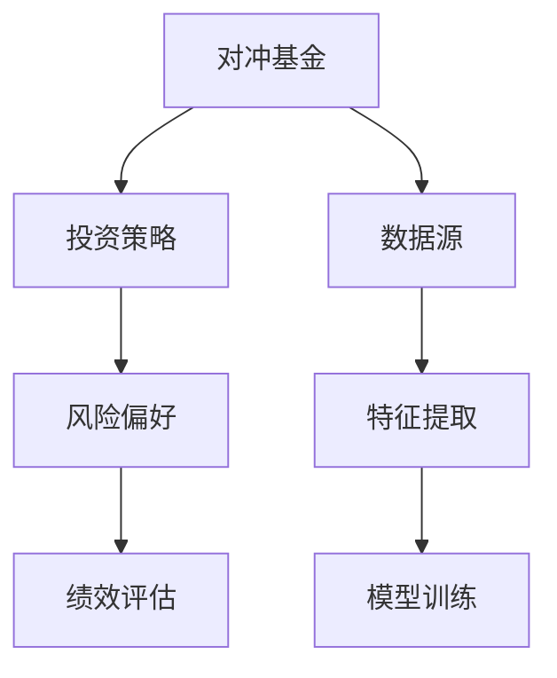
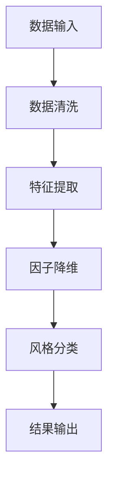

                 


# AI辅助的对冲基金风格分析

**关键词：**AI技术、对冲基金、风格分析、机器学习、投资策略、风险评估、数据挖掘

**摘要：**  
随着金融市场的日益复杂化和数据化，对冲基金的风格分析变得愈发重要。通过对冲基金的风格分析，投资者可以更好地理解不同基金的投资策略、风险偏好和绩效表现。本文将从AI技术的角度，系统地探讨对冲基金风格分析的核心概念、算法原理、系统架构设计以及实际应用。文章结合理论与实践，详细分析了如何利用AI技术辅助对冲基金的风格分析，并提供了具体的案例和代码实现，帮助读者全面掌握这一领域的最新动态和技术要点。

---

## 目录

1. [对冲基金与AI辅助分析的背景介绍](#对冲基金与AI辅助分析的背景介绍)
   - 1.1 对冲基金的基本概念
   - 1.2 AI在金融领域的应用背景
   - 1.3 对冲基金风格分析的定义与意义

2. [对冲基金风格分析的核心概念与联系](#对冲基金风格分析的核心概念与联系)
   - 2.1 风格分析的关键要素
   - 2.2 AI辅助风格分析的原理
   - 2.3 核心概念的ER实体关系图

3. [对冲基金风格分析的算法原理](#对冲基金风格分析的算法原理)
   - 3.1 基于因子模型的风格分析
   - 3.2 基于聚类算法的风格识别
   - 3.3 算法流程图与数学模型

4. [对冲基金风格分析的系统架构设计](#对冲基金风格分析的系统架构设计)
   - 4.1 问题场景介绍
   - 4.2 系统功能设计
   - 4.3 系统架构设计
   - 4.4 系统接口设计

5. [对冲基金风格分析的项目实战](#对冲基金风格分析的项目实战)
   - 5.1 项目背景与目标
   - 5.2 数据采集与预处理
   - 5.3 特征提取与模型训练
   - 5.4 实际案例分析

6. [总结与展望](#总结与展望)

---

## 1. 对冲基金与AI辅助分析的背景介绍

### 1.1 对冲基金的基本概念

#### 1.1.1 对冲基金的定义
对冲基金是一种通过利用市场波动、套利机会和资产定价 inefficiency 来获取超额收益的投资工具。与传统共同基金不同，对冲基金通常采用多空策略，既做多也做空，以降低市场风险并实现绝对收益。

#### 1.1.2 对冲基金的主要策略类型
对冲基金的策略多种多样，主要包括：
- **股票多空策略**：通过买入低估股票和卖空高估股票获利。
- **股指期货套利**：利用股指期货与现货市场的价差进行套利。
- **债券多空策略**：通过买卖债券或利用债券价格波动获利。
- **全球宏观策略**：基于全球经济走势进行跨市场投资。

#### 1.1.3 对冲基金行业的现状与发展趋势
近年来，对冲基金行业呈现出快速发展的态势，尤其是在量化投资和AI技术的推动下，对冲基金的策略越来越依赖数据驱动的方法。然而，行业也面临着市场波动加剧、监管趋严和竞争加剧等挑战。

---

### 1.2 AI在金融领域的应用背景

#### 1.2.1 AI技术在金融行业的应用现状
AI技术在金融领域的应用日益广泛，包括股票预测、风险评估、交易自动化、客户画像等方面。对冲基金作为金融行业的核心组成部分，也在积极探索AI技术的应用。

#### 1.2.2 对冲基金领域引入AI技术的必要性
对冲基金的收益来源于市场中的套利机会，而这些机会往往短暂且难以预测。传统的基于经验的投资策略逐渐暴露出效率低、风险高的问题。AI技术的引入，可以显著提高对冲基金的投资效率和风险控制能力。

#### 1.2.3 AI辅助对冲基金风格分析的核心目标
通过对冲基金的历史业绩、投资策略和市场行为数据，AI技术可以帮助投资者识别和分类不同基金的风格特征，从而实现更精准的投资决策。

---

### 1.3 对冲基金风格分析的定义与意义

#### 1.3.1 对冲基金风格分析的定义
对冲基金风格分析是对基金的投资策略、风险偏好和绩效表现等特征进行系统性分析的过程。通过风格分析，可以将基金分为不同的类别，帮助投资者更好地理解基金的运作逻辑。

#### 1.3.2 风格分析在对冲基金中的作用
- **分类与识别**：将基金按照投资策略、风险偏好等维度进行分类。
- **风险控制**：通过识别基金的风格特征，优化投资组合的风险管理。
- **绩效评估**：分析基金的绩效表现，为投资决策提供依据。

#### 1.3.3 AI辅助风格分析的优势与挑战
- **优势**：AI技术可以处理海量数据，发现传统方法难以察觉的模式和规律。
- **挑战**：数据质量和模型解释性是AI技术在金融领域应用的主要难点。

---

## 2. 对冲基金风格分析的核心概念与联系

### 2.1 风格分析的关键要素

#### 2.1.1 投资策略
投资策略是基金的核心特征之一。通过对冲基金的投资策略，可以判断其在市场中的定位和风险偏好。

#### 2.1.2 风险偏好
风险偏好反映了基金在投资过程中愿意承担的风险程度。高风险偏好的基金通常具有更高的收益潜力，但也伴随着更大的波动性。

#### 2.1.3 绩效表现
绩效表现是衡量基金投资能力的重要指标。通过分析基金的历史绩效，可以判断其在不同市场环境下的表现。

---

### 2.2 AI辅助风格分析的原理

#### 2.2.1 数据驱动的风格识别
通过对冲基金的历史交易数据和市场行为数据，AI技术可以提取出基金的风格特征。

#### 2.2.2 模型驱动的风格预测
利用机器学习模型，AI技术可以预测基金未来的风格表现。

#### 2.2.3 综合分析框架
AI辅助风格分析通常采用多维度数据和多种算法相结合的方式，构建一个综合的分析框架。

---

### 2.3 核心概念的ER实体关系图



---

## 3. 对冲基金风格分析的算法原理

### 3.1 基于因子模型的风格分析

#### 3.1.1 因子模型的基本原理
因子模型是一种将资产收益分解为多个因子线性组合的方法。常用因子包括市值、价值、动量等。

#### 3.1.2 基于因子模型的风格识别
通过对基金的收益数据进行因子分解，可以识别出其主要的投资策略和风格特征。

---

### 3.2 基于聚类算法的风格识别

#### 3.2.1 聚类算法的基本原理
聚类算法是一种无监督学习方法，用于将数据分成若干类别。在风格分析中，聚类算法可以将基金按照其风格特征进行分类。

#### 3.2.2 聚类算法的实现步骤
1. 数据预处理：标准化特征数据。
2. 确定聚类数目：使用肘部法则或轮廓系数等方法。
3. 聚类实现：采用K-means或层次聚类算法。
4. 聚类结果分析：对每个聚类进行解释和命名。

---

### 3.3 算法流程图



---

## 4. 对冲基金风格分析的系统架构设计

### 4.1 问题场景介绍

#### 4.1.1 对冲基金风格分析的典型场景
- 机构投资者需要对大量对冲基金进行分类和评估。
- 投资者希望根据市场环境调整投资组合。

---

### 4.2 系统功能设计

#### 4.2.1 数据采集
- 数据源包括对冲基金的历史业绩数据、市场数据和新闻数据。

#### 4.2.2 数据处理
- 数据清洗：处理缺失值和异常值。
- 特征提取：提取关键特征，如收益波动率、夏普比率等。

#### 4.2.3 模型训练
- 训练机器学习模型，实现风格分类和预测。

---

## 5. 对冲基金风格分析的项目实战

### 5.1 项目背景与目标
本项目旨在利用AI技术，对一组对冲基金进行风格分析，识别其投资策略和风险偏好。

---

### 5.2 数据采集与预处理

#### 5.2.1 数据来源
- 数据来源包括对冲基金的历史收益数据、市场指数数据等。

#### 5.2.2 数据清洗
```python
import pandas as pd

# 加载数据
data = pd.read_csv('hedge_fund_data.csv')

# 处理缺失值
data.dropna(inplace=True)

# 标准化数据
from sklearn.preprocessing import StandardScaler
scaler = StandardScaler()
data_scaled = pd.DataFrame(scaler.fit_transform(data), columns=data.columns)
```

---

### 5.3 特征提取与模型训练

#### 5.3.1 特征提取
```python
# 提取收益相关特征
features = data_scaled[['return', 'volatility', 'beta']]
```

#### 5.3.2 模型训练
```python
from sklearn.cluster import KMeans

# 训练聚类模型
model = KMeans(n_clusters=3, random_state=42)
model.fit(features)

# 预测聚类结果
predicted_clusters = model.predict(features)
```

---

### 5.4 实际案例分析
通过对实际数据的分析，我们可以将对冲基金分为不同类型，例如：
- **多头策略基金**：主要投资于低估股票。
- **空头策略基金**：主要投资于高估股票。

---

## 6. 总结与展望

通过对冲基金风格分析的系统性研究，我们可以更好地理解基金的投资策略和风险特征。未来，随着AI技术的不断发展，对冲基金的风格分析将更加精准和高效。建议读者深入学习相关算法和工具，以便在实际工作中更好地应用这些技术。

---

**作者：AI天才研究院/AI Genius Institute & 禅与计算机程序设计艺术 /Zen And The Art of Computer Programming**

