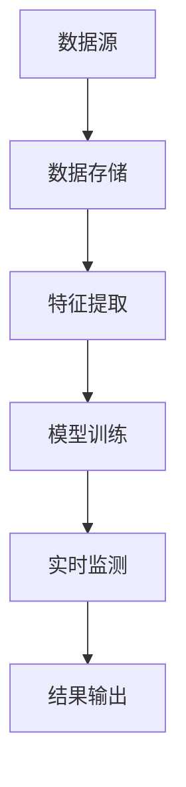

                 


# AI辅助的对冲基金风格漂移检测

> 关键词：对冲基金，风格漂移，人工智能，机器学习，深度学习

> 摘要：本文探讨了AI技术在对冲基金风格漂移检测中的应用，分析了风格漂移的定义、原因及其对投资组合的影响，介绍了基于机器学习和深度学习的风格漂移检测算法，并通过实际案例展示了AI辅助风格漂移检测的实现过程和效果。

---

# 第一部分: AI辅助的对冲基金风格漂移检测背景与概念

## 第1章: 对冲基金与风格漂移概述

### 1.1 对冲基金的基本概念

#### 1.1.1 对冲基金的定义与特点
对冲基金是一种通过多空头同时投资于金融资产，以对冲市场风险并追求绝对收益的投资工具。其特点包括：
- **多样化投资策略**：涵盖股票、债券、衍生品等多种资产。
- **杠杆使用**：通过杠杆放大收益或风险。
- **绝对收益目标**：追求独立于市场表现的收益。
- **风险对冲**：通过做多和做空相结合，降低市场风险。

#### 1.1.2 对冲基金的投资策略与类型
对冲基金的策略多种多样，主要包括：
- **股票多空策略**：通过买入低估股票和卖出高估股票获利。
- **套利策略**：利用资产价格差异进行无风险套利。
- **事件驱动策略**：基于公司并购、重组等事件进行投资。
- **宏观对冲策略**：基于宏观经济走势进行多空头操作。

#### 1.1.3 对冲基金在金融市场的角色与影响
对冲基金在金融市场中扮演着重要角色：
- 提供流动性，活跃市场交易。
- 通过套利行为促进价格合理化。
- 创新金融工具和交易策略，推动金融市场发展。

### 1.2 风格漂移的定义与问题背景

#### 1.2.1 风格漂移的定义
风格漂移是指对冲基金的实际投资策略偏离其初始设定的投资风格或策略的现象。这种漂移可能导致基金的风险收益特征发生变化，偏离投资者预期。

#### 1.2.2 风格漂移的产生原因
风格漂移的产生原因包括：
- **市场环境变化**：市场波动或经济周期变化导致策略调整。
- **管理人变更**：投资经理更换或团队变动影响策略执行。
- **业绩压力**：为应对短期业绩压力，管理人可能偏离原定策略。
- **成本控制**：为降低成本，可能简化或调整投资策略。

#### 1.2.3 风格漂移对投资组合的影响
风格漂移可能导致以下问题：
- **风险增加**：偏离原定策略可能增加市场风险。
- **收益波动**：策略偏离可能导致收益不稳定。
- **投资者信任损失**：风格漂移可能影响投资者信任，导致赎回压力。

#### 1.2.4 风格漂移的监管与风险
风格漂移的监管问题包括：
- **合规风险**：偏离投资策略可能违反监管规定。
- **透明度问题**：风格漂移可能导致信息披露不透明，增加监管难度。

---

## 第2章: 风格漂移检测的核心概念与技术

### 2.1 风格漂移检测的定义与目标

#### 2.1.1 风格漂移检测的目标
风格漂移检测的目标是：
- 监测对冲基金的实际投资策略是否偏离初始设定。
- 及时发现风格漂移，采取措施控制风险。

#### 2.1.2 风格漂移检测的指标与方法
常用的风格漂移检测指标包括：
- **收益波动性**：检测收益是否偏离预期。
- **风险敞口变化**：通过VaR（在险价值）或CVaR（条件在险价值）检测风险敞口变化。
- **因子分解法**：将基金收益分解为市场因子，检测因子暴露是否偏离初始设定。

### 2.2 AI在风格漂移检测中的作用

#### 2.2.1 AI技术在金融领域的应用现状
AI技术在金融领域的应用包括：
- **智能投顾**：通过AI提供个性化投资建议。
- **风险控制**：利用AI进行实时风险监控和预警。
- **算法交易**：基于AI算法进行高频交易。

#### 2.2.2 AI在风格漂移检测中的优势
AI在风格漂移检测中的优势包括：
- **数据处理能力强**：AI能够处理大量非结构化数据，提高检测准确性。
- **实时监测能力**：AI可以实时监测市场变化，及时发现风格漂移。
- **自适应性**：AI算法能够根据市场变化自适应调整检测模型。

#### 2.2.3 AI辅助风格漂移检测的实现路径
实现路径包括：
1. **数据采集**：收集对冲基金的历史交易数据和市场数据。
2. **特征提取**：提取与风格漂移相关的特征，如收益波动性、风险敞口变化等。
3. **模型训练**：训练机器学习模型，识别风格漂移模式。
4. **实时监测**：利用AI算法实时监测对冲基金的风格漂移情况。

---

## 第3章: 风格漂移检测的核心概念与联系

### 3.1 核心概念与原理

#### 3.1.1 风格漂移检测的数学模型
风格漂移检测的数学模型可以表示为：
$$
\text{风格漂移} = f(\text{投资组合}, \text{初始策略}, \text{市场环境})
$$
其中，$f$ 表示检测函数，$\text{投资组合}$ 表示当前投资组合，$\text{初始策略}$ 表示初始投资策略，$\text{市场环境}$ 表示当前市场环境。

#### 3.1.2 AI算法在风格漂移检测中的应用
AI算法在风格漂移检测中的应用包括：
- **监督学习**：用于分类风格漂移和非风格漂移情况。
- **无监督学习**：用于发现数据中的异常模式。
- **深度学习**：用于捕捉复杂非线性关系。

#### 3.1.3 数据特征与模型选择的关系
数据特征与模型选择的关系可以通过以下表格对比：

| 数据特征       | 监督学习模型 | 无监督学习模型 | 深度学习模型 |
|----------------|--------------|----------------|-------------|
| 收益波动性      | XGB          | DBSCAN        | CNN         |
| 风险敞口变化    | RF           | K-Means       | LSTM        |
| 因子暴露变化    | SVM          | GMM           | Transformer  |

### 3.2 核心概念对比与ER图分析

#### 3.2.1 风格漂移检测的关键特征对比
风格漂移检测的关键特征可以通过以下表格对比：

| 特征             | 优点               | 缺点               |
|------------------|--------------------|--------------------|
| 收益波动性        | 易计算             | 可能受市场波动影响   |
| 风险敞口变化      | 能捕捉系统性风险   | 可能忽略非系统性风险 |
| 因子暴露变化      | 能捕捉策略变化     | 需要复杂的因子模型   |

#### 3.2.2 数据特征与模型性能的ER实体关系图
以下是数据特征与模型性能的ER实体关系图：

```mermaid
erDiagram
    现金流表
    {
        id: int
        日期: date
        收益: float
    }
    风险敞口表
    {
        id: int
        日期: date
        风险值: float
    }
    投资组合表
    {
        id: int
        日期: date
        资产分配: string
    }
    关联关系:
        现金流表 --|> 风险敞口表: 每日风险数据
        投资组合表 --|> 风险敞口表: 投资组合风险敞口
```

---

## 第4章: 风格漂移检测的数学模型与公式

### 4.1 风格漂移检测的数学模型

#### 4.1.1 风格漂移检测的监督学习模型
监督学习模型的数学模型可以表示为：
$$
y = f(x) + \epsilon
$$
其中，$y$ 是标签（风格漂移或非风格漂移），$x$ 是输入特征，$\epsilon$ 是误差项。

#### 4.1.2 风格漂移检测的无监督学习模型
无监督学习模型的数学模型可以表示为：
$$
z = g(x)
$$
其中，$z$ 是潜在变量，$x$ 是输入特征，$g$ 是无监督学习模型。

---

## 第5章: 风格漂移检测的系统架构与实现

### 5.1 系统架构设计

#### 5.1.1 系统功能设计
系统功能设计包括：
- 数据采集模块：采集对冲基金的历史交易数据和市场数据。
- 特征提取模块：提取与风格漂移相关的特征。
- 模型训练模块：训练机器学习模型，识别风格漂移模式。
- 实时监测模块：实时监测对冲基金的风格漂移情况。

#### 5.1.2 系统架构图
以下是系统架构图：



---

## 第6章: 风格漂移检测的项目实战

### 6.1 项目环境安装

#### 6.1.1 安装Python环境
```bash
conda create -n aifund python=3.8
conda activate aifund
```

#### 6.1.2 安装依赖库
```bash
pip install numpy pandas scikit-learn tensorflow
```

### 6.2 系统核心实现源代码

#### 6.2.1 数据预处理代码
```python
import pandas as pd
import numpy as np

# 读取数据
data = pd.read_csv('fund_data.csv')

# 数据清洗
data = data.dropna()
```

#### 6.2.2 模型训练代码
```python
from sklearn.ensemble import RandomForestClassifier
from sklearn.metrics import accuracy_score

# 划分训练集和测试集
X_train, X_test, y_train, y_test = train_test_split(data.drop('label', axis=1), data['label'], test_size=0.2)

# 训练模型
model = RandomForestClassifier()
model.fit(X_train, y_train)

# 评估模型
y_pred = model.predict(X_test)
print("Accuracy:", accuracy_score(y_test, y_pred))
```

---

## 第7章: 总结与展望

### 7.1 总结
本文详细探讨了AI技术在对冲基金风格漂移检测中的应用，介绍了基于机器学习和深度学习的风格漂移检测算法，并通过实际案例展示了AI辅助风格漂移检测的实现过程和效果。

### 7.2 展望
未来，随着AI技术的不断发展，风格漂移检测将更加智能化和自动化。以下是几点展望：
1. **算法优化**：进一步优化机器学习和深度学习算法，提高检测准确性和效率。
2. **多模态数据融合**：结合文本、图像等多种数据源，提升风格漂移检测的全面性。
3. **实时监测**：实现实时风格漂移监测，及时发现和应对风格漂移风险。

---

# 作者：AI天才研究院 & 禅与计算机程序设计艺术

