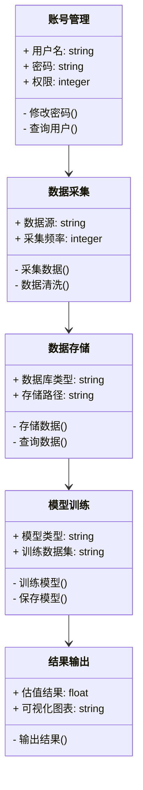

                 


# AI辅助的并购交易估值

## 关键词：AI, 并购交易, 估值模型, 机器学习, 数据分析

## 摘要：本文探讨了人工智能在并购交易估值中的应用，从传统估值方法的局限性出发，分析了AI技术如何通过数据挖掘、机器学习算法和系统架构设计优化并购估值过程。文章详细介绍了AI辅助的并购估值的核心概念、算法原理、系统架构及项目实战，结合实际案例，展示了如何利用AI技术提升并购交易的估值效率和准确性。

---

# 第1章 AI辅助的并购交易估值概述

## 1.1 并购交易估值的背景与意义

### 1.1.1 并购交易的基本概念
并购（Mergers and Acquisitions，简称 M&A）是指一家企业合并或收购另一家企业的一部分或全部股权。并购交易的目的是通过整合资源、扩大市场份额、优化资产配置等方式实现企业价值的最大化。

### 1.1.2 传统并购估值方法的局限性
传统的并购估值方法主要包括：
1. **股权自由现金流模型（Free Cash Flow to Equity，FCFE）**：基于企业未来现金流的折现值来评估企业价值。
2. **可比公司分析（Comparable Companies Analysis）**：通过与类似企业进行比较，估算目标企业的价值。
3. **先前交易倍数法（Precedent Transaction Analysis）**：基于近期类似交易的倍数（如EV/EBITDA）来估算目标企业的价值。

这些方法虽然在一定程度上能够提供合理的估值，但也存在以下局限性：
- 数据依赖性强，对历史数据的质量和完整性要求较高。
- 估值结果受到主观判断的影响，尤其是在处理复杂交易时。
- 无法有效处理非结构化数据（如文本、图像等）。

### 1.1.3 AI技术在并购估值中的应用前景
AI技术通过引入机器学习算法、自然语言处理（NLP）和大数据分析等技术，可以显著提高并购估值的效率和准确性。具体表现在以下几个方面：
1. **数据处理能力**：AI能够处理海量的结构化和非结构化数据，提取有价值的信息。
2. **模型优化**：通过机器学习算法优化估值模型，提高预测精度。
3. **实时分析**：AI可以实时跟踪市场变化和企业动态，动态调整估值结果。

---

## 1.2 AI辅助并购估值的核心概念

### 1.2.1 数据驱动的估值方法
AI辅助的并购估值依赖于大量的数据，包括财务数据、市场数据、行业数据等。通过数据分析，AI能够发现传统方法难以察觉的模式和趋势。

### 1.2.2 机器学习在估值模型中的作用
机器学习算法（如随机森林、神经网络）能够从历史数据中学习，自动调整模型参数，提高估值的准确性。

### 1.2.3 多元化数据源的整合与分析
AI可以整合多种数据源（如财务报表、新闻报道、社交媒体数据）进行分析，提供更加全面的估值支持。

---

## 1.3 本书的目标与结构

### 1.3.1 本书的主要目标
本文旨在探讨AI技术在并购估值中的应用，分析传统方法的局限性，介绍AI辅助的并购估值的核心概念、算法原理和系统架构设计，并通过实际案例展示AI技术在并购估值中的实践应用。

### 1.3.2 目标读者定位
本文适合金融从业者、并购交易顾问、数据科学家以及对AI技术在金融领域应用感兴趣的技术人员阅读。

### 1.3.3 书籍结构概述
本书分为以下几个部分：
1. 第1章：AI辅助的并购交易估值概述。
2. 第2章：并购交易估值的核心要素。
3. 第3章：AI辅助并购估值的算法原理。
4. 第4章：系统分析与架构设计方案。
5. 第5章：项目实战与案例分析。
6. 第6章：总结与展望。

---

# 第2章 并购交易估值的核心要素

## 2.1 并购交易估值的关键因素

### 2.1.1 财务指标分析
财务指标是并购估值的核心依据，主要包括：
- 营业收入（Revenue）
- 净利润（Net Profit）
- 自由现金流（Free Cash Flow）
- 市盈率（P/E Ratio）
- 市净率（P/B Ratio）

### 2.1.2 市场定位与竞争分析
目标企业的市场定位、竞争优势和行业趋势对估值结果有重要影响。

### 2.1.3 管理团队与企业战略
管理团队的能力和企业战略的清晰度也是影响估值的重要因素。

## 2.2 并购估值的核心模型

### 2.2.1 股权自由现金流模型
股权自由现金流模型（FCFE）用于估算目标企业股权部分的公允价值。其公式为：
$$ FCFE = Net\ Income + Non-Cash Charges - Capital Expenditure - Interest Tax Shield $$

### 2.2.2 可比公司分析模型
可比公司分析模型通过与类似企业的比较，估算目标企业的价值。其步骤如下：
1. 选择可比企业。
2. 收集可比企业的财务数据和市场数据。
3. 计算可比企业的平均倍数（如EV/EBITDA）。
4. 应用于目标企业，估算其价值。

### 2.2.3 先前交易倍数法
先前交易倍数法通过分析近期类似交易的倍数，估算目标企业的价值。其公式为：
$$ Target\ Value = Precedent\ Transaction\ Multiple \times Target\ Metric $$

## 2.3 AI在并购估值中的关键作用

### 2.3.1 数据挖掘与特征提取
AI技术可以通过自然语言处理（NLP）和机器学习算法，从文本数据中提取关键词和情感分析结果，帮助评估企业声誉和市场风险。

### 2.3.2 模型优化与预测
AI可以通过机器学习算法优化估值模型，提高预测精度。

### 2.3.3 结果解释与决策支持
AI可以帮助分析人员快速理解模型结果，并提供决策支持。

---

# 第3章 AI辅助并购估值的算法原理

## 3.1 常见的AI算法及其在并购估值中的应用

### 3.1.1 监督学习
监督学习是一种通过训练数据预测目标变量的机器学习方法。在并购估值中，可以用于预测目标企业的价值。

### 3.1.2 非监督学习
非监督学习用于识别数据中的潜在模式和结构。在并购估值中，可以用于聚类分析，识别具有相似特征的企业。

### 3.1.3 强化学习
强化学习通过试错机制优化决策策略。在并购估值中，可以用于动态调整估值模型。

---

## 3.2 线性回归模型

### 3.2.1 线性回归的数学模型
线性回归模型用于预测目标变量与一个或多个特征变量之间的线性关系。其公式为：
$$ y = \beta_0 + \beta_1 x_1 + \beta_2 x_2 + \ldots + \beta_n x_n + \epsilon $$

### 3.2.2 线性回归在并购估值中的应用
线性回归可以用于预测目标企业的价值，基于历史交易数据和特征变量。

### 3.2.3 线性回归的优缺点
- 优点：简单易懂，计算效率高。
- 缺点：假设变量之间存在线性关系，可能忽略复杂的非线性关系。

---

## 3.3 随机森林与梯度提升树

### 3.3.1 随机森林算法原理
随机森林是一种基于决策树的集成学习方法，通过随机抽取样本和特征，构建多棵决策树，最终通过投票或平均的方式得出预测结果。

### 3.3.2 梯度提升树的实现
梯度提升树是一种通过不断优化损失函数，逐步构建决策树的算法。其优点是能够捕捉复杂的非线性关系。

### 3.3.3 算法在并购估值中的应用案例
随机森林和梯度提升树可以用于预测目标企业的价值，基于财务数据和市场数据。

---

## 3.4 神经网络与深度学习

### 3.4.1 神经网络的基本结构
神经网络由输入层、隐藏层和输出层组成，通过多层感知机（MLP）进行非线性拟合。

### 3.4.2 深度学习在金融领域的应用
深度学习在金融领域的应用包括股票价格预测、信用评分和风险评估。

### 3.4.3 神经网络在并购估值中的实践
神经网络可以用于预测目标企业的价值，基于财务数据和市场数据。

---

# 第4章 系统分析与架构设计方案

## 4.1 系统需求分析

### 4.1.1 问题场景介绍
目标是开发一个AI辅助的并购交易估值系统，能够基于历史数据和市场数据，提供目标企业的估值建议。

### 4.1.2 项目目标与范围
项目目标是开发一个高效的AI辅助并购估值系统，项目范围包括数据采集、模型训练和结果输出。

---

## 4.2 系统功能设计

### 4.2.1 领域模型（Mermaid 类图）


### 4.2.2 系统架构设计（Mermaid 架构图）
```mermaid
docker
    server1:
        /- 账号管理
        /- 数据采集
        /- 数据存储
        /- 模型训练
        /- 结果输出
    server2:
        /- 数据存储
        /- 模型训练
        /- 结果输出
```

### 4.2.3 系统接口设计
系统接口包括数据采集接口、模型训练接口和结果输出接口。

### 4.2.4 系统交互（Mermaid 序列图）
```mermaid
sequenceDiagram
    用户 --> 数据采集: 请求数据采集
    数据采集 --> 数据存储: 存储数据
    用户 --> 模型训练: 请求模型训练
    模型训练 --> 数据存储: 获取数据
    模型训练 --> 结果输出: 输出结果
    用户 <-- 结果输出: 返回结果
```

---

## 4.3 项目小结
本章详细介绍了AI辅助的并购交易估值系统的架构设计，包括领域模型、系统架构、接口设计和交互流程。通过Mermaid图展示了系统的结构和流程，为后续的开发工作奠定了基础。

---

# 第5章 项目实战与案例分析

## 5.1 环境安装
项目实战需要安装以下环境：
- Python 3.8+
- Scikit-learn、XGBoost、Keras等机器学习库
- Mermaid工具（用于绘制图表）

## 5.2 系统核心实现源代码

### 5.2.1 数据采集代码
```python
import requests
import json

def fetch_data(api_key):
    url = f"https://api.example.com/financial_data?api_key={api_key}"
    response = requests.get(url)
    return json.loads(response.text)
```

### 5.2.2 模型训练代码
```python
from sklearn.ensemble import RandomForestRegressor

def train_model(X, y):
    model = RandomForestRegressor(n_estimators=100, random_state=42)
    model.fit(X, y)
    return model
```

### 5.2.3 结果输出代码
```python
def output_result(prediction):
    print(f"目标企业价值估值：{prediction}")
```

## 5.3 代码应用解读与分析
通过上述代码，可以实现数据采集、模型训练和结果输出的完整流程。

## 5.4 实际案例分析
以某科技公司为例，通过AI辅助的并购估值系统，预测其价值并进行案例分析。

## 5.5 项目小结
本章通过实际案例展示了AI辅助的并购估值系统的实现过程，包括环境安装、代码实现和案例分析。

---

# 第6章 总结与展望

## 6.1 最佳实践 tips
- 数据质量是AI辅助并购估值的关键。
- 选择合适的算法和模型。
- 定期更新数据和模型。

## 6.2 小结
本文系统地介绍了AI辅助的并购交易估值的核心概念、算法原理和系统架构设计，并通过实际案例展示了AI技术在并购估值中的应用。

## 6.3 注意事项
- 数据隐私和安全问题。
- 模型的可解释性和透明度。

## 6.4 拓展阅读
推荐阅读以下书籍和论文：
1. 《Python机器学习》
2. 《深度学习在金融中的应用》

---

# 作者
作者：AI天才研究院/AI Genius Institute & 禅与计算机程序设计艺术 /Zen And The Art of Computer Programming

