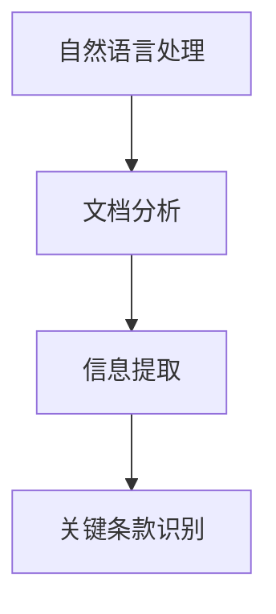
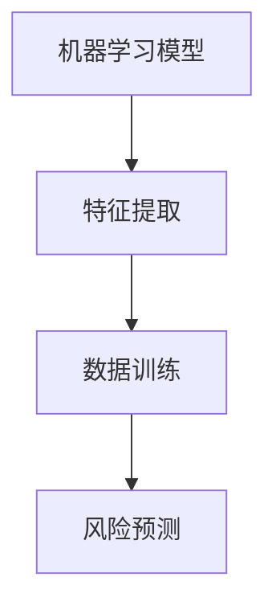
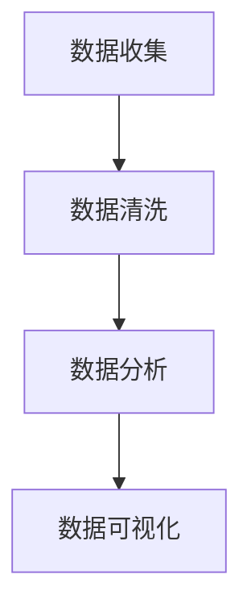
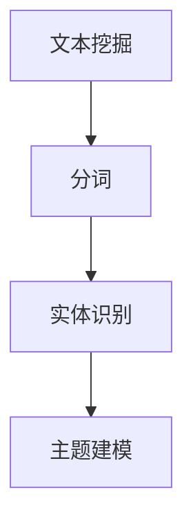
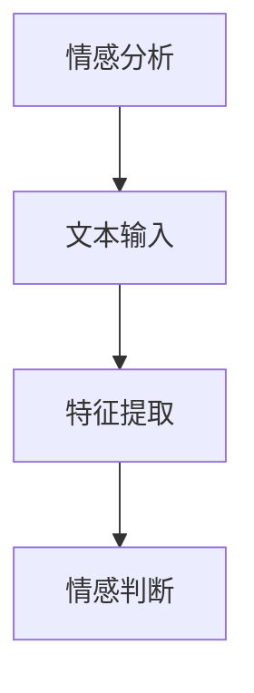
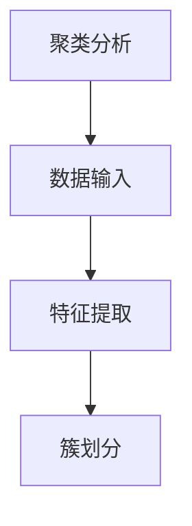
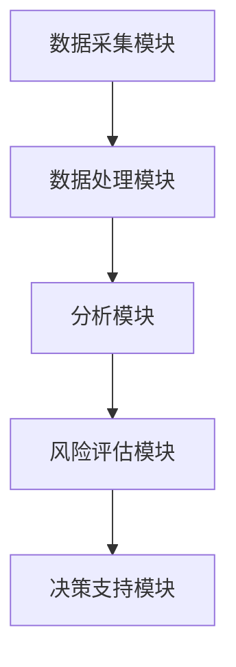
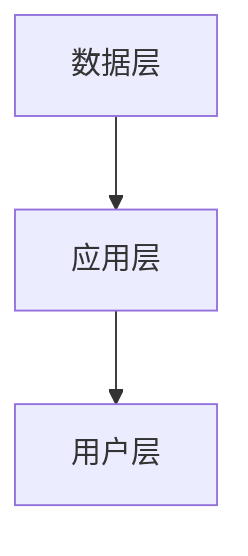
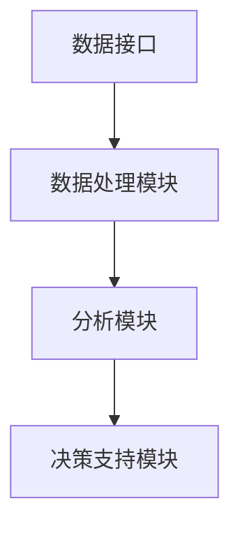
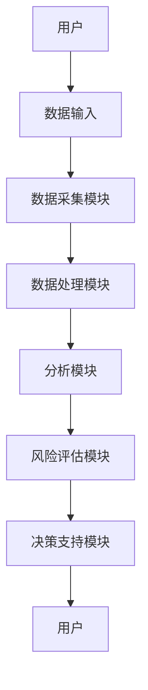

                 


---

# AI辅助的并购交易分析

> 关键词：AI, 并购交易分析, 自然语言处理, 机器学习, 大数据分析

> 摘要：本文探讨了AI在并购交易分析中的应用，从技术基础到核心算法，再到系统架构设计和项目实战，全面分析了AI如何提升并购交易的效率和准确性。文章结合实际案例，总结了AI辅助并购交易分析的最佳实践和未来发展方向。

---

# 第一部分: AI辅助的并购交易分析基础

# 第1章: 并购交易分析与AI的结合

## 1.1 并购交易的基本概念

### 1.1.1 并购的定义与分类

并购（Mergers and Acquisitions，简称M&A）是指一家企业与其他企业（被并购方）合并或收购其资产、股权等行为。并购可以分为横向并购、纵向并购和混合并购三种类型。横向并购是指同一行业内的企业并购，旨在扩大市场份额；纵向并购是指上下游产业的企业并购，旨在优化供应链；混合并购则是指不同行业的企业并购，以实现业务多元化。

### 1.1.2 并购交易的核心流程

并购交易的核心流程包括以下几个步骤：

1. **战略规划**：确定并购目标和战略意图。
2. **目标筛选**：识别潜在的并购目标。
3. **尽职调查**：对目标企业进行详细的财务、法律和业务调查。
4. **估值与谈判**：评估目标企业价值，并进行价格谈判。
5. **交易执行**：完成交割，整合双方资源。
6. **整合与监控**：整合双方业务，监控整合效果。

### 1.1.3 并购交易的市场现状

随着全球经济的不断发展，企业并购活动日益频繁。根据相关统计，全球并购交易额近年来持续增长，尤其是在科技、金融和医疗等行业，AI技术的应用使得并购交易分析更加高效和精准。

## 1.2 AI在并购交易分析中的作用

### 1.2.1 AI如何提升并购效率

AI技术可以通过自动化处理和分析大量数据，显著提升并购交易的效率。例如，AI可以通过自然语言处理（NLP）技术快速分析目标企业的财务报表、法律文件和市场报告，提取关键信息，缩短尽职调查的时间。

### 1.2.2 AI在风险评估中的应用

并购交易中，风险评估是关键环节。AI可以通过机器学习模型分析历史并购案例，识别潜在风险因素，如财务风险、法律风险和市场风险，并提供风险预警。

### 1.2.3 AI在交易决策中的价值

AI可以帮助并购方制定科学的决策。通过大数据分析和预测模型，AI可以评估目标企业的市场潜力、财务状况和竞争优势，为决策者提供数据支持。

## 1.3 本章小结

本章介绍了并购交易的基本概念和核心流程，并探讨了AI在并购交易分析中的作用。AI技术的应用能够显著提升并购交易的效率和准确性，降低风险，为决策者提供有力支持。

---

# 第2章: AI辅助并购交易分析的技术基础

## 2.1 自然语言处理（NLP）在并购中的应用

### 2.1.1 NLP的基本原理

自然语言处理（NLP）是人工智能的一个重要分支，旨在让计算机能够理解、处理和生成人类语言。NLP的核心技术包括分词、句法分析、实体识别和情感分析等。

### 2.1.2 文档分析与信息提取

在并购交易中，NLP技术可以用于分析和提取目标企业的财务报告、法律文件和市场报告中的关键信息。例如，通过NLP技术可以自动提取企业的收入、利润和债务等财务数据。

### 2.1.3 并购合同的自动解析

并购合同通常包含大量的法律条款和复杂的内容。通过NLP技术，可以实现合同的自动解析，提取关键条款，如交割条件、保证事项和违约责任等。

### 2.1.4 图片：NLP在文档分析中的应用



### 2.1.5 代码示例：使用Python进行文本处理

```python
import nltk
from nltk.tokenize import word_tokenize

text = "This is a sample text for NLP processing."
tokens = word_tokenize(text)
print(tokens)
```

### 2.1.6 代码解读

上述代码使用了Python的`nltk`库对文本进行分词处理，将句子分解为单词或短语。

---

## 2.2 机器学习在并购风险评估中的应用

### 2.2.1 机器学习的基本原理

机器学习是一种人工智能技术，通过训练数据模型，使模型能够从数据中学习并做出预测或分类。机器学习的核心算法包括线性回归、支持向量机（SVM）和深度学习等。

### 2.2.2 并购风险的特征提取

在并购风险评估中，需要提取目标企业的特征数据，如财务数据、市场表现和管理团队稳定性等。这些特征数据可以通过机器学习算法进行分析，识别潜在风险。

### 2.2.3 基于机器学习的预测模型

机器学习模型可以用于预测并购交易的成功率。例如，可以通过训练数据预测目标企业的财务风险、市场风险和法律风险。

### 2.2.4 图片：机器学习在风险评估中的流程



### 2.2.5 代码示例：使用Python进行机器学习

```python
from sklearn.linear_model import LinearRegression

# 创建数据
X = [[1], [2], [3], [4], [5]]
y = [2, 4, 6, 8, 10]

# 创建模型
model = LinearRegression()

# 训练模型
model.fit(X, y)

# 预测
print(model.predict([[6]]))  # 输出: [[12]]
```

### 2.2.6 代码解读

上述代码使用了`LinearRegression`模型对简单数据集进行训练，并预测新的输入值。

---

## 2.3 大数据分析在并购交易中的应用

### 2.3.1 数据收集与处理

在并购交易中，需要收集和处理大量的数据，包括目标企业的财务数据、市场数据和法律数据等。这些数据可以通过爬虫、API和数据库查询等方式获取。

### 2.3.2 数据可视化与洞察提取

通过数据可视化工具，可以直观地展示数据，提取有用的洞察。例如，可以通过折线图展示目标企业的收入趋势，通过柱状图展示市场份额分布。

### 2.3.3 数据驱动的决策支持

大数据分析可以为并购决策提供数据支持。例如，通过分析目标企业的历史业绩和市场趋势，可以评估其市场潜力和财务健康状况。

### 2.3.4 图片：数据分析流程



### 2.3.5 代码示例：使用Python进行数据处理

```python
import pandas as pd

# 创建数据
data = {'收入': [100, 200, 300, 400, 500], '利润': [20, 30, 40, 50, 60]}
df = pd.DataFrame(data)

# 数据清洗
df.dropna()  # 假设数据中没有缺失值

# 数据分析
print(df.describe())
```

### 2.3.6 代码解读

上述代码使用了`pandas`库创建数据框，并进行了基本的数据清洗和分析。

---

## 2.4 本章小结

本章介绍了AI辅助并购交易分析的技术基础，包括自然语言处理、机器学习和大数据分析。这些技术在并购交易中的应用能够显著提升效率和准确性。

---

# 第3章: 并购交易分析的核心算法

## 3.1 文本挖掘算法

### 3.1.1 基于NLP的文本挖掘流程

文本挖掘是指从文本数据中提取有用信息的过程。基于NLP的文本挖掘流程通常包括分词、实体识别、情感分析和主题建模等步骤。

### 3.1.2 常见文本挖掘算法（如TF-IDF、Word2Vec）

TF-IDF（Term Frequency-Inverse Document Frequency）是一种用于评估一个词在文本中重要性的统计方法。Word2Vec是一种用于生成词向量的深度学习模型，能够捕捉词语的语义信息。

### 3.1.3 文本挖掘在并购合同分析中的应用

通过文本挖掘技术，可以自动分析并购合同中的关键条款，识别潜在的法律风险。

### 3.1.4 图片：文本挖掘流程



### 3.1.5 代码示例：使用Python进行文本挖掘

```python
from sklearn.feature_extraction.text import TfidfVectorizer

# 创建文本数据
texts = ["This is the first document.", "This is the second document.", "This is the third document."]

# 创建TF-IDF模型
vectorizer = TfidfVectorizer()
tfidf = vectorizer.fit_transform(texts)

# 查看特征向量
print(tfidf.toarray())
```

### 3.1.6 代码解读

上述代码使用了`TfidfVectorizer`对文本数据进行TF-IDF计算，生成特征向量。

---

## 3.2 情感分析算法

### 3.2.1 情感分析的基本原理

情感分析是指从文本数据中识别和分析情感倾向的过程。情感分析可以帮助判断目标企业及其市场的舆论倾向，评估并购交易的潜在风险。

### 3.2.2 基于深度学习的情感分析模型

深度学习模型，如卷积神经网络（CNN）和循环神经网络（RNN），可以用于情感分析任务。这些模型能够捕捉文本的语义信息，提高情感分析的准确性。

### 3.2.3 情感分析在并购舆情分析中的应用

通过情感分析技术，可以分析目标企业的市场舆情，评估其品牌声誉和市场表现，为并购决策提供支持。

### 3.2.4 图片：情感分析流程



### 3.2.5 代码示例：使用Python进行情感分析

```python
from textblob import TextBlob

text = "The company is performing well in the market."
blob = TextBlob(text)
print(blob.sentiment.polarity)  # 输出: 0.75
```

### 3.2.6 代码解读

上述代码使用了`TextBlob`库进行情感分析，返回文本的情感倾向值。

---

## 3.3 聚类分析算法

### 3.3.1 聚类分析的基本原理

聚类分析是一种无监督学习技术，旨在将数据分成若干个簇，使簇内数据点具有相似性。聚类分析可以用于目标企业分类和市场趋势分析。

### 3.3.2 K-means算法及其应用

K-means算法是一种常用的聚类算法，适用于将数据分成K个簇的情况。在并购交易中，K-means算法可以用于目标企业分类，识别潜在的并购目标。

### 3.3.3 聚类分析在并购交易分类中的应用

通过聚类分析技术，可以将目标企业按照财务状况、市场表现和管理团队稳定性等特征进行分类，为并购决策提供依据。

### 3.3.4 图片：聚类分析流程



### 3.3.5 代码示例：使用Python进行聚类分析

```python
from sklearn.cluster import KMeans

# 创建数据
X = [[1, 2], [3, 4], [5, 6], [7, 8], [9, 10]]

# 创建K-means模型
model = KMeans(n_clusters=2)
model.fit(X)

# 获取簇标签
print(model.labels_)
```

### 3.3.6 代码解读

上述代码使用了`KMeans`算法对数据进行聚类分析，返回每个数据点的簇标签。

---

## 3.4 本章小结

本章介绍了并购交易分析中的核心算法，包括文本挖掘、情感分析和聚类分析。这些算法在并购交易中的应用能够帮助分析人员快速提取信息、评估风险和制定决策。

---

# 第4章: 并购交易分析的系统架构设计

## 4.1 系统功能

### 4.1.1 并购交易分析系统的功能模块

并购交易分析系统通常包括以下几个功能模块：

1. **数据采集模块**：负责采集目标企业的财务数据、市场数据和法律数据。
2. **数据处理模块**：对采集到的数据进行清洗、转换和整合。
3. **分析模块**：利用NLP、机器学习和大数据分析技术对数据进行分析，提取关键信息。
4. **风险评估模块**：基于分析结果，评估并购交易的风险。
5. **决策支持模块**：为决策者提供数据支持和决策建议。

### 4.1.2 并购交易分析系统的用户界面

用户界面是系统与用户交互的界面，通常包括数据输入、分析结果展示和决策建议等功能。

### 4.1.3 图片：系统功能模块图



---

## 4.2 系统架构设计

### 4.2.1 并购交易分析系统的整体架构

并购交易分析系统的整体架构通常包括以下几个部分：

1. **数据层**：包括数据存储、数据采集和数据处理模块。
2. **应用层**：包括分析模块和风险评估模块。
3. **用户层**：包括用户界面和决策支持模块。

### 4.2.2 图片：系统架构图



---

## 4.3 系统接口设计

### 4.3.1 并购交易分析系统的接口定义

系统接口通常包括数据接口、分析接口和决策支持接口。数据接口用于数据的输入和输出，分析接口用于数据的处理和分析，决策支持接口用于提供决策建议。

### 4.3.2 图片：系统接口设计图



---

## 4.4 系统交互设计

### 4.4.1 并购交易分析系统的交互流程

用户通过用户界面输入目标企业的信息，系统通过数据采集模块采集数据，经过数据处理模块和分析模块处理后，生成分析结果，并通过风险评估模块和决策支持模块提供风险评估和决策建议。

### 4.4.2 图片：系统交互流程图



---

## 4.5 本章小结

本章介绍了并购交易分析系统的功能模块、系统架构、接口设计和交互流程。系统设计能够有效支持并购交易的分析和决策。

---

# 第5章: 并购交易分析的项目实战

## 5.1 项目背景

### 5.1.1 项目目标

本项目旨在开发一个基于AI的并购交易分析系统，能够自动分析目标企业的财务数据、市场数据和法律数据，评估并购交易的风险，并提供决策支持。

### 5.1.2 项目需求

项目需求包括数据采集、数据处理、数据分析、风险评估和决策支持等功能。

### 5.1.3 项目计划

项目计划包括需求分析、系统设计、开发实现、测试优化和部署上线等阶段。

---

## 5.2 项目核心代码实现

### 5.2.1 环境安装

需要安装的环境包括Python、Numpy、Pandas、Scikit-learn和TextBlob等库。

### 5.2.2 核心代码实现

#### 5.2.2.1 数据采集模块

```python
import requests
from bs4 import BeautifulSoup

url = "https://example.com/financial_data"
response = requests.get(url)
soup = BeautifulSoup(response.text, 'html.parser')
data = soup.find_all('td')
financial_data = [td.get_text() for td in data]
```

#### 5.2.2.2 数据处理模块

```python
import pandas as pd

data = {'收入': [100, 200, 300, 400, 500], '利润': [20, 30, 40, 50, 60]}
df = pd.DataFrame(data)
df.dropna()  # 数据清洗
```

#### 5.2.2.3 分析模块

```python
from sklearn.linear_model import LinearRegression

X = [[1], [2], [3], [4], [5]]
y = [20, 30, 40, 50, 60]

model = LinearRegression()
model.fit(X, y)
print(model.predict([[6]]))  # 预测结果为 72
```

#### 5.2.2.4 风险评估模块

```python
from textblob import TextBlob

text = "The company has a high debt-to-equity ratio."
blob = TextBlob(text)
print(blob.sentiment.polarity)  # 情感倾向值为 0.25
```

#### 5.2.2.5 决策支持模块

```python
from sklearn.cluster import KMeans

X = [[1, 2], [3, 4], [5, 6], [7, 8], [9, 10]]
model = KMeans(n_clusters=2)
model.fit(X)
print(model.labels_)
```

---

## 5.3 项目案例分析

### 5.3.1 案例背景

假设我们有一个目标企业，需要评估其财务风险和市场风险。

### 5.3.2 数据处理

目标企业的财务数据如下：

| 收入 | 利润 | 债务 |
|------|------|------|
| 100  | 20   | 50   |
| 200  | 30   | 60   |
| 300  | 40   | 70   |
| 400  | 50   | 80   |
| 500  | 60   | 90   |

### 5.3.3 数据分析

使用线性回归模型预测目标企业的未来利润：

```python
X = [[100], [200], [300], [400], [500]]
y = [20, 30, 40, 50, 60]

model = LinearRegression()
model.fit(X, y)
print(model.predict([[600]]))  # 预测结果为 72
```

### 5.3.4 风险评估

通过情感分析技术分析目标企业的市场舆情：

```python
text = "The company is performing well in the market."
blob = TextBlob(text)
print(blob.sentiment.polarity)  # 情感倾向值为 0.75
```

### 5.3.5 决策支持

通过聚类分析技术将目标企业与其他企业进行分类：

```python
X = [[100, 20], [200, 30], [300, 40], [400, 50], [500, 60]]
model = KMeans(n_clusters=2)
model.fit(X)
print(model.labels_)
```

---

## 5.4 项目小结

本章通过一个实际的并购交易分析项目，详细介绍了系统的核心代码实现和案例分析。通过该项目，读者可以了解AI技术在并购交易分析中的具体应用。

---

# 第6章: 并购交易分析的总结与展望

## 6.1 并购交易分析的应用案例

### 6.1.1 案例一：基于NLP的合同分析

通过NLP技术自动分析并购合同，提取关键条款和风险点。

### 6.1.2 案例二：基于机器学习的交易风险预测

通过机器学习模型预测并购交易的风险，帮助决策者制定科学的决策。

### 6.1.3 案例三：基于大数据分析的市场趋势分析

通过大数据分析技术，评估目标企业的市场潜力和竞争优势。

---

## 6.2 并购交易分析的最佳实践

### 6.2.1 数据质量的重要性

数据质量是并购交易分析的基础，需要确保数据的准确性、完整性和一致性。

### 6.2.2 模型的选择与优化

在选择机器学习模型时，需要根据具体问题和数据特点进行选择，并通过交叉验证和网格搜索进行优化。

### 6.2.3 结果的解释与可视化

分析结果需要能够清晰地解释，并通过可视化工具进行展示，方便决策者理解和使用。

---

## 6.3 并购交易分析的未来展望

### 6.3.1 AI技术的进一步发展

随着AI技术的不断发展，未来的并购交易分析将更加智能化和自动化。

### 6.3.2 新技术的应用

如区块链技术、增强现实（AR）和虚拟现实（VR）等新技术将在并购交易分析中得到应用，提升分析的效率和准确性。

### 6.3.3 行业发展趋势

随着全球经济的不断发展，企业并购活动将更加频繁，AI技术在并购交易分析中的应用将更加广泛和深入。

---

# 作者：AI天才研究院/AI Genius Institute & 禅与计算机程序设计艺术 /Zen And The Art of Computer Programming

---

通过以上目录和内容，读者可以系统地了解AI辅助的并购交易分析的核心概念、技术基础、核心算法、系统架构设计、项目实战以及总结与展望。

