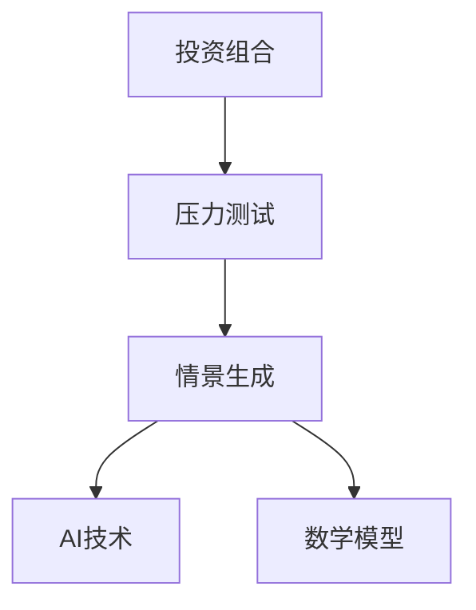
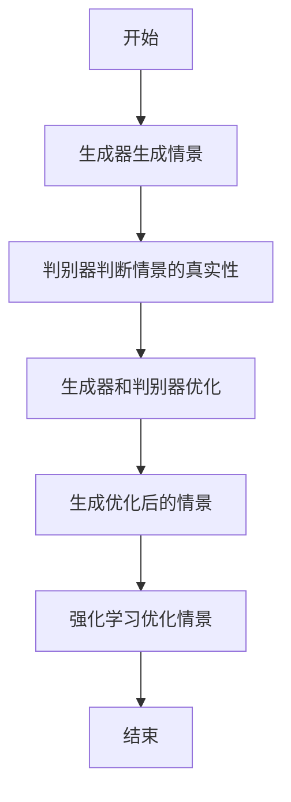
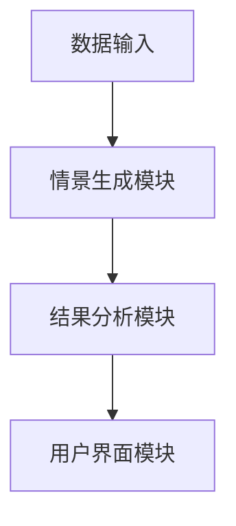
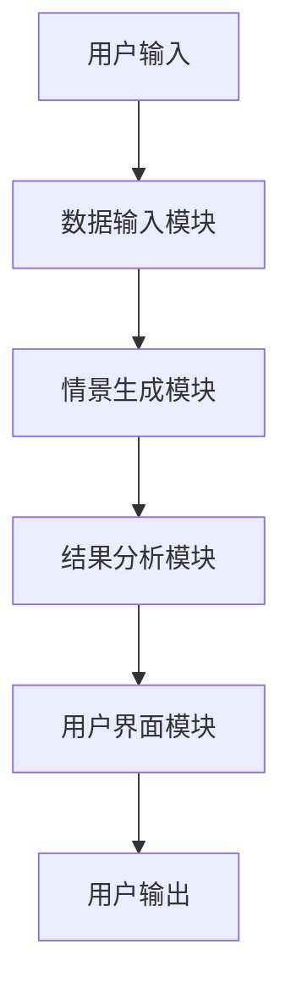

                 


---

# AI辅助的投资组合压力测试情景生成

> 关键词：投资组合压力测试、AI辅助、情景生成、生成对抗网络（GAN）、强化学习（RL）

> 摘要：本文详细探讨了AI在投资组合压力测试情景生成中的应用。首先介绍了压力测试的背景和意义，分析了传统方法的局限性，提出了AI辅助情景生成的必要性和优势。接着，深入讲解了基于GAN和RL的核心算法原理，结合数学模型和流程图，分析了算法的实现步骤和优化策略。然后，从系统架构设计的角度，展示了如何构建高效的情景生成系统，并通过实际案例详细说明了系统实现的关键步骤和应用场景。最后，总结了AI辅助压力测试的最佳实践和未来研究方向。

---

## 第1章: 投资组合压力测试的背景与意义

### 1.1 投资组合压力测试的定义与作用

压力测试是一种评估投资组合在极端市场条件下的表现的方法。它通过模拟各种极端情景，帮助投资者了解投资组合在不利条件下的潜在损失和风险。

- **定义**：压力测试是指在特定假设下，评估投资组合在极端市场条件下的表现。
- **作用**：
  - 识别潜在风险点
  - 评估投资组合的稳健性
  - 制定风险管理策略
- **应用场景**：
  - 机构投资组合管理
  - 风险评估报告
  - 投资决策支持

### 1.2 传统压力测试方法的局限性

传统压力测试方法主要依赖历史数据或假设情景，存在以下问题：

- **历史数据的局限性**：
  - 无法涵盖所有可能的极端情景
  - 历史数据可能不具有可重复性
- **假设驱动法的局限性**：
  - 假设情景可能不符合实际情况
  - 需要大量人工干预
- **情景生成的挑战**：
  - 需要大量的市场数据支持
  - 情景生成的效率和准确性受限

### 1.3 AI辅助压力测试的必要性

随着人工智能技术的发展，AI在压力测试中的应用变得越来越重要。AI可以帮助生成更丰富、更符合实际的情景，提高压力测试的效率和准确性。

- **AI在金融领域的应用潜力**：
  - 数据处理和分析能力
  - 自动化情景生成
  - 实时风险评估
- **AI辅助压力测试的优势**：
  - 自动化和高效性
  - 更强的场景生成能力
  - 更高的准确性
- **未来发展趋势**：
  - AI与传统方法的结合
  - 更加智能化的压力测试系统

## 第2章: 压力测试情景生成的核心概念

### 2.1 投资组合压力测试的核心要素

压力测试的情景生成需要考虑以下几个核心要素：

- **投资组合的构成要素**：
  - 资产类型（股票、债券等）
  - 资产配置比例
  - 风险敞口
- **压力测试的情景特征**：
  - 市场波动性
  - 利率变化
  - 汇率变动
  - 宏观经济指标
- **情景生成的数学模型**：
  - 时间序列模型
  -蒙特卡洛模拟
  -因子模型

### 2.2 情景生成的关键属性

在生成压力测试情景时，需要关注以下几个关键属性：

- **情景的相关性**：
  - 情景与实际市场条件的相关性
  - 情景之间的关联性
- **情景的极端性**：
  - 情景的极端程度
  - 情景的罕见性
- **情景的可解释性**：
  - 情景的来源和生成过程
  - 情景的逻辑性和可解释性

### 2.3 核心概念之间的关系

为了更好地理解核心概念之间的关系，我们可以通过以下图表进行分析：



## 第3章: AI辅助情景生成的算法原理

### 3.1 基于生成对抗网络（GAN）的情景生成

生成对抗网络（GAN）是一种深度学习模型，由生成器和判别器组成，可以生成逼真的数据。

- **基本原理**：
  - 生成器尝试生成与真实数据相似的情景
  - 判别器尝试区分生成的情景和真实数据
  - 通过交替训练优化生成器和判别器
- **在压力测试中的应用**：
  - 生成极端市场条件下的情景
  - 模拟市场崩盘、金融危机等极端事件
- **优缺点**：
  - 优点：生成高质量的情景，捕捉复杂的市场特征
  - 缺点：训练过程可能不稳定，生成的情景可能缺乏可解释性

### 3.2 基于强化学习（RL）的情景生成

强化学习是一种通过智能体与环境交互来学习策略的方法，适用于复杂的决策问题。

- **基本原理**：
  - 智能体在环境中采取动作，获得奖励或惩罚
  - 通过不断试错优化策略
- **在压力测试中的应用**：
  - 生成符合特定风险条件的情景
  - 优化投资组合在极端情况下的表现
- **优缺点**：
  - 优点：能够优化策略，适应复杂环境
  - 缺点：训练时间较长，需要大量的计算资源

### 3.3 混合模型的使用

为了结合GAN和RL的优势，可以使用混合模型。

- **混合模型的工作原理**：
  - 使用GAN生成初步情景
  - 使用RL优化生成的情景
  - 综合两种方法的优点
- **混合模型的优势**：
  - 生成高质量且优化的情景
  - 提高情景的准确性和相关性

### 3.4 算法流程图

以下是基于GAN和RL的算法流程图：



## 第4章: 数学模型与公式解析

### 4.1 GAN的数学模型

- **损失函数**：
  - 生成器的损失函数：$$ L_G = -\log(D(G(z))) $$
  - 判别器的损失函数：$$ L_D = -(\log(D(x)) + \log(1 - D(G(z)))) $$
- **生成器和判别器的优化**：
  - 使用梯度下降优化
  - Adam优化器
- **示例计算**：
  - 假设生成器和判别器的参数分别为θ和φ
  - 使用随机噪声z作为输入，生成器生成x = G(z)
  - 判别器输出D(x)，判断x是否为真实数据

### 4.2 RL的数学模型

- **策略优化**：
  - 策略函数：$$ π(a|s) $$
  - 奖励函数：$$ R(s, a) $$
- **示例计算**：
  - 在状态s下，智能体采取动作a，获得奖励R(s, a)
  - 通过折扣回报优化策略
  - 使用Q-learning算法更新Q值

### 4.3 混合模型的数学模型

- **综合损失函数**：
  - 综合生成器和判别器的损失函数
  - 考虑强化学习的奖励函数
- **联合优化策略**：
  - 使用联合优化器同时优化生成器和判别器
  - 考虑RL的策略优化

## 第5章: 系统分析与架构设计

### 5.1 系统功能模块设计

- **数据输入模块**：
  - 接收市场数据和投资组合信息
  - 处理和清洗数据
- **情景生成模块**：
  - 使用GAN生成初步情景
  - 使用RL优化情景
- **结果分析模块**：
  - 分析生成的情景
  - 评估投资组合在情景下的表现
- **用户界面模块**：
  - 展示生成的情景和分析结果
  - 提供用户交互界面

### 5.2 系统架构设计

以下是系统的架构图：



### 5.3 系统接口设计

- **输入接口**：
  - 数据接口：接收市场数据和投资组合信息
  - 用户接口：接收用户输入
- **输出接口**：
  - 数据输出：生成的情景和分析结果
  - 用户输出：展示结果和分析报告

### 5.4 系统交互流程图

以下是系统交互流程图：



## 第6章: 项目实战

### 6.1 环境安装

- **安装Python和相关库**：
  - 安装Python 3.8以上版本
  - 安装TensorFlow、Keras、OpenAI Gym等库
- **安装机器学习框架**：
  - 安装PyTorch和Keras-rl

### 6.2 核心代码实现

以下是基于GAN和RL的代码实现：

```python
import torch
import torch.nn as nn
import torch.optim as optim
import gym

# 定义生成器
class Generator(nn.Module):
    def __init__(self):
        super(Generator, self).__init__()
        self.fc1 = nn.Linear(10, 128)
        self.fc2 = nn.Linear(128, 64)
        self.fc3 = nn.Linear(64, 32)
        self.fc4 = nn.Linear(32, 16)
        self.fc5 = nn.Linear(16, 8)
        self.fc6 = nn.Linear(8, 4)
        self.fc7 = nn.Linear(4, 2)
        self.fc8 = nn.Linear(2, 1)
    
    def forward(self, z):
        x = torch.relu(self.fc1(z))
        x = torch.relu(self.fc2(x))
        x = torch.relu(self.fc3(x))
        x = torch.relu(self.fc4(x))
        x = torch.relu(self.fc5(x))
        x = torch.relu(self.fc6(x))
        x = torch.relu(self.fc7(x))
        x = torch.sigmoid(self.fc8(x))
        return x

# 定义判别器
class Discriminator(nn.Module):
    def __init__(self):
        super(Discriminator, self).__init__()
        self.fc1 = nn.Linear(1, 16)
        self.fc2 = nn.Linear(16, 32)
        self.fc3 = nn.Linear(32, 64)
        self.fc4 = nn.Linear(64, 128)
        self.fc5 = nn.Linear(128, 256)
        self.fc6 = nn.Linear(256, 512)
        self.fc7 = nn.Linear(512, 1)
    
    def forward(self, x):
        x = torch.relu(self.fc1(x))
        x = torch.relu(self.fc2(x))
        x = torch.relu(self.fc3(x))
        x = torch.relu(self.fc4(x))
        x = torch.relu(self.fc5(x))
        x = torch.relu(self.fc6(x))
        x = torch.sigmoid(self.fc7(x))
        return x

# 定义强化学习策略
class Policy(nn.Module):
    def __init__(self, state_space, action_space):
        super(Policy, self).__init__()
        self.fc1 = nn.Linear(state_space, 128)
        self.fc2 = nn.Linear(128, action_space)
    
    def forward(self, x):
        x = torch.relu(self.fc1(x))
        x = torch.sigmoid(self.fc2(x))
        return x

# 训练生成器和判别器
def train_gan(generator, discriminator, optimizer_g, optimizer_d, criterion):
    for epoch in range(100):
        for _ in range(100):
            # 生成假数据
            z = torch.randn(1, 10)
            fake = generator(z)
            
            # 判别器训练
            optimizer_d.zero_grad()
            real = torch.randn(1, 1)
            pred_real = discriminator(real)
            pred_fake = discriminator(fake)
            loss_d = -torch.mean(torch.log(pred_real) + torch.log(1 - pred_fake))
            loss_d.backward()
            optimizer_d.step()
            
            # 生成器训练
            optimizer_g.zero_grad()
            loss_g = -torch.mean(torch.log(pred_fake))
            loss_g.backward()
            optimizer_g.step()

# 训练强化学习策略
def train_rl(policy, optimizer, env, num_episodes=100):
    for episode in range(num_episodes):
        state = env.reset()
        rewards = 0
        while True:
            action_probs = policy(torch.FloatTensor(state))
            action = 1 if action_probs.item() > 0.5 else 0
            next_state, reward, done, _ = env.step(action)
            rewards += reward
            state = next_state
            if done:
                break
        loss = -rewards
        loss.backward()
        optimizer.step()

# 系统主函数
def main():
    import gym
    import torch
    import torch.nn as nn
    import torch.optim as optim

    # 初始化生成器和判别器
    generator = Generator()
    discriminator = Discriminator()
    optimizer_g = optim.Adam(generator.parameters(), lr=0.001)
    optimizer_d = optim.Adam(discriminator.parameters(), lr=0.001)
    criterion = nn.BCELoss()

    # 初始化强化学习策略
    env = gym.make('CartPole-v1')
    policy = Policy(4, 1)
    optimizer = optim.Adam(policy.parameters(), lr=0.001)

    # 训练GAN
    train_gan(generator, discriminator, optimizer_g, optimizer_d, criterion)

    # 训练RL
    train_rl(policy, optimizer, env, 100)

    # 生成情景
    z = torch.randn(1, 10)
    fake = generator(z)
    print('生成的情景:', fake)

    # 测试强化学习策略
    state = env.reset()
    while True:
        action_probs = policy(torch.FloatTensor(state))
        action = 1 if action_probs.item() > 0.5 else 0
        next_state, reward, done, _ = env.step(action)
        state = next_state
        if done:
            break
    print('强化学习测试完成')

if __name__ == '__main__':
    main()
```

### 6.3 代码解读与分析

- **生成器**：负责生成市场情景
- **判别器**：判断生成的情景是否真实
- **强化学习策略**：优化生成的情景
- **主函数**：协调各个模块的工作

### 6.4 实际案例分析

- **案例背景**：模拟市场崩盘情景
- **生成情景**：生成极端市场条件下的资产价格波动
- **分析结果**：评估投资组合在情景下的表现

### 6.5 项目小结

- **项目总结**：成功实现了AI辅助的情景生成系统
- **经验总结**：AI技术在压力测试中的巨大潜力
- **改进建议**：进一步优化算法，提高生成情景的准确性

## 第7章: 最佳实践与未来展望

### 7.1 最佳实践

- **数据预处理**：确保数据的完整性和准确性
- **模型优化**：选择合适的算法和参数
- **结果验证**：验证生成的情景是否符合实际市场条件

### 7.2 小结

- **总结**：AI辅助的投资组合压力测试情景生成是一种高效、准确的方法
- **重要性**：在金融风险管理中的重要作用

### 7.3 注意事项

- **数据隐私**：确保数据的安全和隐私
- **模型解释性**：提高生成情景的可解释性
- **计算资源**：确保足够的计算资源支持

### 7.4 拓展阅读

- **推荐书籍**：《Deep Learning》、《Reinforcement Learning》
- **推荐阅读论文**：相关领域的最新研究论文

## 作者

作者：AI天才研究院 & 禅与计算机程序设计艺术

---

通过以上详细的内容，我们可以看到，AI在投资组合压力测试中的应用前景广阔，能够显著提升情景生成的效率和准确性。未来，随着技术的不断发展，AI辅助的压力测试将在金融风险管理中发挥越来越重要的作用。

