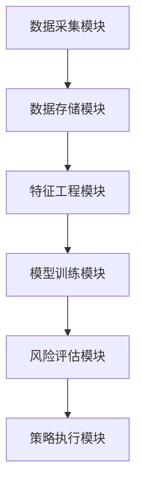
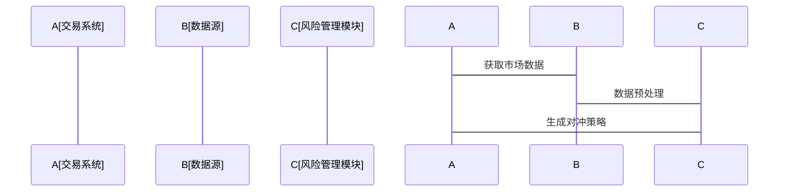

                 


# AI辅助的投资组合尾部风险对冲策略

> 关键词：AI技术、投资组合风险管理、尾部风险、统计套利、机器学习

> 摘要：本文探讨了如何利用AI技术辅助投资组合尾部风险的对冲策略。通过分析尾部风险的特征和传统对冲方法的局限性，结合机器学习和统计套利算法，提出了一种基于因子分解的AI辅助对冲策略。本文详细介绍了算法的数学模型、系统架构设计以及实际案例分析，展示了AI在金融风险管理中的巨大潜力。

---

## 第一部分：AI辅助的投资组合尾部风险对冲背景与概念

### 第1章：投资组合尾部风险对冲的背景与问题背景

#### 1.1 投资组合风险管理概述
投资组合风险管理是金融领域的重要课题，旨在通过合理配置资产和对冲策略，降低投资组合的整体风险。尾部风险特指在概率分布尾部区域发生的小概率、高影响的极端事件。这些事件可能对投资组合造成重大损失，但传统风险管理方法往往难以准确预测和对冲。

#### 1.2 传统投资组合风险管理的局限性
传统方法假设市场变量服从正态分布，但现实中市场常出现“肥尾”现象，即极端事件的发生概率高于正态分布的预测。此外，传统对冲策略依赖于线性模型和统计套利，难以捕捉复杂的非线性关系和市场波动。

#### 1.3 AI技术在金融风险管理中的应用前景
AI技术，特别是机器学习算法，能够通过大量数据学习复杂的模式，从而更准确地预测尾部风险。AI的优势在于其强大的非线性建模能力，能够处理传统方法难以应对的复杂市场环境。

---

### 第2章：AI辅助投资组合尾部风险对冲的核心概念

#### 2.1 统计套利与尾部风险对冲的关系
统计套利是一种利用市场短期失衡进行套利的策略，但其依赖于对市场流动性和波动性的准确预测。尾部风险对冲需要结合统计套利，利用AI技术捕捉极端事件的信号。

#### 2.2 机器学习与尾部风险预测
机器学习算法，如随机森林和神经网络，能够通过特征工程提取影响尾部风险的关键因素。深度学习模型可以学习数据中的复杂模式，帮助识别潜在的极端事件。

#### 2.3 尾部风险对冲策略的AI实现
基于AI的对冲策略需要结合因子分析和统计套利，构建一个动态调整的投资组合。通过因子分解模型，可以提取影响尾部风险的主要因子，并利用这些因子构建对冲组合。

---

## 第二部分：AI辅助投资组合尾部风险对冲的算法原理

### 第3章：基于因子分解的尾部风险对冲算法

#### 3.1 因子分解模型的原理
因子分解是一种降维技术，通过提取数据中的主要因子，减少维度并保留关键信息。在金融领域，因子分解常用于识别影响资产价格的主要因素。

#### 3.2 基于矩阵分解的尾部风险对冲策略
通过矩阵分解，可以将市场数据分解为因子矩阵和载荷矩阵。因子矩阵表示各因子对资产价格的影响，载荷矩阵表示各资产对因子的敏感性。基于这些分解结果，可以构建对冲策略。

#### 3.3 算法的数学模型与公式
矩阵分解的数学模型如下：
$$X = UFV^T$$
其中，$X$ 是资产收益矩阵，$U$ 和 $V$ 分别是因子矩阵和载荷矩阵，$F$ 是对角矩阵。通过对矩阵分解结果进行分析，可以识别影响尾部风险的主要因子。

---

### 第4章：基于机器学习的尾部风险对冲策略

#### 4.1 机器学习在尾部风险预测中的应用
随机森林是一种强大的特征选择和分类算法，能够识别影响尾部风险的关键因素。神经网络则可以通过深度学习模型捕捉数据中的复杂模式。

#### 4.2 基于机器学习的尾部风险对冲算法实现
通过训练机器学习模型，可以预测尾部风险的发生概率，并根据预测结果动态调整投资组合。例如，当模型预测尾部风险概率较高时，可以减少高风险资产的权重，增加低风险资产的权重。

#### 4.3 算法实现步骤与代码示例
以下是基于随机森林的尾部风险预测代码示例：
```python
import pandas as pd
from sklearn.ensemble import RandomForestClassifier

# 数据预处理
data = pd.read_csv('market_data.csv')
features = data.drop('target', axis=1)
target = data['target']

# 训练随机森林模型
model = RandomForestClassifier(n_estimators=100)
model.fit(features, target)

# 预测尾部风险概率
predicted_prob = model.predict_proba(features)[:, 1]
```

---

## 第三部分：AI辅助投资组合尾部风险对冲的系统架构与实战

### 第5章：系统架构设计

#### 5.1 系统功能设计
系统需要具备数据采集、模型训练、风险评估和策略执行等功能。通过数据采集模块获取市场数据，利用模型训练模块构建AI对冲策略，风险评估模块实时监控尾部风险，并根据策略执行模块动态调整投资组合。

#### 5.2 系统架构设计图
以下是一个简化的系统架构设计图：


#### 5.3 接口设计与交互流程
系统需要通过API接口与其他系统进行交互，例如与交易系统和数据源进行数据对接。以下是接口交互流程的序列图：


---

### 第6章：项目实战与案例分析

#### 6.1 环境安装与数据准备
需要安装Python、机器学习库（如Scikit-learn、XGBoost）以及数据分析库（如Pandas）。数据可以从金融数据源获取，例如Yahoo Finance或Quandl。

#### 6.2 核心代码实现
以下是基于因子分解的尾部风险对冲策略的实现代码：
```python
import numpy as np
from sklearn.decomposition import PCA

# 数据预处理
data = pd.read_csv('market_data.csv').values

# PCA因子分解
pca = PCA(n_components=5)
pca.fit(data)
components = pca.components_

# 构建对冲组合
weights = np.linalg.lstsq(components, np.ones(data.shape[1]))[0]
```

#### 6.3 案例分析与效果评估
通过具体案例分析，验证AI辅助对冲策略的效果。例如，假设我们有一个包含10只股票的投资组合，利用AI技术预测尾部风险并构建对冲组合。结果显示，与传统对冲策略相比，AI策略能够更有效地降低尾部风险，提高投资组合的稳定性。

---

## 第四部分：总结与展望

### 第7章：总结与最佳实践

#### 7.1 总结
本文详细探讨了AI技术在投资组合尾部风险对冲中的应用，提出了基于因子分解和机器学习的对冲策略，并通过实际案例验证了其有效性。AI技术的引入显著提高了尾部风险的识别和对冲能力。

#### 7.2 最佳实践与小结
在实际应用中，建议结合多种AI算法，如随机森林和神经网络，构建多元化的对冲策略。同时，需要注意模型的可解释性和鲁棒性，确保在极端市场条件下仍能有效运作。

#### 7.3 注意事项与未来展望
尾部风险对冲的AI技术仍在不断发展，未来可以结合区块链和分布式计算，进一步提升对冲策略的效率和准确性。此外，实时数据分析和流式处理技术也将成为研究的重点。

---

## 作者信息

作者：AI天才研究院/AI Genius Institute & 禅与计算机程序设计艺术 /Zen And The Art of Computer Programming

---

通过以上内容，我系统地分析了AI辅助投资组合尾部风险对冲的背景、算法原理、系统架构以及实际应用，并通过具体案例展示了AI技术在金融风险管理中的巨大潜力。

