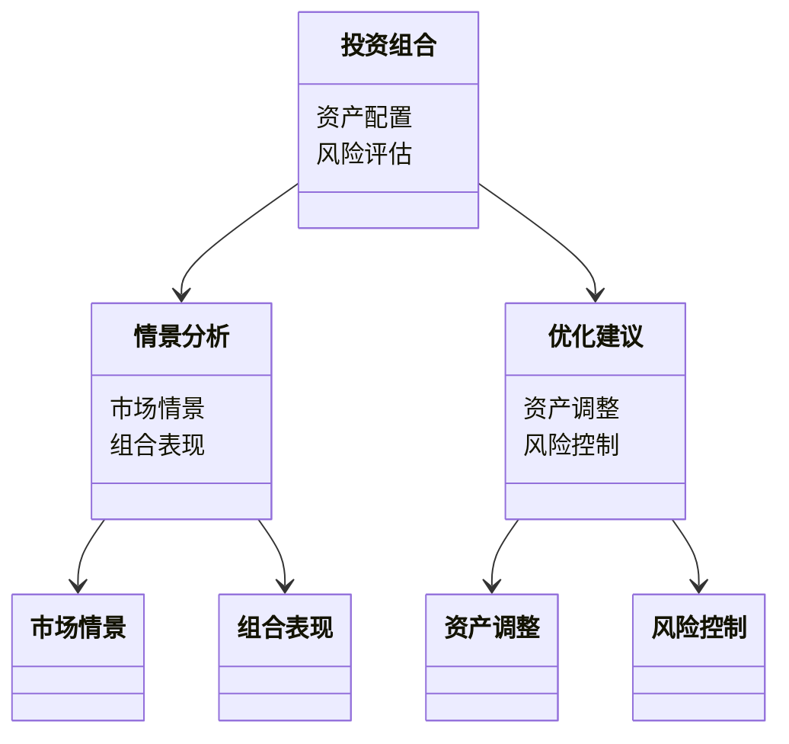
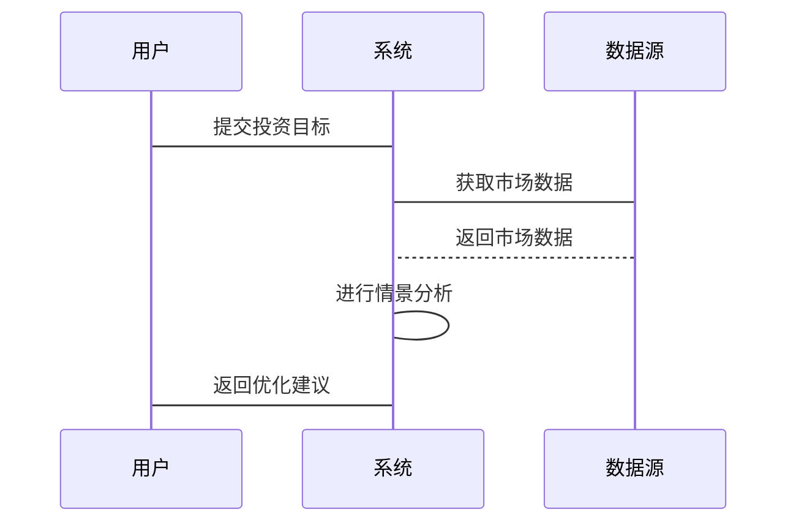

                 


# AI辅助的投资组合情景分析工具

## 关键词：AI，投资组合，情景分析，机器学习，金融建模，风险管理

## 摘要：  
本文详细探讨了AI技术在投资组合情景分析中的应用，通过分析投资组合管理的传统方法及其局限性，结合现代AI算法和大数据分析技术，提出了一种基于机器学习的情景分析工具的设计与实现方法。文章从核心概念、算法原理、系统架构设计到项目实战，全面阐述了AI辅助投资组合情景分析的理论基础和实际应用，为金融从业者和研究人员提供了实用的参考和启示。

---

# 第一部分: AI辅助的投资组合情景分析工具概述

## 第1章: 投资组合与情景分析基础

### 1.1 投资组合的基本概念

#### 1.1.1 投资组合的定义与组成  
投资组合是指将多种金融资产（如股票、债券、基金等）按照一定比例配置在一起的组合，目的是通过分散投资来降低风险并实现收益最大化。一个典型的投资组合通常包括以下组成部分：  
- **资产类别**：股票、债券、现金等。  
- **权重分配**：每种资产在组合中的比例。  
- **风险敞口**：组合对市场波动、利率变化等风险的敏感程度。  

#### 1.1.2 投资组合的目标与风险  
投资组合的目标通常包括：  
- **收益最大化**：在风险可控的前提下，追求最大化的投资收益。  
- **风险最小化**：通过分散投资降低单一资产的风险。  
- **长期稳健增长**：通过科学的配置策略实现资产的长期增值。  

投资组合的主要风险包括市场风险、流动性风险、信用风险等，情景分析是评估这些风险的重要工具。

#### 1.1.3 投资组合的分类与特点  
投资组合可以根据多种维度进行分类：  
- **按资产类别**：股票型、债券型、混合型等。  
- **按风险等级**：保守型、平衡型、激进型等。  
- **按投资策略**：主动型、被动型等。  

每种类型的组合都有其独特的风险收益特征，情景分析需要根据不同组合的特点制定相应的分析策略。

### 1.2 情景分析的定义与作用

#### 1.2.1 情景分析的定义  
情景分析（Scenario Analysis）是一种用于评估投资组合在不同市场条件下的表现的工具。它通过设定多种可能的市场情景（如牛市、熊市、经济衰退等），模拟组合在这些情景下的表现，从而帮助投资者制定更加稳健的投资策略。

#### 1.2.2 情景分析在投资中的作用  
情景分析的主要作用包括：  
- **风险评估**：识别投资组合在不同市场环境下的潜在风险。  
- **策略制定**：根据不同情景下的表现，优化资产配置策略。  
- **决策支持**：为投资者提供数据支持，帮助其做出更明智的投资决策。  

#### 1.2.3 情景分析的常见应用场景  
情景分析在以下场景中尤为重要：  
- **市场波动加剧时**：帮助投资者评估组合在极端市场条件下的表现。  
- **资产配置调整时**：通过模拟不同配置方案的效果，选择最优配置。  
- **风险管理时**：识别组合的潜在风险点，制定应对措施。  

### 1.3 AI技术在投资组合中的应用

#### 1.3.1 AI在金融领域的应用现状  
人工智能技术在金融领域的应用日益广泛，包括股票预测、信用评估、算法交易、风险控制等多个方面。AI技术的核心优势在于其强大的数据处理能力和模式识别能力。

#### 1.3.2 AI在投资组合管理中的优势  
AI技术在投资组合管理中的优势主要体现在：  
- **数据处理能力**：能够快速处理海量金融数据，提取有用的信息。  
- **预测能力**：通过机器学习模型，可以对市场走势进行预测。  
- **自动化优化**：能够根据市场变化自动调整资产配置策略。  

#### 1.3.3 AI辅助情景分析的潜力与挑战  
AI辅助情景分析的潜力巨大，但也面临一些挑战：  
- **数据质量**：需要高质量的金融数据支持模型训练。  
- **模型风险**：机器学习模型可能面临过拟合或数据偏差问题。  
- **计算成本**：复杂的模型训练需要大量计算资源。  

---

## 第2章: AI辅助投资组合情景分析的核心概念

### 2.1 AI辅助情景分析的背景与问题背景

#### 2.1.1 传统投资组合管理的局限性  
传统投资组合管理方法主要依赖于历史数据和经验判断，存在以下问题：  
- **数据驱动不足**：难以充分利用海量金融数据中的潜在信息。  
- **主观性较强**：依赖分析师的主观判断，可能引入偏差。  
- **计算效率低**：面对复杂的市场环境，手动分析效率较低。  

#### 2.1.2 情景分析在传统投资中的难点  
情景分析的传统方法存在以下难点：  
- **情景定义复杂**：需要手动定义多种市场情景，耗时耗力。  
- **情景之间的关联性**：难以准确模拟不同情景之间的相互影响。  
- **计算资源有限**：复杂的计算过程可能需要大量人工干预。  

#### 2.1.3 AI技术如何解决这些难点  
AI技术可以通过以下方式解决情景分析的难点：  
- **自动化情景生成**：利用自然语言处理和大数据分析技术，自动提取市场信息并生成情景。  
- **情景之间的关联建模**：通过机器学习模型模拟不同情景之间的相互影响。  
- **高效计算能力**：利用分布式计算和并行处理技术，提高情景分析的效率。  

### 2.2 核心概念与联系

#### 2.2.1 核心概念原理  
AI辅助投资组合情景分析的核心原理在于：  
- **数据驱动**：利用海量金融数据训练机器学习模型。  
- **自动化分析**：通过算法自动生成情景并评估组合表现。  
- **动态优化**：根据市场变化动态调整资产配置策略。  

#### 2.2.2 核心概念属性特征对比表格  
以下表格对比了传统情景分析和AI辅助情景分析的核心属性：  

| 属性               | 传统情景分析       | AI辅助情景分析       |
|--------------------|-------------------|---------------------|
| 数据来源           | 主要依赖历史数据   | 结合实时数据与历史数据 |
| 情景生成方式       | 手动定义情景       | 自动生成情景         |
| 分析效率           | 较低             | 较高               |
| 模型复杂度         | 较低             | 较高               |
| 预测准确性         | 受限于主观判断     | 提高预测准确性       |

#### 2.2.3 ER实体关系图架构的 Mermaid 流程图  
以下为AI辅助情景分析的实体关系图：  


---

## 第3章: AI辅助投资组合情景分析的算法原理

### 3.1 机器学习模型在情景分析中的应用

#### 3.1.1 常见机器学习算法介绍  
在AI辅助情景分析中，常用的机器学习算法包括：  
- **线性回归**：用于预测资产的收益与风险。  
- **支持向量机（SVM）**：用于分类市场情景。  
- **随机森林**：用于特征选择和模型预测。  

#### 3.1.2 机器学习在情景分析中的流程  
以下是机器学习在情景分析中的典型流程：  


#### 3.1.3 算法选择与优化  
在选择算法时，需要考虑以下因素：  
- **数据类型**：回归问题或分类问题。  
- **数据规模**：小数据适合线性回归，大数据适合随机森林。  
- **计算复杂度**：复杂场景可能需要使用深度学习模型。  

---

### 3.2 基于机器学习的情景分析模型

#### 3.2.1 模型构建流程  
模型构建的主要步骤包括：  
1. 数据收集与预处理：清洗数据，处理缺失值和异常值。  
2. 特征工程：提取关键特征，如市场指标、资产回报率等。  
3. 模型训练：选择合适的算法，训练模型并进行验证。  
4. 情景模拟：生成多种市场情景，模拟组合在不同情景下的表现。  

#### 3.2.2 模型训练与验证  
模型训练需要使用交叉验证等方法，确保模型的泛化能力。以下为一个简单的训练流程：  


#### 3.2.3 模型评估与优化  
模型的评估指标包括准确率、召回率、F1分数等。优化方法包括参数调优和模型融合。

### 3.3 算法原理的数学模型与公式

#### 3.3.1 回归分析模型  
回归分析用于预测资产的收益与风险，常用的回归模型为线性回归：  
$$ y = \beta_0 + \beta_1x + \epsilon $$  
其中，$y$是目标变量，$x$是自变量，$\beta_0$是截距，$\beta_1$是回归系数，$\epsilon$是误差项。

#### 3.3.2 时间序列分析模型  
时间序列分析用于预测资产的未来价格，常用的模型为ARIMA：  
$$ ARIMA(p, d, q) $$  
其中，$p$是自回归阶数，$d$是差分阶数，$q$是移动平均阶数。

#### 3.3.3 随机森林模型  
随机森林是一种集成学习算法，通过构建多棵决策树并进行投票或平均来提高模型的准确性和稳定性：  
$$ y = \sum_{i=1}^{n} \text{特征的重要性} $$  
其中，$n$是决策树的数量，$\text{特征的重要性}$是每棵树对特征的权重。

### 3.4 算法实现的Python代码示例

#### 3.4.1 数据预处理与特征提取  
以下代码示例展示了如何使用Python进行数据预处理和特征提取：  

```python
import pandas as pd
from sklearn.preprocessing import StandardScaler

# 读取数据
data = pd.read_csv('financial_data.csv')

# 删除缺失值
data = data.dropna()

# 标准化处理
scaler = StandardScaler()
data_scaled = scaler.fit_transform(data)

# 特征提取
features = data_scaled[:, :-1]
labels = data_scaled[:, -1]
```

#### 3.4.2 模型训练与验证  
以下代码示例展示了如何使用随机森林模型进行训练和验证：  

```python
from sklearn.ensemble import RandomForestRegressor
from sklearn.metrics import mean_squared_error
from sklearn.model_selection import train_test_split

# 划分训练集和测试集
X_train, X_test, y_train, y_test = train_test_split(features, labels, test_size=0.2, random_state=42)

# 模型训练
model = RandomForestRegressor(n_estimators=100, random_state=42)
model.fit(X_train, y_train)

# 模型验证
y_pred = model.predict(X_test)
print('均方误差:', mean_squared_error(y_test, y_pred))
```

#### 3.4.3 情景模拟与结果分析  
以下代码示例展示了如何进行情景模拟和结果分析：  

```python
import numpy as np
import matplotlib.pyplot as plt

# 情景模拟
np.random.seed(42)
sims = 1000
simulated_returns = np.random.normal(0.05, 0.2, sims)

# 绘制情景分布
plt.hist(simulated_returns, bins=20, alpha=0.7)
plt.xlabel('Return (%)')
plt.ylabel('Frequency')
plt.title('情景模拟结果分布')
plt.show()
```

---

## 第4章: AI辅助投资组合情景分析的系统架构设计

### 4.1 系统分析与设计

#### 4.1.1 问题场景介绍  
系统需要解决的主要问题是：如何利用AI技术实现投资组合的情景分析，并为投资者提供科学的资产配置建议。

#### 4.1.2 项目介绍  
本项目的目标是开发一个基于机器学习的投资组合情景分析工具，帮助投资者更好地理解和管理投资风险。

### 4.2 系统功能设计

#### 4.2.1 领域模型设计  
以下是领域模型的Mermaid类图：  



#### 4.2.2 系统架构设计  
以下是系统架构的Mermaid架构图：  


#### 4.2.3 系统接口设计  
系统需要以下接口：  
- **输入接口**：接收用户输入的投资目标和风险偏好。  
- **输出接口**：展示情景分析结果和优化建议。  
- **API接口**：与其他系统（如数据源、交易系统）进行交互。  

#### 4.2.4 系统交互设计  
以下是系统交互的Mermaid序列图：  



---

## 第5章: 项目实战

### 5.1 环境安装与配置

#### 5.1.1 Python环境搭建  
需要安装以下Python库：  
- `pandas`：数据处理库。  
- `numpy`：数值计算库。  
- `scikit-learn`：机器学习库。  
- `matplotlib`：数据可视化库。  

#### 5.1.2 数据源获取  
可以从以下途径获取数据：  
- **Yahoo Finance**：提供历史股价数据。  
- **Quandl**：提供结构化金融数据。  
- **本地数据**：使用自己的数据库。  

### 5.2 系统核心实现

#### 5.2.1 数据预处理与特征提取  
以下代码示例展示了如何进行数据预处理和特征提取：  

```python
import pandas as pd
import numpy as np
from sklearn.preprocessing import StandardScaler

# 读取数据
data = pd.read_csv('financial_data.csv')

# 删除缺失值
data = data.dropna()

# 标准化处理
scaler = StandardScaler()
data_scaled = scaler.fit_transform(data)

# 特征提取
features = data_scaled[:, :-1]
labels = data_scaled[:, -1]
```

#### 5.2.2 模型训练与验证  
以下代码示例展示了如何使用随机森林模型进行训练和验证：  

```python
from sklearn.ensemble import RandomForestRegressor
from sklearn.metrics import mean_squared_error
from sklearn.model_selection import train_test_split

# 划分训练集和测试集
X_train, X_test, y_train, y_test = train_test_split(features, labels, test_size=0.2, random_state=42)

# 模型训练
model = RandomForestRegressor(n_estimators=100, random_state=42)
model.fit(X_train, y_train)

# 模型验证
y_pred = model.predict(X_test)
print('均方误差:', mean_squared_error(y_test, y_pred))
```

#### 5.2.3 情景模拟与结果分析  
以下代码示例展示了如何进行情景模拟和结果分析：  

```python
import numpy as np
import matplotlib.pyplot as plt

# 情景模拟
np.random.seed(42)
sims = 1000
simulated_returns = np.random.normal(0.05, 0.2, sims)

# 绘制情景分布
plt.hist(simulated_returns, bins=20, alpha=0.7)
plt.xlabel('Return (%)')
plt.ylabel('Frequency')
plt.title('情景模拟结果分布')
plt.show()
```

### 5.3 案例分析与详细解读

#### 5.3.1 案例背景介绍  
假设我们有一个包含股票、债券和现金的投资组合，我们需要评估其在不同市场情景下的表现。

#### 5.3.2 数据收集与分析  
从Yahoo Finance获取过去5年的历史数据，包括股价、收益率、波动率等指标。

#### 5.3.3 情景模拟与优化  
通过随机森林模型生成多种市场情景，并模拟投资组合在这些情景下的表现，最终得出最优资产配置策略。

### 5.4 项目小结

---

## 第6章: 最佳实践

### 6.1 小结  
AI辅助投资组合情景分析是一种高效的风险管理工具，能够帮助投资者更好地理解和应对市场波动。

### 6.2 注意事项  
- 数据质量是模型性能的关键，需确保数据的完整性和准确性。  
- 模型需要定期更新，以适应市场环境的变化。  
- 在实际应用中，需结合市场专家的判断，避免过度依赖模型。  

### 6.3 拓展阅读  
- 《机器学习在金融中的应用》  
- 《投资组合管理与风险管理》  
- 《Python金融计算与数据分析》  

---

## 作者：AI天才研究院 & 禅与计算机程序设计艺术

---

本文通过详细阐述AI技术在投资组合情景分析中的应用，从理论到实践，全面探讨了如何利用机器学习算法优化投资组合的风险管理。希望本文能够为金融从业者和研究人员提供有价值的参考，帮助他们更好地理解和应用AI技术。

