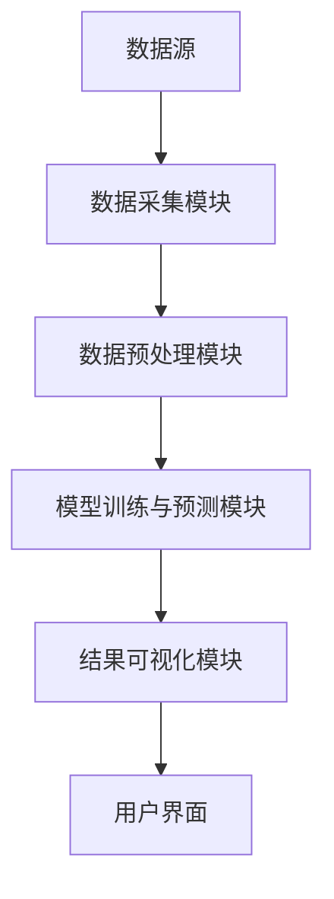
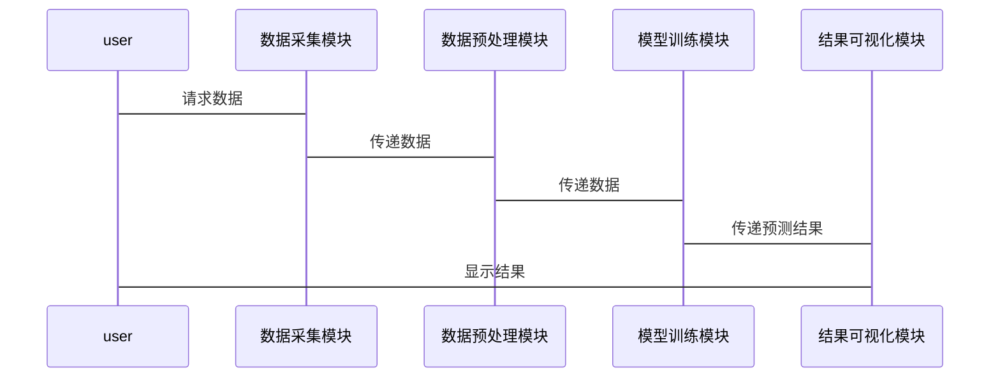

                 


# AI辅助的投资组合情景分析平台

## 关键词：AI，投资组合，情景分析，机器学习，金融，风险管理

## 摘要：  
本文探讨了如何利用人工智能技术构建投资组合情景分析平台，旨在通过智能化手段提升投资决策的效率与准确性。文章从投资组合分析的基本概念、AI技术的应用背景、系统架构设计、算法原理、项目实战等多个维度展开，详细阐述了如何利用机器学习、深度学习等技术手段，结合金融市场的复杂性，构建一个高效、可靠的投资组合情景分析系统。文章内容涵盖理论分析、系统设计、算法实现和案例解读，为读者提供了一个全面了解AI辅助投资组合分析的视角。

---

# 第1章: 投资组合情景分析的背景与问题描述

## 1.1 投资组合的定义与作用
### 1.1.1 投资组合的定义
投资组合是指将不同资产（如股票、债券、基金等）按照一定比例组合在一起，以实现风险分散和收益最大化的一种投资方式。通过合理的资产配置，投资组合能够在不同市场条件下降低风险，提高整体收益。

### 1.1.2 投资组合的作用
- **风险分散**：通过多元化投资降低单一资产的风险。
- **收益增强**：通过优化资产配置提高整体收益。
- **动态调整**：根据市场变化及时调整投资策略。

### 1.1.3 投资组合分析的核心问题
- 如何量化资产的风险与收益？
- 如何预测不同市场情景下的资产表现？
- 如何动态调整投资组合以应对市场变化？

## 1.2 AI技术在金融领域的应用背景
### 1.2.1 人工智能在金融行业的应用现状
人工智能技术在金融领域的应用日益广泛，包括智能投顾、风险管理、算法交易、信用评估等。AI技术能够处理海量数据，发现复杂模式，为金融决策提供支持。

### 1.2.2 AI在投资组合分析中的潜力
- **数据驱动的决策**：通过分析历史数据预测未来市场趋势。
- **个性化投资策略**：根据投资者风险偏好定制投资组合。
- **实时监控与调整**：利用AI技术实时跟踪市场变化，动态优化投资组合。

### 1.2.3 当前AI辅助投资组合分析的痛点
- 数据复杂性：金融市场数据具有高度不确定性和噪声。
- 模型泛化性：传统模型难以适应快速变化的市场环境。
- 计算效率：复杂计算对硬件和算法优化提出更高要求。

## 1.3 本章小结
- 投资组合分析的核心问题是如何在复杂市场环境中实现风险控制和收益最大化。
- AI技术在投资组合分析中的应用具有巨大潜力，但当前仍面临数据复杂性、模型泛化性和计算效率等挑战。

---

# 第2章: AI辅助投资组合情景分析的核心概念与联系

## 2.1 投资组合分析的核心概念
### 2.1.1 投资组合的风险与收益模型
- **风险模型**：衡量投资组合在不同市场情景下的波动性。
- **收益模型**：预测投资组合在不同情景下的收益。

### 2.1.2 投资组合的情景分析方法
- **情景生成**：基于历史数据或市场假设生成多种可能的市场情景。
- **情景评估**：评估投资组合在不同情景下的表现。
- **情景优化**：根据情景评估结果优化投资组合配置。

## 2.2 AI技术在投资组合分析中的应用原理
### 2.2.1 机器学习在投资组合分析中的作用
- **特征提取**：从海量金融数据中提取关键特征。
- **模式识别**：识别市场中的隐含规律。
- **预测建模**：构建市场趋势预测模型。

### 2.2.2 自然语言处理在投资新闻分析中的应用
- **新闻情感分析**：通过分析新闻文本判断市场情绪。
- **关键词提取**：识别影响市场的关键事件。

### 2.2.3 图神经网络在投资关系网络中的应用
- **投资关系建模**：构建资产之间的相互关系网络。
- **网络分析**：通过网络结构分析资产之间的关联性。

## 2.3 投资组合情景分析的系统架构
### 2.3.1 系统功能模块划分
- **数据采集模块**：从多种数据源获取金融数据。
- **数据预处理模块**：清洗和转换数据。
- **模型训练与预测模块**：构建并训练AI模型，生成市场情景。
- **结果可视化模块**：展示投资组合在不同情景下的表现。

### 2.3.2 系统数据流图


### 2.3.3 系统功能实体关系图（ER图）
```mermaid
erd
    投资组合
    定义关系：投资组合由多个资产构成，每个资产有独特的属性（如资产代码、权重等）。
```

---

# 第3章: AI辅助投资组合情景分析的系统架构设计

## 3.1 系统功能模块设计
### 3.1.1 数据采集模块
- **功能描述**：从股票市场、债券市场等数据源获取实时或历史数据。
- **关键步骤**：
  1. 确定数据源（如API接口、数据库）。
  2. 设计数据采集策略（如实时采集、批量采集）。

### 3.1.2 数据预处理模块
- **功能描述**：清洗数据、处理缺失值、标准化数据。
- **关键步骤**：
  1. 数据清洗：去除异常值。
  2. 数据标准化：将数据转换为统一格式。

### 3.1.3 模型训练与预测模块
- **功能描述**：构建AI模型，生成市场情景。
- **关键步骤**：
  1. 数据分割：将数据分为训练集和测试集。
  2. 模型训练：训练机器学习或深度学习模型。
  3. 情景生成：基于模型预测生成多种市场情景。

### 3.1.4 结果可视化模块
- **功能描述**：将投资组合在不同情景下的表现以图表形式展示。
- **关键步骤**：
  1. 数据可视化：使用折线图、柱状图等展示结果。
  2. 用户交互：允许用户自定义情景参数。

## 3.2 系统架构设计
### 3.2.1 分层架构设计
- **数据层**：存储原始数据和处理后的数据。
- **业务逻辑层**：实现数据采集、预处理、模型训练等功能。
- **用户界面层**：提供可视化界面供用户操作。

### 3.2.2 微服务架构设计
- **服务划分**：
  - 数据采集服务。
  - 数据处理服务。
  - 模型训练服务。
  - 结果展示服务。

### 3.2.3 可扩展性设计
- **横向扩展**：通过增加服务器提升处理能力。
- **纵向扩展**：通过升级硬件提升单点处理能力。

## 3.3 系统接口设计
### 3.3.1 数据接口
- **输入接口**：接收原始数据。
- **输出接口**：输出处理后的数据。

### 3.3.2 用户接口
- **输入接口**：接收用户的输入指令。
- **输出接口**：输出可视化结果。

### 3.3.3 API接口
- **RESTful API**：提供标准化接口供其他系统调用。

## 3.4 系统交互设计
### 3.4.1 交互流程图


---

# 第4章: AI辅助投资组合情景分析的算法原理

## 4.1 机器学习算法
### 4.1.1 线性回归
- **模型原理**：通过最小二乘法拟合数据，预测目标变量。
- **应用场景**：预测资产收益。

### 4.1.2 随机森林
- **模型原理**：通过构建多个决策树进行投票或平均。
- **应用场景**：分类和回归问题。

### 4.1.3 LSTM网络
- **模型原理**：通过长短期记忆单元捕捉时间序列数据中的模式。
- **应用场景**：预测时间序列数据。

## 4.2 深度学习算法
### 4.2.1 卷积神经网络（CNN）
- **模型原理**：通过卷积操作提取图像特征。
- **应用场景**：分析图像数据。

### 4.2.2 循环神经网络（RNN）
- **模型原理**：通过循环结构处理序列数据。
- **应用场景**：分析时间序列数据。

## 4.3 数学模型与公式
### 4.3.1 CAPM模型
$$ R_i = R_f + β_i (R_m - R_f) $$

### 4.3.2 风险调整后的收益计算
$$ \text{夏普比率} = \frac{\text{平均收益} - \text{无风险收益}}{\text{收益的标准差}} $$

---

# 第5章: 项目实战——基于AI的投资组合情景分析平台

## 5.1 环境安装与配置
### 5.1.1 安装Python
- **安装命令**：`python --version`
- **安装库**：`pip install numpy pandas scikit-learn tensorflow`

### 5.1.2 安装Jupyter Notebook
- **安装命令**：`pip install jupyter`

## 5.2 系统核心实现源代码
### 5.2.1 数据采集模块
```python
import pandas as pd
import requests

def get_stock_data(ticker, start_date, end_date):
    url = f"https://api.example.com/stock/{ticker}"
    params = {
        'start': start_date,
        'end': end_date
    }
    response = requests.get(url, params=params)
    data = response.json()
    return pd.DataFrame(data)
```

### 5.2.2 模型训练模块
```python
from sklearn.ensemble import RandomForestRegressor

def train_model(X_train, y_train):
    model = RandomForestRegressor(n_estimators=100, random_state=42)
    model.fit(X_train, y_train)
    return model
```

### 5.2.3 情景生成模块
```python
import numpy as np

def generate_scenario(model, X_test):
    y_pred = model.predict(X_test)
    scenario = pd.DataFrame({'预测收益': y_pred})
    return scenario
```

## 5.3 代码应用解读与分析
### 5.3.1 数据采集模块解读
- **功能**：从API获取股票数据。
- **关键点**：处理API返回的JSON数据，转化为DataFrame格式。

### 5.3.2 模型训练模块解读
- **功能**：使用随机森林模型训练投资收益预测模型。
- **关键点**：模型参数调优，交叉验证。

### 5.3.3 情景生成模块解读
- **功能**：基于训练好的模型生成投资组合收益预测。
- **关键点**：处理模型输出，生成可视化结果。

## 5.4 实际案例分析
### 5.4.1 数据来源
- **数据来源**：选取部分股票的历史数据。
- **数据预处理**：清洗和标准化数据。

### 5.4.2 模型训练与评估
- **训练过程**：使用训练集数据训练模型。
- **评估指标**：均方误差（MSE）、准确率。

### 5.4.3 情景分析与优化
- **情景生成**：生成多种市场情景。
- **优化策略**：根据情景结果优化投资组合配置。

## 5.5 项目总结
### 5.5.1 项目成果
- 成功构建投资组合情景分析平台。
- 实现了AI辅助的投资组合优化功能。

### 5.5.2 项目经验
- 数据预处理是关键，需要仔细清洗和标准化。
- 模型选择需要根据具体场景进行调整。

---

# 第6章: 投资组合情景分析平台的优势与展望

## 6.1 平台的优势
### 6.1.1 高效性
- 快速处理海量数据，实时生成市场情景。

### 6.1.2 准确性
- 利用AI技术提高预测的准确性。

### 6.1.3 个性化
- 根据投资者需求定制投资策略。

## 6.2 平台的展望
### 6.2.1 技术优化方向
- 引入强化学习，进一步优化投资组合。
- 集成实时数据流处理，提升系统响应速度。

### 6.2.2 应用拓展方向
- 扩展到更多金融产品，如外汇、衍生品等。
- 结合区块链技术，提升数据安全性。

---

# 作者：AI天才研究院/AI Genius Institute & 禅与计算机程序设计艺术 /Zen And The Art of Computer Programming

