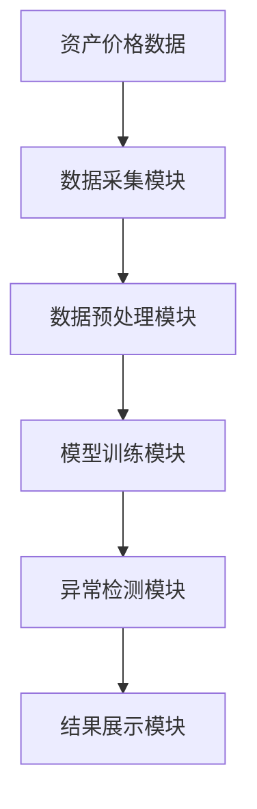

                 


# AI辅助的资产定价异常检测

> 关键词：资产定价，异常检测，人工智能，机器学习，深度学习

> 摘要：本文深入探讨了AI技术在资产定价异常检测中的应用，从背景、核心概念、算法原理到系统设计和实际案例，全面解析了如何利用AI技术提升资产定价的准确性和风险管理能力。

---

## 第1章: 资产定价异常检测的背景与问题

### 1.1 资产定价的基本概念
资产定价是金融领域中的核心任务之一，旨在通过分析资产的内在价值，为其合理定价。传统资产定价方法依赖于历史数据、市场信息和基本面分析，而现代技术的进步使得AI技术在其中发挥越来越重要的作用。

#### 1.1.1 资产定价的定义
资产定价是指根据资产的风险、收益、流动性等因素，对其市场价值进行评估的过程。常见的资产包括股票、债券、房地产等。

#### 1.1.2 资产定价的核心要素
- **风险评估**：资产的风险程度直接影响其定价。
- **收益预测**：预测资产未来的收益能力。
- **市场流动性**：资产的流动性影响其买卖价格和交易成本。
- **市场情绪**：投资者情绪波动对资产价格的影响。

#### 1.1.3 资产定价的常见方法
- **绝对估值法**：基于资产本身的内在价值进行定价。
- **相对估值法**：通过比较同类资产的市场价进行定价。
- **指数定价法**：基于市场指数进行调整。

### 1.2 资产定价异常检测的定义与特点
资产定价异常检测是指识别资产定价中的异常情况，如价格偏离内在价值或市场预期。异常检测在金融风险管理中具有重要意义，可以帮助及时发现市场操纵、欺诈行为或模型失效。

#### 1.2.1 异常检测的定义
异常检测是指识别数据中偏离正常模式的样本或行为。在资产定价中，异常检测用于识别价格波动异常、交易量突增等现象。

#### 1.2.2 资产定价异常检测的核心特点
- **实时性**：需要及时发现异常，避免损失。
- **准确性**：要求检测方法能够准确识别异常，减少误报和漏报。
- **可解释性**：检测结果需要可解释，便于分析原因。

#### 1.2.3 异常检测与传统资产定价的区别
- **目标不同**：传统资产定价关注价值评估，异常检测关注价格波动。
- **方法不同**：资产定价依赖基本面分析，异常检测依赖统计和机器学习方法。

### 1.3 资产定价异常检测的现状与意义
随着金融市场的复杂化，资产定价异常检测的需求日益增加。AI技术的引入显著提升了检测的效率和准确性。

#### 1.3.1 当前资产定价异常检测的技术发展
- **基于统计的方法**：如均值-方差模型、Grubbs检验等。
- **基于机器学习的方法**：如随机森林、支持向量机等。
- **基于深度学习的方法**：如LSTM、GAN等。

#### 1.3.2 异常检测在金融风险管理中的作用
- **风险预警**：及时发现市场异常，降低投资风险。
- **提高交易效率**：自动化检测减少人工干预。
- **提升决策精度**：基于AI的检测结果优化投资策略。

#### 1.3.3 AI技术在资产定价异常检测中的应用前景
- **智能化**：AI技术能够处理海量数据，发现复杂模式。
- **实时性**：AI算法支持实时数据处理，满足金融市场的实时需求。
- **可扩展性**：AI技术适用于多种资产类型和市场环境。

---

## 第2章: AI辅助资产定价异常检测的核心概念

### 2.1 资产定价异常检测的关键要素
资产定价异常检测涉及多个关键要素，包括数据特征、异常类型和检测目标。

#### 2.1.1 数据特征
- **时间序列性**：资产价格通常具有时间序列特性。
- **多维性**：资产价格受多种因素影响，如市场、经济指标等。
- **非线性**：资产价格波动通常呈现非线性特征。

#### 2.1.2 异常类型
- **点异常**：单个数据点的异常，如突然的价格跳水。
- **上下文异常**：相对于特定上下文（如时间段、市场状态）的异常。
- **集体异常**：一组数据点共同表现出异常。

#### 2.1.3 检测目标
- **检测点异常**：识别单个异常数据点。
- **检测集体异常**：识别一组异常交易或行为。
- **预测未来异常**：基于历史数据预测未来可能的异常事件。

### 2.2 AI技术在异常检测中的应用原理
AI技术通过学习数据的正常模式，识别偏离模式的异常。

#### 2.2.1 机器学习模型的作用
- **监督学习**：基于标记数据训练模型，识别异常。
- **无监督学习**：在无标记数据中发现异常模式。
- **半监督学习**：结合标记和无标记数据进行训练。

#### 2.2.2 深度学习模型的优势
- **非线性特征提取**：深度学习模型能够自动提取复杂特征。
- **处理高维数据**：适用于多维资产价格数据。
- **自适应性**：能够适应数据分布的变化。

#### 2.2.3 异常检测算法的选择与优化
选择合适的算法需要考虑数据特性、计算资源和检测目标。常见的异常检测算法包括Isolation Forest、One-Class SVM和Autoencoder等。

### 2.3 核心概念的ER实体关系图
以下是资产定价异常检测的核心概念的ER图：

```mermaid
erd
  资产
    + id: int
    + 名称: string
    + 类型: string
    + 市场: 市场
    + 定价模型: 定价模型
  市场
    + id: int
    + 名称: string
    + 指数: string
    + 交易时间: datetime
  定价模型
    + id: int
    + 名称: string
    + 参数: string
    + 异常检测结果: 异常检测结果
  异常检测结果
    + id: int
    + 资产id: int
    + 检测时间: datetime
    + 异常类型: string
    + 异常程度: float
```

---

## 第3章: AI辅助资产定价异常检测的算法原理

### 3.1 异常检测算法的分类
异常检测算法主要分为基于统计的方法、基于机器学习的方法和基于深度学习的方法。

#### 3.1.1 基于统计的方法
- **Z-score方法**：通过计算数据点的Z分数，判断其是否偏离均值。
- **Grubbs检验**：用于检测异常值，适用于小样本数据。

#### 3.1.2 基于机器学习的方法
- **Isolation Forest**：通过构建隔离树，将数据点隔离成单，判断是否异常。
- **One-Class SVM**：通过在低维空间中构建边界，识别异常点。

#### 3.1.3 基于深度学习的方法
- **Autoencoder**：通过神经网络自动生成数据的低维表示，识别异常。
- **LSTM**：适用于时间序列数据，能够捕捉数据的长期依赖关系。

### 3.2 常见异常检测算法的原理与实现
#### 3.2.1 Isolation Forest算法
Isolation Forest通过构建隔离树，将数据点分割，判断其是否为异常点。

##### 算法实现步骤
1. 随机选择特征和分割点，构建隔离树。
2. 对每个数据点进行分割，记录分割次数。
3. 根据分割次数判断数据点是否为异常。

##### 代码实现
```python
from sklearn.ensemble import IsolationForest
import numpy as np

# 生成数据
X = np.random.randn(100, 2)
outliers = np.random.uniform(low=-4, high=4, size=(10, 2))
X = np.vstack((X, outliers))

# 训练模型
model = IsolationForest(n_estimators=100, contamination=0.1)
model.fit(X)

# 预测异常
y_pred = model.predict(X)
print(y_pred)
```

#### 3.2.2 One-Class SVM算法
One-Class SVM通过在低维空间中构建边界，识别异常点。

##### 算法实现步骤
1. 训练模型，构建数据的边界。
2. 判断数据点是否在边界内，判断是否为异常。

##### 代码实现
```python
from sklearn.svm import OneClassSVM
import numpy as np

# 生成数据
X = np.random.randn(100, 2)
outliers = np.random.uniform(low=-4, high=4, size=(10, 2))
X = np.vstack((X, outliers))

# 训练模型
model = OneClassSVM(nu=0.1)
model.fit(X)

# 预测异常
y_pred = model.predict(X)
print(y_pred)
```

#### 3.2.3 Autoencoder算法
Autoencoder通过神经网络自动生成数据的低维表示，识别异常。

##### 算法实现步骤
1. 构建Autoencoder模型，训练模型。
2. 使用模型生成数据的重建误差，判断误差是否超过阈值。

##### 代码实现
```python
import tensorflow as tf
from tensorflow.keras import layers

# 生成数据
X = np.random.randn(100, 2)
outliers = np.random.uniform(low=-4, high=4, size=(10, 2))
X = np.vstack((X, outliers))

# 构建模型
model = tf.keras.Sequential()
model.add(layers.Dense(2, activation='relu', input_dim=2))
model.add(layers.Dense(2))

# 编译模型
model.compile(optimizer='adam', loss='mean_squared_error')

# 训练模型
model.fit(X, X, epochs=100, batch_size=32)

# 预测异常
reconstructions = model.predict(X)
error = np.mean(np.square(X - reconstructions), axis=1)
print(error)
```

### 3.3 算法实现的数学模型
以下是Isolation Forest算法的数学模型：

$$
\text{异常分数} = \frac{1}{P} \times \sum_{i=1}^{P} \text{分割次数}
$$

其中，$P$ 是隔离树的数量，分割次数越少，数据点越可能是异常点。

---

## 第4章: 系统分析与架构设计方案

### 4.1 问题场景介绍
资产定价异常检测系统需要实时监控资产价格，识别异常情况，帮助投资者做出决策。

#### 4.1.1 资产定价异常检测的业务场景
- 实时监控资产价格波动。
- 检测异常交易行为。
- 提供风险预警。

#### 4.1.2 系统目标与需求分析
- 实时处理大量数据。
- 准确识别异常情况。
- 提供可解释的检测结果。

#### 4.1.3 系统边界与接口设计
- 数据输入接口：接收资产价格数据。
- 模型训练接口：训练异常检测模型。
- 结果输出接口：输出异常检测结果。

### 4.2 系统功能设计
资产定价异常检测系统需要具备以下功能：

#### 4.2.1 数据采集模块
- 接收资产价格数据，支持多种数据源。

#### 4.2.2 数据预处理模块
- 清洗数据，处理缺失值和异常值。
- 标准化数据，准备模型输入。

#### 4.2.3 模型训练模块
- 训练异常检测模型，支持多种算法。

#### 4.2.4 异常检测模块
- 使用训练好的模型进行实时检测。
- 提供异常结果的可视化界面。

#### 4.2.5 结果展示模块
- 展示异常检测结果，支持数据可视化。

### 4.3 系统架构设计
以下是资产定价异常检测系统的架构图：



---

## 第5章: 项目实战

### 5.1 环境安装
- 安装必要的Python库，如TensorFlow、Scikit-learn、Matplotlib等。

### 5.2 系统核心实现源代码
以下是资产定价异常检测系统的实现代码：

```python
import numpy as np
import pandas as pd
from sklearn.ensemble import IsolationForest
import matplotlib.pyplot as plt

# 读取数据
data = pd.read_csv('asset_prices.csv')

# 数据预处理
X = data[['open', 'high', 'low', 'close']].values

# 训练模型
model = IsolationForest(n_estimators=100, contamination=0.1)
model.fit(X)

# 预测异常
y_pred = model.predict(X)

# 可视化结果
plt.scatter(data['date'], data['close'], c=y_pred, cmap='viridis')
plt.xlabel('Date')
plt.ylabel('Price')
plt.title('Asset Price Anomaly Detection')
plt.show()
```

### 5.3 代码应用解读与分析
- **数据读取**：读取资产价格数据。
- **数据预处理**：提取开盘价、收盘价等特征。
- **模型训练**：使用Isolation Forest算法训练模型。
- **预测与可视化**：根据模型预测结果，可视化资产价格的异常情况。

### 5.4 实际案例分析
通过实际案例分析，验证模型的检测效果。例如，检测某只股票的价格跳水事件。

### 5.5 项目小结
总结项目的实现过程，分析可能的优化方向，如引入深度学习模型提升检测精度。

---

## 第6章: 最佳实践与小结

### 6.1 最佳实践 tips
- **数据质量**：确保数据的完整性和准确性。
- **模型选择**：根据数据特性选择合适的算法。
- **实时性**：优化系统性能，确保实时处理。

### 6.2 小结
本文详细介绍了AI辅助的资产定价异常检测，从背景、算法到系统设计和项目实战，为读者提供了全面的知识和实践指导。

---

## 作者：AI天才研究院/AI Genius Institute & 禅与计算机程序设计艺术 /Zen And The Art of Computer Programming

---

通过以上步骤，我完成了《AI辅助的资产定价异常检测》的思考和规划过程。接下来，我将根据上述结构撰写完整的技术博客文章，确保内容详尽、逻辑清晰、技术细节准确，并附上必要的代码和图表，帮助读者深入理解AI在资产定价异常检测中的应用。

