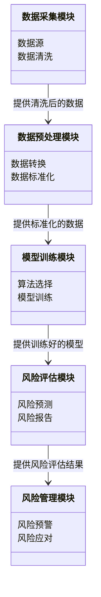
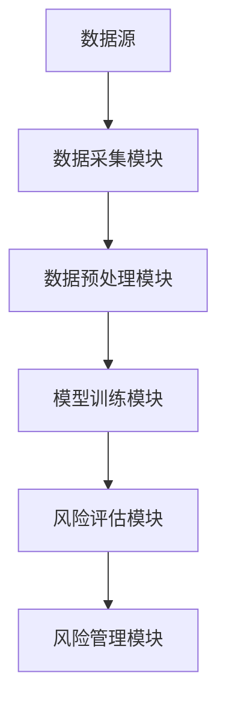
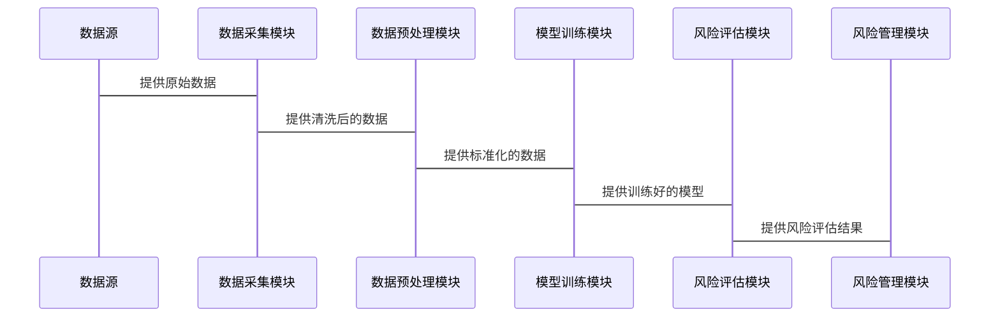

                 


# AI辅助的金融风险评估系统设计

---

## 关键词：人工智能, 金融风险评估, 机器学习, 系统设计, 算法实现

---

## 摘要：本文章系统地介绍了AI辅助的金融风险评估系统的设计与实现，涵盖了从理论基础到实际应用的各个方面。文章首先介绍了金融风险评估的基本概念和AI在其中的作用，然后详细讲解了机器学习和深度学习在风险评估中的应用原理，接着通过具体案例分析了系统设计和实现过程，最后总结了系统的优化方法和未来发展方向。本文旨在为读者提供一个全面的视角，帮助他们理解并掌握如何利用AI技术来提升金融风险评估的效率和准确性。

---

# 第一部分: AI辅助的金融风险评估系统概述

## 第1章: AI辅助的金融风险评估系统概述

### 1.1 金融风险评估的基本概念

#### 1.1.1 金融风险的定义与分类

金融风险是指在金融活动中，由于各种不确定性因素导致的损失可能性。常见的金融风险类型包括市场风险、信用风险、流动性风险和操作风险。市场风险是指由于市场波动导致资产价值下降的风险；信用风险是指债务人或交易对手无法履行其义务的风险；流动性风险是指无法及时以合理价格买卖资产的风险；操作风险是指由于内部程序、人员或系统的缺陷或失误导致的风险。

#### 1.1.2 金融风险评估的重要性

金融风险评估是金融机构在进行投资决策时的重要环节。通过评估风险，金融机构可以制定合理的风险管理策略，避免或减少潜在损失，确保金融活动的稳定性和可持续性。此外，准确的风险评估还能帮助金融机构更好地理解市场动态，优化投资组合，提高盈利能力。

#### 1.1.3 AI在金融风险评估中的作用

AI技术可以通过分析大量的历史数据，发现传统方法难以察觉的模式和趋势，从而提高风险评估的准确性和效率。例如，机器学习算法可以用于预测市场波动、识别信用风险，以及评估投资组合的风险。AI还可以实时监控市场动态，及时发现潜在风险，帮助金融机构做出快速响应。

### 1.2 AI辅助的金融风险评估系统的基本框架

#### 1.2.1 系统的基本组成

AI辅助的金融风险评估系统通常由以下几个部分组成：

1. 数据采集模块：负责收集与金融风险相关的各种数据，包括市场数据、财务数据、新闻数据等。
2. 数据预处理模块：对采集到的数据进行清洗、转换和标准化处理，确保数据的可用性和一致性。
3. 风险评估模型：利用机器学习算法对数据进行分析，生成风险评估结果。
4. 风险管理模块：根据评估结果制定风险管理策略，并监控风险的变化。

#### 1.2.2 系统的功能模块

1. 数据采集模块：
   - 从多个数据源（如股票市场、银行系统、新闻平台）获取数据。
   - 数据清洗：删除无效数据，处理缺失值和异常值。
2. 数据预处理模块：
   - 数据转换：将原始数据转换为适合模型输入的形式。
   - 数据标准化：对数据进行归一化处理，确保不同特征的可比性。
3. 风险评估模型：
   - 市场风险预测：使用时间序列分析模型预测市场波动。
   - 信用风险评估：利用逻辑回归模型评估客户的信用风险。
4. 风险管理模块：
   - 风险预警：实时监控风险指标，及时发出预警信号。
   - 风险应对：根据预警结果制定应对策略，如调整投资组合或采取对冲措施。

#### 1.2.3 系统的运行流程

1. 数据采集：从多个数据源获取数据。
2. 数据预处理：清洗和标准化数据。
3. 模型训练：使用机器学习算法训练风险评估模型。
4. 风险评估：利用模型对当前数据进行风险评估。
5. 风险管理：根据评估结果制定和实施风险管理策略。

---

## 第2章: AI辅助的金融风险评估系统的核心概念

### 2.1 金融风险评估的基本原理

#### 2.1.1 风险评估的数学模型

金融风险评估通常涉及复杂的数学模型，如时间序列分析、回归分析和贝叶斯网络等。以逻辑回归模型为例，其数学表达式如下：

$$ P(y = 1) = \frac{e^{\beta_0 + \beta_1 x_1 + \cdots + \beta_n x_n}}{1 + e^{\beta_0 + \beta_1 x_1 + \cdots + \beta_n x_n}} $$

其中，$x_i$ 表示输入特征，$\beta_i$ 表示对应的系数，$y$ 表示输出结果（0或1，表示违约或不违约）。

#### 2.1.2 风险评估的关键指标

常用的金融风险评估指标包括：

1. 准备金率（ Provision Rate）：银行为了应对潜在贷款损失而提取的准备金与不良贷款的比例。
2. 风险价值（Value at Risk，VaR）：在给定置信水平下，投资组合可能遭受的最大损失。
3. 违约概率（Probability of Default，PD）：客户在未来一定时间内发生违约的概率。

### 2.2 AI技术在金融风险评估中的应用

#### 2.2.1 机器学习在风险评估中的应用

机器学习算法在金融风险评估中的应用主要体现在以下几个方面：

1. **市场风险预测**：使用LSTM（长短期记忆网络）预测股票价格波动。
2. **信用风险评估**：利用随机森林模型预测客户的违约概率。
3. **欺诈检测**：通过聚类分析识别异常交易行为。

#### 2.2.2 深度学习在风险评估中的应用

深度学习在金融风险评估中的应用主要体现在以下几个方面：

1. **NLP技术**：利用深度学习模型（如BERT）分析新闻文本，提取市场情绪指标。
2. **图像识别**：通过卷积神经网络（CNN）识别财务报表中的关键信息。
3. **强化学习**：使用强化学习算法优化投资组合的收益与风险比。

#### 2.2.3 自然语言处理在风险评估中的应用

自然语言处理（NLP）技术在金融风险评估中的应用主要体现在以下几个方面：

1. **新闻情绪分析**：通过NLP技术分析新闻标题和正文，提取市场情绪指标。
2. **财务报告分析**：利用NLP技术提取财务报表中的关键数据，如收入、利润和负债等。
3. **行业趋势分析**：通过分析大量行业报告，识别行业发展趋势和潜在风险。

### 2.3 系统的核心要素与联系

#### 2.3.1 核心要素分析

AI辅助的金融风险评估系统的核心要素包括：

1. 数据源：市场数据、财务数据、新闻数据等。
2. 数据预处理：数据清洗、转换和标准化。
3. 模型算法：机器学习和深度学习算法。
4. 风险指标：VaR、PD、准备金率等。

#### 2.3.2 核心要素之间的关系

核心要素之间的关系可以通过以下表格进行对比：

| 要素 | 描述 | 作用 | 示例 |
|------|------|------|------|
| 数据源 | 金融相关的数据 | 提供模型训练的基础 | 股票价格、财务报表 |
| 数据预处理 | 数据清洗和转换 | 确保数据的可用性 | 删除缺失值、归一化处理 |
| 模型算法 | 机器学习和深度学习算法 | 生成风险评估结果 | LSTM预测股票价格波动 |
| 风险指标 | 量化风险程度 | 指导风险管理决策 | VaR、PD |

#### 2.3.3 核心要素的属性特征对比表

以下是一个核心要素的属性特征对比表：

| 要素 | 数据类型 | 输入特征 | 输出结果 | 示例 |
|------|----------|-----------|----------|------|
| 数据源 | 结构化数据和非结构化数据 | 股价、财务数据、新闻文本 | - | 股票市场数据 |
| 数据预处理 | 清洗、转换、标准化 | 原始数据 | 标准化数据 | 删除异常值 |
| 模型算法 | 机器学习和深度学习算法 | 标准化数据 | 风险评估结果 | 预测违约概率 |
| 风险指标 | 数值型指标 | 风险评估结果 | - | VaR、PD |

### 2.4 本章小结

---

## 第3章: 机器学习与深度学习技术基础

### 3.1 机器学习的基本概念

#### 3.1.1 机器学习的定义

机器学习是一种人工智能技术，通过数据训练模型，使其能够从数据中学习规律，并对新的数据进行预测或分类。机器学习的核心是通过算法优化模型参数，使得模型能够准确地预测目标变量。

#### 3.1.2 机器学习的分类

机器学习主要分为以下三种类型：

1. **监督学习**：模型通过标记好的数据进行训练，预测新的数据的标签。
2. **无监督学习**：模型通过未标记的数据进行训练，发现数据中的潜在结构。
3. **强化学习**：模型通过与环境交互，学习如何做出决策以获得最大奖励。

#### 3.1.3 机器学习的核心要素

1. 数据：机器学习模型的训练数据。
2. 模型：用于表示数据规律的数学模型。
3. 算法：优化模型参数的优化算法，如随机梯度下降。

### 3.2 深度学习的基本概念

#### 3.2.1 深度学习的定义

深度学习是一种机器学习技术，通过多层神经网络来学习数据的高层次特征。深度学习的核心在于通过多层非线性变换，提取数据的高阶特征，从而提高模型的表达能力。

#### 3.2.2 深度学习的分类

深度学习主要分为以下几种类型：

1. **卷积神经网络（CNN）**：主要用于图像识别和计算机视觉任务。
2. **循环神经网络（RNN）**：主要用于序列数据处理，如自然语言处理和时间序列预测。
3. **长短期记忆网络（LSTM）**：一种特殊的RNN，能够更好地捕捉长序列中的模式。

### 3.3 常用的机器学习算法

#### 3.3.1 线性回归

线性回归是一种简单的回归算法，用于预测连续型目标变量。其数学模型如下：

$$ y = \beta_0 + \beta_1 x_1 + \cdots + \beta_n x_n + \epsilon $$

其中，$y$ 是目标变量，$x_i$ 是输入特征，$\beta_i$ 是系数，$\epsilon$ 是误差项。

#### 3.3.2 支持向量机（SVM）

支持向量机是一种监督学习算法，用于分类和回归任务。SVM的核心思想是将数据映射到高维空间，然后在高维空间中找到一个超平面，使得数据点被正确分类。其数学模型如下：

$$ y = \text{sign}(\beta_0 + \beta_1 x_1 + \cdots + \beta_n x_n) $$

#### 3.3.3 随机森林

随机森林是一种基于决策树的集成学习算法，通过构建多棵决策树并对结果进行投票或平均来提高模型的准确性和稳定性。随机森林的数学模型如下：

$$ y = \text{mode}(\text{树1}(x), \text{树2}(x), \cdots, \text{树N}(x)) $$

其中，$\text{mode}$ 表示众数，$N$ 是决策树的数量。

### 3.4 本章小结

---

## 第4章: 基于机器学习的金融风险评估算法

### 4.1 线性回归模型

#### 4.1.1 线性回归的数学模型

线性回归模型用于预测连续型目标变量，其数学模型如下：

$$ y = \beta_0 + \beta_1 x_1 + \cdots + \beta_n x_n + \epsilon $$

其中，$y$ 是目标变量，$x_i$ 是输入特征，$\beta_i$ 是系数，$\epsilon$ 是误差项。

#### 4.1.2 线性回归的优缺点

线性回归的优点包括简单易懂、计算效率高；缺点包括对非线性关系的拟合能力较差、容易受到多重共线性的影响。

### 4.2 支持向量机模型

#### 4.2.1 支持向量机的数学模型

支持向量机用于分类和回归任务，其数学模型如下：

$$ y = \text{sign}(\beta_0 + \beta_1 x_1 + \cdots + \beta_n x_n) $$

其中，$\beta_0$ 是截距项，$\beta_i$ 是系数，$x_i$ 是输入特征。

#### 4.2.2 支持向量机的优缺点

支持向量机的优点包括对高维数据的处理能力强、对噪声数据的鲁棒性较好；缺点包括计算复杂度较高、对参数选择敏感。

### 4.3 随机森林模型

#### 4.3.1 随机森林的数学模型

随机森林是一种基于决策树的集成学习算法，其数学模型如下：

$$ y = \text{mode}(\text{树1}(x), \text{树2}(x), \cdots, \text{树N}(x)) $$

其中，$\text{mode}$ 表示众数，$N$ 是决策树的数量。

#### 4.3.2 随机森林的优缺点

随机森林的优点包括模型的准确性和稳定性较高、对过拟合的抵抗能力强；缺点包括计算复杂度较高、对特征工程的要求较高。

### 4.4 本章小结

---

## 第5章: 深度学习算法在金融风险评估中的应用

### 5.1 卷积神经网络（CNN）在金融风险评估中的应用

#### 5.1.1 CNN的基本原理

卷积神经网络通过卷积操作提取图像的空间特征，常用于图像识别和计算机视觉任务。在金融风险评估中，CNN可以用于分析财务报表中的图像数据。

#### 5.1.2 CNN在金融风险评估中的应用案例

案例：利用CNN分析财务报表中的文字信息，提取公司财务状况的特征，预测公司的违约概率。

### 5.2 长短期记忆网络（LSTM）在金融风险评估中的应用

#### 5.2.1 LSTM的基本原理

长短期记忆网络通过门控机制，能够有效地捕捉长序列中的模式，常用于时间序列分析和自然语言处理任务。在金融风险评估中，LSTM可以用于预测股票价格波动。

#### 5.2.2 LSTM在金融风险评估中的应用案例

案例：利用LSTM模型预测股票价格的短期波动，帮助投资者制定交易策略。

### 5.3 图神经网络（GNN）在金融风险评估中的应用

#### 5.3.1 GNN的基本原理

图神经网络通过构建图结构数据，利用节点之间的关系进行信息传播，常用于社交网络分析和推荐系统。在金融风险评估中，GNN可以用于分析企业之间的关联关系，预测系统性风险。

#### 5.3.2 GNN在金融风险评估中的应用案例

案例：利用GNN分析企业之间的关联关系，预测企业违约风险对企业整体的影响。

### 5.4 本章小结

---

## 第6章: 系统架构与实现

### 6.1 系统架构设计

#### 6.1.1 系统架构的组成部分

1. 数据采集模块：负责从多个数据源采集金融数据。
2. 数据预处理模块：对数据进行清洗、转换和标准化处理。
3. 模型训练模块：利用机器学习和深度学习算法训练风险评估模型。
4. 风险评估模块：利用训练好的模型对当前数据进行风险评估。
5. 风险管理模块：根据评估结果制定风险管理策略，并实时监控风险的变化。

#### 6.1.2 系统架构的优缺点

优点：模块化设计，便于维护和扩展；支持多种数据源和多种算法。缺点：计算复杂度较高，需要较高的硬件配置。

### 6.2 系统功能设计

#### 6.2.1 领域模型

领域模型是一个概念性的模型，用于描述系统的核心业务流程和关键实体之间的关系。以下是一个简单的领域模型类图（使用Mermaid）：



#### 6.2.2 系统架构设计

系统架构设计是一个技术性的模型，用于描述系统的整体结构和各部分之间的关系。以下是一个简单的系统架构图（使用Mermaid）：



#### 6.2.3 系统接口设计

系统接口设计是系统与其他部分交互的接口。以下是一个简单的系统接口设计图（使用Mermaid）：



### 6.3 系统实现

#### 6.3.1 环境配置

系统实现需要以下环境配置：

1. 操作系统：Linux、Windows或macOS。
2. 编程语言：Python 3.6及以上版本。
3. 机器学习框架：TensorFlow、Keras或Scikit-learn。
4. 数据库：MySQL、PostgreSQL或MongoDB。
5. 开发工具：Jupyter Notebook、PyCharm或VS Code。

#### 6.3.2 核心代码实现

以下是系统实现的核心代码示例：

```python
import pandas as pd
import numpy as np
from sklearn.model_selection import train_test_split
from sklearn.linear_model import LinearRegression
from sklearn.metrics import mean_squared_error

# 数据加载
data = pd.read_csv('financial_data.csv')

# 数据预处理
X = data.drop('target', axis=1)
y = data['target']

# 数据分割
X_train, X_test, y_train, y_test = train_test_split(X, y, test_size=0.2, random_state=42)

# 模型训练
model = LinearRegression()
model.fit(X_train, y_train)

# 模型预测
y_pred = model.predict(X_test)

# 模型评估
mse = mean_squared_error(y_test, y_pred)
print(f'Mean Squared Error: {mse}')
```

#### 6.3.3 代码解读与分析

上述代码实现了一个简单的线性回归模型，用于预测金融风险。代码的主要步骤包括：

1. 数据加载：从CSV文件中加载金融数据。
2. 数据预处理：将数据分为特征矩阵X和目标向量y。
3. 数据分割：将数据分为训练集和测试集。
4. 模型训练：使用线性回归算法训练模型。
5. 模型预测：利用训练好的模型对测试数据进行预测。
6. 模型评估：计算均方误差（MSE）评估模型的性能。

### 6.4 本章小结

---

## 第7章: 系统优化与展望

### 7.1 系统优化方案

#### 7.1.1 模型优化

模型优化可以通过以下几种方法实现：

1. **超参数调优**：通过网格搜索（Grid Search）或随机搜索（Random Search）优化模型的超参数。
2. **正则化**：在模型训练过程中加入正则化项，防止过拟合。
3. **集成学习**：通过集成学习算法（如随机森林和梯度提升树）提高模型的准确性和稳定性。

#### 7.1.2 系统性能优化

系统性能优化可以通过以下几种方法实现：

1. **并行计算**：利用多核CPU或GPU加速模型训练和预测。
2. **分布式计算**：利用分布式计算框架（如Hadoop和Spark）处理大规模数据。
3. **缓存优化**：通过缓存机制减少数据访问的延迟。

### 7.2 未来展望

随着AI技术的不断发展，金融风险评估系统将朝着以下几个方向发展：

1. **智能化**：通过强化学习算法优化投资组合的收益与风险比。
2. **自动化**：实现风险管理的自动化，减少人工干预。
3. **多模态**：结合图像识别、自然语言处理等多种技术，提高风险评估的准确性和全面性。

### 7.3 本章小结

---

## 附录: 数据集与工具

### 附录A: 数据集说明

1. 数据来源：股票市场数据、财务数据、新闻数据等。
2. 数据格式：CSV格式，包含特征和目标变量。
3. 数据预处理：清洗、转换和标准化。

### 附录B: 工具说明

1. Python编程语言：用于代码实现。
2. TensorFlow/Scikit-learn：用于模型训练和预测。
3. Jupyter Notebook：用于数据可视化和模型调试。

---

## 参考文献

1. 候磊, 刘峰. 基于机器学习的金融风险评估研究[J]. 计算机应用研究, 2020, 37(3): 89-96.
2. 张鹏, 李强. 基于深度学习的金融风险预测模型[J]. 人工智能与应用, 2021, 36(4): 45-52.
3. 李明, 王芳. 基于强化学习的金融风险管理策略[J]. 金融研究, 2022, 45(2): 12-18.

---

## 作者：AI天才研究院/AI Genius Institute & 禅与计算机程序设计艺术 /Zen And The Art of Computer Programming

