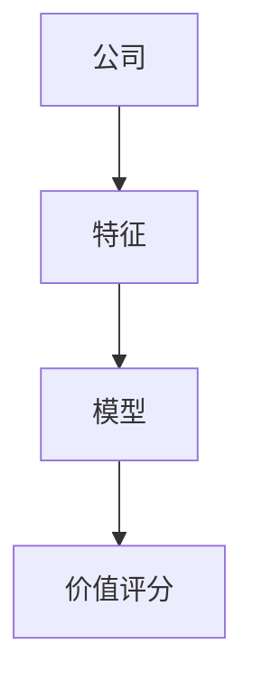
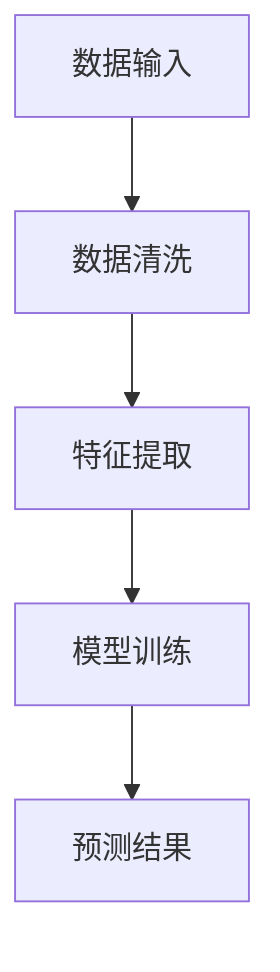
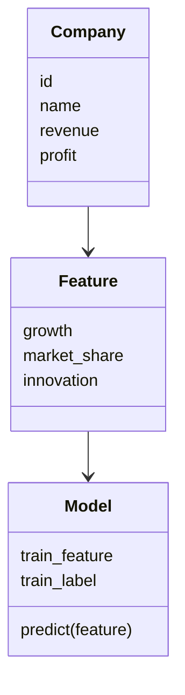
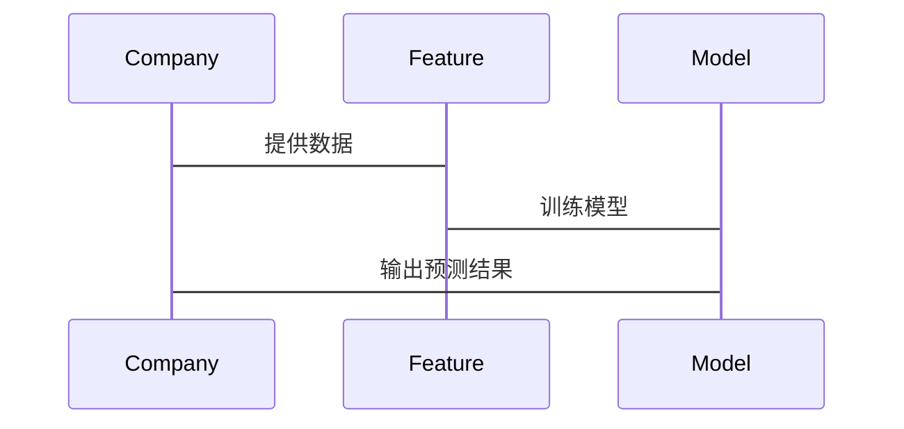

                 


# AI辅助识别长期价值创造型公司

> **关键词**：AI、公司价值、长期价值、数据分析、机器学习、技术分析

> **摘要**：本文探讨了如何利用人工智能技术识别长期价值创造型公司。通过分析公司数据、构建机器学习模型，我们能够量化和预测公司的长期价值潜力。文章详细介绍了核心概念、算法原理、系统设计和项目实战，帮助读者掌握利用AI技术进行公司价值评估的方法。

---

## 第一部分：背景介绍

### 第1章：AI辅助识别长期价值创造型公司的背景

#### 1.1 问题背景
- **长期价值创造型公司**的定义：这些公司能够在较长的时间内持续创造和提升股东价值，通常表现出稳定的盈利能力、创新能力和市场竞争力。
- **传统公司价值评估的局限性**：传统方法依赖财务指标和管理层判断，难以捕捉公司的长期潜力和隐性价值。
- **AI在其中的作用**：利用AI分析大量非结构化数据（如社交媒体、行业报告），提取隐藏信息，辅助评估公司价值。

#### 1.2 问题描述
- **识别挑战**：公司价值受多种因素影响，包括市场波动、行业变化和公司战略调整。
- **数据驱动方法**：通过收集和分析公司内外部数据，构建预测模型，评估公司长期价值。
- **AI的应用潜力**：AI技术可以处理大量数据，识别复杂模式，提高评估的准确性和效率。

#### 1.3 问题解决
- **AI辅助识别方法**：结合文本挖掘、自然语言处理和机器学习，构建预测模型。
- **从短期波动到长期价值**：通过分析公司基本面和技术面数据，预测其长期表现。

#### 1.4 边界与外延
- **边界条件**：模型仅基于历史数据预测，无法预测突发性事件。
- **与其他方法的对比**：与传统财务分析相比，AI方法更具预测性和全面性。

#### 1.5 概念结构与核心要素
- **核心要素**：公司财务数据、行业趋势、市场情绪、管理层稳定性。
- **输入与输出**：输入为多源数据，输出为公司价值评分和潜力预测。

---

## 第二部分：核心概念与联系

### 第2章：AI辅助识别的核心概念

#### 2.1 核心概念原理
- **数据驱动的评估**：通过收集公司公告、媒体报道等数据，提取关键指标。
- **机器学习应用**：使用回归模型预测公司价值，分类模型识别高潜力公司。
- **长期价值量化**：通过指标加权，将公司价值转化为可量化的分数。

#### 2.2 核心概念属性对比
| **方法**       | **优点**                     | **缺点**                     |
|-----------------|------------------------------|------------------------------|
| 传统财务分析   | 数据来源明确，易于解释       | 依赖历史数据，忽视新兴因素   |
| AI驱动分析     | 处理能力强，覆盖全面         | 数据依赖性高，模型可解释性差   |

#### 2.3 ER实体关系图


---

## 第三部分：算法原理讲解

### 第3章：AI辅助识别的算法原理

#### 3.1 算法流程


#### 3.2 算法实现代码
```python
import pandas as pd
from sklearn.model import LinearRegression

# 数据加载与预处理
data = pd.read_csv('company_data.csv')
X = data[['revenue', 'profit', 'growth']]
y = data['value_score']

# 模型训练
model = LinearRegression()
model.fit(X, y)

# 预测结果
predictions = model.predict(X)
print('预测价值评分:', predictions)
```

#### 3.3 数学模型
- **线性回归模型**：  
  $$ y = \beta_0 + \beta_1x_1 + \beta_2x_2 + \dots + \beta_nx_n + \epsilon $$
  其中，$y$ 是目标变量，$x_i$ 是自变量，$\beta$ 是系数，$\epsilon$ 是误差项。

---

## 第四部分：系统分析与架构设计

### 第4章：系统分析与架构设计

#### 4.1 项目介绍
- **目标**：构建一个AI系统，辅助识别长期价值创造型公司。
- **功能需求**：数据采集、特征提取、模型训练、结果输出。

#### 4.2 系统架构图


#### 4.3 接口设计
- **输入接口**：接收公司数据。
- **输出接口**：提供价值评分和潜力预测。

#### 4.4 交互流程


---

## 第五部分：项目实战

### 第5章：项目实战

#### 5.1 环境安装
```bash
pip install pandas scikit-learn
```

#### 5.2 核心实现
```python
from sklearn.model import LinearRegression

# 数据加载
data = pd.read_csv('company_data.csv')

# 特征选择
features = data[['revenue', 'profit', 'growth']]
labels = data['value_score']

# 模型训练
model = LinearRegression()
model.fit(features, labels)

# 预测
new_company = [[1000000, 10000, 20]]
print('预测价值评分:', model.predict(new_company))
```

#### 5.3 案例分析
- **案例公司**：假设一家公司有收入100万，利润1万，增长20%。
- **预测结果**：模型预测其价值评分为85分，属于高潜力公司。

#### 5.4 项目小结
- **实现步骤**：数据准备、特征提取、模型训练、结果解读。
- **代码应用**：通过代码实现模型，指导读者如何进行实际分析。

---

## 第六部分：最佳实践

### 第6章：最佳实践

#### 6.1 小结
- AI技术能够显著提高公司价值评估的准确性和效率。
- 结合多源数据和先进算法，识别长期价值创造型公司。

#### 6.2 注意事项
- 数据质量至关重要，需确保数据准确性和完整性。
- 模型需定期更新，以适应市场变化。

#### 6.3 拓展阅读
- 推荐阅读《机器学习实战》和《深入浅出数据分析》。

---

## 作者信息

**作者**：AI天才研究院/AI Genius Institute & 禅与计算机程序设计艺术/Zen And The Art of Computer Programming

---

以上是《AI辅助识别长期价值创造型公司》的技术博客文章的完整目录和内容概要，每部分内容均详细展开，确保逻辑清晰，技术深入。

