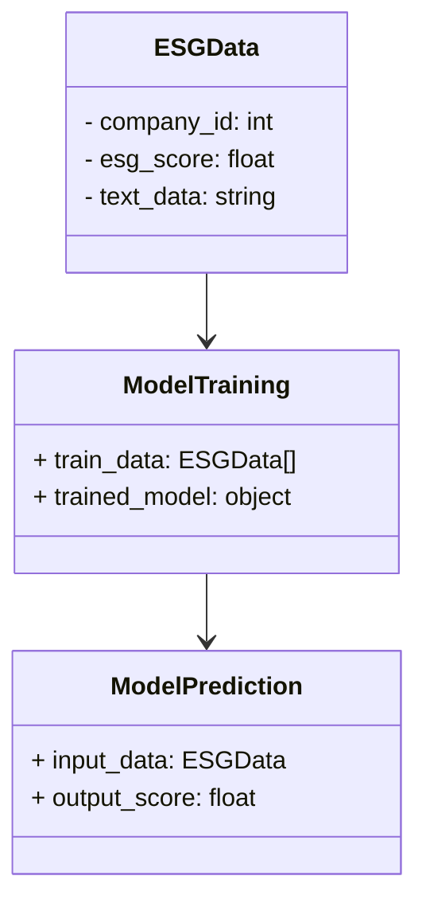
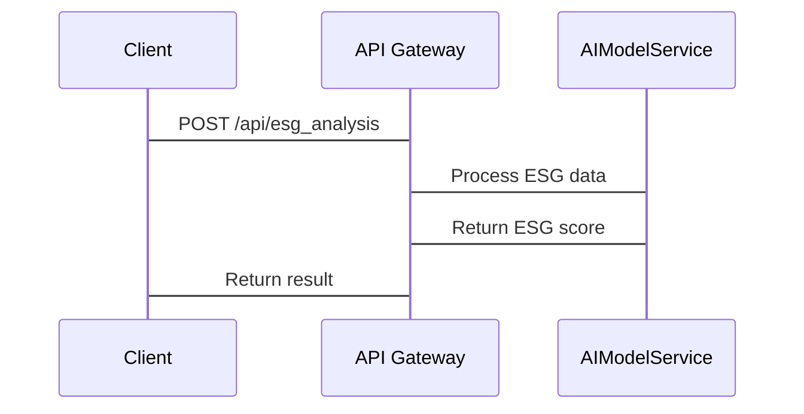

                 


# AI驱动的ESG投资分析

## 关键词：
- AI
- ESG投资
- 投资分析
- 机器学习
- 自然语言处理
- 金融数据分析
- 人工智能

## 摘要：
本文深入探讨了人工智能（AI）技术在ESG（环境、社会和治理）投资分析中的应用。通过结合机器学习和自然语言处理（NLP）等先进技术，文章详细分析了ESG投资的核心概念、算法原理、系统架构以及实际案例。我们从ESG投资的基本概念入手，逐步展开讨论，涵盖数据预处理、模型训练、结果输出等关键步骤。通过详细的技术分析和代码实现，本文为读者提供了从理论到实践的全面指导，帮助投资者更好地理解和应用AI驱动的ESG投资分析方法。

---

# 第一部分: ESG投资与AI驱动的分析背景

## 第1章: ESG投资的基本概念

### 1.1 什么是ESG投资
- ESG投资的定义
- ESG评分的计算方法
- ESG投资的核心要素：环境（E）、社会（S）、治理（G）

### 1.2 ESG投资的全球发展趋势
- ESG投资的兴起背景
- 全球ESG投资规模的增长
- 机构投资者对ESG的关注

### 1.3 AI技术在金融领域的应用背景
- 人工智能在金融分析中的作用
- ESG分析中的数据处理挑战
- AI驱动ESG投资的潜在价值

---

## 第2章: AI驱动ESG投资分析的核心概念

### 2.1 ESG指标体系的构建
- 环境（E）指标：碳排放、能源使用效率
- 社会（S）指标：员工权益、社会责任
- 治理（G）指标：公司治理结构、高管薪酬

### 2.2 AI技术在ESG分析中的应用
- 数据采集与预处理
- 模型训练与优化
- 结果输出与可视化

### 2.3 ESG分析中的关键算法
- 机器学习算法：线性回归、随机森林、支持向量机（SVM）
- 自然语言处理（NLP）技术：文本挖掘、情感分析

---

# 第二部分: ESG投资分析的核心概念与AI技术的结合

## 第3章: ESG指标体系与AI分析框架

### 3.1 ESG指标体系的构建
- 环境（E）指标：碳排放、能源使用效率
- 社会（S）指标：员工权益、社会责任
- 治理（G）指标：公司治理结构、高管薪酬

### 3.2 AI驱动的ESG分析框架
- 数据采集与预处理
- 模型训练与优化
- 结果输出与可视化

### 3.3 ESG分析中的关键算法
- 机器学习算法：线性回归、随机森林、支持向量机（SVM）
- 自然语言处理（NLP）技术：文本挖掘、情感分析

---

## 第4章: 基于机器学习的ESG评分预测

### 4.1 机器学习算法的选择与应用
- 线性回归模型
- 支持向量机（SVM）
- 随机森林与梯度提升树

### 4.2 算法原理与数学模型
- 线性回归的数学公式：$$ y = \beta_0 + \beta_1x_1 + \beta_2x_2 + \ldots + \beta_nx_n $$
- 随机森林的工作原理：基于决策树的集成学习方法
- 梯度提升树的优化策略

### 4.3 实例分析与代码实现
- 数据集的准备与预处理
- 模型训练与调参
- 模型评估与结果分析

---

## 第5章: 基于自然语言处理的ESG文本分析

### 5.1 自然语言处理（NLP）在ESG分析中的应用
- 文本挖掘与情感分析
- 信息抽取与实体识别

### 5.2 ESG文本分析的流程
- 数据清洗与分词
- 词嵌入与语义分析
- 情感分析与主题建模

### 5.3 实例分析与代码实现
- 使用Python的NLP库（如spaCy、NLTK）进行文本处理
- 情感分析模型的训练与应用
- 主题建模（如LDA）的应用与结果解读

---

# 第三部分: 系统分析与架构设计

## 第6章: 系统功能设计

### 6.1 领域模型


### 6.2 系统架构设计


### 6.3 接口设计
- API接口：数据输入、模型训练、结果输出
- 数据格式：JSON格式
- 接口调用：RESTful API

### 6.4 交互设计


---

## 第7章: 项目实战

### 7.1 环境安装
- Python 3.8+
- 机器学习库（scikit-learn、XGBoost）
- NLP库（spaCy、NLTK）
- 数据处理库（Pandas、NumPy）

### 7.2 核心代码实现
```python
import pandas as pd
from sklearn.ensemble import RandomForestRegressor
from sklearn.metrics import mean_squared_error

# 数据加载
data = pd.read_csv('esg_data.csv')

# 特征选择
features = ['feature1', 'feature2', 'feature3']
target = 'esg_score'

# 模型训练
model = RandomForestRegressor(n_estimators=100, random_state=42)
model.fit(data[features], data[target])

# 预测与评估
 predictions = model.predict(data[features])
 mse = mean_squared_error(data[target], predictions)
 print(f'MSE: {mse}')
```

### 7.3 案例分析
- 数据来源：公开的ESG评级数据
- 模型选择：随机森林回归模型
- 结果分析：模型的准确性和可解释性

---

## 第8章: 最佳实践与注意事项

### 8.1 最佳实践
- 数据清洗的重要性
- 特征工程的设计
- 模型调优的策略

### 8.2 注意事项
- 数据隐私与合规性
- 模型的可解释性
- 算法的局限性

---

## 第9章: 小结与展望

### 9.1 小结
- AI技术在ESG投资分析中的应用价值
- 相关算法和系统的实现要点

### 9.2 展望
- 更多AI技术的应用潜力
- 技术与业务结合的未来发展方向

---

# 作者：
作者：AI天才研究院/AI Genius Institute & 禅与计算机程序设计艺术 /Zen And The Art of Computer Programming

