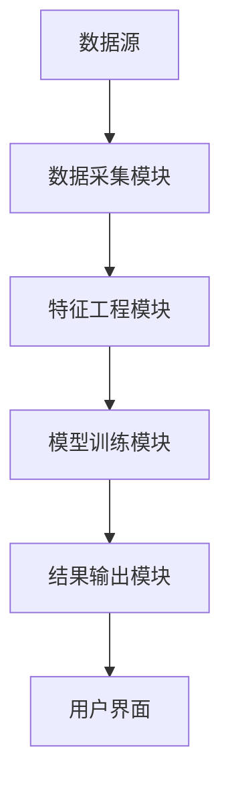

                 


# AI驱动的个人信贷审批系统设计

> 关键词：AI技术、个人信贷审批、机器学习、系统设计、信用评分

> 摘要：本文将详细介绍AI技术在个人信贷审批系统中的应用，涵盖从系统架构设计到算法实现的各个方面。通过分析传统信贷审批的挑战，介绍AI驱动系统的核心优势，并详细讲解基于机器学习的信用评分模型，结合实际案例展示系统的实现过程。最终，本文将为读者提供一套高效、可靠的AI驱动个人信贷审批系统设计方案。

---

## 第一部分: AI驱动的个人信贷审批系统概述

### 第1章: AI在个人信贷审批中的应用概述

#### 1.1 个人信贷审批的基本概念
- **1.1.1 个人信贷的定义与特点**
  - 个人信贷是指银行或其他金融机构向个人提供贷款的行为，具有金额较小、审批周期短、风险控制严格等特点。
- **1.1.2 传统信贷审批的流程与挑战**
  - 传统信贷审批流程包括申请提交、资料审核、信用评估、风险评估等环节，存在效率低、人工干预多、易受主观因素影响等问题。
- **1.1.3 AI技术在信贷审批中的作用**
  - AI技术可以通过数据分析和机器学习模型，快速评估借款人的信用风险，提高审批效率和准确性。

#### 1.2 AI驱动的信贷审批系统的优势
- **1.2.1 提高审批效率**
  - AI系统可以快速处理大量数据，缩短审批时间。
- **1.2.2 减少人为错误**
  - 通过自动化处理和模型预测，降低人为判断的误差。
- **1.2.3 支持复杂决策**
  - AI系统能够综合考虑多维度因素，做出更全面的信用评估。

#### 1.3 本书内容与目标
- **1.3.1 本书的核心目标**
  - 介绍AI技术在个人信贷审批中的应用，提供系统设计和实现的具体方法。
- **1.3.2 本书的结构安排**
  - 从基础概念到系统设计，再到实际案例，层层递进。
- **1.3.3 本书的适用读者**
  - 适用于金融从业者、数据科学家、软件开发人员以及对AI技术感兴趣的读者。

### 第2章: 个人信贷审批系统的核心要素

#### 2.1 信贷申请人的基本特征
- **2.1.1 信用历史**
  - 包括过去的贷款记录、还款情况等。
- **2.1.2 收入水平**
  - 包括工资收入、资产收益等。
- **2.1.3 资产状况**
  - 包括房产、车辆、存款等。
- **2.1.4 就业情况**
  - 包括职业稳定性、行业前景等。

#### 2.2 信贷审批的关键决策因素
- **2.2.1 借款人风险评估**
  - 通过信用评分模型评估借款人的违约风险。
- **2.2.2 还款能力分析**
  - 通过收入和负债情况判断借款人是否有足够的还款能力。
- **2.2.3 信用评分模型**
  - 使用机器学习模型对借款人进行评分，决定是否批准贷款。
- **2.2.4 宏观经济因素**
  - 包括整体经济状况、利率水平等对信贷审批的影响。

#### 2.3 系统设计的核心要素
- **2.3.1 数据采集与处理**
  - 收集借款人信息，进行数据清洗和特征提取。
- **2.3.2 模型训练与优化**
  - 使用训练好的机器学习模型进行预测和评估。
- **2.3.3 系统部署与维护**
  - 将模型部署到生产环境，定期更新和优化。
- **2.3.4 用户交互与反馈**
  - 提供用户友好的界面，收集用户反馈以改进系统。

---

## 第二部分: AI驱动的个人信贷审批系统架构

### 第3章: AI驱动的信贷审批系统架构

#### 3.1 系统架构概述
- **3.1.1 数据层**
  - 包括数据采集、存储和管理。
- **3.1.2 模型层**
  - 包括特征工程、模型训练和评估。
- **3.1.3 业务逻辑层**
  - 包括信用评分、风险评估和决策逻辑。
- **3.1.4 用户界面层**
  - 提供用户交互界面，展示审批结果。

#### 3.2 系统模块划分
- **3.2.1 数据采集模块**
  - 从数据库或外部API获取借款人信息。
- **3.2.2 特征工程模块**
  - 对数据进行清洗、特征提取和转换。
- **3.2.3 模型训练模块**
  - 使用机器学习算法训练信用评分模型。
- **3.2.4 结果输出模块**
  - 输出信用评分和审批结果。

#### 3.3 系统架构图


---

## 第三部分: 信贷审批系统中的数学模型

### 第4章: 信贷审批系统中的数学模型

#### 4.1 线性回归模型
- **4.1.1 线性回归的基本原理**
  - 线性回归是一种统计学方法，用于预测目标变量与一个或多个特征变量之间的线性关系。
- **4.1.2 线性回归的数学公式**
  $$ y = \beta_0 + \beta_1 x_1 + \beta_2 x_2 + \dots + \beta_n x_n $$
  其中，$y$ 是目标变量，$x_i$ 是特征变量，$\beta_i$ 是系数。
- **4.1.3 线性回归的应用场景**
  - 适用于简单线性关系的预测，如单变量信用评分。

#### 4.2 逻辑回归模型
- **4.2.1 逻辑回归的基本原理**
  - 逻辑回归用于分类问题，特别适用于二分类问题，如信用评分。
- **4.2.2 逻辑回归的数学公式**
  $$ P(y=1|x) = \frac{1}{1 + e^{- (\beta_0 + \beta_1 x_1 + \dots + \beta_n x_n)}} $$
- **4.2.3 逻辑回归的应用场景**
  - 适用于判断借款人是否违约。

#### 4.3 支持向量机模型
- **4.3.1 支持向量机的基本原理**
  - SVM用于分类和回归问题，特别适用于高维数据。
- **4.3.2 支持向量机的数学公式**
  $$ \text{目标函数} = \min_{\beta, \beta_0} \frac{1}{2} \|\beta\|^2 + C \sum_{i=1}^n \xi_i $$
  $$ \text{约束条件} = y_i (\beta_0 + \beta \cdot x_i) \geq 1 - \xi_i $$
- **4.3.3 支持向量机的应用场景**
  - 适用于复杂非线性关系的分类。

---

## 第四部分: 项目实战与系统优化

### 第5章: 项目实战: AI驱动的信贷审批系统实现

#### 5.1 环境安装与配置
- **5.1.1 安装Python和必要的库**
  - 使用Anaconda或virtualenv管理环境，安装scikit-learn、pandas、numpy等库。
- **5.1.2 数据集准备**
  - 获取信贷审批相关数据集，如UCI信用评分数据集。

#### 5.2 系统核心实现源代码
- **5.2.1 数据预处理**
```python
import pandas as pd
import numpy as np

# 读取数据
data = pd.read_csv('credit_data.csv')

# 数据清洗
data = data.dropna()
data = pd.get_dummies(data)
```

- **5.2.2 特征工程**
```python
from sklearn.preprocessing import StandardScaler

scaler = StandardScaler()
X = data.drop('default', axis=1)
X_scaled = scaler.fit_transform(X)
```

- **5.2.3 模型训练**
```python
from sklearn.linear_model import LogisticRegression

model = LogisticRegression()
model.fit(X_scaled, data['default'])
```

- **5.2.4 模型评估**
```python
from sklearn.metrics import accuracy_score

y_pred = model.predict(X_scaled)
print(accuracy_score(data['default'], y_pred))
```

#### 5.3 代码应用解读与分析
- **5.3.1 数据预处理**
  - 删除缺失值，将分类变量转换为虚拟变量。
- **5.3.2 特征工程**
  - 标准化特征变量，确保模型训练时各特征的重要性相同。
- **5.3.3 模型训练**
  - 使用逻辑回归模型进行训练，输出模型参数。
- **5.3.4 模型评估**
  - 使用准确率评估模型性能，分析模型的预测能力。

#### 5.4 实际案例分析和详细讲解
- **5.4.1 数据分析**
  - 通过可视化工具分析数据分布，找出影响信用评分的关键特征。
- **5.4.2 模型选择**
  - 比较不同算法的性能，选择最优模型。
- **5.4.3 系统部署**
  - 将模型部署到生产环境，提供API接口供其他系统调用。

#### 5.5 项目小结
- **5.5.1 项目总结**
  - 成功实现了AI驱动的信贷审批系统，提高了审批效率和准确性。
- **5.5.2 经验分享**
  - 数据清洗和特征工程是项目成功的关键。
- **5.5.3 未来展望**
  - 可以进一步优化模型，引入实时数据流处理，提升系统的动态适应能力。

---

## 第五部分: 最佳实践与系统优化

### 第6章: 系统优化与维护

#### 6.1 模型调优
- **6.1.1 超参数优化**
  - 使用网格搜索或随机搜索优化模型参数。
- **6.1.2 模型评估**
  - 使用交叉验证评估模型的泛化能力。
- **6.1.3 模型部署**
  - 将优化后的模型部署到生产环境，确保系统的高效运行。

#### 6.2 系统部署与监控
- **6.2.1 系统部署**
  - 使用Docker容器化部署，确保系统的可移植性和一致性。
- **6.2.2 系统监控**
  - 实时监控系统的性能指标，及时发现和处理问题。
- **6.2.3 日志管理**
  - 记录系统的运行日志，便于故障排查和优化。

#### 6.3 用户反馈与系统迭代
- **6.3.1 用户反馈收集**
  - 收集用户的使用反馈，了解系统的问题和改进建议。
- **6.3.2 系统迭代**
  - 根据用户反馈不断优化系统功能和性能。
- **6.3.3 持续学习**
  - 定期更新模型，确保系统能够适应市场变化和用户需求。

---

## 第六部分: 结语与展望

### 7.1 结语
- AI技术正在深刻改变金融行业的运作方式，个人信贷审批系统作为其中的重要组成部分，具有广阔的应用前景。
- 通过本书的学习，读者可以掌握AI驱动的信贷审批系统的设计和实现方法，为未来的金融创新打下坚实的基础。

### 7.2 未来展望
- 随着AI技术的不断发展，信贷审批系统将更加智能化和自动化。
- 可能的方向包括引入强化学习、图神经网络等新技术，进一步提升系统的决策能力和适应性。

---

## 作者信息

作者：AI天才研究院/AI Genius Institute  
联系邮箱：contact@aicreditapproval.com  
GitHub链接：https://github.com/aicreditapproval  
官方网站：https://www.aicreditapproval.com  

---

**注意：** 本文档为《AI驱动的个人信贷审批系统设计》的目录大纲，实际内容将涵盖每个章节的详细讲解，包括数学公式、算法实现、系统架构图和实际案例分析。

