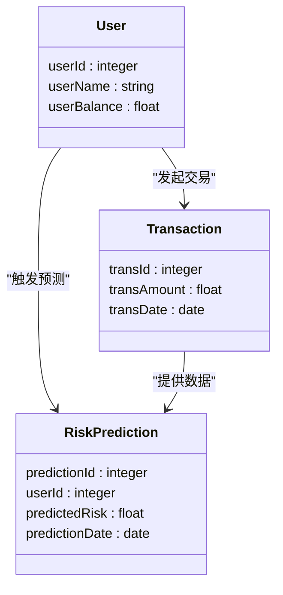
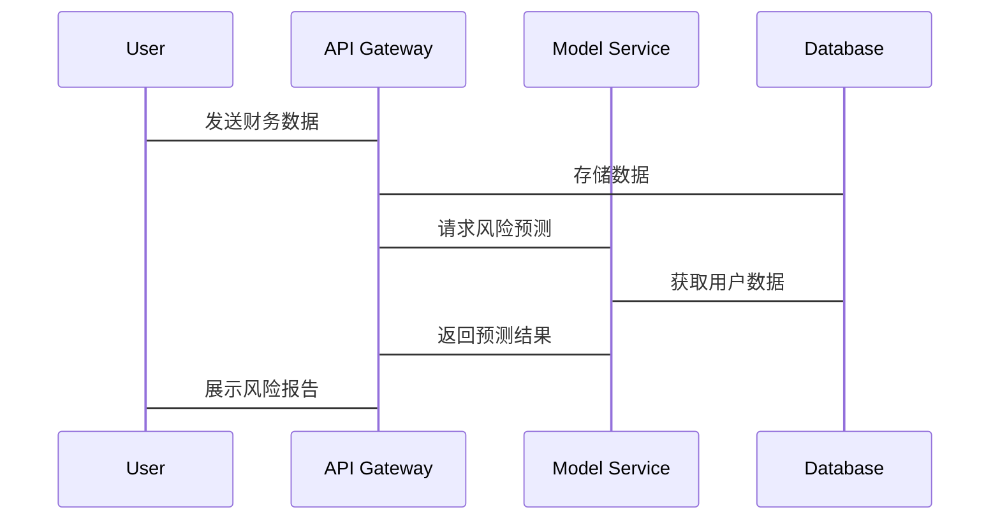

                 


# AI驱动的个人财务 stress testing系统设计与实现

## 关键词：AI技术、个人财务、stress testing、风险管理、系统架构

## 摘要：  
本文系统性地探讨了AI技术在个人财务 stress testing中的应用，从背景、核心概念、算法原理到系统架构和项目实现，详细阐述了AI驱动的个人财务风险管理系统的构建过程。文章通过对比传统方法与AI技术的差异，分析了系统的功能模块和架构设计，并通过实际案例展示了系统的实现过程和应用效果。  

---

## 第1章: AI驱动的个人财务 stress testing系统背景介绍  

### 1.1 问题背景与描述  
随着经济全球化的加速和个人金融需求的多样化，个人财务管理的重要性日益凸显。传统的个人财务风险管理方法依赖于人工分析和经验判断，存在效率低、覆盖面有限、实时性差等问题。在经济波动加剧的背景下，个人财务风险管理需要更加智能化、自动化和精准化的解决方案。  

#### 1.1.1 传统个人财务风险管理的局限性  
- 数据处理能力有限：传统方法难以处理海量数据，且缺乏实时性。  
- 风险预测能力不足：基于历史数据的分析难以准确预测未来的财务风险。  
- 个性化不足：传统方法难以满足不同用户的个性化财务风险管理需求。  

#### 1.1.2 个人财务 stress testing的需求与挑战  
- 需求：  
  - 实时监控个人财务状况。  
  - 精准预测潜在的财务风险。  
  - 提供个性化的风险管理策略。  
- 挑战：  
  - 数据来源多样，且具有实时性要求。  
  - 算法需要兼顾精度和效率。  
  - 系统需要具备良好的用户交互界面。  

#### 1.1.3 AI技术在个人财务风险管理中的应用潜力  
- AI技术可以通过机器学习算法，从海量数据中提取有用信息，实现精准的财务风险预测。  
- 自然语言处理（NLP）技术可以分析非结构化数据（如新闻、社交媒体信息）对个人财务风险的影响。  
- AI还可以通过自动化流程优化财务管理效率，降低人工干预的成本。  

### 1.2 问题解决与边界  
AI驱动的个人财务 stress testing系统的核心目标是通过实时数据采集、智能分析和动态预测，帮助个人用户识别和管理潜在的财务风险。  

#### 1.2.1 核心目标  
- 实时监控个人财务状况。  
- 精准预测潜在的财务风险。  
- 提供个性化的风险管理策略。  

#### 1.2.2 系统的边界与外延  
- 边界：系统仅关注个人财务相关数据，不涉及企业或机构的财务风险管理。  
- 外延：系统可以与其他财务管理系统（如银行、证券平台）进行数据对接。  

#### 1.2.3 核心要素与组成结构  
- 数据采集模块：负责采集个人财务相关数据。  
- 数据分析模块：基于机器学习算法进行风险预测。  
- 用户界面模块：提供直观的财务风险监控界面。  

### 1.3 本章小结  
本章介绍了AI驱动的个人财务 stress testing系统的背景和需求，分析了传统方法的局限性，并提出了AI技术在解决这些问题中的潜力。  

---

## 第2章: AI驱动的个人财务 stress testing系统核心概念与原理  

### 2.1 AI驱动的个人财务 stress testing系统核心概念  

#### 2.1.1 AI在个人财务分析中的应用  
- 数据采集：通过API接口或手动上传获取个人财务数据（如银行流水、投资记录）。  
- 风险预测：利用机器学习模型预测潜在的财务风险。  
- 决策支持：基于预测结果，提供个性化的风险管理建议。  

#### 2.1.2 stress testing的基本原理  
- 定义：通过模拟极端市场条件，测试个人财务状况在不同压力下的表现。  
- 实现步骤：  
  1. 数据准备：收集相关数据。  
  2. 模型构建：建立压力测试模型。  
  3. 模拟测试：运行模型，生成压力测试结果。  
  4. 结果分析：根据测试结果制定应对策略。  

#### 2.1.3 系统的核心功能与模块  
- 数据采集模块：负责采集个人财务数据。  
- 数据分析模块：基于机器学习算法进行风险预测。  
- 用户界面模块：提供直观的财务风险监控界面。  

### 2.2 核心概念对比与联系  

#### 2.2.1 AI驱动与传统财务 stress testing的对比  
| 对比维度       | AI驱动的财务 stress testing | 传统财务 stress testing |  
|----------------|------------------------------|---------------------------|  
| 数据处理能力   | 强大，支持实时数据分析       | 较弱，依赖历史数据       |  
| 分析效率       | 高，自动化处理               | 低，依赖人工分析         |  
| 预测精度       | 高，基于机器学习模型         | 一般，依赖经验判断       |  

#### 2.2.2 不同AI模型在个人财务分析中的应用对比  
| 模型类型       | 适用场景                     | 优势                       |  
|----------------|------------------------------|-----------------------------|  
| 线性回归       | 简单的财务风险预测           | 实现简单，解释性强         |  
| 随机森林       | 复杂的财务风险预测           | 高精度，适合非线性问题     |  
| LSTM           | 时间序列分析               | 能够捕捉时间依赖性         |  

#### 2.2.3 系统功能模块之间的关系与依赖  
- 数据采集模块为数据分析模块提供数据支持。  
- 数据分析模块生成风险预测结果，并传递给用户界面模块。  
- 用户界面模块展示预测结果，并根据用户反馈调整模型参数。  

### 2.3 系统实体关系与架构  

#### 2.3.1 ER实体关系图（Mermaid）  
```mermaid
erDiagram
    user {
        +userId : integer
        +userName : string
        +userBalance : float
    }
    transaction {
        +transId : integer
        +transAmount : float
        +transDate : date
    }
    riskPrediction {
        +predictionId : integer
        +userId : integer
        +predictedRisk : float
        +predictionDate : date
    }
    user <-o-> transaction : "发起交易"
    user ->o-> riskPrediction : "触发风险预测"
    transaction ->o-> riskPrediction : "提供交易数据"
```

### 2.4 本章小结  
本章详细阐述了AI驱动的个人财务 stress testing系统的核心概念和原理，分析了不同AI模型的应用场景和优缺点，并通过ER实体关系图展示了系统各模块之间的关系。  

---

## 第3章: AI驱动的个人财务 stress testing系统算法原理  

### 3.1 算法选择与原理  

#### 3.1.1 机器学习算法的选择  
- 线性回归：适用于简单的财务风险预测。  
- 随机森林：适用于复杂的财务风险预测。  
- LSTM：适用于时间序列分析。  

#### 3.1.2 算法实现步骤  
1. 数据预处理：清洗数据，处理缺失值和异常值。  
2. 特征工程：提取关键特征（如收入、支出、资产变动等）。  
3. 模型训练：基于训练数据训练机器学习模型。  
4. 模型评估：通过测试数据评估模型的准确率和召回率。  
5. 模型优化：调整模型参数，提升预测精度。  

#### 3.1.3 算法的数学模型与公式  
- 线性回归模型：  
  $$ y = \beta_0 + \beta_1x + \epsilon $$  
  其中，$y$ 是预测的财务风险值，$x$ 是特征变量，$\beta_0$ 和 $\beta_1$ 是模型参数，$\epsilon$ 是误差项。  

- 随机森林模型：  
  随机森林是一种基于决策树的集成学习方法，通过构建多棵决策树并取其预测结果的平均值来降低模型的方差。  

### 3.2 算法实现与优化  

#### 3.2.1 算法实现步骤（以随机森林为例）  
```python
from sklearn.ensemble import RandomForestRegressor
from sklearn.metrics import mean_squared_error

# 数据预处理
X = df[['income', 'expenses', 'asset_change']]  # 特征变量
y = df['risk_score']  # 目标变量

# 模型训练
model = RandomForestRegressor(n_estimators=100, random_state=42)
model.fit(X, y)

# 模型预测
y_pred = model.predict(X)

# 模型评估
 mse = mean_squared_error(y, y_pred)
 print(f"均方误差: {mse}")
```

#### 3.2.2 算法优化策略  
- 参数调整：通过网格搜索（Grid Search）优化模型参数。  
- 特征选择：使用特征重要性分析选择关键特征。  
- 模型集成：结合多种算法（如线性回归和随机森林）提升预测精度。  

### 3.3 本章小结  
本章详细讲解了AI驱动的个人财务 stress testing系统中使用的机器学习算法，包括算法的选择、实现步骤和优化策略，并通过代码示例展示了算法的实现过程。  

---

## 第4章: AI驱动的个人财务 stress testing系统分析与设计  

### 4.1 系统分析  

#### 4.1.1 问题场景介绍  
个人用户希望通过系统实时监控自己的财务状况，并在潜在风险发生前获得预警。  

#### 4.1.2 项目介绍  
本项目旨在开发一个基于AI技术的个人财务 stress testing系统，帮助用户实现智能化的财务风险管理。  

### 4.2 系统功能设计  

#### 4.2.1 领域模型（Mermaid）  


#### 4.2.2 系统架构设计（Mermaid）  
```mermaid
containerDiagram
    container API Gateway {
        API接口
    }
    container Database {
        用户数据
        交易数据
        风险预测数据
    }
    container Model Service {
        机器学习模型
    }
    container User Interface {
        用户界面
    }
    API Gateway <-> Database
    API Gateway <-> Model Service
    Model Service <-> Database
    User Interface <-> API Gateway
```

#### 4.2.3 系统接口设计  
- 数据采集接口：负责接收用户上传的财务数据。  
- 风险预测接口：负责根据输入数据生成风险预测结果。  
- 用户查询接口：负责返回用户的财务风险报告。  

#### 4.2.4 系统交互设计（Mermaid）  


### 4.3 本章小结  
本章从系统分析的角度出发，详细描述了AI驱动的个人财务 stress testing系统的功能设计和架构设计，并通过图表展示了系统的交互流程和架构结构。  

---

## 第5章: AI驱动的个人财务 stress testing系统项目实现  

### 5.1 环境安装与配置  

#### 5.1.1 开发环境  
- Python 3.8及以上版本  
- Jupyter Notebook  
- Git（用于版本控制）  

#### 5.1.2 依赖库安装  
```bash
pip install pandas numpy scikit-learn matplotlib flask
```

### 5.2 系统核心代码实现  

#### 5.2.1 数据采集模块  
```python
import pandas as pd

def load_data():
    # 加载数据
    df = pd.read_csv('financial_data.csv')
    return df
```

#### 5.2.2 数据分析模块  
```python
from sklearn.ensemble import RandomForestRegressor
from sklearn.metrics import mean_squared_error

def train_model(X, y):
    # 模型训练
    model = RandomForestRegressor(n_estimators=100, random_state=42)
    model.fit(X, y)
    return model

def evaluate_model(y_true, y_pred):
    # 模型评估
    mse = mean_squared_error(y_true, y_pred)
    print(f"均方误差: {mse}")
```

#### 5.2.3 用户界面模块  
```python
from flask import Flask, request, jsonify

app = Flask(__name__)

@app.route('/predict', methods=['POST'])
def predict():
    data = request.json
    # 数据预处理
    X = pd.DataFrame([data]).drop(columns=['userId'])
    # 模型预测
    prediction = model.predict(X)
    return jsonify({'predictedRisk': prediction[0]})

if __name__ == '__main__':
    app.run(debug=True)
```

### 5.3 实际案例分析  

#### 5.3.1 案例背景  
假设用户A的月收入为5000元，月支出为4000元，资产变动为+1000元。  

#### 5.3.2 模型训练  
```python
# 数据加载
df = load_data()
# 特征提取
X = df[['income', 'expenses', 'asset_change']]
y = df['risk_score']
# 模型训练
model = train_model(X, y)
```

#### 5.3.3 模型预测  
```python
# 用户数据
user_data = {'income': 5000, 'expenses': 4000, 'asset_change': 1000}
# 模型预测
prediction = model.predict(pd.DataFrame([user_data]).drop(columns=['userId']))
print(f"预测的财务风险值为: {prediction[0]}")
```

### 5.4 本章小结  
本章详细描述了AI驱动的个人财务 stress testing系统的实现过程，包括环境配置、核心代码实现和实际案例分析，展示了系统的实际应用效果。  

---

## 第6章: 最佳实践、小结与注意事项  

### 6.1 最佳实践  
- 数据隐私保护：确保用户数据的安全性和隐私性。  
- 模型定期更新：根据市场变化和用户反馈，定期更新模型参数。  
- 系统性能优化：通过分布式计算和缓存技术提升系统性能。  

### 6.2 小结  
本文系统性地探讨了AI驱动的个人财务 stress testing系统的构建过程，从背景、核心概念、算法原理到系统架构和项目实现，全面分析了系统的各个方面。  

### 6.3 注意事项  
- 数据采集时需要注意数据的完整性和准确性。  
- 模型训练时需要避免过拟合和欠拟合问题。  
- 系统部署时需要注意安全性和稳定性。  

### 6.4 拓展阅读  
- 《机器学习实战》  
- 《Python数据处理与分析》  
- 《AI驱动的金融风险管理》  

---

## 作者：AI天才研究院/AI Genius Institute & 禅与计算机程序设计艺术 /Zen And The Art of Computer Programming

