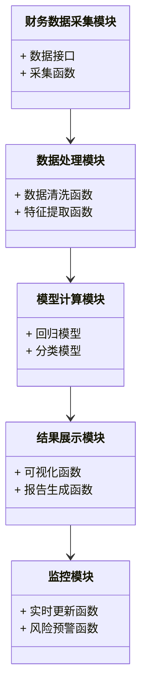
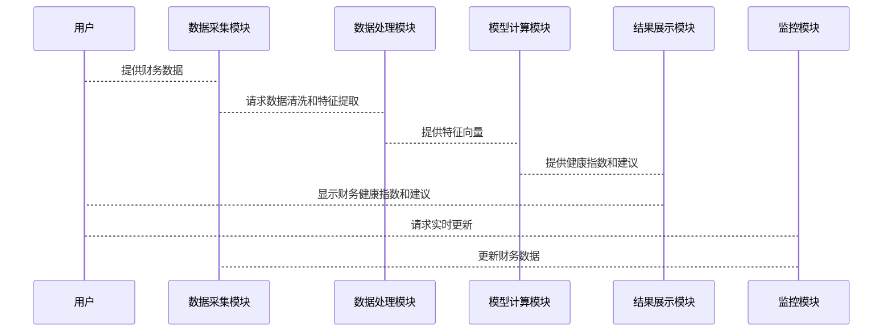

                 


# AI驱动的个人财务健康指数计算与监控系统

## 关键词：
- AI驱动
- 财务健康指数
- 个人财务管理
- 机器学习
- 系统架构

## 摘要：
本文深入探讨了AI在个人财务健康指数计算与监控系统中的应用。通过分析财务数据的特征、选择合适的机器学习算法、设计系统的架构，并结合实际案例，本文详细讲解了如何利用AI技术实现个人财务管理的智能化。文章从背景介绍、核心概念、算法原理、系统架构设计到项目实战，全面覆盖了AI驱动的个人财务健康指数计算与监控系统的核心内容。

---

# 第一部分: AI驱动的个人财务健康指数计算与监控系统背景介绍

## 第1章: 个人财务健康指数的定义与问题背景

### 1.1 个人财务健康指数的定义

#### 1.1.1 财务健康指数的核心概念
财务健康指数是衡量个人财务状况健康程度的量化指标，通常基于收入、支出、资产、负债、信用评分等多维度数据进行计算。其核心目标是帮助个人了解自身财务状况，优化财务管理策略。

#### 1.1.2 财务健康指数的计算维度
- **收入**：包括工资、投资收益、租金收入等。
- **支出**：包括日常生活开支、债务还款、投资支出等。
- **资产**：包括现金、银行存款、房产、股票等。
- **负债**：包括信用卡欠款、贷款、其他债务等。
- **信用评分**：反映个人信用状况的重要指标。

#### 1.1.3 财务健康指数的评价标准
财务健康指数通常以0到100的分数表示，分数越高表示财务状况越健康。例如：
- 0-30分：较差的财务状况，需要立即采取行动。
- 31-60分：中等财务状况，需要优化管理。
- 61-100分：健康的财务状况，具备较强的抗风险能力。

#### 1.1.4 财务健康指数的实际应用场景
- 个人财务管理工具（如预算软件、理财APP）。
- 银行和金融机构的风险评估。
- 个人信用评分的补充指标。

#### 1.1.5 财务健康指数的边界与限制
- 数据的准确性和完整性。
- 模型的适用性和可解释性。
- 用户隐私和数据安全。

### 1.2 个人财务健康指数计算的背景与问题

#### 1.2.1 传统财务健康评估的局限性
- 传统方法通常基于简单的财务指标（如收支平衡表），缺乏动态性和预测性。
- 无法有效捕捉个人财务状况的复杂性和变化趋势。
- 数据处理能力有限，难以应对海量、实时的财务数据。

#### 1.2.2 AI驱动的财务健康评估的优势
- 基于机器学习算法，能够处理多维度、非线性的财务数据。
- 具备实时性和动态性，能够根据最新的财务数据调整评估结果。
- 可以通过深度学习模型捕捉数据中的隐含模式和潜在风险。

#### 1.2.3 财务健康指数在个人财务管理中的作用
- 帮助个人实时了解财务状况，制定合理的财务规划。
- 识别潜在的财务风险，提前采取预防措施。
- 提供个性化的财务建议，优化资产配置和债务管理。

## 第2章: 个人财务健康指数计算的核心概念

### 2.1 财务数据的特征分析

#### 2.1.1 财务数据的分类
- 结构化数据：如收入、支出、资产、负债等。
- 非结构化数据：如银行对账单、交易记录、财务报告等。

#### 2.1.2 财务数据的预处理方法
- 数据清洗：处理缺失值、异常值、重复值。
- 数据转换：标准化、归一化、特征工程。
- 数据增强：通过数据扩展技术提高模型的泛化能力。

#### 2.1.3 财务数据的特征提取
- 时间序列特征：如月度支出波动、季度收入增长。
- 关键指标特征：如支出与收入比、资产与负债比。
- 行为特征：如消费习惯、借贷频率。

#### 2.1.4 财务数据的特征工程
- 特征选择：通过相关性分析选择重要特征。
- 特征组合：将多个特征组合成新的特征。
- 特征变换：如将非线性特征转换为线性特征。

### 2.2 AI算法在财务健康指数计算中的应用

#### 2.2.1 机器学习算法的选择
- 线性回归：适合简单的线性关系，如收入与支出的关系。
- 支持向量机（SVM）：适合分类问题，如健康与不健康的财务状况。
- 随机森林：适合处理高维数据，能够捕捉非线性关系。
- K近邻算法（KNN）：适合分类和回归问题。

#### 2.2.2 深度学习算法的适用性
- 神经网络：适合处理复杂的非线性关系。
- LSTM：适合处理时间序列数据，如月度财务数据。
- 卷积神经网络（CNN）：适合处理图像数据，但在财务数据中的应用较少。

#### 2.2.3 财务健康指数计算的模型构建
- 数据预处理：清洗、转换、特征工程。
- 模型选择：基于数据特征选择合适的算法。
- 模型训练：使用训练数据拟合模型。
- 模型评估：通过测试数据评估模型的性能。
- 模型优化：调整超参数，防止过拟合或欠拟合。

### 2.3 财务健康指数计算的系统架构

#### 2.3.1 系统功能模块划分
- 数据采集模块：负责收集个人的财务数据。
- 数据处理模块：对数据进行清洗、转换和特征提取。
- 模型计算模块：基于机器学习算法计算财务健康指数。
- 结果展示模块：将计算结果以可视化形式呈现给用户。
- 监控模块：实时跟踪财务数据的变化，动态更新健康指数。

#### 2.3.2 系统输入输出的定义
- 输入：用户的财务数据（如银行对账单、交易记录、资产信息）。
- 输出：财务健康指数的数值和相关建议。

#### 2.3.3 系统边界与外延
- 数据来源：仅限于个人提供的财务数据。
- 计算范围：不涉及企业或机构的财务数据。
- 应用场景：仅限于个人财务管理。

---

# 第二部分: AI驱动的个人财务健康指数计算算法原理

## 第3章: 机器学习算法在财务健康指数计算中的应用

### 3.1 线性回归算法

#### 3.1.1 线性回归的基本原理
线性回归是一种统计学方法，用于建立自变量与因变量之间的线性关系。其基本假设是因变量与自变量之间存在线性关系。

#### 3.1.2 线性回归的数学模型
线性回归的数学模型可以表示为：
$$ y = \beta_0 + \beta_1x_1 + \beta_2x_2 + \dots + \beta_nx_n + \epsilon $$
其中，$y$ 是因变量，$x_i$ 是自变量，$\beta_i$ 是回归系数，$\epsilon$ 是误差项。

#### 3.1.3 线性回归在财务健康指数中的应用
线性回归可以用于预测个人的财务健康指数。例如，基于收入和支出数据，预测个人的财务健康指数。

#### 3.1.4 线性回归的优缺点
- 优点：简单易懂，计算速度快。
- 缺点：只能处理线性关系，对非线性关系的处理能力有限。

### 3.2 随机森林算法

#### 3.2.1 随机森林的基本原理
随机森林是一种基于决策树的集成学习算法，通过构建多棵决策树并进行投票或平均来提高模型的准确性和稳定性。

#### 3.2.2 随机森林的数学模型
随机森林的数学模型可以表示为：
$$ y = \text{median}(\{f_1(x), f_2(x), \dots, f_n(x)\}) $$
其中，$f_i(x)$ 是第i棵决策树的输出，$\text{median}$ 是中位数函数。

#### 3.2.3 随机森林在财务健康指数中的应用
随机森林可以用于分类和回归问题，适合处理高维数据和非线性关系。例如，基于多维财务数据，预测个人的财务健康指数。

#### 3.2.4 随机森林的优缺点
- 优点：能够处理高维数据，对噪声数据具有较强的鲁棒性。
- 缺点：模型的可解释性较差，计算复杂度较高。

### 3.3 算法对比与选择

#### 3.3.1 线性回归与随机森林的对比
- 线性回归适用于简单的线性关系，而随机森林适用于复杂的非线性关系。
- 线性回归的计算速度较快，而随机森林的计算速度较慢。
- 线性回归的模型可解释性较好，而随机森林的模型可解释性较差。

#### 3.3.2 算法选择的依据
- 数据特征：如果数据特征简单且线性关系较强，选择线性回归；如果数据特征复杂且非线性关系较强，选择随机森林或深度学习算法。
- 模型性能：通过交叉验证等方法评估不同算法的性能，选择性能最优的算法。
- 模型可解释性：根据实际需求，选择模型可解释性较高的算法。

#### 3.3.3 算法优化的策略
- 超参数调优：通过网格搜索等方法优化算法的超参数。
- 特征选择：通过特征重要性分析选择对目标变量影响较大的特征。
- 模型集成：通过集成学习方法（如投票、加权平均）提高模型的准确性和稳定性。

## 第4章: 深度学习算法在财务健康指数计算中的应用

### 4.1 神经网络的基本原理

#### 4.1.1 神经网络的结构
神经网络由输入层、隐藏层和输出层组成。输入层负责接收输入数据，隐藏层负责处理数据，输出层负责输出结果。

#### 4.1.2 神经网络的训练过程
神经网络的训练过程包括前向传播和反向传播两个阶段。前向传播阶段，输入数据通过网络计算出输出结果；反向传播阶段，计算损失函数并更新网络参数。

#### 4.1.3 神经网络在财务健康指数中的应用
神经网络可以用于分类和回归问题，适合处理复杂的非线性关系。例如，基于多维财务数据，预测个人的财务健康指数。

### 4.2 LSTM网络的应用

#### 4.2.1 LSTM网络的基本原理
LSTM（长短期记忆网络）是一种特殊的RNN（循环神经网络），通过引入记忆单元和遗忘门，能够有效地捕捉时间序列数据中的长期依赖关系。

#### 4.2.2 LSTM网络的数学模型
LSTM网络的数学模型可以表示为：
$$ f_t = \sigma(W_f \cdot [h_{t-1}, x_t] + b_f) $$
$$ i_t = \sigma(W_i \cdot [h_{t-1}, x_t] + b_i) $$
$$ o_t = \sigma(W_o \cdot [h_{t-1}, x_t] + b_o) $$
$$ c_t = f_t \cdot c_{t-1} + i_t \cdot tanh(W_c \cdot [h_{t-1}, x_t] + b_c) $$
$$ h_t = o_t \cdot tanh(c_t) $$
其中，$f_t$ 是遗忘门，$i_t$ 是输入门，$o_t$ 是输出门，$c_t$ 是记忆单元，$h_t$ 是隐藏状态，$\sigma$ 是sigmoid函数，$tanh$ 是双曲正切函数。

#### 4.2.3 LSTM网络在财务健康指数中的应用
LSTM网络可以用于时间序列数据的预测，适合处理具有时间依赖关系的财务数据。例如，基于过去几个月的财务数据，预测未来的财务健康指数。

#### 4.2.4 LSTM网络的优缺点
- 优点：能够捕捉时间序列数据中的长期依赖关系。
- 缺点：计算复杂度较高，模型的可解释性较差。

### 4.3 神经网络与传统机器学习算法的对比

#### 4.3.1 神经网络与线性回归的对比
- 线性回归适用于简单的线性关系，而神经网络适用于复杂的非线性关系。
- 线性回归的计算速度较快，而神经网络的计算速度较慢。
- 线性回归的模型可解释性较好，而神经网络的模型可解释性较差。

#### 4.3.2 神经网络与随机森林的对比
- 随机森林适用于高维数据和非线性关系，而神经网络适用于复杂的非线性关系。
- 随机森林的计算速度较快，而神经网络的计算速度较慢。
- 随机森林的模型可解释性较差，而神经网络的模型可解释性更差。

#### 4.3.3 算法选择的依据
- 数据特征：如果数据特征复杂且具有时间依赖关系，选择LSTM网络；如果数据特征复杂且无时间依赖关系，选择随机森林或深度学习算法。
- 模型性能：通过交叉验证等方法评估不同算法的性能，选择性能最优的算法。
- 模型可解释性：根据实际需求，选择模型可解释性较高的算法。

---

# 第三部分: 系统分析与架构设计方案

## 第5章: 系统分析与架构设计

### 5.1 问题场景介绍

#### 5.1.1 问题背景
个人财务管理涉及大量的财务数据，包括收入、支出、资产、负债等。这些数据具有复杂性和动态性，传统的财务健康评估方法难以满足需求。

#### 5.1.2 项目介绍
本项目旨在开发一个基于AI的个人财务健康指数计算与监控系统，帮助用户实时了解财务状况，优化财务管理策略。

### 5.2 系统功能设计

#### 5.2.1 领域模型（Mermaid类图）


#### 5.2.2 系统架构设计（Mermaid架构图）


#### 5.2.3 系统接口设计
- 数据接口：负责与数据源（如银行账户、交易记录）对接。
- 模型接口：负责与机器学习模型对接，提供特征向量和计算结果。
- 展示接口：负责与用户界面对接，提供可视化结果和报告。

#### 5.2.4 系统交互流程（Mermaid序列图）


---

# 第四部分: 项目实战

## 第6章: 项目实战

### 6.1 环境安装与配置

#### 6.1.1 安装Python环境
使用Anaconda安装Python 3.8及以上版本。

#### 6.1.2 安装机器学习库
安装scikit-learn、xgboost、keras、tensorflow等机器学习库。

#### 6.1.3 安装数据处理库
安装pandas、numpy、matplotlib等数据处理和可视化库。

### 6.2 系统核心实现

#### 6.2.1 数据预处理代码
```python
import pandas as pd
import numpy as np

# 数据加载
df = pd.read_csv('financial_data.csv')

# 数据清洗
df.dropna(inplace=True)
df.drop_duplicates(inplace=True)

# 特征提取
X = df[['income', 'expenses', 'assets', ' liabilities', 'credit_score']]
y = df['financial_health_index']

# 特征标准化
from sklearn.preprocessing import StandardScaler
scaler = StandardScaler()
X_scaled = scaler.fit_transform(X)
```

#### 6.2.2 模型训练代码
```python
# 线性回归模型
from sklearn.linear_model import LinearRegression
model_lr = LinearRegression()
model_lr.fit(X_scaled, y)

# 随机森林模型
from sklearn.ensemble import RandomForestRegressor
model_rf = RandomForestRegressor(n_estimators=100, random_state=42)
model_rf.fit(X_scaled, y)

# LSTM模型
from tensorflow.keras.models import Sequential
from tensorflow.keras.layers import LSTM, Dense

model_lstm = Sequential()
model_lstm.add(LSTM(64, input_shape=(X_scaled.shape[1], 1)))
model_lstm.add(Dense(1))
model_lstm.compile(loss='mean_squared_error', optimizer='adam')
model_lstm.fit(X_scaled.reshape((X_scaled.shape[0], X_scaled.shape[1], 1)), y, epochs=10, batch_size=32)
```

#### 6.2.3 模型评估代码
```python
# 线性回归模型评估
from sklearn.metrics import mean_squared_error, mean_absolute_error, r2_score
y_pred_lr = model_lr.predict(X_scaled)
print(f'线性回归模型 MSE: {mean_squared_error(y, y_pred_lr)}')
print(f'线性回归模型 MAE: {mean_absolute_error(y, y_pred_lr)}')
print(f'线性回归模型 R²: {r2_score(y, y_pred_lr)}')

# 随机森林模型评估
y_pred_rf = model_rf.predict(X_scaled)
print(f'随机森林模型 MSE: {mean_squared_error(y, y_pred_rf)}')
print(f'随机森林模型 MAE: {mean_absolute_error(y, y_pred_rf)}')
print(f'随机森林模型 R²: {r2_score(y, y_pred_rf)}')

# LSTM模型评估
y_pred_lstm = model_lstm.predict(X_scaled.reshape((X_scaled.shape[0], X_scaled.shape[1], 1)))
print(f'LSTM模型 MSE: {mean_squared_error(y, y_pred_lstm)}')
print(f'LSTM模型 MAE: {mean_absolute_error(y, y_pred_lstm)}')
print(f'LSTM模型 R²: {r2_score(y, y_pred_lstm)}')
```

#### 6.2.4 系统实现代码
```python
# 数据采集模块
import requests
import json

def fetch_financial_data(api_key):
    response = requests.get(f'https://api.example.com/financial_data?api_key={api_key}')
    data = json.loads(response.text)
    return data

# 数据处理模块
def preprocess_data(data):
    df = pd.DataFrame(data)
    df.dropna(inplace=True)
    df['income'] = df['income'].apply(lambda x: float(x))
    # 其他特征处理...
    return df

# 模型计算模块
def calculate_health_index(df):
    X = df[['income', 'expenses', 'assets', ' liabilities', 'credit_score']]
    y = df['financial_health_index']
    # 数据标准化...
    # 模型计算...
    return health_index

# 结果展示模块
def display_results(health_index):
    print(f'财务健康指数: {health_index}')
    if health_index >= 61:
        print('财务状况健康，继续保持！')
    elif health_index >= 31:
        print('财务状况中等，需要优化！')
    else:
        print('财务状况较差，需要立即采取行动！')

# 监控模块
def monitor_updates(api_key, user_id):
    while True:
        data = fetch_financial_data(api_key)
        df = preprocess_data(data)
        health_index = calculate_health_index(df)
        display_results(health_index)
        time.sleep(3600)  # 每小时更新一次
```

### 6.3 项目实战总结

#### 6.3.1 代码解读与分析
- 数据预处理代码：清洗数据，提取特征，标准化处理。
- 模型训练代码：训练线性回归、随机森林和LSTM模型。
- 模型评估代码：评估模型的性能，选择最优模型。
- 系统实现代码：实现数据采集、数据处理、模型计算和结果展示模块。

#### 6.3.2 实际案例分析
通过实际数据，展示如何使用上述代码计算个人的财务健康指数，并根据结果提供相应的财务建议。

#### 6.3.3 项目小结
本项目通过实际案例展示了如何利用AI技术实现个人财务健康指数的计算与监控。通过代码实现，验证了模型的可行性和有效性。

---

# 第五部分: 最佳实践

## 第7章: 最佳实践

### 7.1 小结

#### 7.1.1 核心内容回顾
本文详细讲解了AI驱动的个人财务健康指数计算与监控系统的核心内容，包括背景介绍、核心概念、算法原理、系统架构设计和项目实战。

#### 7.1.2 关键知识点总结
- 财务健康指数的定义和计算维度。
- 机器学习算法（线性回归、随机森林）和深度学习算法（LSTM）在财务健康指数计算中的应用。
- 系统架构设计的模块划分和交互流程。

### 7.2 注意事项

#### 7.2.1 数据隐私与安全
- 确保用户数据的隐私和安全，避免数据泄露。
- 遵守相关法律法规，保护用户隐私。

#### 7.2.2 模型的可解释性
- 提供清晰的解释，帮助用户理解财务健康指数的计算依据。
- 避免使用过于复杂的模型，确保模型的可解释性。

#### 7.2.3 系统的实时性和动态性
- 确保系统的实时更新能力，及时捕捉财务数据的变化。
- 提供动态的财务健康指数计算和风险预警功能。

### 7.3 拓展阅读

#### 7.3.1 推荐书籍
- 《机器学习实战》
- 《深度学习》
- 《Python机器学习》

#### 7.3.2 推荐博客和资源
- Towards Data Science
- Medium上的机器学习文章
- Keras和TensorFlow官方文档

---

# 作者信息

作者：AI天才研究院/AI Genius Institute & 禅与计算机程序设计艺术 /Zen And The Art of Computer Programming

