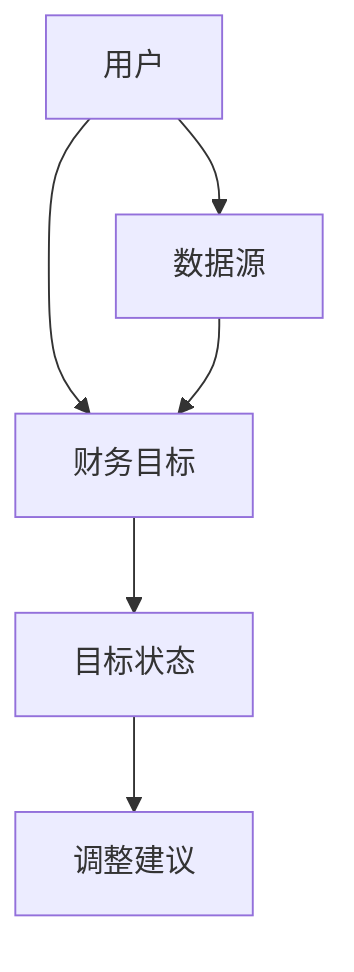
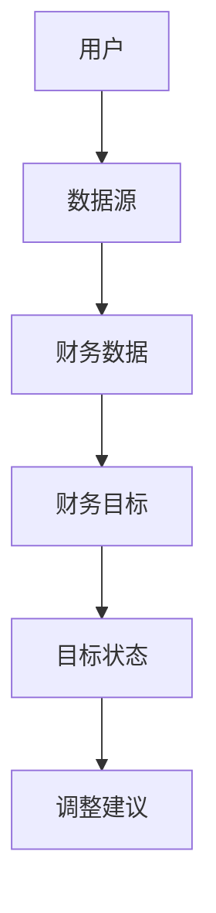
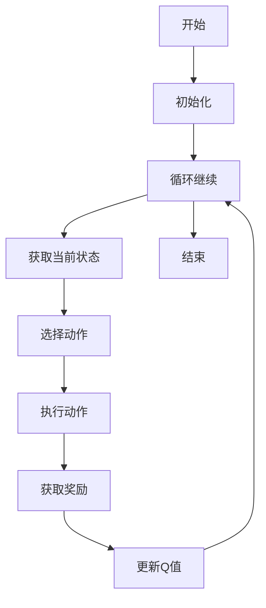
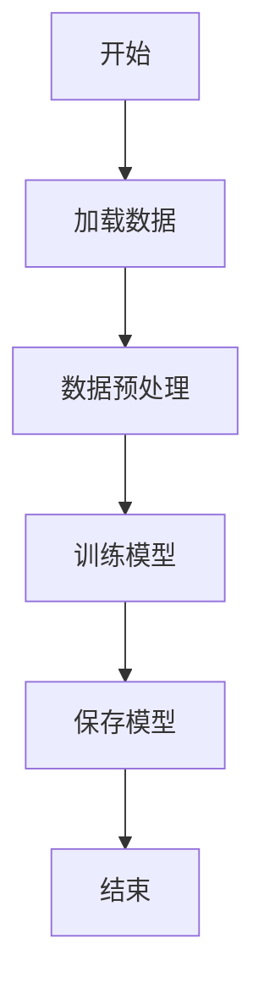
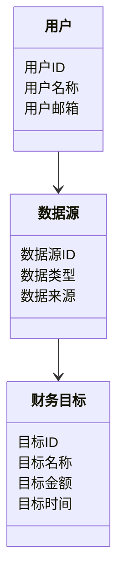
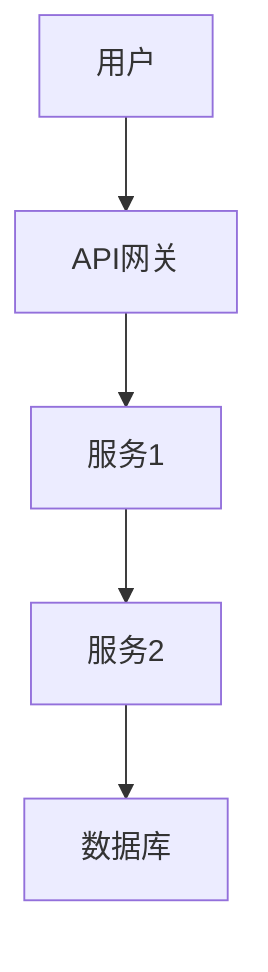
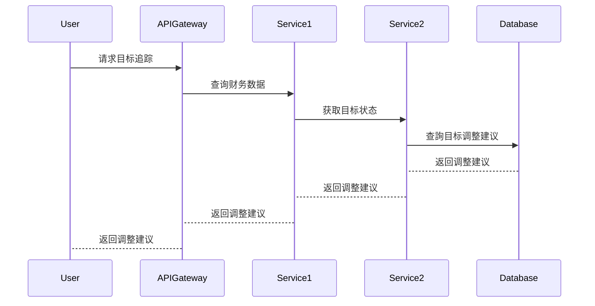

                 


# AI驱动的个人财务目标追踪与调整系统

> 关键词：AI驱动、个人财务目标、追踪系统、调整策略、强化学习、系统架构

> 摘要：本文深入探讨了AI驱动的个人财务目标追踪与调整系统的构建与实现，从问题背景、核心概念、算法原理、系统架构到项目实战，全面分析了该系统的实现思路与技术细节，结合实际案例，展示了如何利用AI技术提升个人财务管理效率。

---

# 第一章: 问题背景与目标

## 1.1 问题背景

### 1.1.1 传统财务目标管理的局限性
- 数据碎片化：个人财务数据分散在不同平台，难以统一管理
- 人工干预过多：需要手动调整财务目标，效率低下
- 缺乏动态调整：市场变化和用户需求变化难以及时响应

### 1.1.2 AI技术在财务管理中的应用潜力
- 数据整合与分析：AI能够快速处理多源异构数据
- 自动化决策：通过机器学习模型实现智能财务规划
- 实时反馈与调整：AI能够根据市场变化动态优化财务目标

### 1.1.3 当前市场对智能财务工具的需求
- 用户需求：个性化财务规划、实时监控、智能提醒
- 市场趋势：数字化转型、智能化工具普及
- 技术支持：AI、大数据、云计算等技术的快速发展

## 1.2 问题描述

### 1.2.1 个人财务目标管理的核心挑战
- 数据获取与整合
- 目标设定与优先级排序
- 动态调整与反馈机制

### 1.2.2 数据碎片化与信息孤岛问题
- 数据来源多样：银行账户、投资平台、消费记录等
- 数据格式不统一：不同平台的数据结构差异大
- 数据安全与隐私保护

### 1.2.3 用户行为分析与动态调整需求
- 用户行为的多样性：不同用户的消费习惯和投资偏好不同
- 动态调整的复杂性：需要根据市场变化和个人财务状况实时调整目标
- 用户反馈的及时性：系统需要快速响应用户的行为变化

## 1.3 问题解决思路

### 1.3.1 引入AI技术的核心目标
- 提供智能化的财务目标管理工具
- 实现数据的自动整合与分析
- 提供个性化的财务调整建议

### 1.3.2 系统设计的总体思路
- 数据采集与整合
- 智能目标设定与优化
- 动态调整与反馈机制

### 1.3.3 系统边界与外延
- 数据范围：仅限于个人财务数据
- 功能范围：目标设定、追踪、调整与反馈
- 用户范围：个人用户

## 1.4 核心概念与系统架构

### 1.4.1 系统核心要素组成
- 用户：系统的主要使用者
- 数据源：财务数据的来源，包括银行账户、消费记录等
- 财务目标：用户设定的财务目标，如储蓄目标、投资目标等
- 调整建议：系统根据数据变化提出的调整方案
- 系统反馈：用户对系统建议的反馈，用于优化系统性能

### 1.4.2 实体关系图（ER图）展示


### 1.4.3 系统功能模块概述
- 数据采集模块：负责从不同数据源获取财务数据
- 目标设定模块：帮助用户设定个性化财务目标
- 跟踪与分析模块：实时监控目标达成情况并进行数据分析
- 调整建议模块：根据分析结果提出调整方案
- 反馈与优化模块：收集用户反馈并优化系统性能

## 1.5 本章小结

---

# 第二章: 核心概念与系统架构

## 2.1 AI驱动的财务目标追踪系统原理

### 2.1.1 基于AI的目标识别与分类
- 目标识别：通过自然语言处理技术从用户输入中提取财务目标
- 目标分类：将目标按照优先级和类型进行分类，例如紧急目标和长期目标

### 2.1.2 数据流与信息处理流程
- 数据采集：从数据源获取原始数据
- 数据清洗：对数据进行预处理，去除噪声数据
- 数据分析：利用机器学习算法对数据进行建模分析
- 信息输出：生成目标追踪报告和调整建议

### 2.1.3 系统输入输出关系
- 输入：用户提供的财务数据和目标设定
- 输出：目标追踪报告和动态调整建议

## 2.2 核心概念对比分析

### 2.2.1 不同AI模型的特征对比（表格形式）
| 模型类型       | 输入数据类型 | 输出结果类型 | 优势 | 劣势 |
|----------------|--------------|--------------|------|------|
| 强化学习模型     | 多维数据     | 动态调整建议   | 实时性高 | 训练时间长 |
| 监督学习模型     | 结构化数据    | 预测结果       | 训练速度快 | 动态调整能力弱 |

### 2.2.2 系统功能模块的属性特征分析
- 数据采集模块：实时性、准确性、高效性
- 目标设定模块：个性化、灵活性、易用性
- 调整建议模块：实时性、精准性、可解释性

### 2.2.3 系统性能指标对比
- 处理速度：强化学习模型 > 监督学习模型
- 调整精度：监督学习模型 > 强化学习模型
- 用户满意度：根据具体场景决定

## 2.3 实体关系图（ER图）展示


## 2.4 本章小结

---

# 第三章: 算法原理与数学模型

## 3.1 基于强化学习的目标追踪算法

### 3.1.1 算法原理
- 强化学习的基本概念：通过智能体与环境的交互，学习最优策略
- 状态、动作、奖励的定义：
  - 状态：当前的财务状况
  - 动作：调整财务目标的具体操作
  - 奖励：调整后的目标达成情况

### 3.1.2 算法流程图


### 3.1.3 数学模型与公式
- 状态值函数：
$$ V(s) = \max_a Q(s,a) $$
- 动作值函数：
$$ Q(s,a) = r + \gamma \max_{a'} Q(s',a') $$

### 3.1.4 代码实现示例
```python
def reward_function(current_state, action):
    # 定义奖励函数
    if action == 'increase':
        return 1
    elif action == 'decrease':
        return 0.5
    else:
        return 0
```

## 3.2 基于监督学习的目标调整算法

### 3.2.1 算法原理
- 监督学习的基本概念：通过训练数据学习映射关系
- 数据预处理：对财务数据进行清洗和特征提取
- 模型训练：利用历史数据训练目标调整模型

### 3.2.2 算法流程图


### 3.2.3 数学模型与公式
- 线性回归模型：
$$ y = \beta x + \epsilon $$
- 逻辑回归模型：
$$ P(y=1|x) = \frac{e^{\beta x}}{1 + e^{\beta x}} $$`

### 3.2.4 代码实现示例
```python
import pandas as pd
from sklearn.linear_model import LinearRegression

data = pd.DataFrame({'x': [1, 2, 3, 4, 5], 'y': [2, 4, 5, 4, 5]})
model = LinearRegression()
model.fit(data[['x']], data['y'])
print(model.predict([[6]]))
```

## 3.3 本章小结

---

# 第四章: 系统分析与架构设计

## 4.1 问题场景介绍

### 4.1.1 系统功能需求
- 数据采集：从多种数据源获取财务数据
- 目标设定：帮助用户设定个性化财务目标
- 目标追踪：实时监控目标达成情况
- 调整建议：根据数据变化提出调整方案
- 反馈与优化：收集用户反馈优化系统性能

### 4.1.2 项目介绍
- 项目名称：AI驱动的个人财务目标追踪与调整系统
- 项目目标：实现智能化的财务目标管理工具
- 项目范围：个人用户

## 4.2 系统功能设计

### 4.2.1 领域模型


### 4.2.2 系统架构设计


### 4.2.3 系统接口设计
- 数据采集接口：从数据源获取财务数据
- 目标设定接口：帮助用户设定个性化目标
- 调整建议接口：根据数据变化提出调整方案
- 用户反馈接口：收集用户对系统建议的反馈

### 4.2.4 系统交互流程


## 4.3 本章小结

---

# 第五章: 项目实战

## 5.1 环境安装

### 5.1.1 安装Python环境
```bash
python --version
pip install --upgrade pip
```

### 5.1.2 安装相关库
```bash
pip install numpy pandas scikit-learn
```

## 5.2 系统核心实现

### 5.2.1 数据采集模块实现
```python
import requests
import json

def get_data(api_key):
    headers = {'Authorization': f'Bearer {api_key}'}
    response = requests.get('https://api.finance.com/data', headers=headers)
    return json.loads(response.text)
```

### 5.2.2 目标设定模块实现
```python
from sklearn.linear_model import LinearRegression

def set_goal(data):
    model = LinearRegression()
    model.fit(data[['income', 'expenses']], data['savings'])
    return model.predict([[5000, 2000]])
```

### 5.2.3 调整建议模块实现
```python
def generate_adjustment(current_status):
    if current_status < target:
        return 'increase'
    elif current_status > target:
        return 'decrease'
    else:
        return 'no change'
```

## 5.3 实际案例分析

### 5.3.1 案例背景
- 用户：小明
- 目标：在1年内储蓄5000元
- 当前储蓄：3000元

### 5.3.2 数据分析
- 当前储蓄：3000元
- 剩余时间：6个月
- 每月储蓄目标：833.33元

### 5.3.3 调整建议
- 当前储蓄进度：60%
- 需要每月增加储蓄金额：500元
- 预计完成时间：9个月

## 5.4 本章小结

---

# 第六章: 总结与展望

## 6.1 最佳实践 tips
- 数据安全与隐私保护
- 系统性能优化
- 用户体验设计

## 6.2 小结
- 本文详细介绍了AI驱动的个人财务目标追踪与调整系统的构建与实现，从问题背景到系统设计，再到项目实战，全面分析了该系统的实现思路与技术细节。

## 6.3 注意事项
- 数据安全与隐私保护
- 系统性能优化
- 用户体验设计

## 6.4 拓展阅读
- 强化学习在金融领域的应用
- 大数据技术在财务管理中的应用
- 智能化财务工具的发展趋势

---

# 作者：AI天才研究院/AI Genius Institute & 禅与计算机程序设计艺术 /Zen And The Art of Computer Programming

