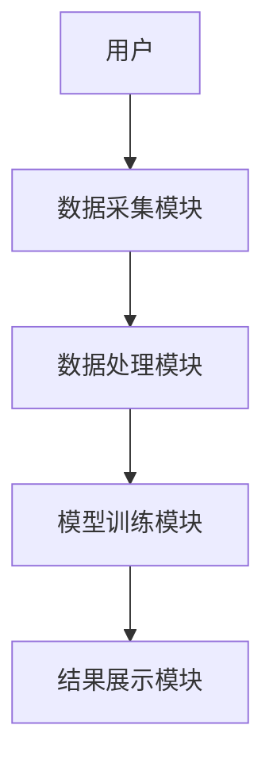

                 


# AI驱动的个人财务规划工具开发指南

## 关键词：人工智能、财务规划、机器学习、系统架构、项目开发

## 摘要：本文将详细介绍如何利用人工智能技术开发个人财务规划工具，涵盖背景分析、核心算法、系统架构及项目实战，旨在为开发者提供全面的指导。

---

# 第一部分：AI驱动的个人财务规划工具开发背景与基础

## 第1章：AI驱动的个人财务规划工具概述

### 1.1 个人财务规划工具的背景与现状

#### 1.1.1 传统个人财务规划工具的局限性
传统财务工具依赖人工计算，效率低下且易出错，难以应对复杂多变的财务状况。

#### 1.1.2 AI技术如何提升财务规划效率
AI通过自动化数据分析和预测，提供个性化的财务建议，显著提高规划效率和准确性。

#### 1.1.3 个人财务规划工具的市场前景
随着AI技术的普及，市场对智能化财务工具的需求日益增长，具有广阔的发展前景。

### 1.2 AI驱动的财务规划工具的核心概念

#### 1.2.1 人工智能在财务规划中的应用领域
- 数据分析与预测
- 个性化建议生成
- 风险评估与优化

#### 1.2.2 AI驱动工具的优势与劣势对比
| 优势 | 劣势 |
|------|------|
| 高效性 | 高昂的开发成本 |
| 准确性 | 数据依赖性高 |

#### 1.2.3 个人财务规划工具的功能模块分析
- 数据采集与预处理
- 财务分析与预测
- 个性化建议生成
- 用户交互与反馈

### 1.3 AI与财务规划的结合方式

#### 1.3.1 数据分析与预测
通过机器学习模型分析用户支出模式，预测未来财务状况。

#### 1.3.2 个性化建议生成
基于用户数据，AI生成定制化投资建议和预算优化方案。

#### 1.3.3 风险评估与优化
利用风险评估模型，识别潜在财务风险并提出应对策略。

## 第1章小结
本章介绍了AI驱动的个人财务规划工具的背景、核心概念及应用方式，为后续章节奠定了基础。

---

# 第二部分：AI驱动的个人财务规划工具核心算法与技术

## 第2章：机器学习算法基础

### 2.1 机器学习的基本概念

#### 2.1.1 机器学习的定义与分类
机器学习是一种通过数据训练模型的技术，分为监督学习、无监督学习和强化学习。

#### 2.1.2 机器学习在财务规划中的应用场景
- 财务预测
- 风险评估
- 用户行为分析

### 2.2 常见机器学习算法介绍

#### 2.2.1 线性回归算法
用于预测连续变量，如股票价格预测。

#### 2.2.2 支持向量机（SVM）
适用于分类问题，如信用评分。

#### 2.2.3 随机森林与梯度提升树
用于复杂数据的分类与回归，如客户画像分析。

### 2.3 机器学习算法的优缺点对比

| 算法 | 优点 | 缺点 |
|------|------|------|
| 线性回归 | 简单高效 | 高维度数据表现差 |
| SVM | 高维数据表现好 | 对数据预处理要求高 |
| 随机森林 | 鲁棒性强 | 计算复杂度高 |

## 第2章小结
本章介绍了机器学习的基本概念和常见算法，分析了它们在财务规划中的应用及优缺点。

---

# 第三部分：AI驱动的个人财务规划工具系统架构与设计

## 第3章：系统功能设计

### 3.1 功能模块划分

#### 3.1.1 数据采集与预处理模块
- 数据清洗
- 数据标准化

#### 3.1.2 财务分析与预测模块
- 支出预测
- 收入预测

#### 3.1.3 个性化建议生成模块
- 投资建议
- 预算优化

#### 3.1.4 用户交互与反馈模块
- 图形化界面
- 用户反馈

### 3.2 功能模块的交互流程

#### 3.2.1 数据采集与预处理流程
1. 用户输入财务数据
2. 数据清洗与标准化
3. 数据存储

#### 3.2.2 财务分析与预测流程
1. 数据分析
2. 模型训练
3. 预测结果生成

#### 3.2.3 个性化建议生成流程
1. 分析预测结果
2. 生成建议
3. 提供反馈

### 3.3 功能模块的实现方式

#### 3.3.1 数据采集与预处理的实现
```python
import pandas as pd
data = pd.read_csv('financial_data.csv')
data_cleaned = data.dropna()
```

#### 3.3.2 财务分析与预测的实现
```python
from sklearn.linear_model import LinearRegression
model = LinearRegression()
model.fit(X_train, y_train)
y_pred = model.predict(X_test)
```

#### 3.3.3 个性化建议生成的实现
```python
def generate_recommendations(data):
    # 生成建议的逻辑
    pass
```

## 第3章小结
本章详细设计了系统功能模块及其交互流程，为后续开发奠定了架构基础。

---

# 第四部分：AI驱动的个人财务规划工具项目实战

## 第4章：项目开发环境与工具

### 4.1 开发环境的选择

#### 4.1.1 Python编程语言的选择
Python丰富的库支持（如NumPy、Pandas、Scikit-learn）使其成为首选。

#### 4.1.2 开发工具的安装与配置
- 安装Anaconda
- 配置Jupyter Notebook

#### 4.1.3 数据库的选择与配置
- 使用SQLite存储数据
- 数据库连接配置

### 4.2 项目核心实现源代码

#### 4.2.1 数据预处理代码
```python
import pandas as pd
data = pd.read_csv('financial_data.csv')
data_cleaned = data.dropna()
data_cleaned.to_csv('cleaned_data.csv', index=False)
```

#### 4.2.2 模型训练代码
```python
from sklearn.model_selection import train_test_split
from sklearn.linear_model import LinearRegression
X = data_cleaned[['income', 'expenses']]
y = data_cleaned['savings']
X_train, X_test, y_train, y_test = train_test_split(X, y, test_size=0.2)
model = LinearRegression()
model.fit(X_train, y_train)
```

#### 4.2.3 个性化建议生成代码
```python
def generate_recommendations(data):
    # 示例建议生成逻辑
    pass
```

## 第4章小结
本章详细介绍了开发环境的选择和项目核心代码的实现，为读者提供了实际操作的指导。

---

# 第五章：系统架构设计与实现

## 5.1 系统架构设计

### 5.1.1 系统功能模块划分
- 数据采集模块
- 数据处理模块
- 模型训练模块
- 结果展示模块

### 5.1.2 系统架构图


### 5.1.3 系统接口设计
- 数据接口：提供REST API用于数据交互
- 模型接口：提供预测API用于结果获取

## 5.2 系统实现

### 5.2.1 数据采集模块实现
```python
import requests
def fetch_data(api_key):
    response = requests.get(f'https://api.example.com/financial_data?api_key={api_key}')
    return response.json()
```

### 5.2.2 数据处理模块实现
```python
import pandas as pd
def preprocess_data(data):
    df = pd.DataFrame(data)
    df = df.dropna()
    return df
```

### 5.2.3 模型训练模块实现
```python
from sklearn.model_selection import train_test_split
from sklearn.linear_model import LinearRegression
def train_model(data):
    X = data[['income', 'expenses']]
    y = data['savings']
    X_train, X_test, y_train, y_test = train_test_split(X, y, test_size=0.2)
    model = LinearRegression()
    model.fit(X_train, y_train)
    return model
```

## 5.3 系统测试与优化

### 5.3.1 系统测试
- 单元测试：测试每个模块的功能
- 集成测试：测试模块之间的接口

### 5.3.2 系统优化
- 优化模型性能
- 提高系统响应速度

## 第5章小结
本章详细介绍了系统的架构设计与实现过程，从模块划分到接口设计，再到具体实现，为读者提供了全面的指导。

---

# 第六章：项目实战与案例分析

## 6.1 环境安装与配置

### 6.1.1 安装必要的库
- NumPy
- Pandas
- Scikit-learn
- Jupyter Notebook

### 6.1.2 配置开发环境
- 安装Anaconda
- 配置Jupyter Notebook

## 6.2 核心代码实现

### 6.2.1 数据预处理代码
```python
import pandas as pd
data = pd.read_csv('financial_data.csv')
data_cleaned = data.dropna()
data_cleaned.to_csv('cleaned_data.csv', index=False)
```

### 6.2.2 模型训练代码
```python
from sklearn.model_selection import train_test_split
from sklearn.linear_model import LinearRegression
X = data_cleaned[['income', 'expenses']]
y = data_cleaned['savings']
X_train, X_test, y_train, y_test = train_test_split(X, y, test_size=0.2)
model = LinearRegression()
model.fit(X_train, y_train)
```

### 6.2.3 个性化建议生成代码
```python
def generate_recommendations(data):
    # 示例建议生成逻辑
    pass
```

## 6.3 案例分析与详细解读

### 6.3.1 案例背景
某用户过去一年的收入和支出数据，希望通过AI工具进行财务规划。

### 6.3.2 数据分析与预测
使用线性回归模型预测未来六个月的收入和支出。

### 6.3.3 个性化建议生成
根据预测结果，生成投资建议和预算优化方案。

## 6.4 项目小结
本章通过一个实际案例，展示了如何利用AI技术进行个人财务规划，从数据预处理到模型训练，再到个性化建议生成，详细解读了整个过程。

---

# 第七章：最佳实践、小结与注意事项

## 7.1 最佳实践

### 7.1.1 数据质量的重要性
确保数据的准确性和完整性，避免影响模型性能。

### 7.1.2 模型选择与调优
根据具体问题选择合适的算法，并进行参数调优以提高模型性能。

### 7.1.3 系统架构设计
注重模块化设计，便于后续维护和扩展。

## 7.2 小结
本文详细介绍了AI驱动的个人财务规划工具的开发背景、核心算法、系统架构及项目实战，为开发者提供了全面的指导。

## 7.3 注意事项

### 7.3.1 数据隐私与安全
确保用户数据的安全，遵守相关法律法规。

### 7.3.2 模型解释性
在复杂模型中，确保结果的可解释性，便于用户理解和信任。

### 7.3.3 系统性能优化
通过优化算法和架构设计，提高系统的运行效率。

## 7.4 拓展阅读

### 7.4.1 推荐书籍
- 《机器学习实战》
- 《深度学习》

### 7.4.2 推荐博客与资源
- Towards Data Science
- Kaggle

---

# 作者：AI天才研究院/AI Genius Institute & 禅与计算机程序设计艺术 /Zen And The Art of Computer Programming

---

**附录：**

- 代码示例汇总
- 数据集说明
- 进一步学习资源

---

通过以上结构，您可以逐步撰写完整的文章内容，每章内容详细展开，确保逻辑清晰、结构紧凑、内容丰富。

