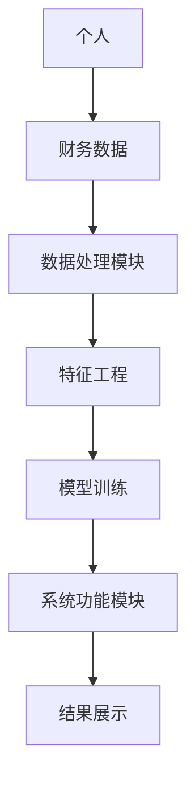
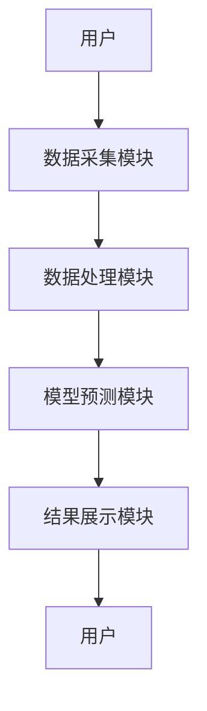
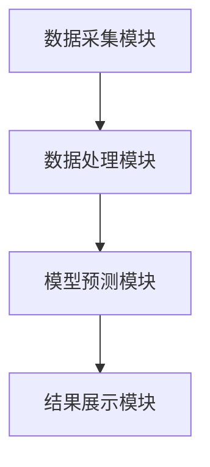

                 


# AI驱动的个人财务韧性评估与增强系统

## 关键词：
AI, 个人财务, 韧性评估, 增强系统, 机器学习

## 摘要：
本文系统性地探讨了AI驱动的个人财务韧性评估与增强系统的构建与实现。文章从问题背景出发，详细阐述了系统的核心概念、算法原理、系统架构，并通过项目实战展示了系统的具体实现。文中通过大量实例和图表，深入分析了AI在个人财务管理中的应用，最终提出了系统的设计方案与实现路径。本文适合对AI与个人财务管理感兴趣的读者阅读。

---

# 第一部分: AI驱动的个人财务韧性评估与增强系统概述

## 第1章: AI驱动的个人财务韧性评估与增强系统概述

### 1.1 问题背景与定义

#### 1.1.1 个人财务韧性的概念与重要性
个人财务韧性是指个人在面对经济波动、收入变化或支出突变时，维持财务稳定的能力。在经济不确定性增加的今天，个人财务韧性的重要性日益凸显。传统上，个人财务管理依赖人工分析，效率低且难以应对复杂场景。

#### 1.1.2 AI在个人财务管理中的应用背景
人工智能技术的快速发展为个人财务管理带来了新的可能性。通过AI技术，可以实现自动化、智能化的财务分析与优化，帮助个人更好地管理财务。

#### 1.1.3 本系统的定义与目标
本系统旨在通过AI技术，对个人财务数据进行分析，评估财务韧性，并提出增强建议。目标是帮助个人在复杂经济环境中保持财务健康。

### 1.2 核心概念与联系

#### 1.2.1 核心概念原理
系统的核心概念包括数据收集、特征工程、模型构建与训练、系统架构设计等。这些概念共同构成了AI驱动的个人财务韧性评估与增强系统。

#### 1.2.2 核心概念属性特征对比表
| 核心概念 | 数据来源 | 数据处理 | 模型构建 | 系统功能 |
|----------|-----------|----------|----------|----------|
| 数据采集 | 收入、支出、资产 | 数据清洗、特征提取 | 机器学习模型 | 数据采集、模型预测、结果展示 |

#### 1.2.3 ER实体关系图架构（Mermaid流程图）


---

## 第2章: AI驱动的个人财务韧性评估系统核心要素

### 2.1 系统核心要素组成

#### 2.1.1 数据来源与处理流程
数据来源包括银行账户、交易记录、资产信息等。数据处理流程包括数据清洗、特征提取和标准化。

#### 2.1.2 模型构建与训练
模型构建基于机器学习算法，训练数据包括历史财务数据和标签。

#### 2.1.3 系统功能模块设计
系统功能模块包括数据采集、数据处理、模型预测和结果展示。

### 2.2 系统边界与外延

#### 2.2.1 系统边界定义
系统边界包括与外部数据源的接口和用户交互界面。

#### 2.2.2 系统外延与扩展性分析
系统可以扩展到多用户支持和多场景应用。

---

# 第二部分: AI驱动的个人财务韧性评估模型构建与训练

## 第3章: 数据收集与特征工程

### 3.1 数据来源与预处理

#### 3.1.1 数据收集渠道
数据来源包括银行账户、信用卡交易、资产信息等。

#### 3.1.2 数据清洗与标准化
数据清洗包括去除缺失值和异常值，标准化处理包括归一化和离散化。

#### 3.1.3 数据特征提取
特征提取包括收入、支出、资产、负债等。

### 3.2 特征工程与选择

#### 3.2.1 特征重要性分析
使用特征重要性评分方法，评估每个特征对模型的影响。

#### 3.2.2 特征选择方法
使用基于统计的方法和机器学习方法进行特征选择。

#### 3.2.3 特征工程案例分析
通过实例分析，展示特征工程的具体实施过程。

---

## 第4章: AI模型构建与训练

### 4.1 模型选择与设计

#### 4.1.1 传统机器学习模型对比
对比随机森林、支持向量机等传统模型的性能。

#### 4.1.2 深度学习模型选择
选择适合任务的深度学习模型，如神经网络。

#### 4.1.3 模型架构设计
设计模型的输入层、隐藏层和输出层。

### 4.2 模型训练与调优

#### 4.2.1 训练数据集划分
将数据划分为训练集、验证集和测试集。

#### 4.2.2 模型训练与优化
通过训练数据优化模型参数，提升模型性能。

#### 4.2.3 模型超参数调优
使用网格搜索或随机搜索优化模型超参数。

### 4.3 模型评估与验证

#### 4.3.1 评估指标选择
选择准确率、召回率、F1值等指标评估模型性能。

#### 4.3.2 模型验证方法
使用交叉验证方法评估模型的泛化能力。

#### 4.3.3 模型鲁棒性分析
分析模型在不同数据集上的表现，验证模型的稳定性。

---

# 第三部分: 系统架构与功能设计

## 第5章: 系统功能模块设计

### 5.1 功能模块划分

#### 5.1.1 数据采集模块
负责采集用户的财务数据。

#### 5.1.2 数据处理模块
对采集的数据进行清洗和特征提取。

#### 5.1.3 模型预测模块
基于训练好的模型对数据进行预测。

#### 5.1.4 结果展示模块
将预测结果以可视化形式展示给用户。

### 5.2 功能模块交互流程

#### 5.2.1 模块间数据流分析
展示数据如何在各个模块之间流动。

#### 5.2.2 模块交互流程图（Mermaid）


---

## 第6章: 系统架构设计

### 6.1 项目介绍

#### 6.1.1 项目背景
介绍项目的背景和目标。

#### 6.1.2 项目目标
明确项目的具体目标和预期成果。

### 6.2 系统架构设计

#### 6.2.1 系统功能设计
设计系统的功能模块和交互流程。

#### 6.2.2 系统架构图（Mermaid）


---

# 第四部分: 项目实战

## 第7章: 项目实战

### 7.1 环境安装与配置

#### 7.1.1 环境搭建
安装必要的开发环境和工具。

#### 7.1.2 数据集准备
获取或生成个人财务数据集。

### 7.2 系统核心实现

#### 7.2.1 数据预处理
编写代码对数据进行清洗和特征提取。

#### 7.2.2 模型训练
使用机器学习框架训练模型。

#### 7.2.3 系统开发
开发系统的各个功能模块。

### 7.3 代码实现与解读

#### 7.3.1 数据预处理代码
```python
import pandas as pd
from sklearn.impute import SimpleImputer
from sklearn.preprocessing import StandardScaler

# 加载数据
data = pd.read_csv('financial_data.csv')

# 删除缺失值
data.dropna(inplace=True)

# 标准化处理
scaler = StandardScaler()
data_scaled = scaler.fit_transform(data)
```

#### 7.3.2 模型训练代码
```python
from sklearn.ensemble import RandomForestClassifier
from sklearn.model_selection import train_test_split

# 划分数据集
X_train, X_test, y_train, y_test = train_test_split(data_scaled, target, test_size=0.2)

# 训练模型
model = RandomForestClassifier()
model.fit(X_train, y_train)
```

### 7.4 系统功能展示

#### 7.4.1 系统交互流程图（Mermaid）


### 7.5 项目小结

#### 7.5.1 项目实现总结
总结项目的实现过程和成果。

#### 7.5.2 项目注意事项
提醒读者在实际应用中需要注意的问题。

---

# 第五部分: 最佳实践与未来展望

## 第8章: 最佳实践与未来展望

### 8.1 最佳实践

#### 8.1.1 数据处理建议
建议如何更好地处理数据，提升模型性能。

#### 8.1.2 模型优化技巧
分享一些模型优化的小技巧。

### 8.2 未来展望

#### 8.2.1 技术发展趋势
分析AI在个人财务管理领域的未来发展趋势。

#### 8.2.2 研究方向
提出未来可以进一步研究的方向。

---

# 作者信息

作者：AI天才研究院/AI Genius Institute & 禅与计算机程序设计艺术 /Zen And The Art of Computer Programming

---

以上是《AI驱动的个人财务韧性评估与增强系统》的技术博客文章的完整目录和内容框架，希望对您有所帮助！

