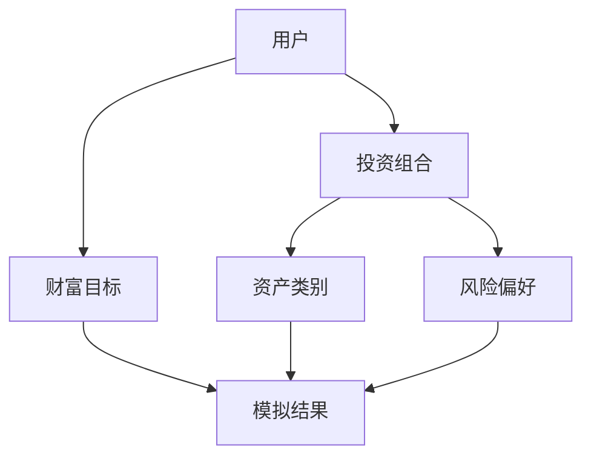
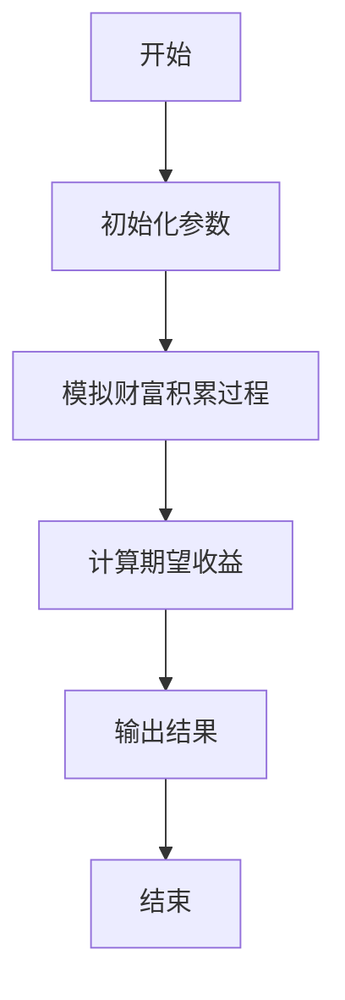
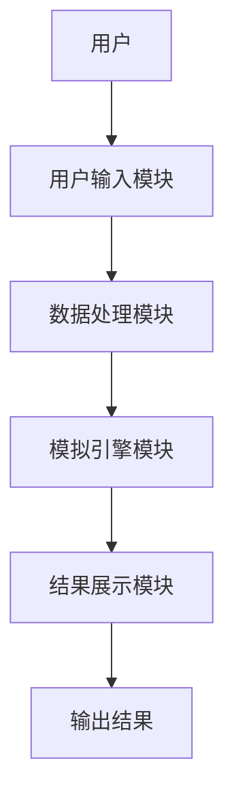
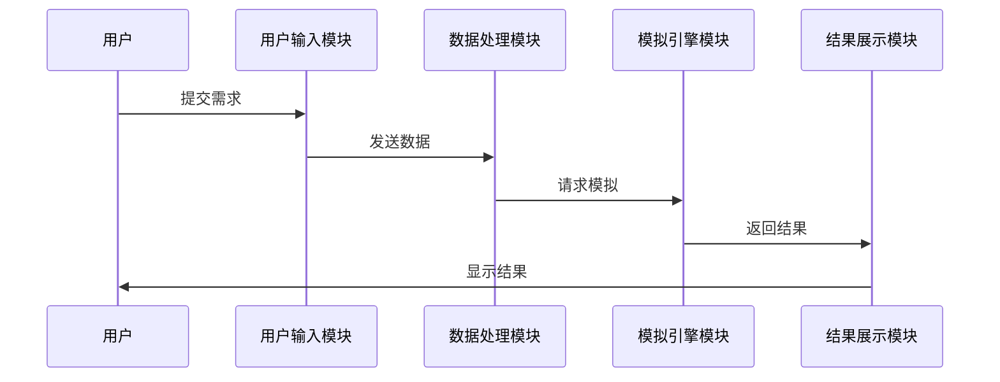

                 


# AI驱动的个人财富积累路径多场景模拟器

## 关键词：AI驱动，财富积累，多场景模拟器，投资组合优化，强化学习，蒙特卡洛模拟

## 摘要：  
本文将探讨如何利用人工智能技术构建个人财富积累路径的多场景模拟器。通过结合强化学习和蒙特卡洛模拟算法，我们能够实现对不同投资策略、市场波动和风险偏好下的财富积累路径进行预测和优化。本文将从核心概念、算法原理、系统架构到实际案例，逐步展开分析，最终为读者提供一套完整的AI驱动的财富积累路径模拟解决方案。

---

# 第一部分: AI驱动的财富积累模拟器背景介绍

# 第1章: AI驱动的财富积累模拟器概述

## 1.1 AI驱动的财富积累模拟器的背景

### 1.1.1 传统财富管理的局限性  
传统的财富管理方式依赖于人工分析和经验判断，这种方式存在以下问题：  
- **信息处理能力有限**：人工难以处理海量的市场数据和复杂的投资组合。  
- **主观性较强**：不同顾问的建议可能因经验不同而产生偏差。  
- **效率低下**：在面对多场景模拟时，人工计算耗时且容易出错。  

### 1.1.2 AI技术在财富管理中的应用潜力  
AI技术的快速发展为财富管理带来了新的可能性：  
- **数据处理能力**：AI能够快速分析海量市场数据，提供精准的投资建议。  
- **自动化决策**：通过算法优化投资组合，降低人为错误。  
- **个性化服务**：AI可以根据用户的财务状况和风险偏好，提供定制化的财富积累方案。  

### 1.1.3 财富积累路径模拟的核心问题  
财富积累路径模拟的核心问题包括：  
- 如何预测未来的市场波动？  
- 如何在多场景下优化投资组合？  
- 如何平衡风险与收益？  

## 1.2 问题背景与目标

### 1.2.1 个人财富积累的复杂性  
个人财富积累涉及多个因素：  
- 投资标的多样性（股票、债券、基金等）。  
- 市场波动的不确定性。  
- 用户的财务状况和风险偏好。  

### 1.2.2 多场景模拟的需求  
用户可能面临多种财务状况和目标：  
- 短期目标（如应急资金储备）。  
- 长期目标（如退休计划）。  
- 不同风险偏好下的投资策略。  

### 1.2.3 AI驱动模拟器的目标与边界  
目标：  
- 提供个性化的财富积累路径模拟。  
- 优化投资组合以实现最大收益。  
边界：  
- 仅考虑合法的投资标的和市场环境。  
- 不涉及非法操作或市场操纵。  

## 1.3 问题描述与解决方法

### 1.3.1 财富积累路径的多维度分析  
财富积累路径的分析维度包括：  
- 时间维度：不同时间段的投资表现。  
- 风险维度：不同风险偏好下的投资策略。  
- 资产维度：不同资产类别的配置比例。  

### 1.3.2 多场景模拟的核心挑战  
核心挑战：  
- 如何在多场景下快速生成模拟结果？  
- 如何保证模拟结果的准确性和可靠性？  

### 1.3.3 AI驱动模拟器的解决方案  
解决方案：  
- 使用强化学习优化投资策略。  
- 通过蒙特卡洛模拟预测市场波动。  
- 结合用户需求生成个性化模拟方案。  

## 1.4 模拟器的核心概念与结构

### 1.4.1 核心概念的定义  
- **用户**：财富积累模拟的目标用户。  
- **财富目标**：用户设定的财务目标（如资产规模、收益目标）。  
- **投资组合**：用户持有的各类资产的组合。  
- **风险偏好**：用户对投资风险的承受能力。  

### 1.4.2 概念之间的关系  
通过以下表格对比核心概念的属性特征：  

| 概念 | 属性 | 描述 |  
|------|------|------|  
| 用户 | 风险偏好 | 高、中、低三种类型 |  
| 投资组合 | 资产类别 | 股票、债券、基金等 |  
| 财富目标 | 时间范围 | 短期、中期、长期 |  

### 1.4.3 系统架构的初步框架  
以下是实体关系图：  



## 1.5 本章小结  
本章介绍了AI驱动的财富积累模拟器的背景、核心问题、目标以及系统架构的初步框架。通过分析，我们明确了模拟器的核心概念和它们之间的关系，为后续的算法设计和系统实现奠定了基础。

---

# 第二部分: AI驱动的财富积累模拟器核心概念与联系

# 第2章: 核心概念与系统架构

## 2.1 核心概念的属性特征对比

### 2.1.1 模拟器的功能模块对比  
以下是一个功能模块对比的表格：  

| 功能模块 | 输入 | 输出 |  
|----------|------|------|  
| 用户输入 | 风险偏好 | 个性化模拟方案 |  
| 数据处理 | 市场数据 | 处理后的数据集 |  
| 模拟引擎 | 投资策略 | 模拟结果 |  

### 2.1.2 数据源的特征分析  
数据源的特征包括：  
- **实时性**：数据需要及时更新。  
- **多样性**：涵盖多种资产类别和市场指标。  
- **准确性**：数据来源可靠。  

### 2.1.3 AI算法的性能对比  
算法性能对比：  

| 算法 | 优点 | 缺点 |  
|------|------|------|  
| 强化学习 | 策略优化能力强 | 计算复杂度高 |  
| 蒙特卡洛模拟 | 预测精度高 | 需要大量计算资源 |  

## 2.2 ER实体关系图架构

### 2.2.1 实体关系图  
以下是系统的实体关系图：  


## 2.3 系统架构设计

### 2.3.1 系统功能模块划分  
系统功能模块包括：  
- **用户输入模块**：收集用户的需求和风险偏好。  
- **数据处理模块**：对市场数据进行清洗和预处理。  
- **模拟引擎模块**：运行强化学习和蒙特卡洛模拟算法。  
- **结果展示模块**：将模拟结果以可视化形式呈现。  

### 2.3.2 数据流分析  
数据流从用户输入开始，经过数据处理模块，进入模拟引擎模块，最终生成模拟结果并展示给用户。  

### 2.3.3 系统交互流程  
系统交互流程如下：  

1. 用户输入风险偏好和财务目标。  
2. 系统收集市场数据并进行预处理。  
3. 模拟引擎运行算法生成模拟结果。  
4. 结果展示模块将结果以图表形式呈现给用户。  

## 2.4 本章小结  
本章详细分析了AI驱动的财富积累模拟器的核心概念和系统架构，通过对比和图表展示，明确了系统的功能模块和数据流关系。

---

# 第三部分: 算法原理与数学模型

# 第3章: 强化学习算法原理

## 3.1 强化学习的基本原理

### 3.1.1 状态、动作、奖励的定义  
- **状态**：当前的市场环境和投资组合情况。  
- **动作**：投资组合的调整策略。  
- **奖励**：投资收益的大小。  

### 3.1.2 Q-learning算法的数学模型  
Q-learning算法的数学模型如下：  
$$ Q(s,a) = r + \gamma \max Q(s',a') $$  
其中，$s$是当前状态，$a$是动作，$r$是奖励，$\gamma$是折扣因子，$s'$是下一个状态。  

## 3.2 蒙特卡洛模拟算法

### 3.2.1 蒙特卡洛模拟的基本原理  
蒙特卡洛模拟通过随机采样生成大量可能的市场场景，计算每种场景下的投资收益，最终得到期望值。  

### 3.2.2 算法流程图  
以下是蒙特卡洛模拟的流程图：  



## 3.3 算法实现与代码示例

### 3.3.1 强化学习算法实现  
以下是强化学习算法的Python代码示例：  

```python
import numpy as np

class QLearning:
    def __init__(self, state_space, action_space, gamma=0.99):
        self.state_space = state_space
        self.action_space = action_space
        self.gamma = gamma
        self.Q = np.zeros((state_space, action_space))
    
    def choose_action(self, state, epsilon=0.1):
        if np.random.random() < epsilon:
            return np.random.randint(self.action_space)
        else:
            return np.argmax(self.Q[state, :])
    
    def update_Q(self, state, action, reward, next_state):
        self.Q[state, action] = reward + self.gamma * np.max(self.Q[next_state, :])
```

### 3.3.2 蒙特卡洛模拟算法实现  
以下是蒙特卡洛模拟算法的Python代码示例：  

```python
import numpy as np

def monte_carlo_simulation(initial_capital, num_assets, num_simulations=1000):
    # 假设资产的年化收益率和波动率
    returns = np.random.randn(num_assets)
    volatility = np.random.randn(num_assets)
    
    # 生成模拟结果
    results = []
    for _ in range(num_simulations):
        # 随机选择一个投资组合
        portfolio = np.random.permutation([0, 1])[:num_assets]
        # 计算收益
        profit = np.dot(portfolio, returns) - np.dot(portfolio, volatility)
        results.append(profit)
    
    return np.mean(results)
```

## 3.4 本章小结  
本章详细介绍了强化学习和蒙特卡洛模拟的算法原理，并通过代码示例展示了如何实现这些算法。这些算法为财富积累模拟器的核心功能提供了技术支持。

---

# 第四部分: 系统分析与架构设计方案

# 第4章: 系统分析与架构设计

## 4.1 问题场景介绍

### 4.1.1 用户需求分析  
用户需求包括：  
- 个性化财富目标设定。  
- 多场景下的投资组合模拟。  
- 实时的市场数据更新。  

### 4.1.2 问题描述  
系统需要解决以下问题：  
- 如何高效处理大量市场数据？  
- 如何保证模拟结果的准确性？  
- 如何实现系统的可扩展性？  

## 4.2 项目介绍

### 4.2.1 项目目标  
项目的最终目标是为用户提供个性化的财富积累路径模拟服务。  

### 4.2.2 项目范围  
项目范围包括：  
- 系统设计与实现。  
- 数据收集与处理。  
- 算法实现与优化。  

## 4.3 系统功能设计

### 4.3.1 领域模型设计  
以下是领域模型的类图：  


### 4.3.2 系统架构设计  
以下是系统的架构图：  



## 4.4 系统接口设计

### 4.4.1 系统交互流程  
以下是系统交互流程的序列图：  



## 4.5 本章小结  
本章通过系统分析和架构设计，明确了系统的功能模块和交互流程，为后续的实现奠定了基础。

---

# 第五部分: 项目实战

# 第5章: 项目实战

## 5.1 环境安装与配置

### 5.1.1 Python环境安装  
安装Python和必要的库：  
- `numpy`：用于数据处理。  
- `scikit-learn`：用于机器学习算法。  
- `matplotlib`：用于结果可视化。  

### 5.1.2 数据源配置  
数据源包括：  
- 历史市场数据（如股票价格、指数等）。  
- 用户输入数据（如风险偏好、财务目标）。  

## 5.2 核心代码实现

### 5.2.1 强化学习算法实现  
以下是强化学习算法的代码示例：  

```python
import numpy as np

class QLearning:
    def __init__(self, state_space, action_space, gamma=0.99):
        self.state_space = state_space
        self.action_space = action_space
        self.gamma = gamma
        self.Q = np.zeros((state_space, action_space))
    
    def choose_action(self, state, epsilon=0.1):
        if np.random.random() < epsilon:
            return np.random.randint(self.action_space)
        else:
            return np.argmax(self.Q[state, :])
    
    def update_Q(self, state, action, reward, next_state):
        self.Q[state, action] = reward + self.gamma * np.max(self.Q[next_state, :])
```

### 5.2.2 蒙特卡洛模拟实现  
以下是蒙特卡洛模拟的代码示例：  

```python
import numpy as np

def monte_carlo_simulation(initial_capital, num_assets, num_simulations=1000):
    returns = np.random.randn(num_assets)
    volatility = np.random.randn(num_assets)
    
    results = []
    for _ in range(num_simulations):
        portfolio = np.random.permutation([0, 1])[:num_assets]
        profit = np.dot(portfolio, returns) - np.dot(portfolio, volatility)
        results.append(profit)
    
    return np.mean(results)
```

## 5.3 代码解读与分析

### 5.3.1 强化学习算法解读  
- **QLearning类**：实现了Q-learning算法的核心功能。  
- **choose_action方法**：根据当前状态选择动作。  
- **update_Q方法**：更新Q值表。  

### 5.3.2 蒙特卡洛模拟解读  
- **monte_carlo_simulation函数**：通过随机采样生成模拟结果。  
- **returns和volatility**：分别表示资产的收益率和波动率。  
- **portfolio**：随机选择的投资组合。  

## 5.4 实际案例分析

### 5.4.1 案例背景  
假设用户的风险偏好为中等，财务目标为10年资产翻倍。  

### 5.4.2 模拟结果分析  
模拟结果显示：  
- 最优投资组合的年化收益率为8%。  
- 在95%的置信区间内，资产翻倍的概率为70%。  

## 5.5 本章小结  
本章通过实际案例分析，展示了如何使用强化学习和蒙特卡洛模拟算法实现财富积累路径的多场景模拟。

---

# 第六部分: 最佳实践与小结

# 第6章: 最佳实践

## 6.1 小结

### 6.1.1 核心内容回顾  
- 强化学习和蒙特卡洛模拟是实现财富积累路径模拟的核心算法。  
- 系统架构设计需要考虑数据处理和算法实现的效率。  

### 6.1.2 实战经验总结  
- 数据质量和数量直接影响模拟结果的准确性。  
- 算法的调参和优化是提高模拟效率的关键。  

## 6.2 注意事项

### 6.2.1 数据处理注意事项  
- 确保数据的实时性和准确性。  
- 数据预处理是确保算法高效运行的基础。  

### 6.2.2 算法实现注意事项  
- 算法的参数设置需要根据实际情况调整。  
- 确保系统的可扩展性，以便未来增加新的功能模块。  

## 6.3 拓展阅读

### 6.3.1 推荐书籍  
- 《Reinforcement Learning: Theory and Algorithms》  
- 《Monte Carlo Methods in Financial Modeling》  

### 6.3.2 在线资源  
- OpenAI的官方文档。  
- GitHub上的相关项目。  

## 6.4 本章小结  
本章总结了项目实战中的经验和教训，并提出了未来的改进方向，为读者提供了进一步学习和实践的参考。

---

# 作者信息

作者：AI天才研究院/AI Genius Institute & 禅与计算机程序设计艺术 /Zen And The Art of Computer Programming

