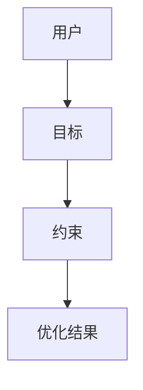
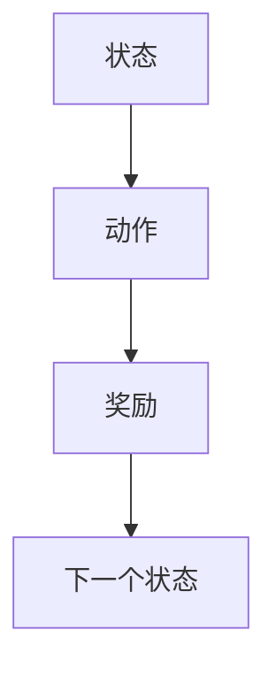
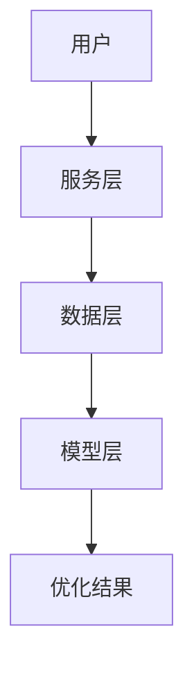

                 


# AI驱动的个人财富积累路径多目标优化器

## 关键词：AI驱动、财富管理、多目标优化、强化学习、遗传算法

## 摘要：  
随着人工智能技术的飞速发展，个人财富管理正经历一场深刻的变革。传统的财富管理方式依赖于人工决策和经验判断，难以应对复杂多变的金融市场环境。本文提出了一种基于AI驱动的个人财富积累路径多目标优化器，结合强化学习和遗传算法，为个人提供智能化的财富管理方案。通过构建多目标优化模型，该系统能够同时考虑风险、收益、流动性等多个目标，为用户提供个性化的投资组合和财务规划建议。本文将详细阐述该优化器的核心原理、算法实现、系统架构及实际应用场景，为读者提供一份全面的技术指南。

---

## 第一部分：背景介绍

### 第1章：AI驱动的财富优化概述

#### 1.1 问题背景  
传统的财富管理方式主要依赖人工经验，存在以下问题：  
- **信息处理能力有限**：金融市场数据复杂且动态变化，人工难以及时捕捉最佳投资机会。  
- **决策滞后**：传统方法依赖历史数据，难以实时调整策略。  
- **多目标冲突**：个人财富管理通常涉及风险控制、收益最大化、流动性等多个目标，传统方法难以平衡这些目标。  

#### 1.2 问题描述  
在财富积累过程中，个人面临以下核心问题：  
- 如何在风险可控的前提下实现收益最大化？  
- 如何平衡短期流动性需求与长期投资目标？  
- 如何动态调整投资组合以应对市场波动？  

这些问题构成了一个多目标优化问题，需要同时优化多个相互冲突的目标。

#### 1.3 问题解决  
AI技术的引入为解决这些问题提供了新的思路：  
- **强化学习**：通过模拟决策过程，学习最优策略。  
- **遗传算法**：通过模拟自然选择，优化投资组合。  
- **多目标优化算法**：在多个目标之间找到平衡点。  

#### 1.4 概念结构与核心要素  
AI驱动的财富优化器由以下核心要素组成：  
- **用户需求**：个性化的目标和风险偏好。  
- **市场数据**：实时的金融数据。  
- **优化算法**：强化学习和遗传算法。  
- **决策模型**：基于算法的多目标优化模型。  

---

## 第二部分：核心概念与联系

### 第2章：AI驱动的多目标优化原理  

#### 2.1 核心概念原理  
AI驱动的多目标优化器通过以下方式实现财富管理：  
- **强化学习**：通过与市场的交互，逐步优化投资策略。  
- **遗传算法**：通过模拟进化，优化投资组合。  

#### 2.2 概念属性对比  
以下是AI算法与传统优化方法的对比：  

| 对比维度 | AI算法 | 传统优化方法 |  
|----------|--------|--------------|  
| 算法复杂度 | 高 | 低 |  
| 可扩展性 | 高 | 低 |  
| 灵活性 | 高 | 低 |  

#### 2.3 ER实体关系图  


---

## 第三部分：算法原理讲解

### 第3章：强化学习与多目标优化  

#### 3.1 强化学习流程  


#### 3.2 Python实现  
```python
class Agent:
    def __init__(self, state_space, action_space):
        self.state_space = state_space
        self.action_space = action_space
        # 策略网络
        self.policy = PolicyNetwork(state_space, action_space)
    
    def act(self, state):
        return self.policy.act(state)
    
    def update(self, state, action, reward, next_state):
        self.policy.update(state, action, reward, next_state)
```

#### 3.3 数学模型  
多目标优化问题可以表示为：  
$$ \min_{x} f_1(x) + f_2(x) + \cdots + f_n(x) $$  
其中，$f_i(x)$ 表示第 $i$ 个目标函数。  

---

## 第四部分：系统分析与架构设计

### 第4章：系统架构设计  

#### 4.1 问题场景  
系统需要处理以下场景：  
- 用户输入投资目标和风险偏好。  
- 系统根据市场数据生成优化方案。  

#### 4.2 系统功能设计  
系统功能模块包括：  
- 用户界面：展示优化结果。  
- 数据处理：解析市场数据。  

#### 4.3 系统架构设计  


---

## 第五部分：项目实战

### 第5章：项目实战  

#### 5.1 环境安装  
安装所需的库：  
```bash
pip install numpy pandas tensorflow
```

#### 5.2 核心代码实现  
```python
def optimize_portfolio(returns, constraints):
    # 初始化模型
    model = PortfolioOptimizer(returns, constraints)
    # 运行优化
    result = model.optimize()
    return result
```

#### 5.3 案例分析  
案例：某用户希望在风险可控的前提下实现收益最大化。  
优化结果：调整后的投资组合。

---

## 第六部分：最佳实践

### 第6章：总结与展望  

#### 6.1 小结  
本文提出了一种基于AI的财富优化器，结合强化学习和遗传算法，解决了多目标优化问题。  

#### 6.2 注意事项  
- 数据质量对结果影响重大。  
- 需要定期更新模型。  

#### 6.3 拓展阅读  
推荐阅读相关领域的最新研究，如《强化学习实战》和《多目标优化算法》。

---

## 作者：AI天才研究院/AI Genius Institute & 禅与计算机程序设计艺术 /Zen And The Art of Computer Programming

