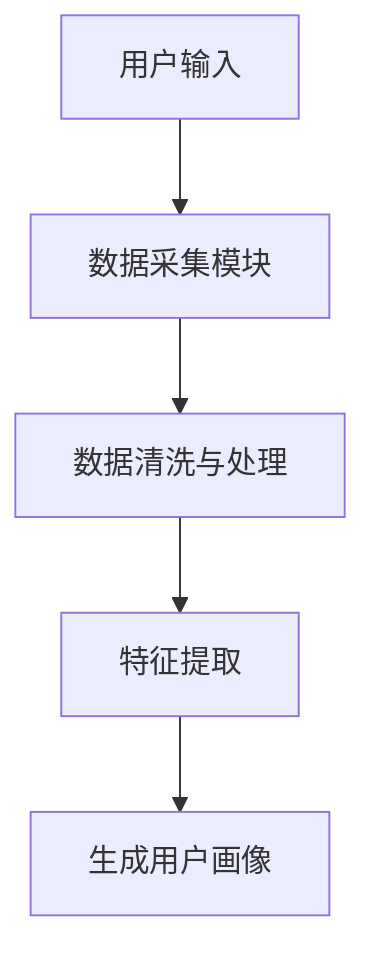
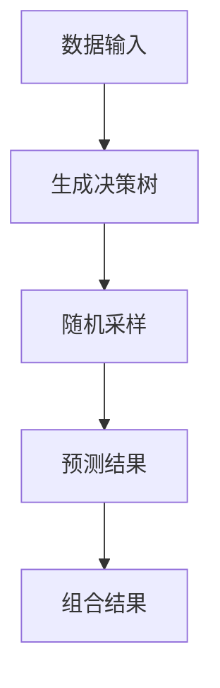
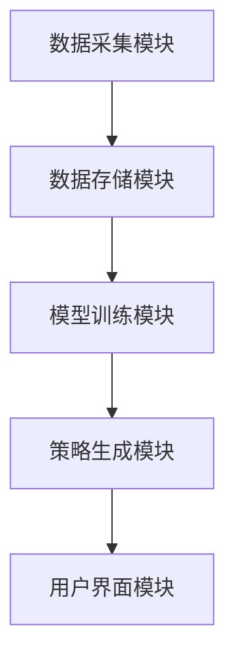
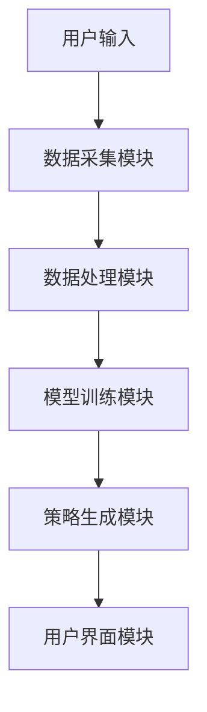

                 


# AI驱动的个人财富积累路径规划器

---

## 关键词

AI驱动，财富规划，路径规划，机器学习，强化学习，系统架构

---

## 摘要

在当前快速变化的经济环境中，个人财富管理变得越来越复杂。本文提出了一种基于人工智能的个人财富积累路径规划器，通过数据驱动的方法，结合机器学习和强化学习算法，为用户提供个性化的财富规划建议。本文详细介绍了系统的背景、核心概念、算法原理、系统架构，并通过实战案例展示了如何构建这样一个系统。

---

## 第一部分：引言与背景

### 第1章：AI驱动财富规划的背景与现状

#### 1.1 人工智能在财富管理中的作用

人工智能技术正在深刻改变财富管理行业。通过分析海量数据，AI能够帮助用户制定更科学的财富规划策略。AI的优势在于能够快速处理复杂信息，并提供实时反馈，帮助用户做出更优决策。

#### 1.2 个人财富积累的核心问题

个人财富积累的核心问题包括资产配置、风险控制、投资策略优化等。传统方法依赖人工经验，效率低下且难以应对复杂多变的市场环境。AI技术的引入，能够显著提升财富管理的效率和准确性。

#### 1.3 本书的目标与结构

本书旨在帮助读者理解如何利用AI技术构建个人财富积累路径规划器。我们将从基础概念到系统实现进行全面讲解，最后通过实战案例展示系统的实际应用。

---

## 第二部分：AI驱动财富规划的核心概念

### 第2章：AI驱动财富规划的核心概念与原理

#### 2.1 数据驱动的财富规划

财富规划的核心在于数据的收集与处理。通过分析用户的财务状况、市场趋势等数据，AI系统能够生成个性化的财富规划方案。

**图2-1：数据驱动的财富规划流程图**



#### 2.2 AI算法在财富规划中的应用

AI算法在财富规划中的应用主要体现在预测市场趋势、优化投资组合等方面。常用的算法包括线性回归、随机森林和强化学习等。

**表2-1：常用AI算法对比**

| 算法类型       | 描述                                   | 优点                                   | 缺点                                   |
|----------------|--------------------------------------|--------------------------------------|--------------------------------------|
| 线性回归       | 预测变量之间的线性关系                 | 简单易懂，计算速度快                 | 无法处理非线性关系                   |
| 随机森林       | 基于决策树的集成学习                   | 高准确性，抗过拟合                   | 计算复杂度高                         |
| 强化学习       | 通过试错优化策略                       | 能够处理复杂动态环境                 | 需要大量数据和计算资源               |

---

## 第三部分：AI算法与数学模型

### 第3章：机器学习算法在财富规划中的应用

#### 3.1 线性回归模型

线性回归是一种简单而有效的预测模型，适用于线性关系的数据。

**线性回归公式：**

$$ y = \beta_0 + \beta_1x + \epsilon $$

其中，$\beta_0$是截距，$\beta_1$是斜率，$\epsilon$是误差项。

**应用案例：** 预测某类资产的回报率。

#### 3.2 随机森林与决策树

随机森林是一种基于决策树的集成学习方法，通过组合多个决策树的结果来提高准确性。

**随机森林工作流程：**



---

### 第4章：强化学习在投资决策中的应用

#### 4.1 强化学习的基本原理

强化学习通过试错优化策略，适用于动态环境下的决策问题。

**Q-learning公式：**

$$ Q(s, a) = r + \gamma \max_{a'} Q(s', a') $$

其中，$s$是当前状态，$a$是动作，$r$是奖励，$\gamma$是折扣因子，$s'$是下一状态。

**应用案例：** 动态资产配置。

---

## 第四部分：系统架构与设计

### 第5章：AI驱动财富规划系统的架构设计

#### 5.1 系统功能模块划分

系统主要包括数据采集模块、模型训练模块和策略生成模块。

**系统架构图：**



#### 5.2 系统交互流程

用户输入数据，系统处理并生成策略，最后通过界面展示结果。

**系统交互流程图：**



---

## 第五部分：项目实战与案例分析

### 第6章：项目实战与案例分析

#### 6.1 环境安装与配置

建议使用Python 3.8以上版本，安装必要的库如NumPy、Pandas、Scikit-learn和TensorFlow。

#### 6.2 核心代码实现

以下是部分代码实现：

```python
import numpy as np
import pandas as pd
from sklearn.model_selection import train_test_split
from sklearn.linear_model import LinearRegression

# 数据加载
data = pd.read_csv('wealth_data.csv')

# 数据分割
X = data[['income', 'expenses']]
y = data['savings']

X_train, X_test, y_train, y_test = train_test_split(X, y, test_size=0.2)

# 模型训练
model = LinearRegression()
model.fit(X_train, y_train)

# 预测与评估
y_pred = model.predict(X_test)
print('预测值:', y_pred)
print('真实值:', y_test)
```

#### 6.3 案例分析

通过实际案例，展示系统如何帮助用户制定财富规划方案。例如，帮助用户优化投资组合，降低风险。

---

## 第六部分：最佳实践与未来展望

### 第7章：最佳实践与未来展望

#### 7.1 最佳实践

- 数据隐私保护
- 模型的可解释性
- 系统的实时性与动态调整

#### 7.2 未来展望

- 更智能的算法优化
- 更个性化的财富规划
- 多模态数据的应用

---

## 作者

作者：AI天才研究院 & 禅与计算机程序设计艺术

---

## 资源链接

- GitHub代码库：[AI财富规划器](https://github.com/AI-Genius/wealth-planner)
- 更多技术博客：[禅与计算机程序设计艺术](https://www.zenofprogramming.com/)

---

通过以上步骤，我们详细讲解了如何利用AI技术构建个人财富积累路径规划器，从理论到实践，帮助读者全面理解并掌握相关技术。

