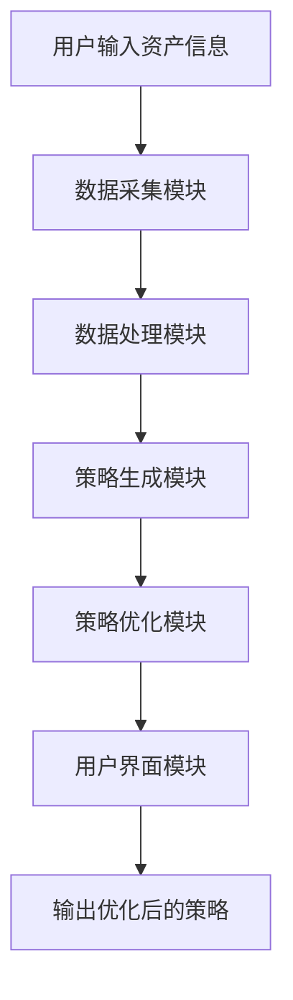
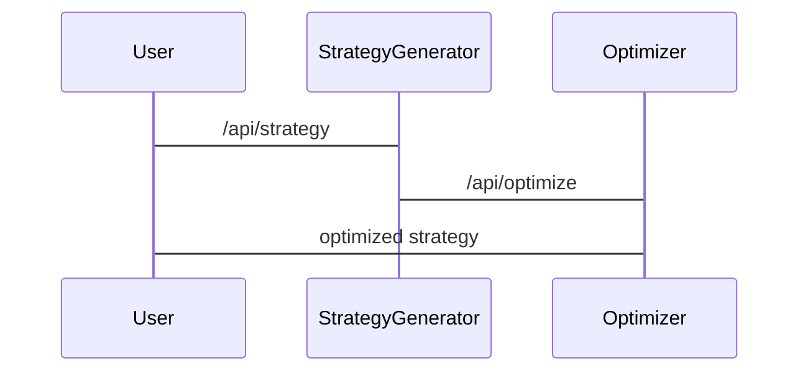

                 


# AI驱动的个人财富管理策略生成器

> 关键词：AI驱动、个人财富管理、策略生成、机器学习、自然语言处理、强化学习

> 摘要：本文将详细探讨如何利用人工智能技术构建个人财富管理策略生成器。通过分析传统财富管理的局限性，介绍AI驱动的优势，从数据收集与预处理、算法原理、系统架构设计到项目实战，系统地阐述AI在财富管理中的应用，帮助读者理解并实现智能化的财富管理策略。

---

# 第1章: AI驱动的个人财富管理概述

## 1.1 什么是个人财富管理

### 1.1.1 财富管理的定义与目标

财富管理是指通过科学的策略和工具，对个人的资产进行优化配置，以实现财富保值、增值和风险控制的目标。传统的财富管理依赖于人工分析和经验判断，但随着市场环境的复杂化和个性化需求的增加，这种方法逐渐显现出效率低下、成本高昂、难以应对复杂场景的局限性。

### 1.1.2 个人财富管理的核心要素

个人财富管理的核心要素包括：
1. **资产配置**：根据个人风险承受能力、投资目标和市场环境，合理分配各类资产（如股票、债券、房地产等）。
2. **风险控制**：通过分散投资、止损策略等手段，降低投资风险。
3. **收益最大化**：在风险可控的前提下，实现资产的最优收益。
4. **动态调整**：根据市场变化和个人财务状况，实时调整投资策略。

### 1.1.3 AI在财富管理中的作用

人工智能（AI）技术可以通过大数据分析、机器学习和自然语言处理等手段，帮助个人实现更精准、高效的财富管理。AI可以实时监控市场动态，分析海量数据，提供个性化投资建议，并根据市场变化动态调整策略，从而显著提升财富管理的效率和效果。

---

## 1.2 AI驱动的财富管理策略

### 1.2.1 传统财富管理的局限性

传统的财富管理模式存在以下主要问题：
1. **效率低下**：人工分析市场数据和制定策略耗时耗力，难以应对高频交易和复杂市场环境。
2. **主观性较强**：依赖分析师的主观判断，存在人为错误和偏差。
3. **缺乏个性化**：传统策略往往基于固定模板，难以满足不同用户的个性化需求。
4. **难以应对复杂场景**：面对突发事件或市场剧烈波动时，人工决策往往反应迟缓，难以做出最优选择。

### 1.2.2 AI驱动的策略优势

AI驱动的财富管理策略具有以下显著优势：
1. **高效性**：AI可以在短时间内处理海量数据，快速生成投资建议。
2. **精准性**：通过机器学习算法，AI能够发现数据中的潜在规律，提供更精准的投资策略。
3. **个性化**：基于用户的财务状况、风险偏好和投资目标，AI可以定制个性化的财富管理方案。
4. **动态适应性**：AI能够实时监控市场变化，动态调整投资策略，应对复杂的市场环境。

### 1.2.3 个人财富管理的未来趋势

随着AI技术的不断发展和普及，个人财富管理将朝着更加智能化、个性化和便捷化的方向发展。未来的财富管理将更加依赖于AI技术，通过智能投顾、量化投资和自动化交易等方式，帮助个人实现财富的长期稳健增长。

---

## 1.3 本书的目的与结构

### 1.3.1 本书的目标

本书旨在通过系统地介绍AI驱动的个人财富管理策略生成器的核心概念、算法原理、系统架构和项目实战，帮助读者理解并掌握如何利用AI技术优化个人财富管理策略。

### 1.3.2 本书的结构安排

本书共分为三大部分：
1. **引言**：介绍AI驱动的个人财富管理的基本概念和背景。
2. **核心概念与原理**：详细探讨数据驱动的财富管理策略生成、AI驱动的策略优化和系统架构设计。
3. **项目实战**：通过具体案例展示如何利用AI技术实现个人财富管理策略生成器。

### 1.3.3 本书的适用读者

本书适合对AI技术感兴趣、对财富管理有一定了解的读者，包括：
1. 金融从业者：如投资顾问、基金经理等。
2. AI技术爱好者：希望将AI技术应用于金融领域的技术人员。
3. 个人投资者：希望通过AI技术优化自己财富管理策略的个人投资者。

---

# 第2章: 数据驱动的财富管理策略生成

## 2.1 数据收集与预处理

### 2.1.1 数据来源与分类

在AI驱动的财富管理中，数据是策略生成的基础。数据来源主要包括：
1. **市场数据**：包括股票价格、债券收益率、基金净值、指数走势等。
2. **经济指标**：如GDP增长率、通货膨胀率、利率水平等。
3. **新闻与社交媒体**：包括市场新闻、公司公告、社交媒体情绪等。
4. **用户数据**：如用户的财务状况、风险偏好、投资目标等。

### 2.1.2 数据清洗与特征提取

数据清洗是确保数据质量的重要步骤，主要包括：
1. **去除重复数据**：删除重复的记录。
2. **处理缺失值**：通过插值或删除的方法处理缺失数据。
3. **标准化/归一化**：对数据进行标准化或归一化处理，使其适合算法输入。

特征提取则是从原始数据中提取对策略生成有用的特征，例如：
- **技术指标**：如移动平均线、相对强弱指数（RSI）、MACD等。
- **市场情绪指标**：如社交媒体情绪评分、新闻情感分析结果等。

### 2.1.3 数据标注与标准化

数据标注是将数据进行分类或打标签的过程，例如将市场新闻分为正面、负面和中性三类。标准化则是将数据转换为统一的格式，以便于模型训练和推理。

---

## 2.2 策略生成的核心算法

### 2.2.1 机器学习算法简介

机器学习算法在财富管理中的应用非常广泛，常见的算法包括：
- **监督学习**：如线性回归、支持向量机（SVM）、随机森林等。
- **无监督学习**：如聚类分析（K-means）、主成分分析（PCA）等。
- **强化学习**：如Q-learning、深度强化学习（Deep RL）等。

### 2.2.2 自然语言处理在策略生成中的应用

自然语言处理（NLP）技术可以用于分析市场新闻、公司公告和社交媒体内容，提取其中的情感倾向和关键词，从而生成投资建议。例如，可以通过情感分析模型判断某只股票的新闻是否为正面消息，进而调整投资策略。

### 2.2.3 强化学习在财富管理中的应用

强化学习是一种通过试错和奖励机制来优化决策的算法。在财富管理中，强化学习可以用于动态调整投资组合，例如在市场波动较大时，通过调整资产配置来降低风险。

---

## 2.3 策略优化的数学模型

### 2.3.1 线性规划模型

线性规划是一种优化技术，常用于在约束条件下求解目标函数的最大值或最小值。在财富管理中，线性规划可以用于优化资产配置问题，例如在给定的预算和风险承受能力下，求解最优的投资组合。

$$
\text{目标函数：} \quad \max \sum_{i=1}^{n} w_i r_i
$$

$$
\text{约束条件：} \quad \sum_{i=1}^{n} w_i = 1, \quad w_i \geq 0
$$

其中，\( w_i \) 表示第 \( i \) 个资产的投资权重，\( r_i \) 表示第 \( i \) 个资产的预期收益率。

---

## 2.4 策略优化的实现方法

### 2.4.1 基于遗传算法的优化

遗传算法是一种模拟自然选择和遗传机制的优化算法，常用于解决复杂的非线性优化问题。在财富管理中，遗传算法可以用于优化投资组合的权重分配。

### 2.4.2 基于梯度下降的优化

梯度下降是一种常用优化算法，用于求解模型的参数。在财富管理中，梯度下降可以用于训练机器学习模型，例如训练股票价格预测模型。

### 2.4.3 基于蒙特卡洛模拟的优化

蒙特卡洛模拟是一种通过随机采样来估计概率分布的方法。在财富管理中，蒙特卡洛模拟可以用于评估不同投资策略在不同市场环境下的表现。

---

# 第3章: 系统架构与实现

## 3.1 系统功能设计

### 3.1.1 用户需求分析

在设计AI驱动的个人财富管理策略生成器时，首先需要进行用户需求分析，明确系统需要满足的功能需求，例如：
- 用户资产信息输入
- 市场数据查询
- 策略生成与优化
- 投资组合管理

### 3.1.2 系统功能模块划分

根据用户需求，系统可以划分为以下功能模块：
1. **数据采集模块**：负责采集市场数据和用户数据。
2. **数据处理模块**：对采集到的数据进行清洗和特征提取。
3. **策略生成模块**：基于机器学习算法生成投资策略。
4. **策略优化模块**：对生成的策略进行优化。
5. **用户界面模块**：提供友好的用户界面，方便用户操作。

### 3.1.3 系统功能流程图



---

## 3.2 系统架构设计

### 3.2.1 分层架构设计

系统的分层架构包括以下几层：
1. **表现层**：负责与用户交互，展示系统功能。
2. **业务逻辑层**：实现系统的业务逻辑，例如策略生成和优化。
3. **数据访问层**：负责与数据源交互，进行数据的存储和检索。
4. **基础设施层**：提供系统的运行环境，例如服务器、网络等。

### 3.2.2 微服务架构设计

为了提高系统的扩展性和维护性，可以采用微服务架构。每个功能模块作为一个独立的服务运行，例如：
- 数据采集服务
- 数据处理服务
- 策略生成服务
- 策略优化服务

---

## 3.3 系统接口设计

### 3.3.1 API接口定义

系统需要定义一系列API接口，例如：
1. `/api/assets`：用于获取用户资产信息。
2. `/api/strategy`：用于生成投资策略。
3. `/api/optimize`：用于优化投资策略。

### 3.3.2 接口调用流程

以下是接口调用流程的示例：



---

## 3.4 系统交互设计

### 3.4.1 系统交互流程图

以下是系统交互流程图的示例：


---

# 第4章: 项目实战

## 4.1 环境安装与配置

### 4.1.1 Python环境搭建

首先需要安装Python，并配置好Python的环境变量。推荐使用虚拟环境来管理依赖包，例如使用 `venv` 或 `conda`。

### 4.1.2 第三方库安装

安装以下第三方库：
- `pandas`：用于数据处理。
- `numpy`：用于数值计算。
- `scikit-learn`：用于机器学习算法。
- `transformers`：用于自然语言处理。

### 4.1.3 环境配置示例

以下是一个环境配置示例：

```bash
python -m pip install pandas numpy scikit-learn transformers
```

---

## 4.2 核心实现

### 4.2.1 数据采集与处理

以下是一个数据采集与处理的代码示例：

```python
import pandas as pd
import requests

def get_stock_data(ticker):
    url = f"https://api.example.com/stock/{ticker}"
    response = requests.get(url)
    data = response.json()
    df = pd.DataFrame(data)
    return df

# 示例：获取股票数据
stock_data = get_stock_data("AAPL")
print(stock_data.head())
```

### 4.2.2 策略生成与优化

以下是一个基于机器学习的策略生成与优化的代码示例：

```python
from sklearn.model_selection import train_test_split
from sklearn.ensemble import RandomForestRegressor

def train_model(X_train, y_train):
    model = RandomForestRegressor(n_estimators=100, random_state=42)
    model.fit(X_train, y_train)
    return model

# 示例：训练模型
X_train, y_train = prepare_data()
model = train_model(X_train, y_train)
```

---

## 4.3 案例分析

### 4.3.1 案例背景

假设我们有一个股票数据集，包含以下特征：
- 收盘价（Close）
- 开盘价（Open）
- 最高价（High）
- 最低价（Low）
- 成交量（Volume）

目标是根据这些特征预测股票的未来走势。

### 4.3.2 数据分析

通过分析数据，我们可以发现某些特征与股票价格的相关性较高，例如成交量和收盘价。

### 4.3.3 策略生成与优化

通过机器学习模型生成投资策略，并根据市场变化动态调整策略，例如在预测股票价格上涨时增加仓位，预测股票价格下跌时减少仓位。

---

## 4.4 项目小结

通过本章的实战，我们了解了如何利用AI技术实现个人财富管理策略生成器。从环境搭建、数据采集与处理，到模型训练与策略生成，整个过程展示了AI在财富管理中的强大能力。

---

# 第5章: 最佳实践与总结

## 5.1 最佳实践

### 5.1.1 数据处理注意事项

在数据处理过程中，需要注意以下几点：
1. 数据清洗：确保数据的完整性和准确性。
2. 特征工程：提取有意义的特征，避免特征冗余。
3. 数据标注：确保标签的准确性和一致性。

### 5.1.2 算法选择建议

在选择算法时，需要考虑以下因素：
1. 数据类型：不同的算法适用于不同类型的数据。
2. 问题类型：不同的算法适用于不同的问题，例如分类、回归、聚类等。
3. 计算资源：算法的计算复杂度和内存需求。

### 5.1.3 系统架构优化

在系统架构设计中，需要注意以下几点：
1. 可扩展性：设计模块化架构，便于功能扩展。
2. 可维护性：确保代码清晰，便于后续维护。
3. 性能优化：通过缓存、并行计算等技术提高系统性能。

---

## 5.2 小结与展望

通过本文的介绍，我们系统地探讨了AI驱动的个人财富管理策略生成器的核心概念、算法原理和系统架构，并通过实战展示了如何利用AI技术实现财富管理策略的生成与优化。未来，随着AI技术的不断发展，个人财富管理将更加智能化、个性化和高效化。

---

# 作者

作者：AI天才研究院/AI Genius Institute & 禅与计算机程序设计艺术 /Zen And The Art of Computer Programming

