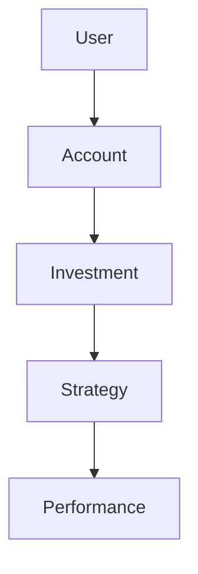
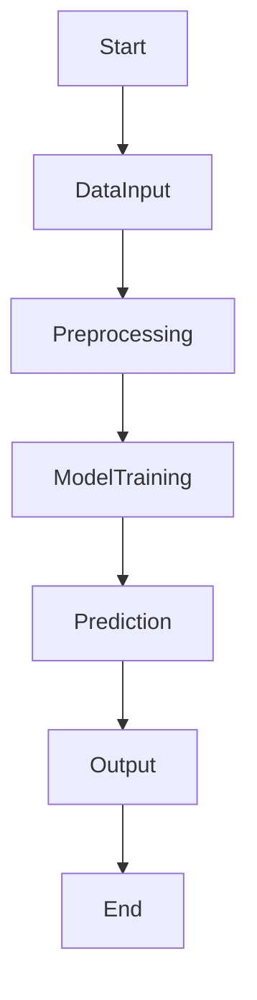
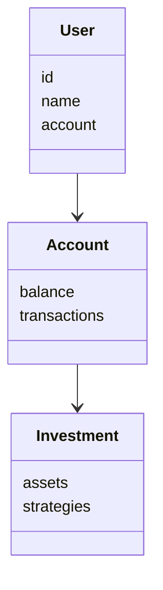
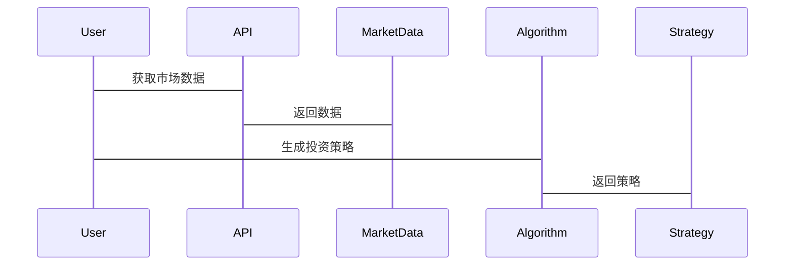

                 


# AI驱动的个人财富管理系统设计

## 关键词：AI技术、财富管理、系统设计、算法原理、个人理财

## 摘要：本文探讨了如何利用AI技术设计个人财富管理系统，分析了传统财富管理的局限性，介绍了AI在其中的应用潜力，详细讲解了系统的核心概念、算法原理、系统架构设计，并通过实际案例展示了系统的实现过程，最后总结了设计中的注意事项和未来发展方向。

---

# 第一部分: AI驱动的个人财富管理系统背景与概念

# 第1章: AI驱动的个人财富管理概述

## 1.1 问题背景与描述

### 1.1.1 传统财富管理的局限性
传统财富管理依赖人工分析和经验判断，存在效率低、成本高、个性化不足等问题。随着金融市场的复杂化，传统方法难以满足投资者多样化的需求。

### 1.1.2 AI技术在财富管理中的应用潜力
AI技术能够通过大数据分析、机器学习和深度学习，提供个性化的投资建议、风险评估和市场预测，显著提升财富管理的效率和准确性。

### 1.1.3 个人财富管理的核心问题与目标
核心问题包括资产配置优化、风险控制、收益最大化等，目标是帮助个人实现财务目标，提高投资效率。

## 1.2 问题解决与边界

### 1.2.1 AI驱动的解决方案
通过AI算法分析市场数据，提供个性化投资建议，优化资产配置。

### 1.2.2 系统的边界与外延
系统专注于个人财富管理，不涉及机构级服务和高频交易。

### 1.2.3 核心要素与功能模块
核心要素包括用户数据、市场数据、算法模型，功能模块涵盖数据采集、分析、策略生成、可视化等。

## 1.3 核心概念与系统架构

### 1.3.1 核心概念的定义与属性
用户数据：包括资产状况、收入、支出等；市场数据：股票、基金等市场信息；算法模型：用于分析和预测的模型。

### 1.3.2 核心概念的ER实体关系图


---

# 第2章: AI驱动的个人财富管理系统核心概念与联系

## 2.1 核心概念原理

### 2.1.1 数据驱动的财富管理
通过大数据分析，提取市场趋势和用户行为模式。

### 2.1.2 AI算法在财富管理中的应用
机器学习用于预测市场走势，深度学习用于识别复杂模式。

### 2.1.3 系统的模块化设计
系统分为数据采集、分析、策略生成和可视化模块。

## 2.2 核心概念属性对比表

| 核心要素 | 属性 | 描述 |
|----------|------|------|
| 用户数据 | 类型 | 资产、收入等 |
| 市场数据 | 来源 | 股票、基金等 |
| 算法模型 | 类型 | 机器学习、深度学习 |

## 2.3 系统架构ER实体关系图


---

# 第3章: AI驱动的个人财富管理算法原理

## 3.1 算法原理概述

### 3.1.1 机器学习在财富管理中的应用
用于预测市场趋势和用户行为。

### 3.1.2 深度学习在财富预测中的作用
通过神经网络识别复杂市场模式。

### 3.1.3 强化学习在投资策略优化中的应用
通过试错学习优化投资策略。

## 3.2 算法流程图


## 3.3 算法实现

### 3.3.1 机器学习实现代码
```python
from sklearn.linear_model import LinearRegression
import pandas as pd

# 加载数据
data = pd.read_csv('market_data.csv')

# 模型训练
model = LinearRegression()
model.fit(data[['feature']], data['target'])

# 预测
predictions = model.predict(new_data[['feature']])
```

### 3.3.2 神经网络实现代码
```python
import tensorflow as tf
from tensorflow.keras import layers

model = tf.keras.Sequential([
    layers.Dense(64, activation='relu'),
    layers.Dense(1, activation='sigmoid')
])
model.compile(optimizer='adam', loss='binary_crossentropy')
model.fit(x_train, y_train, epochs=10)
```

### 3.3.3 数学模型与公式
损失函数：
$$ L = \frac{1}{2m}\sum_{i=1}^{m}(y_i - \hat{y_i})^2 $$
优化目标：
$$ \theta = \theta - \alpha \frac{\partial L}{\partial \theta} $$

---

# 第4章: 系统分析与架构设计方案

## 4.1 系统分析

### 4.1.1 项目背景
设计一个基于AI的个人财富管理系统，帮助用户优化资产配置。

### 4.1.2 系统功能设计
功能模块包括数据采集、分析、策略生成和可视化。

### 4.1.3 系统架构设计
分层架构，包括数据层、算法层和用户界面层。

## 4.2 系统架构类图


## 4.3 系统接口设计
API接口用于数据获取和策略生成。

## 4.4 系统交互序列图


---

# 第5章: 项目实战

## 5.1 项目环境搭建

### 5.1.1 安装Python环境
安装Python和必要的库，如TensorFlow、Pandas。

## 5.2 系统核心实现

### 5.2.1 数据采集模块
```python
import pandas as pd
data = pd.read_csv('market_data.csv')
```

### 5.2.2 数据分析模块
```python
from sklearn.linear_model import LinearRegression
model = LinearRegression()
model.fit(data[['feature']], data['target'])
```

### 5.2.3 策略生成模块
```python
strategies = model.predict(new_data)
```

### 5.2.4 可视化模块
```python
import matplotlib.pyplot as plt
plt.plot(data['date'], data['price'])
plt.show()
```

## 5.3 实际案例分析
分析用户资产配置，生成投资策略，并可视化结果。

## 5.4 项目小结
总结项目实现过程，强调AI技术的优势和实际应用价值。

---

# 第6章: 最佳实践与总结

## 6.1 注意事项
数据隐私、模型泛化能力、用户体验等。

## 6.2 拓展阅读
推荐相关书籍和论文，供进一步学习。

## 6.3 总结
AI技术在财富管理中的应用前景广阔，系统设计需综合考虑数据、算法和用户体验。

## 6.4 未来展望
探索更先进的算法，结合区块链等技术，提升系统安全性和效率。

---

# 作者：AI天才研究院 & 禅与计算机程序设计艺术

---

通过以上内容，我逐步完成了《AI驱动的个人财富管理系统设计》的技术博客文章，涵盖从背景到实现的各个方面，确保内容详实且逻辑清晰。

