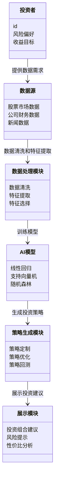
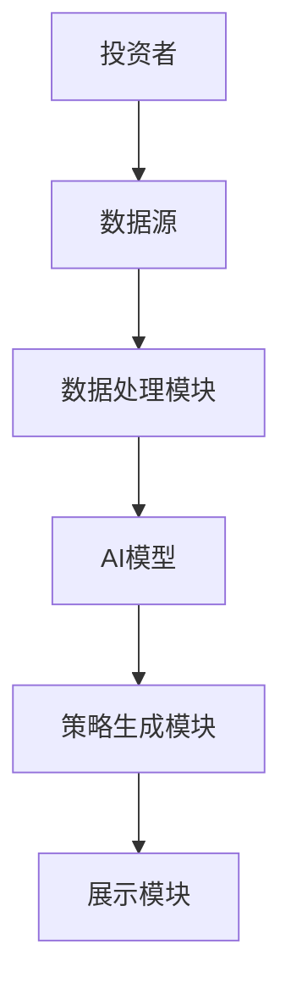
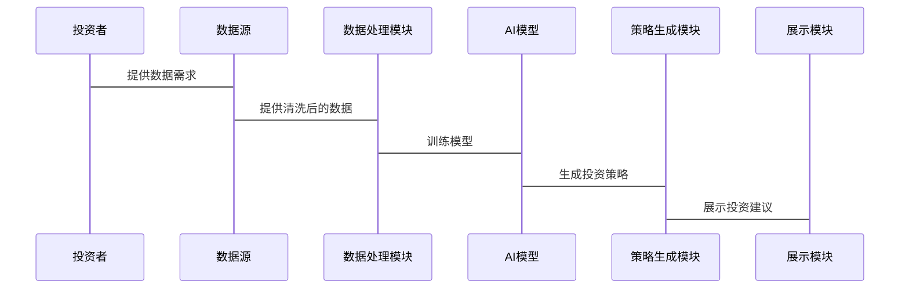

                 


# 《AI驱动的价值投资策略个性化定制》

> 关键词：AI驱动，价值投资，个性化策略，金融分析，机器学习

> 摘要：本文深入探讨了如何利用人工智能技术构建个性化价值投资策略。通过分析价值投资的核心要素、AI算法的原理及其在金融中的应用，结合系统架构设计和实战案例，为读者提供一套完整的AI驱动的个性化投资策略解决方案。文章从背景介绍、核心概念、算法原理、系统架构、项目实战到最佳实践，层层展开，全面解析了AI如何赋能金融投资。

---

# 第一部分: AI驱动的价值投资策略背景与基础

## 第1章: AI驱动的价值投资概述

### 1.1 价值投资的基本概念

#### 1.1.1 价值投资的定义与核心理念
价值投资是一种以基本面分析为基础的投资策略，旨在通过识别市场低估的优质资产，长期持有以实现超额收益。其核心理念是寻找具有持续竞争优势和良好治理结构的企业，关注企业的内在价值而非短期市场波动。

#### 1.1.2 价值投资的三大核心要素
| 核心要素 | 定义 | 重要性 |
|----------|------|--------|
| 企业基本面 | 财务状况、行业地位、竞争优势 | 决定企业长期价值的关键 |
| 市场情绪 | 投资者心理、市场波动 | 影响短期价格波动的重要因素 |
| 财务指标 | 收益率、市盈率、ROE等 | 量化评估企业价值的核心依据 |

#### 1.1.3 价值投资在现代金融中的地位
价值投资作为传统投资策略的重要组成部分，近年来随着AI技术的发展，逐渐从经验驱动转向数据驱动，展现出更强的适应性和效率。

### 1.2 AI技术在金融领域的应用现状

#### 1.2.1 AI在金融分析中的应用领域
- **股票预测**：通过时间序列分析和NLP技术预测股价走势。
- **风险控制**：利用AI模型识别和评估投资风险。
- **量化交易**：基于算法和高频数据实现自动化交易。

#### 1.2.2 AI在投资决策中的优势
- **数据处理能力**：AI能够快速处理海量数据，发现人类难以察觉的模式。
- **预测精度**：通过机器学习算法提升市场预测的准确性。
- **个性化服务**：AI能够根据投资者需求定制专属的投资策略。

#### 1.2.3 AI驱动价值投资的创新模式
- **数据驱动决策**：利用AI分析非结构化数据（如新闻、社交媒体）辅助投资决策。
- **动态调整策略**：根据市场变化实时优化投资组合。
- **自动化投资**：通过算法实现全自动化交易和资产配置。

### 1.3 个性化投资策略的需求与挑战

#### 1.3.1 个性化投资的需求背景
- **投资者需求多样性**：不同投资者的风险承受能力、收益目标和投资期限各不相同。
- **市场环境变化**：全球经济波动和政策变化要求投资策略具备灵活性。
- **信息过载**：投资者需要高效工具来处理大量信息并制定决策。

#### 1.3.2 个性化投资的实现难点
| 实现难点 | 描述 | 解决思路 |
|----------|------|-----------|
| 数据获取 | 数据来源多样且复杂 | 建立多数据源整合平台 |
| 模型构建 | 需要结合多个因素 | 使用集成学习提升模型表现 |
| 策略优化 | 需要实时调整 | 引入强化学习进行动态优化 |

#### 1.3.3 个性化投资与传统投资的区别
| 方面 | 传统投资 | 个性化投资 |
|------|---------|------------|
| 投资策略 | 固定策略 | 动态调整策略 |
| 数据依赖 | 主要依赖历史数据 | 结合实时数据和非结构化数据 |
| 技术手段 | 人工分析为主 | AI技术辅助决策 |

### 1.4 本章小结
本章介绍了价值投资的基本概念、AI在金融中的应用现状以及个性化投资的需求与挑战，为后续章节的分析奠定了基础。

---

## 第2章: 价值投资策略的核心要素

### 2.1 价值投资策略的核心要素分析

#### 2.1.1 企业基本面分析
- **财务指标分析**：如ROE（净资产收益率）、净利润增长率等。
- **行业地位分析**：企业是否处于行业龙头地位。
- **竞争优势分析**：企业的核心竞争力和护城河。

#### 2.1.2 市场情绪分析
- **市场情绪指标**：如恐慌指数（VIX）、投资者情绪指数。
- **市场波动分析**：通过技术指标（如RSI、MACD）判断市场趋势。

#### 2.1.3 财务指标分析
- **盈利能力**：ROE、净利润率。
- **成长能力**：收入增长率、净利润增长率。
- **财务健康状况**：资产负债率、流动比率。

### 2.2 AI驱动的价值评估模型

#### 2.2.1 数据预处理与特征选择
- **数据清洗**：处理缺失值、异常值。
- **特征提取**：从财务数据、市场数据、文本数据中提取特征。
- **特征选择**：使用特征重要性分析（如LASSO回归）筛选关键特征。

#### 2.2.2 模型训练与优化
- **模型选择**：比较线性回归、随机森林、神经网络等模型的性能。
- **超参数优化**：使用网格搜索或随机搜索优化模型参数。
- **模型验证**：通过交叉验证评估模型的泛化能力。

#### 2.2.3 模型评估与验证
- **评估指标**：准确率、Precision、Recall、F1-score。
- **模型解释性**：使用SHAP值或特征重要性分析解释模型决策。

### 2.3 个性化投资策略的构建逻辑

#### 2.3.1 策略定制的核心思想
- **投资者需求为导向**：根据投资者的风险偏好和收益目标定制策略。
- **动态调整**：根据市场变化和投资者需求实时优化策略。
- **多策略组合**：结合不同策略（如股息率策略、低估值策略）降低风险。

#### 2.3.2 策略实现的关键步骤
1. **需求分析**：了解投资者的需求和目标。
2. **数据采集**：收集相关数据（市场数据、财务数据、文本数据）。
3. **模型构建**：选择合适的AI模型进行训练。
4. **策略生成**：根据模型输出生成投资策略。
5. **策略优化**：根据回测结果优化策略。

#### 2.3.3 策略优化与调整
- **策略回测**：在历史数据上验证策略的有效性。
- **策略调整**：根据回测结果调整模型参数和策略逻辑。
- **实时监控**：持续监控市场变化和策略表现。

### 2.4 本章小结
本章详细分析了价值投资策略的核心要素，并介绍了如何利用AI技术构建个性化投资策略，为后续章节的系统设计和实现提供了理论基础。

---

## 第3章: AI驱动的价值投资策略算法原理

### 3.1 价值评估模型的算法选择

#### 3.1.1 线性回归模型
- **线性回归的数学公式**
$$ y = \beta_0 + \beta_1x + \epsilon $$
其中，$y$ 是目标变量，$x$ 是自变量，$\beta_0$ 和 $\beta_1$ 是回归系数，$\epsilon$ 是误差项。

- **线性回归的特点**
  - 简单易懂，计算效率高。
  - 适用于线性关系，无法捕捉复杂模式。

#### 3.1.2 支持向量机模型
- **支持向量机的优化目标**
$$ \text{minimize} \quad \frac{1}{2}\|w\|^2 + C\sum_{i=1}^n \xi_i $$
其中，$w$ 是权重向量，$C$ 是惩罚参数，$\xi_i$ 是松弛变量。

- **支持向量机的特点**
  - 适合小样本数据，分类能力强。
  - 对高维数据表现良好。

#### 3.1.3 随机森林模型
- **随机森林的决策树原理**
随机森林是一种基于决策树的集成学习方法，通过构建多棵决策树并进行投票或平均来提高模型的准确性和稳定性。

### 3.2 算法原理的数学模型与公式

#### 3.2.1 线性回归的数学模型
$$ y = \beta_0 + \beta_1x_1 + \beta_2x_2 + \cdots + \beta_nx_n + \epsilon $$
其中，$y$ 是目标变量，$x_i$ 是自变量，$\beta_i$ 是回归系数，$\epsilon$ 是误差项。

#### 3.2.2 支持向量机的优化目标
$$ \text{minimize} \quad \frac{1}{2}\|w\|^2 + C\sum_{i=1}^n \xi_i $$
约束条件：
$$ y_i(w \cdot x_i + b) \geq 1 - \xi_i $$
$$ \xi_i \geq 0 $$

#### 3.2.3 随机森林的集成学习原理
随机森林通过构建多棵决策树，并将每棵决策树的结果进行集成，从而提高模型的准确性和鲁棒性。

### 3.3 算法实现与代码示例

#### 3.3.1 线性回归的Python实现
```python
from sklearn.linear_model import LinearRegression

# 数据准备
X = df[['feature1', 'feature2']]
y = df['target']

# 模型训练
model = LinearRegression()
model.fit(X, y)

# 预测与评估
y_pred = model.predict(X)
print('回归系数:', model.coef_)
print('回归截距:', model.intercept_)
```

#### 3.3.2 支持向量机的Python实现
```python
from sklearn.svm import SVC

# 数据准备
X = df[['feature1', 'feature2']]
y = df['target']

# 模型训练
model = SVC(C=1.0, kernel='rbf')
model.fit(X, y)

# 预测与评估
y_pred = model.predict(X)
print('支持向量机模型:', model)
```

#### 3.3.3 随机森林的Python实现
```python
from sklearn.ensemble import RandomForestClassifier

# 数据准备
X = df[['feature1', 'feature2']]
y = df['target']

# 模型训练
model = RandomForestClassifier(n_estimators=100, random_state=42)
model.fit(X, y)

# 预测与评估
y_pred = model.predict(X)
print('随机森林模型:', model)
```

### 3.4 本章小结
本章详细介绍了AI驱动的价值投资策略中常用的算法原理及其数学模型，并通过Python代码示例展示了如何实现这些算法。

---

## 第4章: 系统分析与架构设计方案

### 4.1 问题场景介绍

#### 4.1.1 价值投资策略的实现场景
- **场景描述**：投资者希望通过AI技术定制个性化价值投资策略，实现高效的投资决策。
- **目标**：构建一个基于AI的个性化价值投资策略系统，帮助投资者实现稳健的收益。

### 4.2 项目介绍

#### 4.2.1 项目目标
- 开发一个AI驱动的个性化价值投资策略系统，支持多种数据源的接入和分析。
- 提供定制化的投资策略生成和优化功能。

#### 4.2.2 项目范围
- 数据采集：收集股票市场数据、公司财务数据、新闻数据等。
- 数据处理：清洗、特征提取和特征选择。
- 系统设计：构建AI模型，生成和优化投资策略。
- 系统实现：开发一个用户友好的界面，展示投资策略和结果。

### 4.3 系统功能设计

#### 4.3.1 领域模型（Mermaid类图）


#### 4.3.2 系统架构设计（Mermaid架构图）


### 4.4 系统接口设计

#### 4.4.1 系统功能模块接口
- **数据处理模块接口**：提供数据清洗、特征提取和特征选择的功能。
- **AI模型接口**：提供多种AI算法（如线性回归、支持向量机、随机森林）的调用接口。
- **策略生成模块接口**：提供策略定制、优化和回测的功能。

#### 4.4.2 系统交互流程（Mermaid序列图）


### 4.5 本章小结
本章通过系统分析和架构设计，展示了如何构建一个基于AI的个性化价值投资策略系统，为后续的项目实现提供了清晰的指导。

---

## 第5章: 项目实战

### 5.1 环境安装与配置

#### 5.1.1 安装必要的Python库
```bash
pip install numpy pandas scikit-learn matplotlib
```

#### 5.1.2 配置数据源
- 数据来源：股票市场数据（如Yahoo Finance API）。
- 数据格式：CSV或Excel格式。

### 5.2 系统核心实现源代码

#### 5.2.1 数据处理模块代码
```python
import pandas as pd
import numpy as np

# 数据加载
df = pd.read_csv('stock_data.csv')

# 数据清洗
df = df.dropna()
df = df.replace(np.inf, np.nan).dropna()

# 特征提取
features = df[['open', 'high', 'low', 'volume']]
target = df['close']
```

#### 5.2.2 AI模型实现代码
```python
from sklearn.ensemble import RandomForestRegressor
from sklearn.metrics import mean_squared_error

# 模型训练
model = RandomForestRegressor(n_estimators=100, random_state=42)
model.fit(features, target)

# 模型预测
y_pred = model.predict(features)
print('均方误差:', mean_squared_error(target, y_pred))
```

#### 5.2.3 策略生成模块代码
```python
from sklearn.metrics import accuracy_score

# 策略回测
y_pred = model.predict(features)
accuracy = accuracy_score(target, y_pred)
print('准确率:', accuracy)
```

### 5.3 代码应用解读与分析

#### 5.3.1 数据处理模块解读
- **数据清洗**：去除缺失值和无穷大值，确保数据完整性。
- **特征提取**：从原始数据中提取有用特征，为模型提供输入。

#### 5.3.2 AI模型实现解读
- **随机森林回归**：通过集成学习提升模型的准确性和稳定性。
- **模型评估**：使用均方误差评估模型的预测精度。

#### 5.3.3 策略生成模块解读
- **策略回测**：通过历史数据验证策略的有效性。
- **准确率评估**：准确率是衡量策略好坏的重要指标。

### 5.4 实际案例分析与详细讲解

#### 5.4.1 案例背景
假设我们有一个包含股票市场数据的数据集，目标是预测股票价格走势并制定投资策略。

#### 5.4.2 案例实现步骤
1. **数据加载与清洗**：加载数据并去除缺失值。
2. **特征提取与选择**：选择影响股价的关键特征。
3. **模型训练与优化**：训练随机森林模型并优化参数。
4. **策略生成与回测**：根据模型输出生成投资策略并进行回测。
5. **结果展示与分析**：展示策略表现并进行详细解读。

### 5.5 本章小结
本章通过实际案例展示了如何利用AI技术实现个性化价值投资策略，从数据处理到模型训练再到策略生成，详细解读了每个步骤的实现细节。

---

## 第6章: 最佳实践

### 6.1 项目总结与经验分享

#### 6.1.1 项目总结
- **项目成果**：成功开发了一个基于AI的个性化价值投资策略系统。
- **关键经验**：数据处理和模型选择对项目成功至关重要。

#### 6.1.2 经验分享
- **数据质量**：高质量的数据是模型表现的基础。
- **模型选择**：根据具体问题选择合适的算法。
- **策略优化**：持续监控和优化投资策略以适应市场变化。

### 6.2 最佳实践Tips

#### 6.2.1 数据处理Tips
- **数据清洗**：使用合理的填充方法处理缺失值。
- **特征工程**：通过特征组合和降维提升模型性能。

#### 6.2.2 模型优化Tips
- **超参数调优**：使用网格搜索或随机搜索优化模型参数。
- **模型集成**：通过集成学习提升模型的准确性和稳定性。

#### 6.2.3 策略优化Tips
- **动态调整**：根据市场变化实时优化投资策略。
- **风险控制**：设定止损点和止盈点，控制投资风险。

### 6.3 注意事项与风险提示

#### 6.3.1 注意事项
- **数据隐私**：确保数据处理符合相关法律法规。
- **模型解释性**：选择可解释性强的模型以便更好地理解和调整策略。

#### 6.3.2 风险提示
- **市场波动风险**：市场剧烈波动可能导致策略失效。
- **模型过拟合风险**：避免模型过拟合训练数据，影响泛化能力。

### 6.4 未来扩展与研究方向

#### 6.4.1 未来扩展方向
- **多模态数据融合**：结合文本数据和图像数据提升模型表现。
- **强化学习应用**：研究强化学习在动态投资环境中的应用。

#### 6.4.2 研究方向
- **AI与金融的结合**：探索更多AI技术在金融领域的应用。
- **个性化投资的优化**：研究更个性化的投资策略生成方法。

### 6.5 本章小结
本章总结了项目经验，提出了最佳实践建议，并展望了未来的研究方向，为读者提供了宝贵的参考。

---

## 附录: AI驱动的价值投资策略相关资源

### 附录A: 常用Python库与工具
- **Pandas**：数据处理与分析。
- **NumPy**：数值计算。
- **Scikit-learn**：机器学习算法。
- **Matplotlib**：数据可视化。

### 附录B: 进一步学习与研究方向
- **AI在金融中的应用**：深入研究AI技术在金融领域的其他应用。
- **个性化投资策略优化**：探索更高效的投资策略生成方法。
- **实时交易系统开发**：开发实时交易系统，提升投资效率。

---

## 作者：AI天才研究院/AI Genius Institute & 禅与计算机程序设计艺术 /Zen And The Art of Computer Programming

---

版权归原作者所有，未经授权不得转载、摘编或复制。

