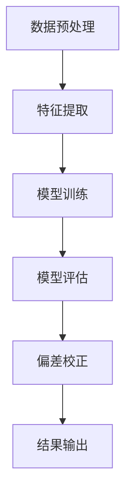
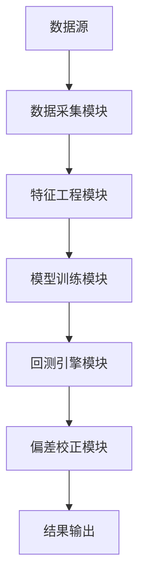
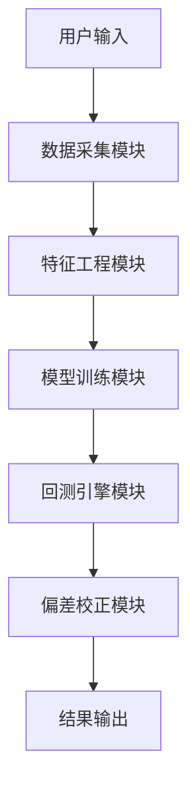

                 

# AI驱动的价值投资策略回测偏差校正

> 关键词：AI驱动，价值投资，策略回测，偏差校正，机器学习，深度学习，金融分析

> 摘要：本文将详细探讨如何利用人工智能技术优化价值投资策略的回测过程，特别是如何利用AI技术校正回测中的偏差。通过分析价值投资的核心概念、AI在金融中的应用，以及回测偏差的成因，本文将提出一种基于机器学习的回测偏差校正算法，并通过系统架构设计和实际案例展示如何将这些理论应用于实践。最后，本文将总结经验和最佳实践，为读者提供实用的指导。

---

## 目录

# 第一部分: AI驱动的价值投资策略回测背景与基础

## 第1章: 价值投资与AI驱动的回测概述

### 1.1 价值投资的核心概念

#### 1.1.1 价值投资的定义与特点
价值投资是一种以内在价值为导向的投资策略，强调以低于内在价值的价格买入优质资产。其特点包括长期导向、注重基本面分析、追求安全边际等。

#### 1.1.2 价值投资的基本原理
价值投资的原理包括寻找市场低估的资产、关注企业的长期盈利能力、分散投资以降低风险等。

#### 1.1.3 价值投资在现代金融中的地位
价值投资在现代金融中占据重要地位，尤其是在机构投资和个人投资中广泛应用，但传统方法存在效率低下、主观性强等问题。

### 1.2 AI在金融领域的应用

#### 1.2.1 AI在金融分析中的作用
AI技术在金融分析中的作用包括数据处理、预测模型构建、风险评估等，能够显著提高分析效率和准确性。

#### 1.2.2 AI在投资策略中的应用
AI技术被广泛应用于投资策略的制定与优化，如量化投资、情绪分析、市场预测等领域。

#### 1.2.3 AI在回测中的潜在价值
AI能够帮助优化回测过程，减少人为偏差，提高回测结果的准确性和可靠性。

### 1.3 回测偏差的定义与影响

#### 1.3.1 回测的基本概念
回测是指通过历史数据测试投资策略的有效性，是投资策略开发的重要环节。

#### 1.3.2 回测偏差的定义
回测偏差是指回测结果与实际投资表现之间的差异，主要由数据选择偏差、模型过拟合、回测环境不真实等因素引起。

#### 1.3.3 回测偏差对投资决策的影响
回测偏差可能导致投资者基于虚假的策略表现做出错误的投资决策，增加投资风险。

### 1.4 本章小结
本章介绍了价值投资的基本概念、AI在金融领域的应用，以及回测偏差的定义与影响，为后续内容奠定了基础。

---

## 第二部分: AI驱动的价值投资策略回测偏差校正的核心概念

## 第2章: AI与价值投资策略的结合

### 2.1 价值投资策略的AI化

#### 2.1.1 传统价值投资策略的局限性
传统价值投资策略依赖于人工分析，存在效率低下、主观性强、覆盖面窄等问题。

#### 2.1.2 AI在价值投资策略中的优势
AI技术能够提高分析效率、降低人为偏差、扩展分析范围，为价值投资策略的优化提供了新的可能性。

#### 2.1.3 AI驱动的策略优化
通过机器学习等技术，AI可以自动识别市场模式、优化投资组合、预测市场趋势，从而提升价值投资策略的效率和准确性。

### 2.2 回测偏差的成因分析

#### 2.2.1 数据偏差的来源
数据偏差可能来自数据样本的选择、数据清洗过程中的遗漏，以及历史数据的不可重复性。

#### 2.2.2 模型偏差的来源
模型偏差包括模型假设的不合理、特征选择的偏差、算法过拟合等问题。

#### 2.2.3 回测过程中的其他偏差
其他偏差可能来自回测环境与实际市场的差异、交易成本的忽略、策略执行的延迟等因素。

### 2.3 偏差校正的核心原理

#### 2.3.1 偏差校正的基本思路
偏差校正的核心思路是通过识别和调整偏差源，提高回测结果的准确性和可靠性。

#### 2.3.2 AI在偏差校正中的作用
AI技术可以通过数据分析、模型优化、特征工程等方法，有效识别和校正回测中的偏差。

#### 2.3.3 偏差校正的数学模型
偏差校正的数学模型通常包括数据预处理、特征选择、模型优化等步骤，通过这些步骤消除或减少偏差的影响。

### 2.4 本章小结
本章探讨了AI如何与价值投资策略结合，分析了回测偏差的成因，并介绍了偏差校正的核心原理。

---

## 第三部分: AI驱动的价值投资策略回测偏差校正的算法原理

## 第3章: 基于机器学习的回测偏差校正算法

### 3.1 机器学习在回测中的应用

#### 3.1.1 机器学习的基本概念
机器学习是一种通过数据训练模型，使其能够自动学习和改进的技术，广泛应用于分类、回归、聚类等问题。

#### 3.1.2 机器学习在金融回测中的应用
机器学习在金融回测中的应用包括预测市场趋势、评估资产风险、优化投资组合等。

#### 3.1.3 机器学习与价值投资的结合
机器学习可以帮助识别市场中的价值低估资产、预测企业的盈利能力和成长性，从而优化价值投资策略。

### 3.2 回测偏差校正的算法选择

#### 3.2.1 常见的偏差校正算法
常见的偏差校正算法包括过采样、欠采样、集成学习等方法。

#### 3.2.2 机器学习算法在偏差校正中的适用性
不同的机器学习算法适用于不同的偏差校正场景，例如随机森林适合处理类别不平衡问题，支持向量机适合高维数据分类。

#### 3.2.3 基于深度学习的偏差校正算法
深度学习算法如神经网络、卷积神经网络等，可以通过非线性特征学习提高偏差校正的效果。

### 3.3 算法实现的数学模型

#### 3.3.1 回测偏差校正的数学模型
假设我们有一个投资组合的收益数据，我们可以通过机器学习模型来预测其真实收益，从而校正回测中的偏差。

#### 3.3.2 偏差校正的优化目标函数
$$ \text{目标函数} = \text{损失函数} + \lambda \times \text{正则化项} $$

#### 3.3.3 偏差校正的损失函数
$$ \text{损失函数} = \frac{1}{N} \sum_{i=1}^{N} (y_i - \hat{y}_i)^2 $$

### 3.4 算法实现的流程图

### 3.5 本章小结
本章详细介绍了基于机器学习的回测偏差校正算法，包括算法选择、数学模型和实现流程。

---

## 第四部分: AI驱动的价值投资策略回测偏差校正的系统架构

## 第4章: 系统架构设计

### 4.1 系统功能模块划分

#### 4.1.1 数据采集模块
数据采集模块负责收集历史市场数据、公司基本面数据等。

#### 4.1.2 特征工程模块
特征工程模块负责对数据进行清洗、特征提取和特征选择，为模型训练提供高质量的特征。

#### 4.1.3 模型训练模块
模型训练模块利用机器学习算法训练回测偏差校正模型。

#### 4.1.4 回测引擎模块
回测引擎模块负责模拟投资策略的回测过程，并输出回测结果。

#### 4.1.5 偏差校正模块
偏差校正模块通过模型输出调整回测结果，消除偏差的影响。

### 4.2 系统架构设计

### 4.3 系统接口设计

#### 4.3.1 数据接口
数据接口负责与数据源的交互，包括数据的获取和存储。

#### 4.3.2 模型接口
模型接口负责与机器学习模型的交互，包括模型的训练和预测。

#### 4.3.3 回测接口
回测接口负责与回测引擎的交互，包括回测参数的设置和回测结果的获取。

### 4.4 系统交互流程图

### 4.5 本章小结
本章设计了一个完整的系统架构，展示了如何将AI驱动的回测偏差校正算法应用于实际系统中。

---

## 第五部分: 项目实战

## 第5章: 项目实战与经验分享

### 5.1 项目背景介绍

#### 5.1.1 项目目标
本项目旨在利用AI技术优化价值投资策略的回测过程，校正回测中的偏差。

#### 5.1.2 项目需求
项目需求包括数据采集、特征工程、模型训练、回测模拟和偏差校正等模块。

### 5.2 项目环境安装

#### 5.2.1 安装Python
安装Python 3.8或更高版本。

#### 5.2.2 安装必要的库
安装pandas、numpy、scikit-learn、xgboost等库。

#### 5.2.3 安装深度学习框架（可选）
安装TensorFlow或Keras用于深度学习模型的训练。

### 5.3 项目核心实现

#### 5.3.1 数据采集与预处理
使用API获取历史数据，清洗数据并提取特征。

#### 5.3.2 特征工程
进行特征选择、标准化、归一化等处理，为模型训练提供高质量的特征。

#### 5.3.3 模型实现
选择合适的机器学习算法训练模型，并进行交叉验证和调优。

#### 5.3.4 回测模拟
模拟投资策略的回测过程，记录回测结果。

#### 5.3.5 偏差校正
通过模型输出调整回测结果，校正偏差。

### 5.4 项目小结
本章通过具体案例展示了如何利用AI技术优化价值投资策略的回测过程，总结了项目实施的经验和注意事项。

---

## 第六部分: 最佳实践与总结

## 第6章: 最佳实践与总结

### 6.1 小结

#### 6.1.1 核心概念回顾
回顾了AI驱动的价值投资策略回测偏差校正的核心概念。

#### 6.1.2 项目经验总结
总结了项目实施中的经验和教训。

### 6.2 注意事项

#### 6.2.1 数据质量的重要性
数据质量直接影响回测结果的准确性，需要高度重视数据清洗和特征工程。

#### 6.2.2 模型选择的合理性
模型选择需要根据具体问题和数据特点进行合理选择，避免盲目追求复杂模型。

#### 6.2.3 回测环境的真实性
回测环境需要尽可能接近实际市场环境，减少因环境差异导致的偏差。

### 6.3 拓展阅读

#### 6.3.1 相关书籍
推荐一些关于AI在金融中的应用的经典书籍。

#### 6.3.2 相关论文
推荐一些关于回测偏差校正的学术论文。

#### 6.3.3 在线资源
推荐一些在线资源，如Coursera上的相关课程、Kaggle上的相关项目等。

### 6.4 本章小结
本章总结了AI驱动的价值投资策略回测偏差校正的核心内容，并提供了实用的建议和拓展阅读资料。

---

## 作者信息

作者：AI天才研究院/AI Genius Institute & 禅与计算机程序设计艺术 /Zen And The Art of Computer Programming

---

以上目录大纲涵盖了从理论到实践的各个方面，确保内容全面、逻辑清晰、结构紧凑。每一章都详细探讨了相关的核心概念，并通过具体的案例和代码示例帮助读者理解和应用这些知识。

