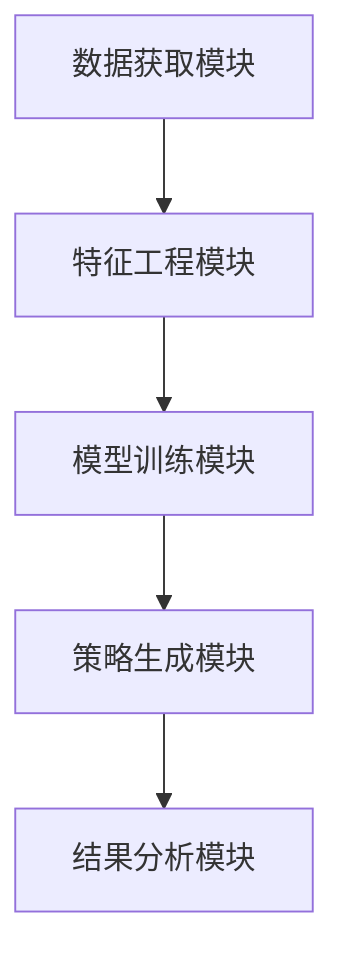

                 


# AI驱动的价值投资策略归因分析

## 关键词：AI, 价值投资, 归因分析, 金融策略, 机器学习

## 摘要：  
本文深入探讨了AI驱动的价值投资策略归因分析的核心概念、方法和实现。通过结合金融学、机器学习和深度学习的最新进展，详细分析了如何利用AI技术从多维度数据中提取有效信息，构建和优化投资策略模型，并通过归因分析明确策略收益的来源。文章从理论基础到实战案例，全面阐述了AI在金融投资中的应用潜力和实际价值。

---

# 第一部分: AI驱动的价值投资策略归因分析背景与基础

## 第1章: AI驱动的金融分析概述

### 1.1 价值投资策略基础

#### 1.1.1 价值投资的核心概念  
价值投资是一种以基本面分析为基础的投资策略，旨在通过分析企业的财务状况、行业地位和成长潜力，寻找市场价格低于其内在价值的股票。其核心在于“买便宜”的原则，即寻找市场未充分反映其内在价值的企业。

#### 1.1.2 价值投资的策略分类  
价值投资策略可以分为以下几类：  
1. **绝对价值投资**：基于企业的内在价值，寻找市场价格低于内在价值的股票。  
2. **相对价值投资**：比较不同资产或股票的相对价值，寻找估值相对较低的标的。  
3. **事件驱动型价值投资**：基于特定事件（如并购、重组等）带来的价值重估机会进行投资。  

#### 1.1.3 价值投资的数学模型  
价值投资的核心是通过对企业财务指标（如市盈率、市净率、股息率等）的分析，计算出企业的内在价值。常用的数学模型包括：  
1. **DCF模型（ discounted cash flow model）**：通过预测企业未来现金流的现值来评估其内在价值。  
2. **市盈率模型**：通过比较股票的市盈率与行业或市场平均水平，判断其估值是否合理。  

### 1.2 AI在金融分析中的应用  

#### 1.2.1 AI在金融分析中的优势  
1. **数据处理能力**：AI能够快速处理海量金融数据，提取有用的特征信息。  
2. **模式识别**：通过机器学习算法，AI可以识别数据中的复杂模式和潜在关系。  
3. **实时性**：AI能够实现实时数据分析和策略调整，提高交易效率。  

#### 1.2.2 AI在金融分析中的常见场景  
1. **股票预测**：利用历史价格和市场数据预测未来股价走势。  
2. **风险评估**：通过分析企业财务数据和市场信息，评估投资风险。  
3. **组合优化**：基于多目标优化算法，构建风险收益平衡的投资组合。  

#### 1.2.3 AI驱动的价值投资策略的潜力  
AI技术的应用能够显著提高价值投资策略的效率和准确性。通过深度学习模型，AI可以挖掘传统金融分析方法难以捕捉的隐含信息，帮助投资者发现潜在的投资机会。

---

## 第2章: 价值投资策略归因分析基础  

### 2.1 价值投资策略归因分析的定义  

#### 2.1.1 归因分析的基本概念  
归因分析是一种将投资组合的收益分解为各个因素贡献的方法。它能够帮助投资者理解投资决策对最终收益的具体影响，从而优化投资策略。  

#### 2.1.2 价值投资策略归因分析的目标  
1. **识别收益来源**：确定投资收益是来自选股策略、市场波动还是其他因素。  
2. **评估策略效果**：通过分析策略的贡献，判断投资策略的有效性。  
3. **优化投资组合**：基于归因分析的结果，调整投资组合以提高收益或降低风险。  

#### 2.1.3 归因分析的数学模型  
归因分析通常基于回归模型，通过构建多元回归方程，分解收益来源。  
例如，Fama三因子模型是一种常用的归因分析方法，其数学表达式为：  
$$ R_i = \alpha + \beta_1 R_{m} + \beta_2 SMB + \beta_3 HML + \epsilon $$  
其中，$R_i$ 是资产的超额收益，$R_m$ 是市场收益，$SMB$ 是小盘股溢价，$HML$ 是价值溢价，$\epsilon$ 是误差项。

### 2.2 数据基础  

#### 2.2.1 数据来源与类型  
1. **市场数据**：包括股票价格、成交量、指数数据等。  
2. **财务数据**：包括企业的收入、利润、负债等财务指标。  
3. **文本数据**：包括公司公告、新闻标题、行业报告等。  

#### 2.2.2 数据预处理与清洗  
1. **缺失值处理**：通过插值或删除法处理缺失数据。  
2. **异常值处理**：识别并处理异常值，确保数据的准确性。  
3. **数据标准化**：对不同量纲的数据进行标准化处理，便于模型训练。  

#### 2.2.3 数据特征提取  
1. **统计特征**：如均值、方差、最大值等。  
2. **技术指标**：如RSI、MACD等技术分析指标。  
3. **文本特征**：如关键词提取、情感分析等。  

### 2.3 AI基础  

#### 2.3.1 机器学习在金融中的应用  
1. **监督学习**：用于分类和回归问题，如股票价格预测。  
2. **无监督学习**：用于聚类和异常检测，如客户行为分析。  

#### 2.3.2 深度学习在金融中的应用  
1. **神经网络**：用于复杂模式识别，如股价预测和风险评估。  
2. **卷积神经网络（CNN）**：用于图像和序列数据的分析，如K线图分析。  

#### 2.3.3 自然语言处理（NLP）在金融中的应用  
1. **情感分析**：分析市场情绪，预测股价走势。  
2. **文本挖掘**：提取公司公告中的关键信息，辅助投资决策。  

---

# 第二部分: AI驱动的价值投资策略归因分析方法论  

## 第3章: 归因分析方法  

### 3.1 Fama三因子模型  

#### 3.1.1 Fama三因子模型的定义  
Fama三因子模型是一种资产收益归因模型，用于解释资产收益的来源。它包括市场因子、小盘股溢价因子和价值溢价因子。  

#### 3.1.2 Fama三因子模型的数学公式  
$$ R_i = \alpha + \beta_1 R_{m} + \beta_2 SMB + \beta_3 HML + \epsilon $$  
其中，$\alpha$ 是截距项，$\beta$ 是因子的回归系数，$R_{m}$ 是市场收益，$SMB$ 是小盘股溢价，$HML$ 是价值溢价，$\epsilon$ 是误差项。  

#### 3.1.3 Fama三因子模型的实现步骤  
1. **数据收集**：收集资产收益和因子数据。  
2. **回归分析**：通过多元回归模型计算各因子的回归系数。  
3. **结果解读**：分析各因子对资产收益的贡献。  

### 3.2 多因子模型构建  

#### 3.2.1 多因子模型的定义  
多因子模型是将多个因子组合起来解释资产收益的一种方法。常用的因子包括市场因子、价值因子、动量因子等。  

#### 3.2.2 多因子模型的数学公式  
$$ R_i = \alpha + \beta_1 R_{m} + \beta_2 Value + \beta_3 Momentum + \epsilon $$  
其中，$Value$ 是价值因子，$Momentum$ 是动量因子。  

#### 3.2.3 多因子模型的实现步骤  
1. **因子选择**：选择具有解释力的因子。  
2. **回归分析**：通过多元回归模型计算各因子的回归系数。  
3. **模型优化**：通过逐步剔除不显著的因子，优化模型。  

### 3.3 特征工程  

#### 3.3.1 特征工程的定义  
特征工程是指对数据进行处理和转换，以提高模型的性能和可解释性。  

#### 3.3.2 特征工程的关键步骤  
1. **特征提取**：从原始数据中提取有用的特征。  
2. **特征变换**：对特征进行标准化、归一化等处理。  
3. **特征选择**：通过统计或机器学习方法选择重要的特征。  

---

## 第4章: AI驱动的价值投资策略构建  

### 4.1 AI模型的构建步骤  

#### 4.1.1 数据准备  
1. **数据收集**：收集股票价格、财务数据、新闻等多源数据。  
2. **数据清洗**：处理缺失值、异常值等。  
3. **特征提取**：提取统计特征、文本特征等。  

#### 4.1.2 模型训练  
1. **选择算法**：选择适合的机器学习或深度学习算法。  
2. **模型训练**：通过训练数据训练模型。  
3. **模型调优**：通过交叉验证优化模型参数。  

#### 4.1.3 模型评估  
1. **评估指标**：如准确率、召回率、F1分数等。  
2. **回测分析**：通过历史数据验证模型的预测能力。  

### 4.2 策略优化  

#### 4.2.1 策略回测  
1. **回测方法**：通过历史数据模拟投资策略的表现。  
2. **风险控制**：设置止损、止盈等机制，控制投资风险。  

#### 4.2.2 策略优化  
1. **参数优化**：通过网格搜索等方法优化模型参数。  
2. **组合优化**：通过多目标优化算法构建最优投资组合。  

---

# 第三部分: AI驱动的价值投资策略归因分析的系统架构设计  

## 第5章: 系统架构设计  

### 5.1 系统功能设计  

#### 5.1.1 数据获取模块  
1. **数据源**：包括股票数据、财务数据、新闻数据等。  
2. **数据接口**：通过API获取实时数据。  

#### 5.1.2 特征工程模块  
1. **特征提取**：提取统计特征、文本特征等。  
2. **特征变换**：对特征进行标准化、归一化处理。  

#### 5.1.3 模型训练模块  
1. **算法选择**：选择适合的机器学习或深度学习算法。  
2. **模型训练**：通过训练数据训练模型。  

#### 5.1.4 策略生成模块  
1. **策略回测**：通过历史数据模拟投资策略的表现。  
2. **策略优化**：通过参数优化和组合优化提升策略性能。  

### 5.2 系统架构设计  

#### 5.2.1 系统架构图  


---

## 第6章: 项目实战  

### 6.1 环境搭建  

#### 6.1.1 安装Python  
安装Python 3.x版本，并安装必要的库：  
- `pandas`：数据处理。  
- `numpy`：数值计算。  
- `scikit-learn`：机器学习算法。  
- `keras`：深度学习框架。  

### 6.2 核心实现  

#### 6.2.1 数据获取与处理  
```python
import pandas as pd
import numpy as np

# 获取股票数据
data = pd.read_csv('stock_data.csv')

# 数据清洗
data.dropna()  # 删除缺失值
data = data[~data.isin([np.nan, np.inf, -np.inf])]  # 删除无穷大值
```

#### 6.2.2 特征工程  
```python
from sklearn.preprocessing import StandardScaler

# 特征标准化
scaler = StandardScaler()
features = scaler.fit_transform(features)
```

#### 6.2.3 模型训练  
```python
from sklearn.linear_model import LinearRegression

# 线性回归模型
model = LinearRegression()
model.fit(X_train, y_train)
```

#### 6.2.4 策略回测  
```python
import backtrader as bt

# 回测策略
class MyStrategy(bt.Strategy):
    def __init__(self):
        self.data = self.datas[0]
        self.order = None

    def next(self):
        if self.order:
            return
        if self.data.close > self.data.open:
            self.order = self.buy()
```

---

## 第7章: 高级主题  

### 7.1 风险管理  

#### 7.1.1 风险评估  
通过VaR（Value at Risk）等方法评估投资组合的风险。  

#### 7.1.2 风险控制  
设置止损、止盈等机制，控制投资风险。  

### 7.2 多资产配置  

#### 7.2.1 资产配置策略  
通过多目标优化算法，构建多资产的投资组合。  

#### 7.2.2 跨资产归因分析  
分析不同资产对投资组合收益的贡献。  

### 7.3 算法优化  

#### 7.3.1 算法调优  
通过网格搜索等方法优化模型参数。  

#### 7.3.2 算法扩展  
将归因分析扩展到更复杂的金融场景中，如高频交易、算法交易等。  

### 7.4 可解释性AI  

#### 7.4.1 可解释性模型  
选择可解释性强的模型（如线性回归）进行归因分析。  

#### 7.4.2 解释性工具  
使用SHAP（SHapley Additive exPlanations）等工具解释模型的预测结果。  

---

## 结论  

本文系统地探讨了AI驱动的价值投资策略归因分析的核心概念、方法和实现。通过结合金融学、机器学习和深度学习的最新进展，本文详细分析了如何利用AI技术从多维度数据中提取有效信息，构建和优化投资策略模型，并通过归因分析明确策略收益的来源。未来的研究可以进一步探索多资产配置、风险管理等领域，进一步提升AI在金融投资中的应用价值。

---

## 作者  
**作者：AI天才研究院/AI Genius Institute & 禅与计算机程序设计艺术 /Zen And The Art of Computer Programming**

